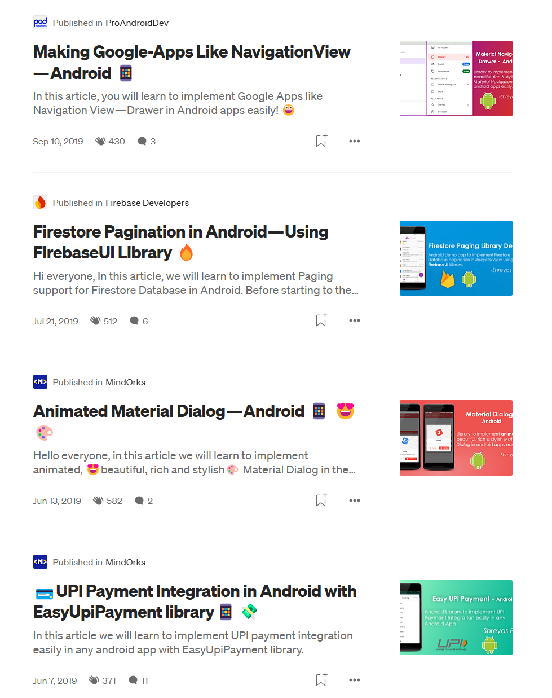
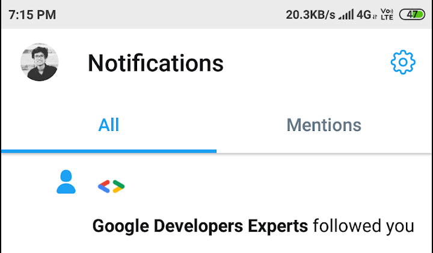
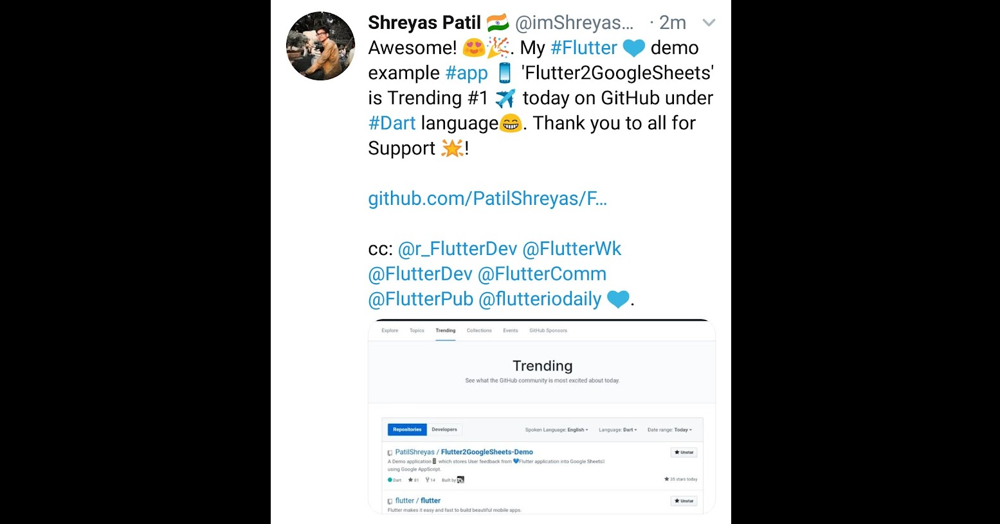
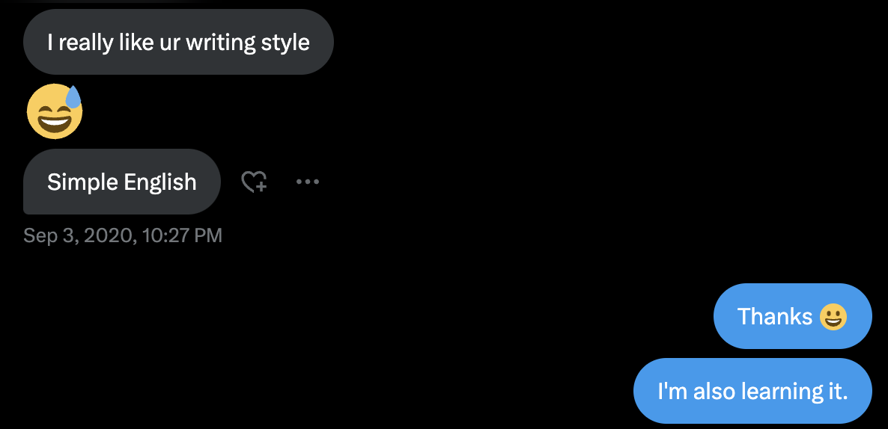
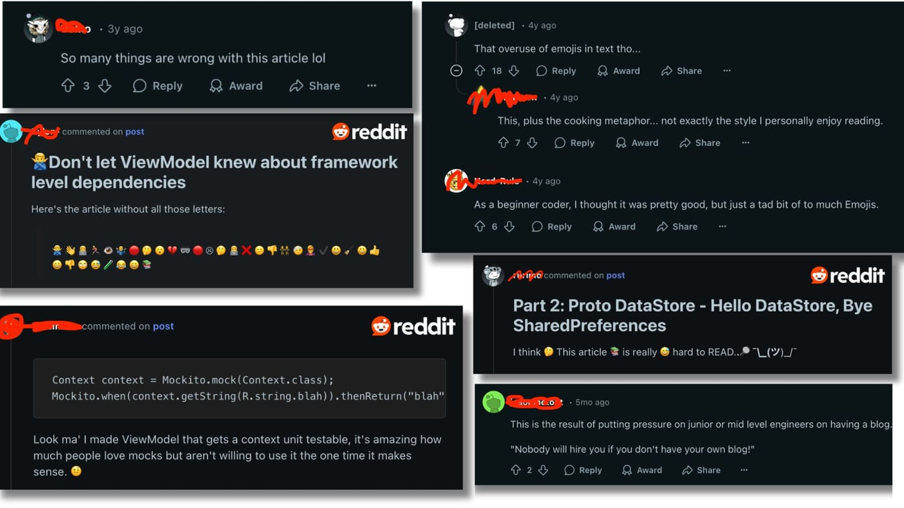

Hi everyone, I'm excited to share that this is the 51st blog post I'm writing. In this post, I'll share what I've learned over time that has helped me become a better version of myself in writing blogs. I'm writing this post to share the story of how I began writing blogs and how I continued doing it, how this thing helped me in my career. I've noticed that many people want to start something new but hesitate to try it for the first time. Some even give up before they begin. I'm writing this to inspire you by showing how this journey can help you learn 2x as much and enrich your overall experiences. This blog will also guide you through that process.

---

# 🎬 Kickstart of journey

In 2019, during my second year of engineering college, I was just a someone who was learning and building apps in Android at that time, working on my new Android app project. I used the Firebase UI SDK to display data from the Firebase Realtime Database. I needed to show data in pages, but at that time, the official Firebase UI library didn't support pagination. Until then, I wasn't even aware of GitHub and open source. Then I learned about open source and GitHub and discovered that the [FirebaseUI-Android SDK](https://github.com/firebase/FirebaseUI-Android) is open source, and we can contribute code to it. First, I cloned it, developed a pagination API, and open-sourced it [internally](https://github.com/PatilShreyas/FirebaseRecyclerPagination) on my own GitHub account ( *later I contributed it to the official SDK* 😀). I used my version of the API in my Android app, continued using it, and saw that it was serving its purpose.

I thought I should spread the word about it since it was useful for me and could help others too if they needed it. I already had accounts on Twitter and LinkedIn ( *I just wasn't very active*), so I logged in again and noticed that many popular Android developers were writing posts on **medium.com **. At that time,***ProAndroidDev, MindOrks, AndroidPub***, and others were well-known publishers in the AndroidDev community. So, I signed up on medium.com and wrote my first article. I decided to submit it to [ProAndroidDev](https://proandroiddev.com/), and after a few hours, I received a couple of suggestions for improvements from their editors. I addressed all the feedback, and they approved my post. Finally, on **April 8, 2019 **, I published my first tech blog 🎉. I kept the title very simple: “**Firebase Database Pagination - Android 🔥** “.

[https://proandroiddev.com/firebase-database-paging-android-f59e6dd0dc75](https://proandroiddev.com/firebase-database-paging-android-f59e6dd0dc75)

After publishing the blog, the next day on the 9th of April’s night, I shared it on Facebook, Android-related FB groups, Twitter and LinkedIn. Till this point, I never had thought that blogging would become my regular practice. Before publishing the blog, I was so nervous and I was getting so many negative thoughts and had fear of publishing something publicly. Do you know what motivated me to continue it? The next day I woke up in the morning and I saw this message on a Facebook messenger DM 😃

I read this early in the morning and felt so happy. It was satisfying to know that what I did helped someone. I realized that whatever we share as a learning experience can be useful to anyone, whether it's simple beginner stuff or complex advanced topics. This one message cleared all my fears that I was getting before publishing the article and boosted my confidence. That's when I decided to keep writing articles on medium.com.

As time went on, I started creating my open-source libraries on GitHub and exploring some Android APIs. Then I wrote a few more articles and published them on **MindOrks **and **ProAndroidDev **. I also published an article on the official **Firebase Developers** Medium publication. If you notice, all my early blogs were mostly tutorials kind of stuff and nothing more 😅. I was also getting a good response from them, so continued it. My initial blogs be like 👇🏻

As I published open-source projects and content, I began gaining followers on Twitter and making good connections on LinkedIn. Then one day, the “ **Google Developers Experts**” account started following me on Twitter, which boosted my confidence even more (*I never expected that to happen*😅\*. This happened two years prior of being a GDE\* ).

I was also exploring ***Flutter***for cross-platform app development during this time. I learned about***Google AppScript***and how I could use it as an API for data operations in Google Sheets. So, I created a simple proof of concept with Flutter, made it open-source on GitHub, and [wrote an article](https://medium.com/mindorks/storing-data-from-the-flutter-app-google-sheets-e4498e9cda5d?source=user_profile_page---------43-------------5b88bf6959e5---------------) about it. When I published it, the response was surprising. Within a day, I gained many followers on GitHub, Twitter, and LinkedIn. That repository received many stars on GitHub and became the**#1 trending project in the Dart** language category. I wasn't even very skilled in Flutter at that time, but I learned about the growing popularity and strong community of Flutter developers 💪🏻.

> **Fun fact: **Even after being a native app developer, my first repo that went**#1 trending **on GitHub was *Flutter* 😃. And till the date, that blog has more views than my other Android or Kotlin related blogs.

---

# 🏠 Lockdown - The golden opportunity

In 2020, I was in the third-year of my engineering when COVID-19 started, colleges closed, and I returned to my hometown, stopping online classes as well. This was a golden opportunity for me to work full-time on open-source projects and focus more on my blogs. Although the COVID period was tough with many challenges in the family, I spent most of my time learning and experimenting with Android development, open-sourcing, blogging, etc.

As seen in the previous section, my all articles were tutorial-ish. I learnt about the concept of Dependency Injection and the Dagger framework. I noticed that in that period, there was a lot of fear about this concept around beginners. So I thought of writing an article that simplifies the concept of Dagger. Finally, I wrote an article in which I explained this DI as a concept by giving a very simple example and relating it to real-life scenarios.

[https://medium.com/mindorks/introduction-to-dagger-di-by-a-life-way-d34f62540329](https://medium.com/mindorks/introduction-to-dagger-di-by-a-life-way-d34f62540329)

After I published this, I received a lot of positive feedback, and many developers thanked me for writing it because they found it easy to understand the basics of Dependency Injection. This gave me a great sense of satisfaction and boosted my confidence, as it was a new type of article for me. So, I continued writing similar blogs.

Lockdown was ongoing, and I was in the last semester of my third year. Due to my blogs and open-source work, I got an internship opportunity at [ScaleReal](https://scalereal.com/). The founder liked that I wrote blogs. One day, we were discussing it, and he asked me if we could implement regular blogging practices at ScaleReal and motivate other employees to contribute as well. He asked me to lead it, and I accepted. I created a [Medium publication](https://medium.com/scalereal) of ScaleReal and became its maintainer and editor. I started submitting all my future blogs to that publication. Over time, many others also began contributing, which boosted ScaleReal's reach significantly! 😄. I used to review every blog, which helped me gain valuable experience in blog reviewing.

During the lockdown, I wanted to encourage blogging among my friends and college students, so I used what I learned from ScaleReal’s Medium publication. Around that time, I had already initiated a Developer's Club at my college (before COVID). Then I launched a Medium publication called [DevClub DYPCOE](https://medium.com/dsc-dypcoe). I encouraged others to write blogs for this publication. Later that DevClub got migrated into GDSC (Google Developers Student Club). It was really a helpful initiative as many students contributed and published good blogs to that publication. It was good to see that.

---

# 🤔 That one opinionated blog

I was feeling confident in development and began forming opinions about different concepts. While reading the release notes of Kotlin Coroutines, I discovered an API called **StateFlow. **By looking at it, it looked like an advanced version of **LiveData **to me. Till that time, it was not mentioned anywhere whether it’s gonna replace LiveData or not. I wrote a simple blog explaining how the StateFlow API could be used instead of LiveData in Android. Since I wasn't sure if it was truly a replacement, I added a question mark "?" at the end of the title. The title of that blog became:**“🌊 StateFlow, end of LiveData?”**

[https://medium.com/scalereal/stateflow-end-of-livedata-a473094229b3?source=user_profile_page---------38-------------5b88bf6959e5---------------](https://medium.com/scalereal/stateflow-end-of-livedata-a473094229b3?source=user_profile_page---------38-------------5b88bf6959e5---------------)

The response was incredible! The blog received around 2K+ reads in one night. Even people from Google reacted to it. It became so popular that some other bloggers copied the title and parts of the content 🤦🏻. My first opinionated blog was a success, `confidence++`. What could boost confidence more than that? 😄. So far in the Android-related blogs of mine, this one has the highest views on the medium.com.

---

# 📐 Diving deeper into the context

Later, I began writing about under-the-hood topics, such as how certain things work internally, and deeper concepts of Android and Kotlin. I started exploring Jetpack Compose and wrote about it as well. I also wrote about architecture best practices and created a series of articles on how to use Kotlin language features effectively. The response was quite positive.I was also working on open-source projects alongside my writing. Whenever I learned something new, I would write about it in detail.

In 2021, I became the [youngest Google Developer Expert for Android in India](https://x.com/GoogleDevsIN/status/1425329067658649601). That was huge for me!

Meanwhile, I joined [Paytm](https://paytm.com) and became a Senior Android Engineer. As we adopted Jetpack Compose, I encountered new challenges and learned something new about APIs every day. My experience at Paytm taught me a lot, and many of my later blog posts were inspired by the challenges we faced there.

😅

<strong>Fun fact: </strong>When I joined the team at Paytm, I discovered a funny twist: the interviewer for my first round was actually hesitant to interview me. He was saying to his team that he also learns from my blogs and how can he ask me the questions in the interview. Despite his initial reluctance, we ended up having a great conversation, and now he's not just a former colleague but also a good friend 😄.

So, blogging has helped me a lot in my career!

I continued writing blogs, and now you're reading my 51st blog here! Do you think it was always smooth? Now let me share the dilemmas and challenges that I faced as well.

---

# 📖 English

Until 2021, I wasn't very good at English (and maybe I'm still not). My general communication skills were poor. I only understood tech concepts and could write about them, but I made a lot of grammatical mistakes. If you read my early blogs, you'll notice this and easily find many English-related errors. This caused me a lot of anxiety when I was about to hit the " **Publish** " button for my first blog post. I used to think, " *What will people think if they see my writing?* " and " *How will they judge me?* ". However, I pressed that button for the first time and continued to do so many more times. My writing was very simple; I never used complicated words in any of my blogs. I avoided fancy English words and complex language. It was straightforward enough for any beginner to understand. But still, I was not so confident about my writing style and one day, a developer from community sent me a message on Twitter (now X). He mentioned that he likes whatever I like, then he wrote this:

I was surprised after reading this. That day, I learned that we often overthink before taking action. Stop overthinking and just go for it! In my case, it was "English"; for others, it might be something else. So my advice is to ignore the negative thoughts and focus on positive actions. This can not only boost your confidence but also help others. After my first few blogs, I started using Grammarly, which helped me identify common English mistakes in my writing. In today's world, LLMs can also help refine your sentences effectively.

---

# 😨 Criticism

Everything was going well while I was writing simple blog posts. It was all positive and boosted my confidence. However, things started to change when I began writing opinionated posts and posts related to architecture. Architecture is a topic that often sparks debate, and it's natural for developers to have different opinions. So whenever I wrote articles related to architecture or engineering best practices, I’ve been always criticized for them. But that doesn't mean I've never received good reviews on it. Opinions are always mixed on such topics. Another thing is that I used to include a lot of emojis in my blog posts, which led to some criticism, mostly on Reddit. Here's a glimpse of the criticism on Reddit:

Today's world has many negative people who do nothing themselves but are always ready to criticize. We always encounter both types of people: positive and negative. So, don't just focus on the negativity. On Reddit, most comments were about my use of emojis. However, on a personal level, I once received feedback from one of my connections who actually liked how I use emojis in my blogs, saying it feels attractive. So, in my opinion, there's no perfect or wrong way here 🤷🏻‍♂️.

Many times, I've also engaged in tech debates on Twitter, LinkedIn, and Reddit about various topics, but always in a healthy way ( *regardless of the other person's tone* 😂). But criticism is not always harmful; it can be constructive too. If I ever made a mistake, I accepted it and corrected it in my blog before it could mislead any readers. It all depends on the author's attitude towards handling criticism. Once, I wrote an article and accidentally attached the wrong code snippet from a GitHub gist. I found out about it 30 minutes after posting, thanks to a comment on Reddit, and I quickly fixed it. I learned to take such feedback positively, which ultimately helped me become a better version of myself day by day. But I also learned to ignore some comments because not all of them are helpful. Some comments are just nonsense and won't benefit anyone, neither you nor the readers. So you should know what to take and what to ignore otherwise it can impact you a lot.

## 🔍 Learning - Getting post reviewed

Later on, I started having my blog posts reviewed by my tech-savvy friends and colleagues. Sometimes, when I wrote in-depth about a specific concept, I reached out to experts in that field from the community for help with reviewing and proofreading the blog. I always mentioned them at the bottom of my blog. Occasionally, I even sought the help of Google DevRel Engineers to get feedback on some opinionated blogs to ensure the intention was clear. This is the best way to feel confident before publishing a blog that might be sensitive. It's a really good habit I've developed, and I highly recommend it to anyone starting their blogging journey!

😃

I would like to mention my friends who often reviewed my blogs and helped making it better. Many thanks to: <a target="_self" rel="noopener noreferrer nofollow" href="https://himanshoe.com/" style="pointer-events: none">Himanshu Singh</a>, <a target="_self" rel="noopener noreferrer nofollow" href="https://sagarviradiya.dev/" style="pointer-events: none">Sagar Viradiya</a>, <a target="_self" rel="noopener noreferrer nofollow" href="https://siddroid.com/" style="pointer-events: none">Siddhesh Patil</a>, <a target="_self" rel="noopener noreferrer nofollow" href="https://thedroidlady.com/" style="pointer-events: none">Niharika Arora</a> 🙏🏻. Fact: We didn't know each other before, and we only connected through blogging. We met in person after two years of knowing each other online. Now, we're not just connected through tech, we also have a good personal relations. My point is that blogging has helped me build some great personal connections too.

---

# 📈 Self promotion is important!

Once you hit "Publish," your work isn't done! I always shared my posts on Twitter, LinkedIn, Facebook, Reddit, Hackernews, as well as on community Slack channels like Kotlinlang. Newsletters like [AndroidWeekly.net](https://androidweekly.net) and [KotlinWeekly.net](https://kotlinweekly.net) are fantastic for reaching the right readers. Every Sunday, when my blogs were featured in these newsletters, I noticed a spike in viewers on the analytics graph. It just works well ✈️. Many people hesitate to share what they've created ( *I did too when I was a beginner, but I learned by watching others*). But you have to do it. **If you don’t, who else will? **When you share your work, there will come a time when *others start sharing your blog links on their feeds *if it’s really a good quality work. Over time, Google search became my top source of organic referrals for my blogs (*Thanks to the SEO of Medium and Hashnode* so far).

---

# 📚 Keep learning

Technology is vast, and staying updated is crucial, especially if you want to continue blogging for the long term. Blogging itself is a learning experience. Even after about five years, I still feel like a beginner in writing blogs. I admit I'm still trying to improve and learn good blogging practices. I read other blogs to learn from them. I read official tech blogs, blogs by famous developers, company blogs, and my friends' blogs, which teach me a lot about technical writing. I believe there's no limit to learning, and it will always continue. So, keep learning!

---

# 🎉 Celebrating a small milestone

As a content creator, celebrating a small milestone not only releases dopamine for us but can also inspire others. So, don't hesitate to share your achievements or small wins too. Through this post, I'm absolutely thrilled to share that <mark>I've reached a total of </mark> **<mark>~605K views</mark>** <mark>for my blogs since I started!</mark> It's such an amazing feeling to know that what I've written has reached half a million screens! 🎉. But of course, this is not done yet, and there is much more to come in the future. I’m really excited to see what comes next for me in this journey.

---

# 🎬 Wrapping up this post

So, that's been my blogging journey so far, and I'm really enjoying it. Thanks to the amazing tech community, especially the Android and Kotlin communities, the readers who supported me, my friends, tech enthusiasts, and the editors of the publications who helped review some of my posts ❤️.

I'm really excited to keep blogging about tech and to improve a little each day.

I hope this article encourages anyone who isn't confident enough to hit that "Publish" button right now. I would just say, hit "Publish" and go with the flow!

If you notice, I end every blog with this line 😄👇🏻

*** "Sharing is Caring" ***

Thank you! 😄

Let's catch up on [ **X**](https://twitter.com/imShreyasPatil) or [**visit my site** ](https://shreyaspatil.dev/) to know more about me 😎.