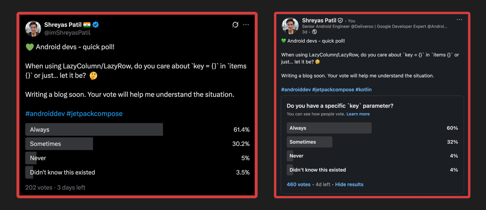
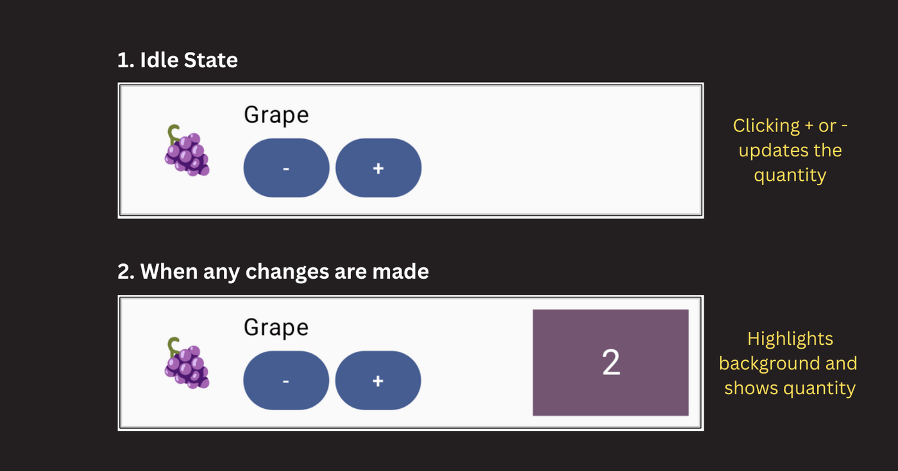
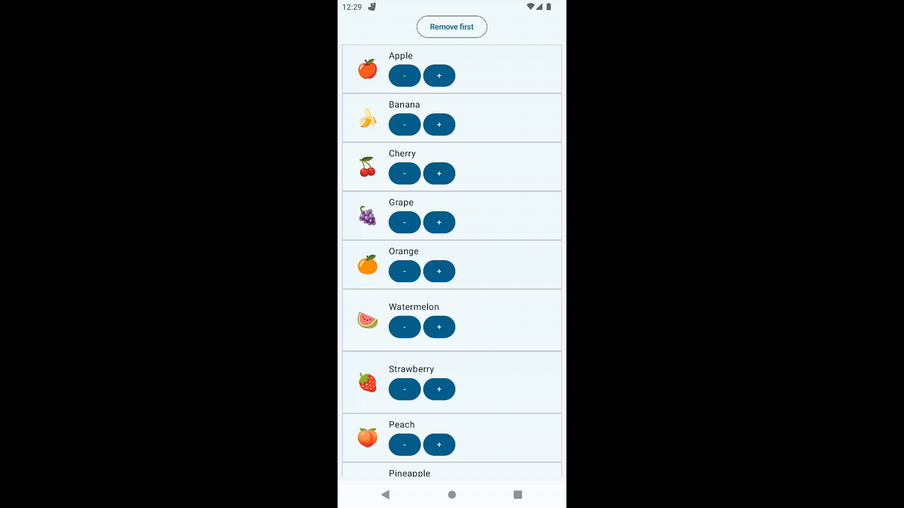

Hey Composers 👋,

It’s awesome to see Jetpack Compose being adopted in so many apps. If you're using Compose, you've almost certainly worked with its powerful `LazyList` APIs like `LazyColumn` and `LazyRow`. They are incredibly efficient for displaying list of items.

However, there's a tiny parameter in the items function that can cause some seriously confusing behavior if overlooked. In this blog, we're going to explore how missing one small thing: the key and how it can lead to tricky state management issues.

## Preface

A while back, I posted a poll on [X](https://x.com/imShreyasPatil/status/1974419516940804546) and [LinkedIn](https://www.linkedin.com/posts/patil-shreyas_androiddev-jetpackcompose-kotlin-activity-7380186618109976576-A2wp?utm_source=share&utm_medium=member_desktop&rcm=ACoAABUdUs4B-VoTZYn5iAoOP7UC0hoQURs4hlU) asking developers a simple question:



The results were interesting and mostly similar across both platforms!

*🟢*Always use* — 60%

*🟡*Sometimes* — 32%

*🔴*Never/Didn’t know* — 8%


This poll inspired me to write this post to shed some light on this important detail especially for 40% of Android developers.

Before we dive into the problem, let's quickly understand what this key parameter actually does.

### What is `key {}` in LazyColumn

When you provide a list of items to a LazyColumn or LazyRow, you can also provide a key for each item. This key is a stable and unique identifier for that specific piece of data.

```kotlin
LazyColumn {
items(
items = myItems,
key = { item -> item.id } // Provide a unique ID for each item
) { item ->
MyItemRow(item)
}
}
```

Think of it like a primary key in a database table. It gives Compose a way to track each item individually, even if the list changes.

**Why is this important?** ***Performance Boost 🚀: **When you add, remove, or reorder items in your list, Compose uses these keys to understand which items have changed. This allows it to be much smarter. For example, if you reorder items, Compose can just move the corresponding composables without completely redrawing them. This avoids unnecessary work and makes your app feel smoother.***Stable Identity: **The key tells Compose, "Hey, this item is the same one as before, it's just in a different position now." Remember that `DiffUtil.ItemCallback` in RecyclerView? 🤔**What happens if you don't specify a key? **If you skip the key, Compose falls back to using the item's **position (or index)** in the list as its identifier. For a list that never changes, this is perfectly fine. But for a dynamic list where items can be added or removed, this can lead to some unexpected problems. Because whenever the list changes, even if some items in the list might not have been changed, it’ll still cause recompositions for such items.

The most important rule for keys is that they **must be unique** . If two items have the same key, your app will crash with an error.

Now, let's get to the fun part and see what can go wrong.

## What can go wrong if `key` is missing

Let's imagine a simple scenario. We have a LazyColumn showing a list of fruits. Each Fruit item is a composable that can be updated. When you tap the '+' or '-' buttons, it changes a quantity, and the item's background highlights to show it has been modified.

Here’s what the UI for a single fruit item looks like:



And here is the code for our `Fruit` composable:

```kotlin
@Composable
fun Fruit(fruit: Fruit, modifier: Modifier = Modifier) {
Row(/ *...* /) {
var quantity by remember { mutableIntStateOf(0) }
var hasChanged by remember { mutableStateOf(false) }

Text(fruit.emojifiedImage, / *Other parameters* /)

Column(/ *...* /) {
Text(fruit.name)
Row {
Button(onClick = { quantity-- }) { Text("-") }
Button(onClick = { quantity++ }) { Text("+") }
}
}

if (hasChanged) {
Box(Modifier.background(MaterialTheme.colorScheme.tertiary)) {
Text("$quantity", / *Other parameters* /)
}
}

// 👀 Pay attention to this. This only notifies whether any changes have been made
// to this fruit or not.
LaunchedEffect(Unit) {
snapshotFlow { quantity }.filter { it != 0 }.first()
hasChanged = true
println("${fruit.name} has changed")
}
}
}
```

Notice that the `quantity` and `hasChanged` states are managed inside the `Fruit` composable using `remember {}`. `hasChanged` is a boolean state which is being mutated only from `LaunchedEffect` only when `quantity` is updated for the first time, then prints a simple log to console and it leaves the block. Since underneath it’s using a `snapshotFlow {}`, there’s no need to specify a key to `LaunchedEffect`.

Finally, we display the list on a screen and add a button to remove the first item. We are **not** providing a key in our LazyColumn.

```kotlin
@Composable
fun DemoScreen() {
var fruits by remember { mutableStateOf(sampleFruits) }

Column(/ *...* /) {
OutlinedButton(onClick = { fruits = fruits.removeAt(0) }) {
Text("Remove first")
}
LazyColumn(/ *...* /) {
items(fruits) {
Fruit(it)
}
}
}
}
```

Now, let's perform a few actions on the UI:

1. Click + on **Apple** -&gt; logs `Apple has changed`

2. Click “ **Remove first**” on top -&gt; It removed the first item from list i.e. **Apple**-&gt; Now **Banana** is in 1st place. But it’s still keeping the state of old item along with highlighted background

3. Click + on **Orange** -&gt; logs `Grape has changed`

4. Click + on **Peach** -&gt; logs `Strawberry has changed`


See it here:


Surprised? 🤯 This shouldn’t have happened right?

This strange behavior happens because of how Compose reuses composables.

When you don't provide a `key`, Compose identifies each item by its **position** . In our example, the "Apple" item was at position 0. It had its own internal state (`quantity` and `hasChanged`) that we modified.

When we removed "Apple" from our data list, "Banana" moved into position 0. From Compose's perspective, it sees that there is still a composable at position 0. To be efficient, it decides to **reuse** the existing composable and just give it the new data ("Banana" instead of "Apple").

The problem is that the **remembered state** from the old item is still attached to that composable "slot" at position 0. So, "Banana" inherits the `quantity` and `hasChanged` state that originally belonged to "Apple".

In ideal situations, when the state comes from the ViewModel, UI state-related issues won't be noticeable. However, **the concern here is with the behavior of** `LaunchedEffect`. If you're calling some business logic from side-effect APIs or using anything related to it, it can be confusing.

### **The Simple Solution: Provide a** `key`

This entire problem can be fixed with a single line of code. We just need to tell Compose how to uniquely identify each fruit.

```diff
LazyColumn(/ *...* /) {
- items(fruits) {
+ items(fruits, key = { it.id }) {
Fruit(it)
}
}
```

By adding `key = { fruit -> fruit.id }`, we are now telling Compose to track items by their unique ID, not by their position.

With this change, when we remove "Apple" (which has its own unique ID), Compose knows that the composable associated with that specific key is gone forever. It completely removes it, along with its state. It then creates a fresh new composable for "Banana" in its place, with a clean state. Everything works as you would expect! ✅



And console also prints valid values meaning LaunchedEffect block is actually working as expected

```plaintext
Apple has changed
Banana has changed
Orange has changed
Peach has changed
```

### **An Alternative (But Flawed) Solution 🤔**

You might be wondering if there are other solutions. For example, you could pass the `fruit` object as a key to the `remember` and `LaunchedEffect` blocks inside the `Fruit` composable.

```diff
- var quantity by remember { mutableIntStateOf(0) }
+ var quantity by remember(fruit) { mutableIntStateOf(0) }
- var hasChanged by remember { mutableStateOf(false) }
+ var hasChanged by remember(fruit) { mutableStateOf(false) }
//...
- LaunchedEffect(Unit) {/ *...* /}
+ LaunchedEffect(fruit) {/ *...* /}
```

This tells Compose to reset the state whenever the `fruit` input changes, which does fix the issue.

But ideally, a composable shouldn't have to do this. Why should the `Fruit` composable worry that it might receive another item’s content? It's not aware that it's being used in a list. In real-world scenarios, we often read state from a ViewModel, so a situation like this might not happen. But the main takeaway is that if you're using stateful APIs like `remember` or side-effects like `LaunchedEffect`, they will be affected by this recycling behavior.

A component shouldn’t have the overhead of providing extra keys, as it shouldn't have to worry about where it’s going to be rendered. The responsibility should lie with the parent that is managing the list.

### Under the Hood: How `key` Works? 🧙‍♂️

So what’s happening internally? It all comes down to how Compose generates and caches the composables for your list items.

Deep inside the Compose framework, there's a class called `LazyLayoutItemContentFactory`. Its main job is to manage the content (the composable lambdas) for each item in the lazy list. It has a cache, which is essentially a map that stores the generated composable for each item.

```kotlin
// From LazyLayoutItemContentFactory.kt
/ **Contains the cached lambdas produced by the [itemProvider].* /
private val lambdasCache = mutableScatterMapOf<Any, CachedItemContent>()
```

When it's time to display an item, the factory's `getContent` method is called. This method is the key to our mystery.

```kotlin
// Simplified from LazyLayoutItemContentFactory.kt
fun getContent(index: Int, key: Any, contentType: Any?): @Composable () -> Unit {
val cached = lambdasCache[key] // Tries to find a cached item using the key
return if (cached != null && ...) {
cached.content // Found it! Return the cached composable.
} else {
// Didn't find it. Create a new one and add it to the cache.
val newContent = CachedItemContent(index, key, contentType)
lambdasCache[key] = newContent
newContent.content
}
}
```

When you provide a `key`, that `key` is used to look up the item in `lambdasCache`. Since your key is stable and unique (like `fruit.id`), Compose can always find the correct composable along with its remembered state.

But if you **don't **provide a key, Compose uses the item's **index** as the key. So when "Apple" at index 0 is removed, "Banana" moves to index 0. Compose looks in the cache for index 0 and finds the old composable that belonged to "Apple", and reuses it for "Banana".

This cached content is then passed to `subcompose`, which is the mechanism that actually creates and manages the UI tree for that item.

```kotlin
// From LazyLayoutMeasureScopeImpl.kt
val itemContent = itemContentFactory.getContent(index, key, contentType)
return subcomposeMeasureScope.subcompose(key, itemContent)
```

By passing your stable `key` to `subcompose`, you ensure that the state is correctly associated with the data, not just the position.

## Conclusion

So, what's the main takeaway?

If your list is completely static and will never change, you can get away with not using a key. However, for any list that is dynamic where items can be added, removed, or reordered then providing a key is essential. It not only improves performance but is also crucial for correct state management.

I think we should **make it a habit to always add a key** . You might think a list is static today, but requirements can change in future and then it’s easy to miss it in PR review. Adding a key from the start makes your code more robust and saves you from debugging some very confusing issues down the road.

---

I hope you got the idea about how important it is to provide key to LazyList APIs.

Awesome. I hope you've gained some valuable insights from this. If you enjoyed this write-up, please share it 😉, because...

*** "Sharing is Caring" ***

Thank you! 😄 Happy composing! 😎

Let's catch up on [ **X**](https://twitter.com/imShreyasPatil) or [**visit my site** ](https://shreyaspatil.dev/) to know more about me 😎.