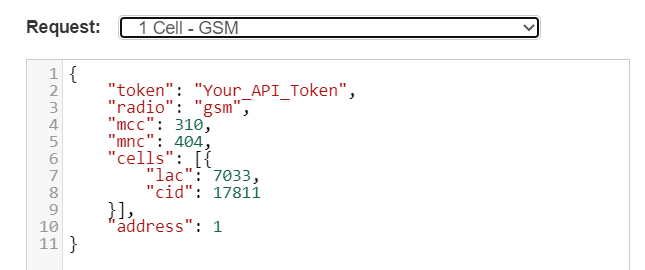
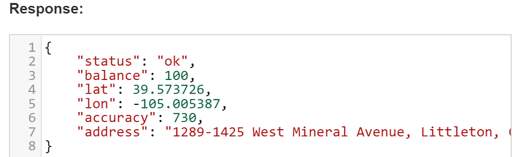
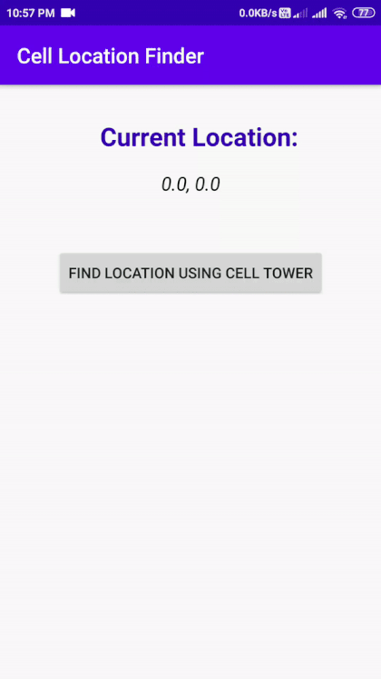

These days, almost many apps use the device location📍. There might be some use case in your app which is strongly dependent on the user’s location. *For example*, if you have developed a*social*app 💬 which shows posts of users and imagine you’ve feature which shows trending posts in user’s**nearby area**. For such use case, you’ll get a user’s device location and after some*processing*, you’ll be able to manage this feature for your*cool* app.

But wait… 🤔

#### What if your app user’s enabled Mock location? 😮

If your *cool*app users have enabled mock locations then your feature will not work as expected. If the user is currently at*Mumbai, India*and he enabled mock location and showing his location at*Beijing, China*😩 then that Indian user will see useless Chinese content in the app. Your *cool* app’s cool feature won’t work as expected 😢


## Then is there any solution? 🤷‍♀️

Yes😃, for such use case you won’t need user’s perfect location. Just area/city level location is enough for such use case. You can get the user’s *cell tower* location by extracting the SIM card📡 details from the user’s device.

The famous app *TikTok app* extracts SIM Card📶 details and fetches the user’s location for the perfect updates and avoiding spoofing of location.


## How did we come up with this Idea? 💡

We at [ScaleReal](http://scalereal.com/) were developing a product which was heavily dependent on the user’s location and we thought *“What if GPS location isn’t available due to conditions like device failure or bad weather or if the user provides fake location”*🤔. We thoroughly studied these scenarios with all aspects 🧐 and came with the solution of using SIM card details to extract at least the*cell tower location*of the user. This solution helped us to pinpoint the user's location using*cell tower triangulation*and the results were even better when we wrote a custom algorithm on top of these two. In turn a***better***product! 😄*In this article, we’ll learn to access the device’s cell tower location by extracting SIM Card details from the device. So let’s start implementation.*>**Note:** GPS is not involved in this process. So doesn’t matter if it’s enabled tr disabled!


# Let’s Start 🚀

First of all, we’ll need to get API for accessing Geolocation information. I’ve seen two APIs for such use case🤔.

*[Google’s Geolocation API](https://developers.google.com/maps/documentation/geolocation/overview)— This API is good to go with but requires a billing account to be enabled for your project🤑.*[Unwiredlabs OpenCellID](https://opencellid.org/)— This API is amazing and easy to use and the world’s largest open database of cell towers😍. *(We’re using this API for geolocation)*Just go to above link and*Sign Up your account*and you’ll get*API key* . See API documentation [here](https://unwiredlabs.com/api#documentation) for more details about accessing API.

## How API Works?🤔

From your app, you just have to send this data payload to API:




Let’s understand these parameters:

*`radio`— Network type. For e.g. GSM, LTE, etc*`mcc`—*Mobile Country Code* used to identify the country which a mobile subscriber belongs to.
*`mnc`— Used to uniquely identify a mobile subscribers**network**the**MCC**is combined with a Mobile**Network**Code.* `lac`— Location Area Code
* `cid`— Cell ID

When you request API with above details, you’ll get a response from API as below👇.




That’s the main thing! I hope now you have API key with you so let’s proceed to implementation🚀.

# Getting Started 💻

*Open Android Studio* Create a new project or you can simply clone or import[ this](https://github.com/PatilShreyas/CellLocationFind-Android) project.

## Make Request model

Request model will be used to request API with data payload. This will include ***network details of the device*** . Here’s you can see how our request model will look like 👇

```kotlin
data class CellInfo(
val token: String = BuildConfig.OPENCELLID_API_KEY,
var radio: String? = null,
var mcc: Int? = null,
var mnc: Int? = null,
var cells: List<Cell> = emptyList(),
val address: Int = 1
)

data class Cell(
val lac: Int,
val cid: Int,
val psc: Int? = null
)

object RadioType {
const val GSM = "gsm"
const val CDMA = "cdma"
const val UMTS = "umts"
const val LTE = "lte"
}
```

## Make Response model

We’ll get a response from API and for that, we’ll have to make response model as below.

```kotlin
data class CellLocation(
val status: String,
val message: String?,
val accuracy: Int? = null,
val address: String? = null,

@Json(name = "lat")
val latitude: Double? = null,

@Json(name = "lon")
val longitude: Double? = null
) {
fun isSuccess() = status == "ok"
}
```

So now we have to make a service which will communicate with API which will look like as below 👇

```kotlin
interface UnwiredLabsService {

@POST("v2/process.php")
suspend fun getLocationByCellInfo(@Body cellInfo: CellInfo): Response<CellLocation>

companion object {
const val BASE_URL = "https://ap1.unwiredlabs.com/"
}
}
```

> *We have used Retrofit in this app. I’ll not show the whole implementation of it here. For that, you can refer app source code for implementation details. You can that here we’ve implemented ViewModel and Activity which is now able to communicate with API.*

## Remember one thing! 🤨

For accessing the device’s network information you’ll need to include below permission in your app’s Manifest.

```xml
<uses-permission android:name="android.permission.ACCESS_FINE_LOCATION" />
```

## Getting network Details 📶

Here the main thing is how to get *Network details* from the device. Here we have created a method `getCurrentCellInfo()` as below 👇 which will help us to extract proper network details.

```kotlin
fun getCurrentCellInfo(context: Context): List<CellInfo> {
val telephonyManager = context.getSystemService(Context.TELEPHONY_SERVICE) as TelephonyManager
val allCellInfo = telephonyManager.allCellInfo

return allCellInfo.mapNotNull {
when (it) {
is CellInfoGsm -> getCellInfo(it)
is CellInfoWcdma -> getCellInfo(it)
is CellInfoLte -> getCellInfo(it)
else -> null
}
}
}
```

As you can see in the above code, for extracting network details, we need to check whether network type is *GSM, CDMA or LTE* . We’ll need to create a method `getCellInfo()` for every network type. For example, the below method is created for GSM type 👇

```kotlin
fun getCellInfo(info: CellInfoGsm): CellInfo {
val cellInfo = CellInfo()
cellInfo.radio = RadioType.GSM

info.cellIdentity.let {
val (mcc, mnc) = if (Build.VERSION.SDK_INT >= Build.VERSION_CODES.P) {
Pair(it.mccString?.toInt() ?: 0, it.mncString?.toInt() ?: 0)
} else {
Pair(it.mcc, it.mnc)
}
cellInfo.mcc = mcc
cellInfo.mnc = mnc
cellInfo.cells = listOf(Cell(it.lac, it.cid, it.psc))
}

return cellInfo
}
```

The same method can be repeated for other network types.

Okay! By this, we’ve completed the **main**part of the application✨. As you can see, we***haven’t used GPS or location service*** in this app.

Now just send this information along as data payload to the API and you’ll get a *response*which will include*location* details 🔥.

- - -

Okay😃. Now let’s run this app🚀. You’ll see like this… 👇



Yeah!😍 Our app is working as expected 🚣. That’s all. I hope you liked this article 😃.


Thank you! 😃

Sharing is caring!

- - -

# Resources

*[GitHub Repository](https://github.com/PatilShreyas/CellLocationFind-Android)* [Unwiredlabs OpenCellID](https://opencellid.org/)
* [Unwiredlabs API Documentation](https://unwiredlabs.com/api#documentation)