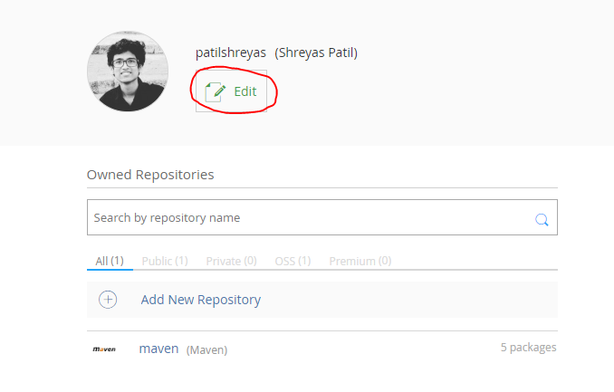
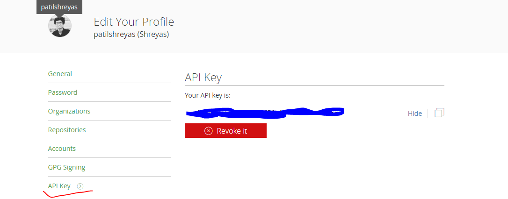
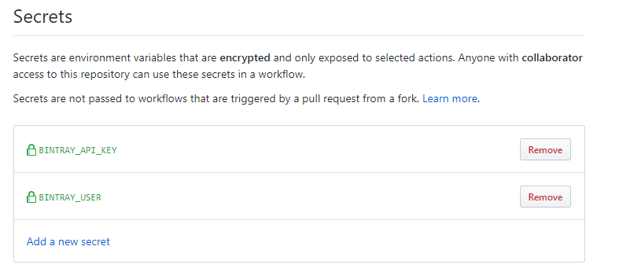
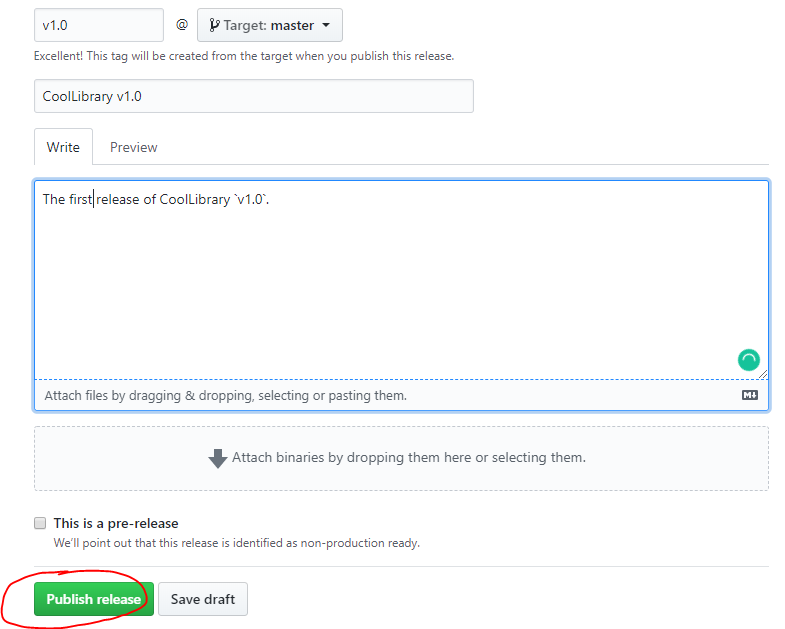
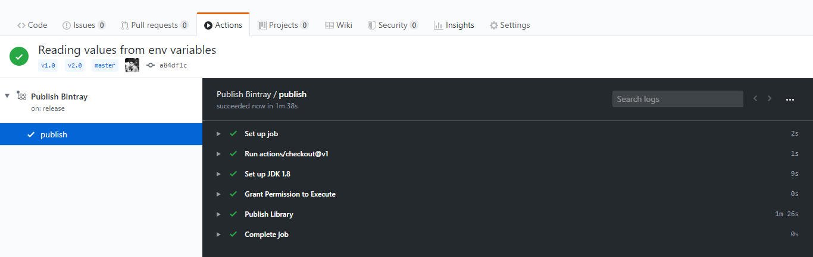
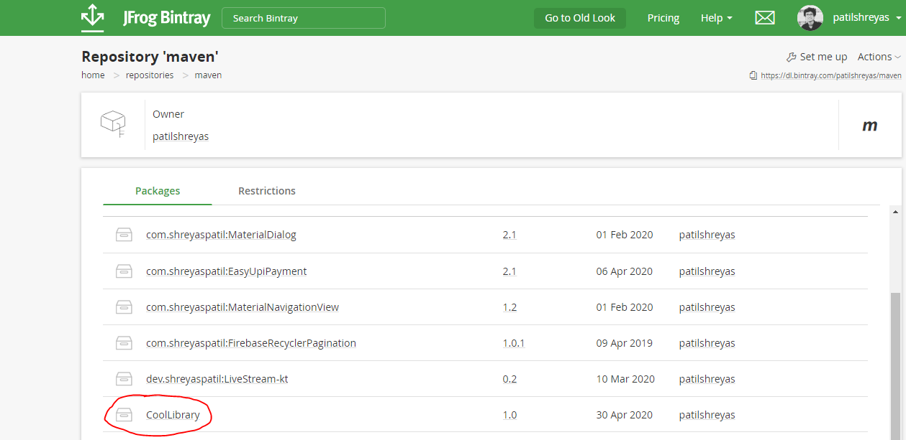
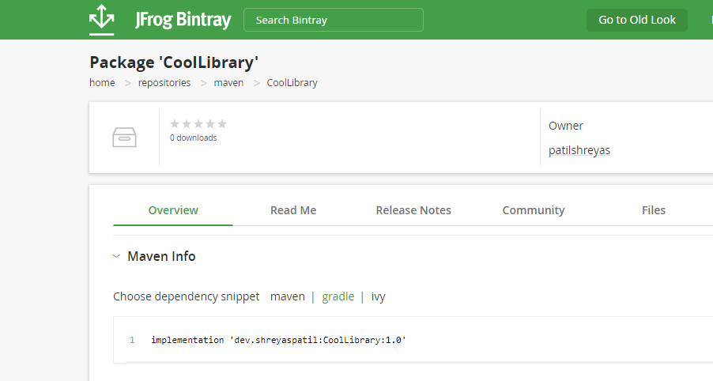

In this article, I’m going to demonstrate the use of GitHub Actions to publish open-source Android Library to Bintray when it is released.

You might have developed a cool open-source android library 🛠️. You have published it to Bintray/JCenter. Right? But you’re publishing it manually using Gradle CLI `./gradlew bintrayUpload` command. After you made changes in your library, you always run Gradle command manually. Want to see how you can automate publishing it using **GitHub Actions CI**? Then you are at the right place.

We will see how to publish your open-source cool android library to Bintray automatically when we create a new **release** in GitHub repository. So, let’s start 😃.

Before starting, you’ll need to do some tasks with Bintray profile. If you’ve already done, you can skip this part and directly go to the next part ⚡.

---

## 💻 Setup Bintray 🛠️

- Visit [Bintray](https://bintray.com) and set up your account there.
- Go to **Home** → **Repository** and create a **maven** repository and keep its name of your choice. I’ve named it 'maven'. (_Remember, it’ll be useful in upcoming steps._)
- After this, it’ll look like below. Click **Edit**.



- Select **API Key** from the left menu and **Copy or Keep** this API Key for future reference.



Thus, you’re done with Bintray set up. Now let’s see the **Android** part.

---

## 💻 Android Library Set up

In `build.gradle` of your project module, ensure that you’ve below plugins added:

```gradle
dependencies {
        classpath 'com.android.tools.build:gradle:3.6.2'
        classpath "org.jetbrains.kotlin:kotlin-gradle-plugin:$kotlin_version"

        // Required plugins added to classpath to facilitate pushing to Jcenter/Bintray
        classpath 'com.jfrog.bintray.gradle:gradle-bintray-plugin:1.8.4'
        classpath 'com.github.dcendents:android-maven-gradle-plugin:2.1'
    }
```

Add these plugins in the `build.gradle` file of the library module:

```groovy
apply plugin: 'com.android.library'
apply plugin: 'kotlin-android'
apply plugin: 'com.github.dcendents.android-maven'
apply plugin: 'com.jfrog.bintray'
```

Now, we’ve to set up library configuration 🛠 for the Bintray in this file. Just append `build.gradle` file of library module with the code as below:

```gradle
ext {
    // This should be same as you've created in bintray
    bintrayRepo = 'maven'

    // Name which will be visible on bintray
    bintrayName = 'CoolLibrary'

    // Library Details
    publishedGroupId = 'dev.shreyaspatil'
    libraryName = 'CoolLibrary'
    artifact = 'CoolLibrary'
    libraryDescription = 'Cool Library'
    libraryVersion = version

    // Repository Link (For e.g. GitHub repo)
    siteUrl = 'https://github.com/patilshreyas/AndroidLibDemo'
    gitUrl = 'https://github.com/patilshreyas/AndroidLibDemo.git'
    githubRepository= 'patilshreyas/AndroidLibDemo'

    // Developer Details
    developerId = 'patilshreyas'
    developerName = 'Shreyas Patil'
    developerEmail = 'shreyaspatilg@gmail.com'

    // License Details
    licenseName = 'The Apache Software License, Version 2.0'
    licenseUrl = 'http://www.apache.org/licenses/LICENSE-2.0.txt'
    allLicenses = ["Apache-2.0"]
}

// This is mandatory
group = publishedGroupId

install {
    repositories.mavenInstaller {
        // This generates POM.xml with proper parameters
        pom {
            project {
                packaging 'aar'

                groupId publishedGroupId
                artifactId = artifact
                name libraryName
                description = libraryDescription
                url siteUrl

                licenses {
                    license {
                        name licenseName
                        url licenseUrl
                    }
                }
                developers {
                    developer {
                        id developerId
                        name developerName
                        email developerEmail
                    }
                }
                scm {
                    connection gitUrl
                    developerConnection gitUrl
                    url siteUrl
                }
            }
        }
    }
}

// Avoid Kotlin docs error
tasks.withType(Javadoc) {
    enabled = false
}

// Remove javadoc related tasks
task javadoc(type: Javadoc) {
    source = android.sourceSets.main.java.srcDirs
    classpath += project.files(android.getBootClasspath().join(File.pathSeparator))
}

task sourcesJar(type: Jar) {
    from android.sourceSets.main.java.srcDirs
    classifier = 'sources'
}

task javadocJar(type: Jar, dependsOn: javadoc) {
    classifier = 'javadoc'
    from javadoc.destinationDir
}
artifacts {
    archives javadocJar
    archives sourcesJar
}

// https://github.com/bintray/gradle-bintray-plugin
bintray {
    user = System.getenv("bintrayUser")
    key = System.getenv("bintrayApiKey")

    configurations = ['archives']
    pkg {
        repo = bintrayRepo
        name = bintrayName
        websiteUrl = siteUrl
        vcsUrl = gitUrl
        licenses = allLicenses
        publish = true
    }
}
```

About these variables:

- `bintrayRepo` — Name of the repository you’ve created in previous steps.
- `bintrayName` — Name which will be visible on **Bintray**.
- Change the values of other fields of your choice.

> **Note:** Notice that we’re reading **Bintray User** and **Bintray API Key** from the system environment variable using `System.getenv()` method. This will be significant in the GitHub Actions Workflow setup.

Now, you’ve done this part and now push your code to the GitHub repo for next step.

---

## 💻 Setting up on GitHub

Go to **Settings** → Click **Add new Secret**. You’ve to add two secret values for this repo: `BINTRAY_USER` and `BINTRAY_API_KEY`.

- `BINTRAY_USER` — Your Bintray Username
- `BINTRAY_API_KEY` — Your Bintray API Key (Which you’ve copied in the previous step).

After adding these secrets, it should look as below 👇:



---

## 💻 Setting up GitHub Actions Workflow

Now just create a workflow file named `publish.yml` which will be responsible to publish your library automatically on every release.

Just create a `.github` directory at the root of GitHub repository. Under it, create `workflows` directory and put the below file in this. So the path would be `.github/workflows/publish.yml`. Or simply, you can directly create the workflow by clicking the **Actions** tab and then create Workflow from available templates.

```yaml
name: Publish Bintray
on:
  release:
    types: [published]

jobs:
  publish:
    runs-on: ubuntu-latest

    steps:
      - uses: actions/checkout@v1
      - name: Set up JDK 1.8
        uses: actions/setup-java@v1
        with:
          java-version: 1.8
      - name: Grant Permission to Execute
        run: chmod +x gradlew
      - name: Publish Library
        env:
          bintrayUser: ${{ secrets.BINTRAY_USER }}
          bintrayApiKey: ${{ secrets.BINTRAY_API_KEY }}
        run: ./gradlew bintrayUpload
```

> **Note:** Notice that we’ve exposed system environment variable `bintrayUser` and `bintrayApiKey` which values we’re getting from GitHub **secrets**. Remember that we’re reading these values in `build.gradle` using `System.getenv()` method.

Finally, it’s running a command `./gradlew bintrayUpload` which will publish your library to the Bintray!

---

## Test it! 😃

Now let’s test if it is working or not.

Go to **Releases** of your repository and click **Create new Release** and create release as below and click **Publish Release** 👇:



After you click **Publish release**, that workflow we created earlier will be triggered and it will start its execution.

Now just navigate to **Actions** tab of your GitHub repo and notice that your Action is running. Finally, after execution is done, you’ll see the result as below! 👇:



Yeah 😍!!! Your cool open-source Android library is just successfully published in Bintray JFrog repository. Let’s verify it. 😃

Go to your **Bintray** account and open **Maven** repository you created earlier and see your library is listed there. Now, officially your library is published and it can be imported in Android projects. 👇:





This is how we automated publishing your cool open-source android library to Bintray using GitHub Actions.

> In the future, you will not need to manage it manually 😎. You just make changes in the library and create Release on GitHub and a new version of the library will be automatically published to the Bintray and it’ll be live in a few seconds 🚀.

> **Yeah 😍!** Hope you liked that. If you find it helpful please share this article. Maybe it’ll help someone needy!

> **Thank you 😄!**

---

**Sharing is Caring!**

---

## 📚 Resources

Here is a repository that contains the code used in this article:

[**PatilShreyas/AndroidLibDemo - GitHub**](https://github.com/PatilShreyas/AndroidLibDemo)

If you want to contact me, feel free to reach me…

[**shreyaspatil.dev**](https://shreyaspatil.dev)

- [**Facebook**](https://www.facebook.com/shreyaspatil99)
- [**X (Twitter)**](https://twitter.com/imShreyasPatil)
- [**LinkedIn**](https://www.linkedin.com/in/patil-shreyas)
- [**GitHub**](https://github.com/PatilShreyas)
