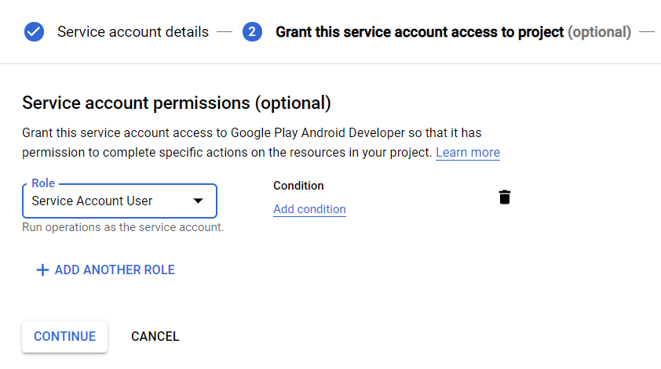
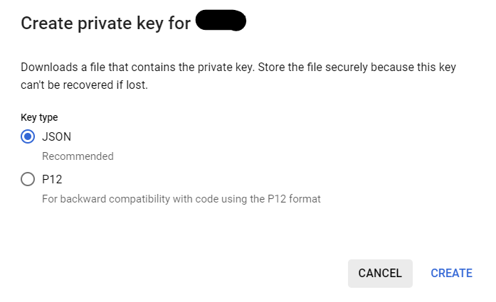
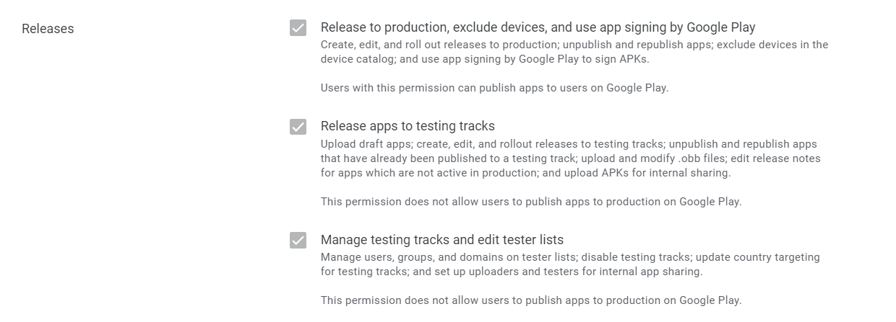
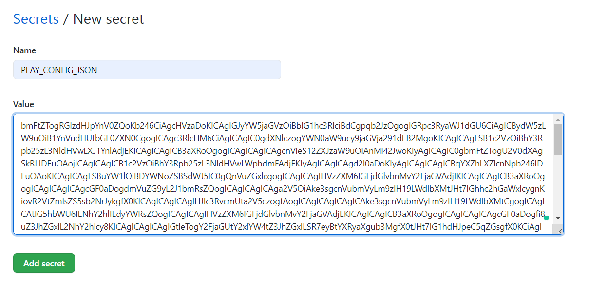
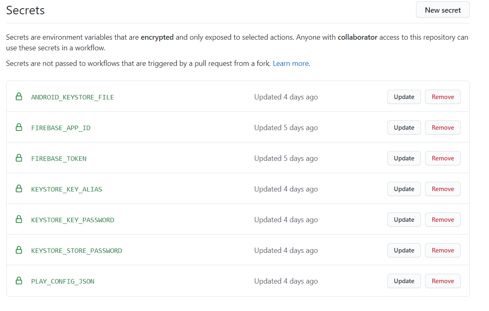
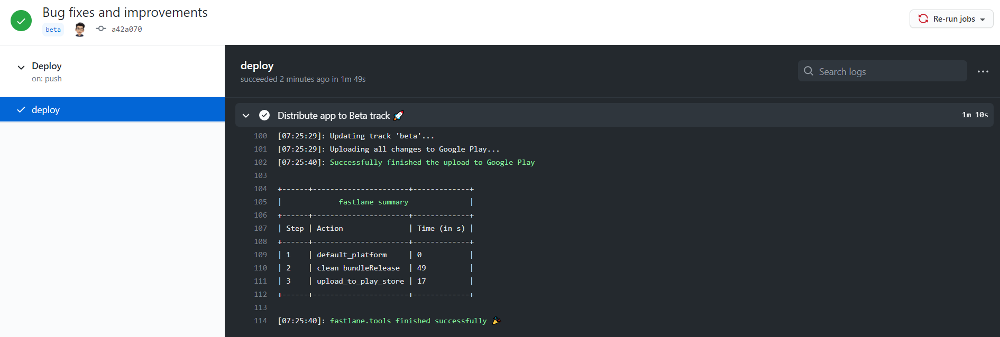

> **Code, push and chill! 🚀**

Hello Android developers, In this article, we’ll learn to automate tasks for deploying your cool Android application to the Google Play Store using GitHub Actions and Fastlane. So you just need to Write Code, Push to GitHub and then relax! Action will work for you 😃.

---

## A quick introduction to Fastlane 🏃

[Fastlane](https://fastlane.tools/) is the easiest way to automate beta deployments and releases for your iOS and Android apps. 🚀 It handles all tedious tasks, like generating screenshots, dealing with code signing, and releasing your application.

As you know, we won’t need to visit Play Console to deploy our app. So we will need **Google Play Credential file (.json)** for the Fastlane to deploy our app. So let’s generate that file.

---

## Generating Google Play Credentials (.json) 🔒

1.  Open the [Google Play Console](https://play.google.com/apps/publish/).
2.  Go to **Settings** → **API Access** → Click **"Create new service account"** and follow steps mentioned in a dialog.
3.  In GCP console, Click **"➕ CREATE SERVICE ACCOUNT"**.
4.  Provide service account name → Click **"Create"**.
5.  Then select role **"Service Account User"** and click **"Continue"**.



6.  Next step is optional so click **"Done"**.
7.  Then you’ll see list of service accounts. Click Action menu of service account which you just created → **Create Key** → Select 'Key Type' as **"JSON"** → Click **"CREATE"**.



8.  Then the credentials file will be downloaded to your machine. **Keep that file safe.**
9.  Come back to the Play Console → Click **"DONE"** on dialog. You’ll see service account which you just created.
10. Click **"GRANT ACCESS"** → Select the application which you want to allow to publish → Make sure you’ve checked 'Releases' section.



11. Finally, click **"Apply"** → Click **"Invite User"**.

Thus you’ve successfully set up Google play credentials. Keep that file with you and keep it safe.

---

## Setup Fastlane in app 🏃

You can refer to [this repository](https://github.com/PatilShreyas/AndroidFastlaneCICD) as a reference. Everything in this article is already implemented there.

Setting up Fastlane is so easy. [Ruby](https://www.ruby-lang.org/en/downloads/) should be preinstalled on the system. (Alternatively, you can follow the process as described [here](https://docs.fastlane.tools/getting-started/android/setup/)).

- Create a `Gemfile` in the root directory of your Android project as below:

```ruby
source "https://rubygems.org"

gem "fastlane"
```

- Copy the Credentials JSON file which is downloaded in the previous step in the root directory of your project and give it a name (For e.g. `play_config.json`).
- Then just run a command — `sudo gem install fastlane -NV`.
- Setup Fastlane using command — `fastlane init` and provide information with respect to your app.

Now you can see the newly created `fastlane` directory in your project with the following files:

- `Appfile` — Defines configuration information that is global to your app.
- `Fastfile` — Defines the "lanes" that drive the behaviour of Fastlane.

---

## Let’s create lanes 🛣️

You can declare various lanes in `Fastfile` which can have different behaviours or simply we can call them tasks.

Let’s say you have to deploy an application for the **BETA** track. Then your lane would look like 👇:

```fastfile
default_platform(:android)

platform :android do

  desc "Deploy a beta version to the Google Play"
  lane :beta do
    gradle(task: "clean bundleRelease")
    upload_to_play_store(track: 'beta')
  end

end
```

> **Note:** You can use many other [available parameters for configuring](https://docs.fastlane.tools/actions/upload_to_play_store/#parameters) `upload_to_play_store()` as per your requirement.

If you remove all parameters from `upload_to_play_store` then it’ll release application in **production**. So deploy lane would look like 👇:

```fastfile
desc "Deploy a new version to the Google Play"
    lane :production do
      gradle(task: "clean bundleRelease")
      upload_to_play_store
    end
```

Yeah! Thus we have completed the core part of the deployment. Now let’s test it locally.

---

## Testing it locally 👨‍💻

> **Note:** Before actually testing deployment make sure the initial version of the application should be already available on **Play Console** because Fastlane can’t create a new application. So you’ll have to create a very first version of the app from **Play Console** itself.

Run command as per syntax — `fastlane LANE_NAME`

So if you want to deploy an app to the beta track then run `fastlane beta` otherwise `fastlane production`. Make sure everything is working fine 🍷.

If everything is working fine then we are ready to go for automation ⚡.

---

## Setup GitHub Actions 🤖

This is the most interesting part 😍. As you might know that we always require a Keystore file (`.jks`) for signing **APK/App Bundle** before publishing app to the Google Play. You will also need Google play credentials file (`.json`) for deploying with Fastlane.

If your project is in the private repository then you can easily include these files in VCS. But what if your project is opensource and you still you want to keep it secret? 🤔

Here GitHub Actions Secret comes to rescue 😃. Because we’ll store file contents in the Action Secrets. But we can’t directly store exact content because it may contain whitespace. So we’ll encode these files with [Base64](https://en.wikipedia.org/wiki/Base64).

For example. Run command 👇:

```bash
base64 -i play_config.json > play_config.json.b64
```

This will encode Google play configuration file and see generated **.b64** file. Now copy the content of the file and add a secret in GitHub Actions 👇:



Do the same procedure for the Keystore file and add Keystore file’s **Base64** encoded content and other configurations as secret. Now secrets of Action would look like 👇:



---

## Let’s create GitHub Action’s Workflow 👨‍💻

1.  Create a workflow file `release.yml` in `.github/workflows` directory. Add initial contents to the file as 👇:

```yaml
name: Deploy

on:
  push:
    branches: [beta]

jobs:
  distribute:
    runs-on: ubuntu-latest

    steps:
      - uses: actions/checkout@v2

      - uses: actions/setup-ruby@v1
        with:
          ruby-version: "2.6"
```

This means, whenever commits are pushed on to the **beta** branch, the deployment will be triggered. Also, setup Ruby for workflow.

2.  Install Ruby bundle:

```yaml
- name: Install bundle
        run: |
          bundle config path vendor/bundle
          bundle install --jobs 4 --retry 3
```

3.  Now let’s create Keystore (`.jks`) file and Google play configuration (`.json`) file from content which we created using GitHub Actions Secret:

```yaml
- name: Configure Keystore
        run: |
          echo "$ANDROID_KEYSTORE_FILE" > keystore.jks.b64
          base64 -d -i keystore.jks.b64 > app/keystore.jks
          echo "storeFile=keystore.jks" >> keystore.properties
          echo "keyAlias=$KEYSTORE_KEY_ALIAS" >> keystore.properties
          echo "storePassword=$KEYSTORE_STORE_PASSWORD" >> keystore.properties
          echo "keyPassword=$KEYSTORE_KEY_PASSWORD" >> keystore.properties
        env:
          ANDROID_KEYSTORE_FILE: ${{ secrets.ANDROID_KEYSTORE_FILE }}
          KEYSTORE_KEY_ALIAS: ${{ secrets.KEYSTORE_KEY_ALIAS }}
          KEYSTORE_KEY_PASSWORD: ${{ secrets.KEYSTORE_KEY_PASSWORD }}
          KEYSTORE_STORE_PASSWORD: ${{ secrets.KEYSTORE_STORE_PASSWORD }}

      - name: Create Google Play Config file
        run : |
          echo "$PLAY_CONFIG_JSON" > play_config.json.b64
          base64 -d -i play_config.json.b64 > play_config.json
        env:
          PLAY_CONFIG_JSON: ${{ secrets.PLAY_CONFIG_JSON }}
```

4.  Finally, let’s execute the **BETA** lane:

```yaml
- name: Distribute app to Beta track 🚀
        run: bundle exec fastlane beta
```

Yeah! 😍 That’s it. You can do the same for the production deployment as per your choice.

Now just push some commits to the **beta** branch and see the magic **✨**



Lovely! 🎉 Thus your app is successfully deployed to the Google Play Store 😍.

**Write some code 👨‍💻, push 🚀 and chill! 😎**

I hope you liked this article. If you find this article helpful then share it with everyone. Maybe it’ll help someone who needs it 😃.

Thank you!

---

## 📚 Resources

- [**AndroidFastlaneCICD - GitHub**](https://github.com/PatilShreyas/AndroidFastlaneCICD)
- [**Fastlane Documentation**](https://docs.fastlane.tools/)
