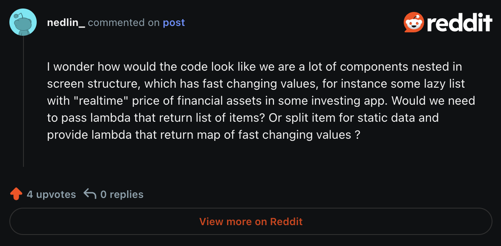
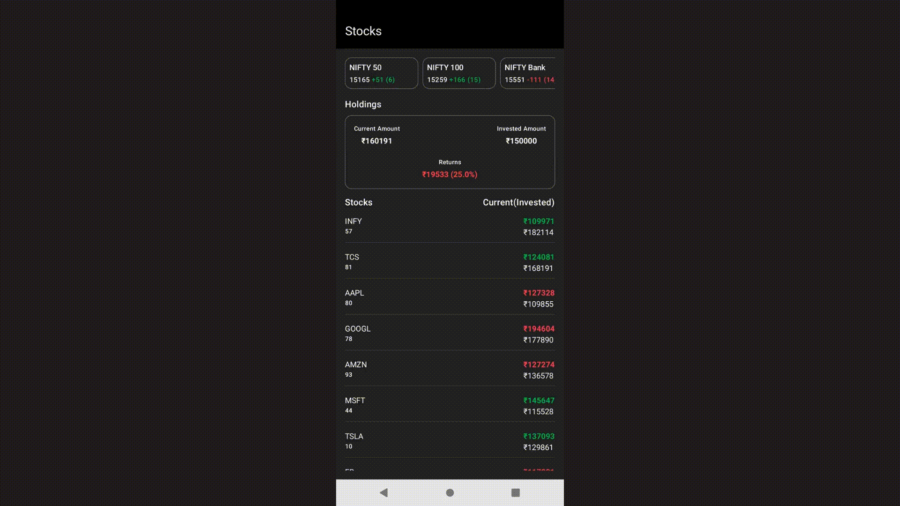
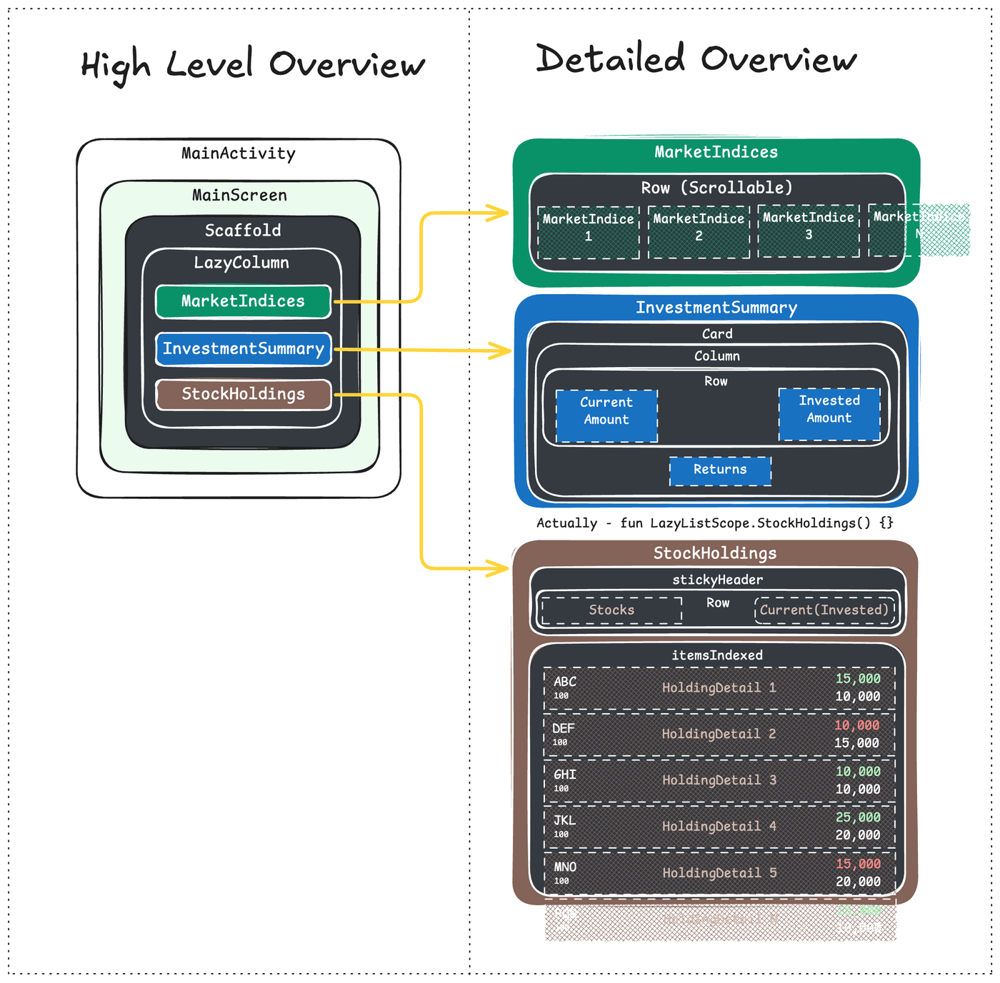
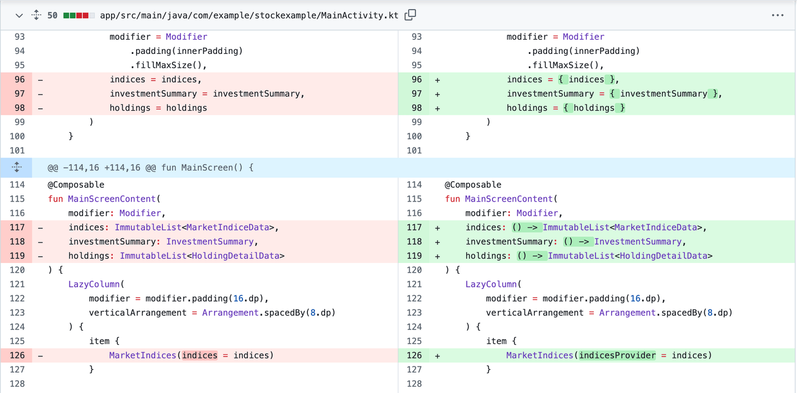
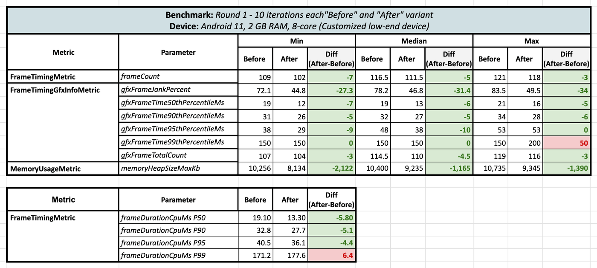
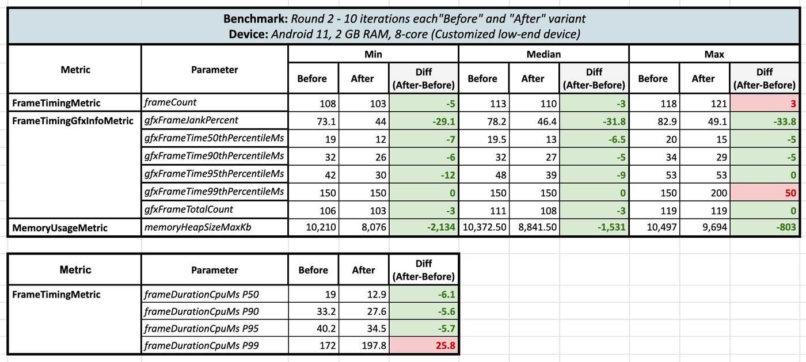
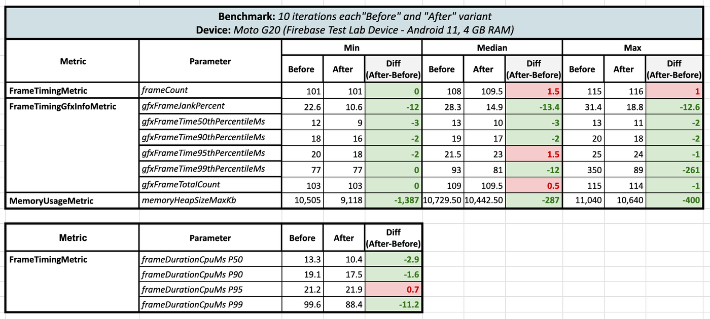
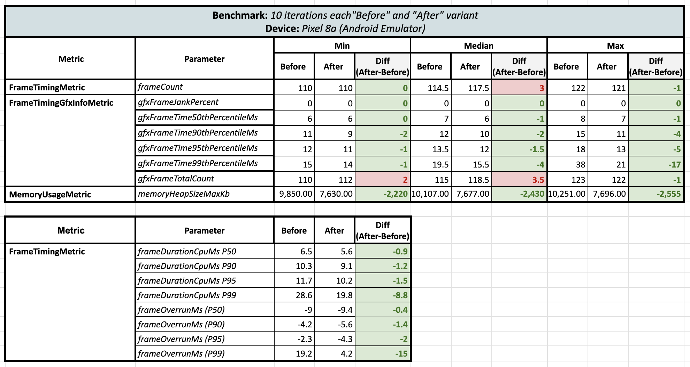
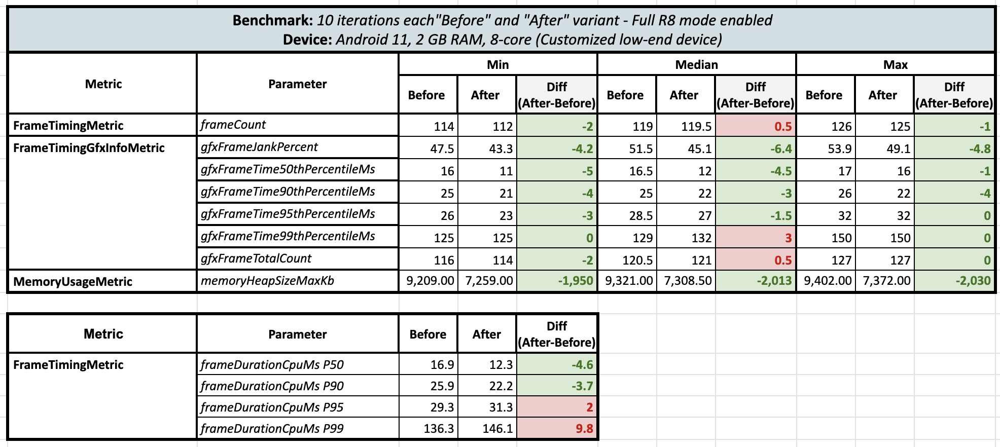
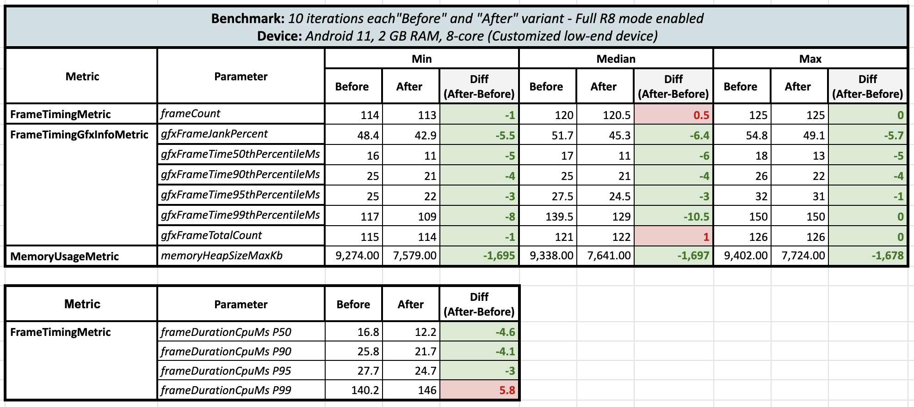

Hey composers 👋🏻, welcome to this analysis blog! Here, we'll dive into some benchmark analysis on the state propagation approach in Jetpack Compose and try to reach some conclusions. This might be a bit opinionated, but feel free to share your thoughts in the comments (as this is the beauty of our Android Community ❤️).

## 💁🏻 Context

Last week, I published a blog [***“Skipping the composition of intermediate composables“***](https://blog.shreyaspatil.dev/skipping-the-invocation-of-intermediate-composables) that sparked some controversial opinions and comments across Twitter and Reddit. This prompted me to write a post discussing the benchmarking analysis between the two approaches. So, if you’re reading this post directly, I recommend you read my previous blog post first and then continue from here.

[https://blog.shreyaspatil.dev/skipping-the-invocation-of-intermediate-composables](https://blog.shreyaspatil.dev/skipping-the-invocation-of-intermediate-composables)

## 🫴🏻 Let’s start

I found the following comment on Reddit, and it gave me an idea for an application where UI updates happen frequently across multiple components.

[](https://www.reddit.com/r/androiddev/comments/1gosan5/comment/lwle3un/?utm_source=share&utm_medium=web3x&utm_name=web3xcss&utm_term=1&utm_content=share_button)

I whipped up a quick prototype for a screen that shows the stock market. It includes basic stuff like market indices, an overview of investments, and holdings in a scrolling list. Here's what it looks like:



So, in this post, I won't dive into the details of the Compose implementation. Instead, I'll give you a quick overview of what the Compose tree looks like with the graphic below.



<div data-node-type="callout">
<div data-node-type="callout-emoji">🧑‍💻</div>
<div data-node-type="callout-text">If you want to check out the code implementation, take a look <a target="_self" rel="noopener noreferrer nofollow" href="https://github.com/PatilShreyas/compose-benchmark-lambda" style="pointer-events: none">at this repository</a>.</div>
</div>

Since this is just a sample app pretending to be like a real app, I added fixed data that changes randomly at intervals. For example, market indices update every 300ms, the investment summary updates every 250ms, and the holdings list updates every 500ms. This means there will be a total of 9-10 data updates per second for the UI.

### 🧑🏻‍💻 Implementation variants

As you already might know the implementation variants (if you’ve read the previous blog), we have named them as “Before” and “After”.

#### Before:

Direct state model propagation through the composable functions. For implementation detail, refer to the branch: [***main***](https://github.com/PatilShreyas/compose-benchmark-lambda/tree/main) ***.***

#### After:

State model propagation through the Kotlin Lambda function references through the composable functions. For implementation detail, refer to the branch: [***lambda***](https://github.com/PatilShreyas/compose-benchmark-lambda/tree/lambda) ***.*** Can also refer to [this PR](https://github.com/PatilShreyas/compose-benchmark-lambda/pull/1) to have a look on the changes.

This is how the change looks between both the variants:

[](https://github.com/PatilShreyas/compose-benchmark-lambda/pull/1/files)

Before running the benchmarks, I ensured that the composable functions of both branches are ***stable and that all restartable functions can be skipped*** with the help of compose compiler report.

## 📐 Benchmark

To benchmark this, let's use macrobenchmark. For our purpose, it's straightforward: we just need to run the benchmark for a certain period, and that's it. So, in our case, let's run this benchmark for 10 seconds. We’ll perform 10 iterations of this benchmark on the app to get the aggregated data and we want to track the following metrics:

*   `FrameTimingMetric`: This will be useful to know the amount of time the frame takes to be produced on the CPU on both the UI thread and the `RenderThread`.
*   `FrameTimingGfxInfoMetric`: It’s legacy than above metric but this gives the insights on the janks via `dumpsys gfxinfo`.
*   `MemoryUsageMetric`: We’ll use this to check memory consumption. Only for HeapSize and GPU size and keeping mode as `Mode.Max` which will give us the info about maximum memory usage observed during the benchmark.


So, benchmark test looks as follows:

```kotlin
@RunWith(AndroidJUnit4::class)
class StockScreenBenchmark {
    @get:Rule
    val benchmarkRule = MacrobenchmarkRule()

    @Test
    fun startup() = benchmarkRule.measureRepeated(
        packageName = "com.example.stockexample",
        metrics = listOf(
            FrameTimingMetric(),
            FrameTimingGfxInfoMetric(),
            MemoryCountersMetric(),
            MemoryUsageMetric(
                mode = MemoryUsageMetric.Mode.Max,
                subMetrics = listOf(
                    MemoryUsageMetric.SubMetric.HeapSize,
                    MemoryUsageMetric.SubMetric.Gpu
                )
            )
        ),
        iterations = 10,
        startupMode = StartupMode.COLD
    ) {
        pressHome()
        startActivityAndWait()

        Thread.sleep(10000)
    }
}
```

That’s it!

Also, as per the best practices, we are going to run these benchmark tests obviously on the ***release equivalent build*** having ***R8 enabled for optimization*** but by disabling obfuscation (*as benchmarking needs it*)

Now just run these benchmarks on variety of the devices and analyse the results. I ran these benchmarks on 3 devices on total out of which 2 were physical devices and last one was an emulator.

***Why 3 devices?** because* I was unable to believe the results, so I decided to run these on different devices.

Cool, let’s see the analysis after performing the benchmarks on the “Before” and “After” variants.

***

## 🧐 Analysis

So, first off, I kicked things off by running benchmark tests on the super low-end phone I have, which has just 2 GB of RAM. I wasn’t expecting much from these benchmark tests and guess what? Here are the results!



I couldn't believe these results! So, I ran a second round of benchmark tests on the same device for both variants, and the results from Round 2 finally gave me some relief:



Surprisingly, when comparing the lambda-based approach with the direct state approach, there was a huge reduction in the UI jank percentage by **30-33%**! And not only that, but there was a **reduction** in maximum heap memory consumption ***by*** 800 KB to 2134 KB *** 🤯 (*this is 10 iterations’ data and that too with running benchmark tests twice*). Also, at the ***99th percentile***, negative results were observed.

Then I decided to run these benchmarks on another device, but I didn't have one with me. That's when I remembered that Firebase Test Lab devices are now accessible through Android Studio. There are a variety of devices available there, just like real devices in the cloud. This opened up exciting possibilities for further testing!

I found a device: Moto G20, which runs on **Android 11 and has 4 GB of RAM**. So, I ran these tests on that device, and here are the results:



A similar trend was observed here too! There were reductions in both the jank percentages, frame time at 99th percentile and the maximum heap memory consumption.

Then I ran the third test on the Android Emulator (Pixel 8a - Android 14):



On the emulator, according to the frame metrics, there were no janks. However, memory usage remained consistent, with the minimum, median, and maximum values all showing reduction of **heap memory consumption by around 2400 KB** 🧐.

> **UPDATE:**
>
> After this blog was published, on X [we had a discussion](https://x.com/keyboardsurfer/status/1858894309732278501) about Full R8 mode and till above section’s benchmark results, Full R8 mode wasn’t enabled for the app, so I performed benchmark tests again on the same low-end device twice to confirm the benchmark results on the Full R8 mode and here was the result: **Round 1 (Full R8 Mode enabled)**:



**Round 2 (Full R8 Mode enabled):**



After turning on Full R8 mode, the delta for frames actually shrinked but still it’s on green side with lambdas 😄 and memory heap size usage was still the same even after R8 optimizations.

After running 6 rounds of benchmark tests on 3 different devices, I finally gained some confidence! 😃. Here are some key takeaways:

| **Parameters** | **Observation** |
| --- | --- |
| **Frame count** | 🟨 No major change |
| **Jank Percent** | 🟩 Major improvement in jank percentage in the low-end devices in lambda-based state variant without Full R8 mode enabled. Minimal improvements when full R8 mode is turned on. |
| **Frame time** | 🟩 🟥 10ms (minimum) to 200ms (maximum - P99) reduction in frame time in the lambda-based state variant. Low-end devices benefited the most. Occasionally, at P99 on low-end devices, there was a slight decrease in performance when **R8 is disabled**. Very minimal gains when **Full R8 mode is enabled**. |
| **Memory** | 🟩 Significant improvements were seen in the lambda-based state variant, with a reduction of about 2000 KB in heap size consumption **irrespective of R8 is enabled or not**. |

<div data-node-type="callout">
<div data-node-type="callout-emoji">📈</div>
<div data-node-type="callout-text">To check the raw benchmark results, you can <a target="_self" rel="noopener noreferrer nofollow" href="https://github.com/PatilShreyas/compose-benchmark-lambda/blob/main/benchmark_result.md" style="pointer-events: none">checkout this document</a>.</div>
</div>

If you want to explore this project or run benchmarks, take a look at [this repository](https://github.com/PatilShreyas/compose-benchmark-lambda/).

***

## 🔍 Conclusion?

Using lambda-based state is actually improving the runtime performance across low-end devices and actually saving the heap memory by around 2000 KB even in such a sample application, so I think lambda-based states are really useful in the scenarios in which nested sub-components change really very frequently in the application.

**What is causing heap memory saving?**

> When a function is called, memory is allocated for the function's local variables, parameters, and return value. Additionally, if the function creates new objects or data structures, these will also consume heap memory. The impact on heap memory depends on the complexity of the function and the amount of data it processes or generates.

As you might have learnt from the previous blog that even if compose compiler skips the re-composition of the UI, it’s still invoking the functions and actually performs lot of operations and also checks the equality of the state models every time the state parameters are changed. So **maybe** that has some cost associated with it, **maybe** when data changes so fast, there are so many unnecessary invocations are happening causing unnecessary memory allocation in the heap, **maybe** that’s what this lambda-based state approach is avoiding and that’s why we are seeing the advantages after using lambdas over direct states. **Learning?**

For me, the takeaway was that using stateful lambdas doesn't really have any major downsides. In fact, it's super helpful in situations where data updates quickly and leading it to update on the UI. Plus, less janks and memory benefits observed as this approach works great on low-end devices too.

***

Awesome 🤩. I hope you've gained some valuable insights from this. If you enjoyed this write-up, please share it 😉, because...

***"Sharing is Caring"***

Thank you! 😄

Let's catch up on [**X**](https://twitter.com/imShreyasPatil) or [**visit my site**](https://shreyaspatil.dev/) to know more about me 😎.