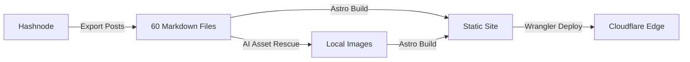

Hey everyone 👋🏻, welcome back! Today I want to talk about something slightly different from my usual Android engineering posts. I want to talk about the platform you are reading this on right now.

Since 2019, I have published over 60 technical blogs. My journey started on Medium, which was great for reaching an audience but lacked personalization. Then, I moved to Hashnode using their custom domain support. It was a massive step up, but recently, I realized it was time for a change.

Today, I am thrilled to announce that my blog has a new, permanent home. It is custom built from the ground up using **Astro**, hosted on **Cloudflare Pages**, and heavily pair programmed with Google's **Antigravity AI agent**.

Let us dive into the high-level blueprint of how I pulled it off! 🚀

---

## 🕵🏻 The Breaking Point: Why Leave Hashnode?

Hashnode is a fantastic platform for many developers, but as my needs evolved, I started facing several frustrating roadblocks:

1. **Unwanted Design Revamps**: They rolled out design changes that I simply did not like, and I had no power to revert them or customize the layout to fit the style which I liked.
2. **The Vercel Captcha Trap**: Readers started getting blocked by a random Vercel browser verification screen when visiting my blog. It required them to manually refresh the page to read my content. I emailed support about this issue, but they never responded. This was a huge turn off for user experience.
3. **Broken Social Previews**: Recently, they introduced bugs that started breaking my Open Graph (OG) image previews on social media. For example, whenever my blogs were shared on Slack channels, the missing previews made the links look completely broken and unprofessional.
4. **Performance Issues**: My Lighthouse scores were taking a hit due to platform bloat out of my control.
5. **Workflow Friction in the AI Era**: We are in the era of AI agents. I prefer writing my drafts locally using AI assistants. But with Hashnode, I had to write the Markdown, then manually fight with their specific editor formats to publish. Having a pure Git repository for my blogs just makes much more sense now.

It was clear: I needed a platform where I controlled every pixel, every byte, and every deployment.

---

## 🛠️ The Chosen Stack: Astro + Cloudflare

I chose **Astro** because it is practically designed for content-rich websites. It ships zero JavaScript by default, making it blazingly fast. (Wait, how did we build a JS lightbox then? Astro allows us to ship client-side JS exactly when we need it via 'Islands', keeping the rest of the site pure static HTML!) It has native support for Markdown and MDX, which means my Git repository is my database.

For hosting, I chose **Cloudflare Pages**. Their global Edge network is incredibly fast, and their worker integrations mean I can handle dynamic routing without breaking a sweat.

---

## 🤖 The Ultimate Co Pilot: Google Antigravity

Instead of doing everything manually, the AI agent and I pair programmed the entire migration in a few hours. The AI went through all 60 of my Markdown files, automatically fixing Hashnode formatting quirks and converting them into clean, standard Markdown. This alone saved me weeks of manual editing!

_(Fun fact: Antigravity even generated the dynamic OG-images for the blog site using the Gemini Nano model behind the scenes! I also had it generate the cover image for this very post)._

### The "Magic" Prompt

To give you an idea of how I worked with Antigravity, here is the type of prompt I used to automate the heaviest part of the migration:

<div class="post-callout">
  <strong>Pro Tip: The Migration Prompt</strong>
  "Iterate through all .md files in the blog directory. Find any image URLs hosted on cdn.hashnode.com. Download those images to src/assets/images/, giving them a slugified filename based on the post title. Finally, update the Markdown files to use the new local relative paths."
</div>

Using this prompt, the AI generated a temporary Node.js script. I simply saved it as `rescue-assets.js` in my root folder and ran `node rescue-assets.js` — it handled all 60 files while I watched the terminal. It was a true pair-programming experience.

---

## 🗺️ The Migration Journey

### Phase 1: The Blueprint and Backup

We started with a clean Astro template. I downloaded my entire blog backup from Hashnode, which gave me raw Markdown files. We imported these directly into Astro's `src/content/blog` directory.

### Phase 2: AI-Assisted Asset Rescue

Hashnode hosted all my images on their own CDN. If I closed my account, those images would break. Our markdown files were filled with URLs looking like this: `https://cdn.hashnode.com/res/hashnode/image/upload/...`. What we wanted was clean, local paths like `../../assets/images/...`.

We wrote a quick Node.js script using the `fs` and `path` modules combined with Regular Expressions to find, download, and replace these links. The logic looked something like this:

```javascript
// A simplified look at the rescue logic
const content = fs.readFileSync(file, "utf8");
// Finds the hashnode URL and stops capturing when it hits a closing parenthesis
const matches = content.match(/https:\/\/cdn\.hashnode\.com\/[^\)]+/g);

for (const url of matches) {
  const localPath = await downloadImage(url, targetDir);
  newContent = newContent.replace(url, localPath);
}
```

For heavy GIF and video assets that exceeded Cloudflare's 25 MiB size limit, we smartly offloaded them to GitHub Raw URLs.

### Phase 3: Total Backward Compatibility

One of my biggest requirements was not breaking existing links. Many of my blogs have thousands of views and are linked across Reddit, Twitter, and StackOverflow. We ensured that the URL structure from `blog.shreyaspatil.dev` remained completely identical in the new Astro setup.

### Phase 4: Redesign, Theming & Porting the Best Features

I wanted to combine the best parts of Medium and Hashnode while giving it my own distinct flavor:

- **Homepage Redesign & Pagination**: We rebuilt the homepage to elegantly showcase featured posts and cleanly paginate through my back catalog, ensuring readers can easily find older content without endless scrolling.
- **Flawless Light & Dark Modes**: No more jarring flashes! We fine tuned a beautiful, system aware light and dark theme that feels native and easy on the eyes.
- **Premium Code Snippets**: As an Android engineer, code blocks are the heart of my blog. We implemented high contrast [Shiki](https://shiki.style) syntax highlighting, complete with line diffs and a one click copy button.

```kotlin
// Example of the new Shiki highlighting + diffs
fun main() {
    println("Hello Old World") // [!code --]
    println("Hello New Astro World! 👋") // [!code ++]
}
```

- **Medium Style Lightbox**: We built a custom, vanilla JavaScript pinch to zoom lightbox.

- **Native Callouts**: We stripped away the clunky HTML callouts from Hashnode and built native Markdown highlight components using clean CSS.
- **Mermaid Diagrams**: We now have native support for [Mermaid.js](https://mermaid.js.org/). This means I can write technical flowcharts directly in Markdown without ever having to export an image again!



- **Beautiful Typography**: I brought over my favorite font combination: **Merriweather** for the reading body and **Inter** for crisp headings.

### Phase 5: SEO and Deployment Magic

We used the AI agent to read through any blogs missing meta descriptions and safely generate SEO friendly summaries. We also set up aggressive link prefetching, so now when you hover over a blog card, it loads in the background.

Finally, for deployment, we shifted to a purely static **assets only** deployment strategy. Instead of running heavy [SSR (Server Side Rendering)](https://astro.build/blog/ssr-release/), we simply use the [Wrangler CLI](https://developers.cloudflare.com/workers/wrangler/) to push our compiled folder directly to Cloudflare's Edge network:

```bash
# The magic command
npm run build && npx wrangler pages deploy dist
```

The result? Instantaneous, globally distributed page loads that feel incredibly snappy across both desktop and mobile.

---

## 🏁 Conclusion

Of course, no migration is perfect. There are a couple of minor things still missing in this new setup:

1. **Comments and Discussions**: I haven't implemented a native commenting system yet.
2. **Lifetime Reads and Views**: We integrated Google Analytics for future tracking, but it will not carry over the historical lifetime views from Hashnode.

However, these are completely acceptable trade offs for the incredible speed, control, and developer experience I now have. After serving my content on Medium and Hashnode, moving to my own custom hosting feels like arriving at a final destination. I will not be moving to any other platform anytime soon.

The best part? You can see exactly how it is built. **The entire repository is open source!** Feel free to check out the code, steal the lightbox feature, or fork it to build your own dream blog.

Check out the source code here: [patilshreyas/blog.shreyaspatil.dev](https://github.com/patilshreyas/blog.shreyaspatil.dev)

And if you are reading this right now... congratulations! You are experiencing the final result of this journey on our brand new platform. Welcome to the new era of the blog! 🎉

### References

- [Astro Documentation](https://docs.astro.build/)
- [Cloudflare Workers](https://workers.cloudflare.com/)
- [Deploying Astro to Cloudflare Pages](https://docs.astro.build/en/guides/deploy/cloudflare/)

Thanks for reading, and happy coding! 💻✨
