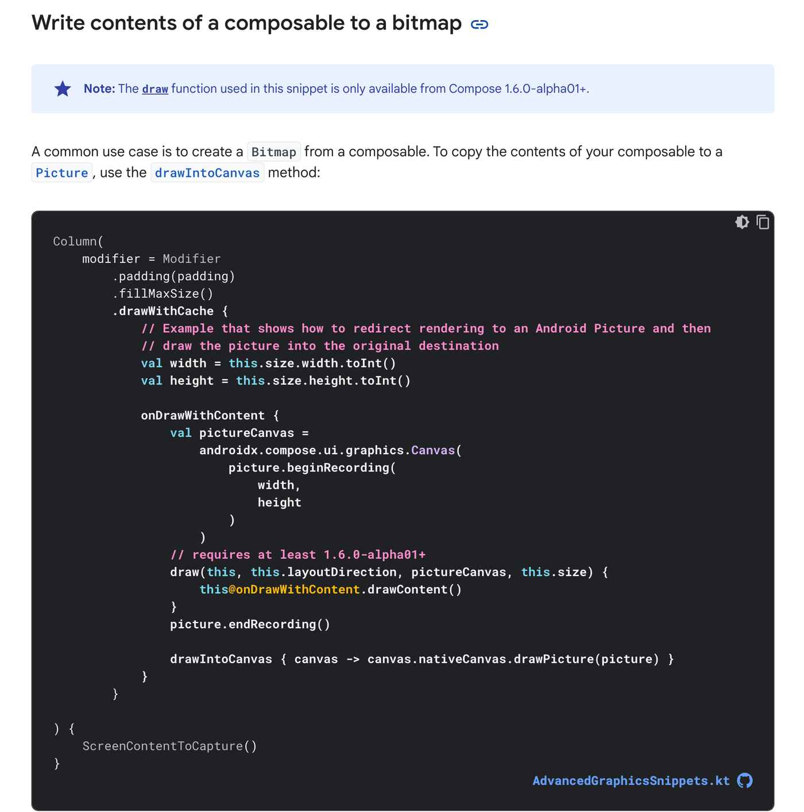
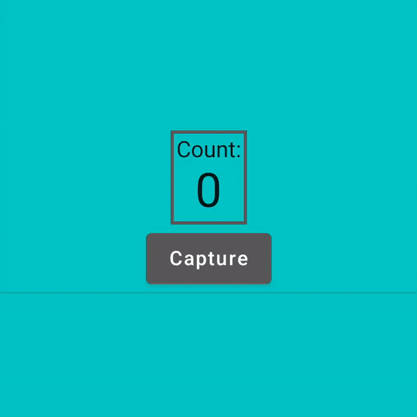
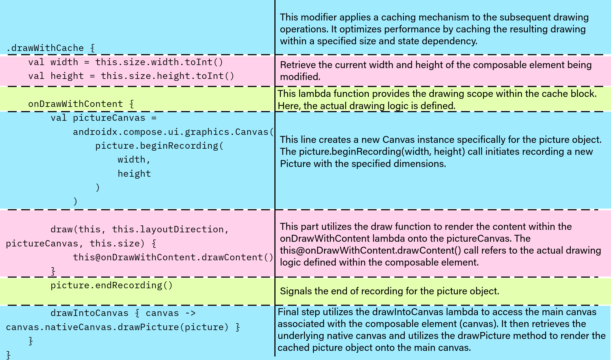
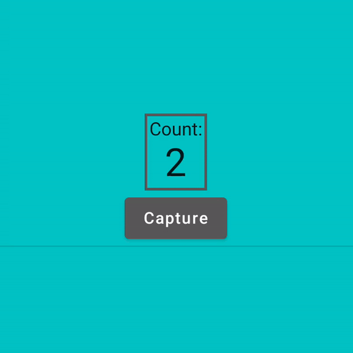

Hey Composers 👋🏻,

I'm the maintainer of a library - [Capturable](https://github.com/PatilShreyas/Capturable), *that helps you to convert composable content into a Bitmap image easily*. In the very first release of it, as there was no dedicated API from compose, I used to wrap composable content inside a `ComposeView` and then draw a View's Canvas into a Bitmap. Later in Compose 1.6.x, the API was added by which we can redirect rendering into `android.graphics.Picture`, which can then be used to create a Bitmap.

*The* [*official documentation*](https://developer.android.com/jetpack/compose/graphics/draw/modifiers#composable-to-bitmap) *has a guide for capturing the composable content into a Bitmap as follows* **OR** *see this* [*snippet*](https://github.com/android/snippets/blob/5ae1f7852164d98d055b3cc6b463705989cff231/compose/snippets/src/main/java/com/example/compose/snippets/graphics/AdvancedGraphicsSnippets.kt#L93) ⬇️

[](https://developer.android.com/jetpack/compose/graphics/draw/modifiers#composable-to-bitmap)

As this API is more efficient than my previous approach of capturing content, I adopted it in [Capturable v2.0.0](https://github.com/PatilShreyas/Capturable/releases/tag/v2.0.0).

Now it's an interesting part 😁 because I started seeing issues with this and someone also opened a similar issue on GitHub which proved that the above approach is not fulfilling all the use cases. Let's understand in the detail.

## Issue 🧐

Let's say we have a screen on which content can be changed at any time in the runtime i.e. ***stateful content*** then this issue was easily reproducible. *For example, you want to capture content having a network image (which will be loaded in future), or a simple count-down like continuously changing screen, etc.*

Let's build a simple continuous counter and try to add a capturing modifier to it. Here is what the code would look like.

```kotlin
@Composable
private fun Counter() {
    var count by remember { mutableIntStateOf(0) }
    Column(
        horizontalAlignment = Alignment.CenterHorizontally,
    ) {
        Text(text = "Count:")
        Text(text = "$count", style = MaterialTheme.typography.h4)
    }

    LaunchedEffect(key1 = Unit) {
        while (true) {
            delay(1000)
            count++
        }
    }
}
```

In the capturing UI, we'll put a simple button below this counter with the label "Capture" and once the user clicks on that button, the current state of the counter should be captured and will be displayed below the button. Code be like ⬇️

```kotlin
@Composable
fun CounterCapture() {
    val coroutineScope = rememberCoroutineScope()
    val picture = remember { Picture() }

    var imageBitmap by remember { mutableStateOf<ImageBitmap?>(null) }

    Column {
        // Content to be captured ⬇️
        Box(
            modifier = Modifier
                .drawWithCache {
                    val width = this.size.width.toInt()
                    val height = this.size.height.toInt()

                    onDrawWithContent {
                        val pictureCanvas =
                            androidx.compose.ui.graphics.Canvas(
                                picture.beginRecording(
                                    width,
                                    height
                                )
                            )
                        // requires at least 1.6.0-alpha01+
                        draw(this, this.layoutDirection, pictureCanvas, this.size) {
                            this@onDrawWithContent.drawContent()
                        }
                        picture.endRecording()

                        drawIntoCanvas { canvas -> canvas.nativeCanvas.drawPicture(picture) }
                    }
                }
        ) {
            Counter()
        }

        // Capture button
        Button(
            onClick = {
                coroutineScope.launch {
                    imageBitmap = createBitmapFromPicture(picture).asImageBitmap()
                }
            }
        ) {
            Text("Capture")
        }

        Divider()

        // Captured Image
        imageBitmap?.let {
            Text(
                text = "Captured Image",
                modifier = Modifier.padding(8.dp),
                style = MaterialTheme.typography.h6
            )

            Image(
                bitmap = it,
                contentDescription = "Captured Image"
            )
        }
    }
}
```

But when we run this, we run into an issue 😏. See the issue below.



Whoa! 😮. It doesn't only break the capturing but also ***breaks the UI state*** of a component. Because the counter is not working properly with this.

If we remove `drawWithCache {}` Modifier from the above code, then there's no issue as such and the counter will work without any issues.

## Understanding the `drawWithCache` logic 🤔

Refer to this for step by step understanding of a flow ⬇️.



> The code establishes a caching mechanism using `drawWithCache`. It creates a temporary `picture` object to render the composable's content. Once the content is drawn onto the `picture`, it's then transferred to the main canvas for final display. This approach avoids redundant calculations and re-drawing if the size and relevant state haven't changed, leading to improved performance for complex or frequently updated composables.

### Spotting the issue 🔬

As we can understand from the logic above, it captures the content from Canvas into a `Picture` and later it draws the same picture on the canvas (*which is going to be displayed on the UI*). But this is unaware of recompositions (*UI updates*). So we need a solution in such a way that we should be able to capture the content with its current state without hampering the UI updates of the content.

> Earlier, I faced the similar issue which was reported on [Google's issue-tracker](https://issuetracker.google.com/issues/305653364). In this issue was with image loading from a network and capturing content of it.

## Solution 💡

Since this issue was also affecting my library [Capturable](https://github.com/PatilShreyas/Capturable), I solved it using the recently introduced API of Modifier from the latest release of Jetpack Compose. I leveraged `Modifier.Node` API for this.

> [`Modifier.Node` is a lower level API](https://developer.android.com/reference/kotlin/androidx/compose/ui/Modifier.Node) for creating modifiers in Compose. It is the same API that Compose implements its own modifiers in and is the most performant way to create custom modifiers.
>
> ~ [Official Documentation](https://developer.android.com/jetpack/compose/custom-modifiers#implement_a_custom_modifier_using_modifiernode)

So I created a custom Modifier node as follows:

```kotlin
class CapturableModifierNode(...) : DelegatingNode(), DelegatableNode {
    // Other logic

    private suspend fun getCurrentContentAsPicture(): Picture {
        return Picture().apply { drawCanvasIntoPicture(this) }
    }

    /** Draws the current content into the provided [picture] */
    private suspend fun drawCanvasIntoPicture(picture: Picture) {
        // CompletableDeferred to wait until picture is drawn from the Canvas content
        val pictureDrawn = CompletableDeferred<Unit>()

        // Delegate the task to draw the content into the picture
        val delegatedNode = delegate(
            CacheDrawModifierNode {
                val width = this.size.width.toInt()
                val height = this.size.height.toInt()

                onDrawWithContent {
                    val pictureCanvas = Canvas(picture.beginRecording(width, height))

                    draw(this, this.layoutDirection, pictureCanvas, this.size) {
                        this@onDrawWithContent.drawContent()
                    }
                    picture.endRecording()

                    drawIntoCanvas { canvas ->
                        canvas.nativeCanvas.drawPicture(picture)

                        // Notify that picture is drawn
                        pictureDrawn.complete(Unit)
                    }
                }
            }
        )
        // Wait until picture is drawn
        pictureDrawn.await()

        // As task is accomplished, remove the delegation of node to prevent draw operations on UI
        // updates or recompositions.
        undelegate(delegatedNode)
    }
}
```

In this, `CapturableModifierNode` inherits from two interfaces: `DelegatingNode` and `DelegatableNode`, suggesting it can delegate drawing tasks to other nodes while also being delegatable itself (*as we want to re-use the* `CacheDrawModifierNode`).

You can see that we are using the same code as we saw earlier inside of `CacheDrawModifierNode`.

But see the difference that this Modifier only gets attached when capturing of content is requested. `drawCanvasIntoPicture` is a suspend method which can be called when capturing is requested. At the time of a request (call of the method), the logic of capturing is called via `delegate()` method. Then we wait until the picture is drawn by observing `pictureDrawn` (CompletableDeferred<Unit>). The wait is completed after the picture is drawn on the UI from `drawIntoCanvas {}` lambda. After the picture is drawn, the same node is removed via `undelegate()` method that removes the delegated `CacheDrawModifierNode` to prevent unnecessary work.

This can help us solve UI state issues while capturing the content. Also, ***it ensures that content is only captured when it's requested***. So our logic of drawing is only executed at the time of capturing the request and instantly undelegated after it.

After this, let's expose the Modifier element

```kotlin
fun Modifier.capturable(controller: CaptureController): Modifier {
    return this then CapturableModifierNodeElement(controller)
}

private data class CapturableModifierNodeElement(
    private val controller: CaptureController
) : ModifierNodeElement<CapturableModifierNode>() {
    override fun create(): CapturableModifierNode {
        return CapturableModifierNode(controller)
    }
    // ...
}
```

Since this has been part of my library Capturable, with it, it can be captured as follows:

```kotlin
@Composable
fun CounterCapture() {
    val coroutineScope = rememberCoroutineScope()
    val captureController = rememberCaptureController()

    var imageBitmap by remember { mutableStateOf<ImageBitmap?>(null) }

    Column {
        // Content to be captured ⬇️
        Box(Modifier.capturable(captureController)) {
            Counter()
        }

        // Capture button
        Button(
            onClick = {
                coroutineScope.launch {
                    imageBitmap = captureController.captureAsync().await().asImageBitmap()
                }
            }
        ) {
            Text("Capture")
        }
    }
}
```

All done! Let's see how it works

### Outcome ▶️



🚀 Issue fixed, composable content captured 🎯. Mission accomplished! 😀

You can see this [pull request](https://github.com/PatilShreyas/Capturable/pull/147) as a reference for code changes I did for my library.

That's it!

***

Awesome 🤩. I trust you've picked up some valuable insights from this. If you like this write-up, do share it 😉, because...

***"Sharing is Caring"***

Thank you! 😄

Let's catch up on [**X**](https://twitter.com/imShreyasPatil) or [**visit my site**](https://shreyaspatil.dev/) to know more about me 😎.

***

## See also

[https://github.com/PatilShreyas/Capturable/pull/147](https://github.com/PatilShreyas/Capturable/pull/147)