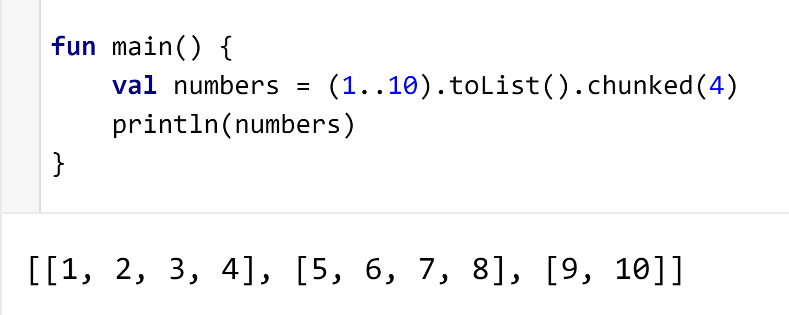
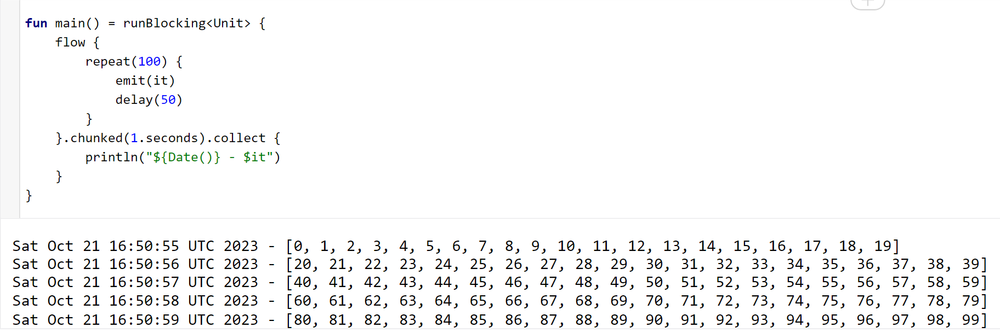

Hey Kotliners 👋🏻, Kotlin coroutines are now widely used and many of its APIs are helping developers to simplify things a lot. Flow is one of the popular APIs that developers choose for reactive programming and is quite easy to use as well. In this article, we'll particularly learn to collect the flow items per required intervals in chunks without losing produced data.

***

## Why

Before jumping on the topic, let's understand the need.

You can consider any use case in which Flow produces a lot of data within a small period that can't even skipped. Imagine we are developing an application in which we heavily log analytics. *For example, we store logs when the user clicks on the button, user interactions, scrolls, etc*. It means we can assume: that whenever a user is doing something, we can say 5-6 analytic events per 2-3 seconds need to be persisted in the database (*or need to be sent on the network*).

Imagine we are solving the use case like above with the Flow APIs. In such cases, if we are doing operations like DB persistence or network calls frequently, then it can block our business logic for a little time. *For example, ***presentational data saving/fetching should be prioritized over saving/fetching analytical data for any app***.* These DB calls or network operations happen on reserved thread pools that get busy doing unimportant things. In such cases, if we could get the data in the chunks after fixed intervals then that would solve such issues. Let's see how can we achieve that 😎.

### What's the advantage of collecting Flow items in the chunks?

When a lot of data is produced within a short period, then processing each data individually becomes costly because **a thread** has to process it. But, if we start processing the same data in bulk, it's not as costly as it is for an individual item. *Example: Bulk insertion of items in an SQLite table is always better than inserting each item individually.*

***

## Creating an operator on the Flow - `.chunked()`

Have you ever tried [`chunked()`](https://kotlinlang.org/api/latest/jvm/stdlib/kotlin.collections/chunked.html) on the Collections?



It creates a chunk (sublist) of items based on the chunk size provided. Similarly, we have to collect the Flow items in chunks. But in our use case, we want to receive the chunks based on the time intervals, not based on the size.

The API interface for this should look like this... ⬇️

```kotlin
val eventsFlow: Flow<Event> = // ...

eventsFlow
    .chunked(2.seconds)
    .collect { events: List<Event> ->
        // Do something with `events`
    }
```

So after `chunked(Duration)`, Flow type should be changed to `Flow<List<T>>`. Let's start the implementation.

***

## Design the "flow" operator function

Let's create a class first for extending the behaviour of a Flow. We call it `TimeChunkedFlow` which extends the type `Flow<List<T>>`

<script src="https://gist.github.com/PatilShreyas/2580aed71790ae776788e54a0cc10ed1.js"></script>

Now our requirement is: that we have to collect the items from `upstream` flow and have to emit all the items in chunks that are collected from it after the specified `duration`.

So, this is what basic logic looks like:

<script src="https://gist.github.com/PatilShreyas/b8c2326e84702cc5f08d22fa6c4cbe4d.js"></script>

But there is a problem 🤔. Whenever the upstream Flow is ended, this `TimeChunkedFlow` will continue emitting `[]` (empty list) and will start behaving like a hot♨️ flow even if a cold🧊flow is used. It's because we have launched a child coroutine and collected its job in `emitterJob` and it's never canceled so `collect()` is never unblocked.

But wait! If we cancel it directly at the end, it will never emit the last chunk of the Flow (*because the coroutine job might be cancelled before emitting* the *last chunked items in the collector). ***So we have to complete the execution of the job carefully by emitting the last chunk as well.**

For this, we'll introduce a flag `isFlowCompleted` that will be helpful for us to break the loop whenever the flow completes ⬇️.

<script src="https://gist.github.com/PatilShreyas/36c55d694dbd0fee559e0b85c677578f.js"></script>

Again, there is an issue of race condition 🏃🏻‍♂️. If due to its async nature, if list gets accessed among various threads and read/modified without safety then there is a risk of data loss or data duplication. To solve this, **we can use** `Mutex` **as a lock to safely perform the operations on the** `values` **list so that it won't get accidental reads/writes**. We can quickly update our logic with Mutex's implementation:

<script src="https://gist.github.com/PatilShreyas/5678e6ab24715b1ff1dc6544af5dc008.js"></script>

Nice! It's ready to use 🚀. Just create an **operator function for easy chaining for the Flow type.**

<script src="https://gist.github.com/PatilShreyas/b3ad20f0fbc2a404c26762daea026c53.js"></script>

Let's try this! Creating a sample flow and let's try collecting the items in chunks👇🏻.



Whoa! We achieved it! We can get chunked data without losing it that too with specified intervals as we wanted 😃.

You can [refer to the gist here](https://gist.github.com/PatilShreyas/c501182a92aa338e10e6ca9fdfa43da7) for full implementation.

Just remember that if the upstream flow doesn't produce any item within the specified duration, an empty list `[]` will be emitted in the collector.

> **Note:** Similarly, if you don't want chunked data by time but you want it by size, the implementation can be designed similarly. It's already in discussion on the [GitHub issues](https://github.com/Kotlin/kotlinx.coroutines/issues/1290)

### But, There's a catch! 🔴

If the Flow ***gets cancelled within the emission of the next chunk***, then data will be lost for that specific intermediate chunk which was going to be emitted. It means the collector will never receive data of the last chunk if it's cancelled before collecting that. So use it wisely by knowing your use cases suitably. **So there'll be always a problem with cancellable** `CoroutineScope` **s.** If you want a workaround for it just for a certain use case, you can wait for cancellation and emit the remaining chunk in the collector as follows:

<script src="https://gist.github.com/PatilShreyas/b7be1ab0ebb524980bde3f4c47012950.js"></script>

But this kind of implementation won't be safe to be used within UI use cases. Because, this way, the collector will get the last emission even if the flow is cancelled. **<mark>So this is a kind of hack and not a recommended solution ❌</mark>.**

So `chunked()` won't be useful for you if you don't want to lose the data in the cancellation scenarios.

***

## Remember

*<mark>This is not yet a standard library implementation and is still in discussion at </mark>*[*<mark>Kotlinx.coroutines</mark>*](https://github.com/Kotlin/kotlinx.coroutines/issues/1302) *<mark>so consider this implementation as an experiment. If you find any issues in this, feel free to comment here or on the Gist. As per my usage, it has worked so well with cold and hot flows (like SharedFlow).</mark>*

***

Awesome 🤩. I trust you've picked up some valuable insights from this. If you like this write-up, do share it 😉, because...

***"Sharing is Caring"***

Thank you! 😄

Let's catch up on [**X**](https://twitter.com/imShreyasPatil) or [**visit my site**](https://shreyaspatil.dev/) to know more about me 😎.

[**Follow my channel on WhatsApp**](https://www.whatsapp.com/channel/0029Va4DU4kLY6d03IhsCO11) to get the latest updates straight to your WhatsApp inbox.