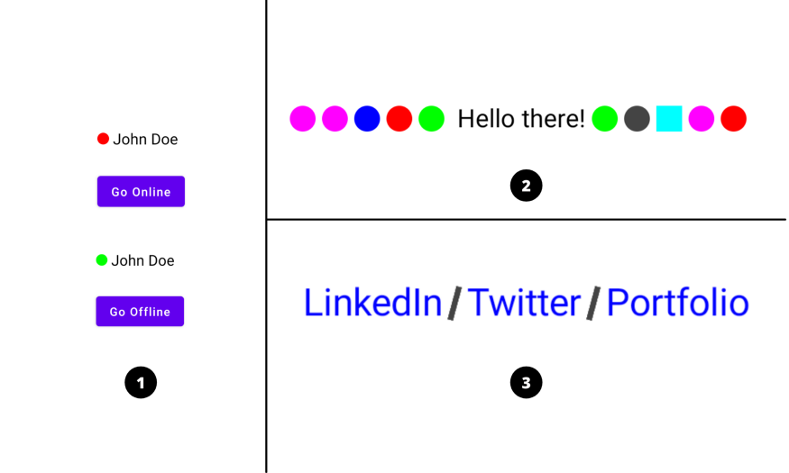

👋 Hey Composers (Android developers) 😄, finally wait is over and Jetpack Compose 1.0.0 is here 🎉. In this article, we’ll see how to use **InlineTextContent** to use composable in the text line in Jetpack Compose.

---

## ⚡ Introduction

While developing Android applications, we sometimes may have a design-use-case that we need a design that aligns with the Text component. See below diagram 👇 (Forgive me for my bad design and example 😬).



Here’s what I want to explain from this diagram:

1.  Showing user presence (online/offline) ahead of user’s name.
2.  Showing some shapes with text (just for example).
3.  Adding a divider/separator between social links.

Let’s see then how to implement UI **3**.

---

## 💻 Implementation

Okay. So we have to design a UI where we want to show three text items i.e. LinkedIn / Twitter / Portfolio and have separator in between these items. We know we can build divider UI using [Box](<https://developer.android.com/reference/kotlin/androidx/compose/foundation/layout/package-summary#Box(androidx.compose.ui.Modifier)>) with Shape as a clip. So let’s do that.

Basically, we can do these things by using `Row`, right? So what's an advantage here? So the advantage is the size of composable always remains with the size of text and we can control it. You'll see how we provide size to inline composable content in some time 👇.

Jetpack Compose comes with [foundation](https://developer.android.com/jetpack/androidx/releases/compose-foundation) group which provides ready to use building blocks and extend foundation to build your own design system pieces. **InlineTextContent** is part of foundation group. Let’s directly see code and step-by-step understand what is what and why!

Let’s first create a Composable function with basic setup of showing text:

```kotlin
@Composable
fun Social() {
    val text = buildAnnotatedString {
        append(AnnotatedString("LinkedIn ", spanStyle = SpanStyle(Color.Blue)))
        // TODO: Add Divider here
        append(AnnotatedString(" Twitter ", spanStyle = SpanStyle(Color.Blue)))
        // TODO: Add Divider here
        append(AnnotatedString(" Portfolio", spanStyle = SpanStyle(Color.Blue)))
    }
    BasicText(text = text, style = TextStyle(fontSize = 17.sp))
}
```

Basically we use `AnnotatedString` to set different styles within the same `Text` composable and for this we use `buildAnnotatedString {}` lambda function which provides a `Builder` so that we can append or add styles to text.

`appendInlineContent()` of a _Builder_ is used to insert composables into the text layout and by using this, we are going to add divider (Composable Shape) in between the text items. Let’s see usage 👇:

```kotlin
@Composable
fun Social() {
    val dividerId = "inlineDividerId"
    val text = buildAnnotatedString {
        append(AnnotatedString("LinkedIn ", spanStyle = SpanStyle(Color.Blue)))

        appendInlineContent(dividerId, "[divider]")

        append(AnnotatedString(" Twitter ", spanStyle = SpanStyle(Color.Blue)))

        appendInlineContent(dividerId, "[divider]")

        append(AnnotatedString(" Portfolio", spanStyle = SpanStyle(Color.Blue)))
    }
}
```

`appendInlineContent()` requires `id` as a first parameter which is referred by [`BasicText`](<https://developer.android.com/reference/kotlin/androidx/compose/foundation/text/package-summary#BasicText(androidx.compose.ui.text.AnnotatedString,androidx.compose.ui.Modifier,androidx.compose.ui.text.TextStyle,kotlin.Function1,androidx.compose.ui.text.style.TextOverflow,kotlin.Boolean,kotlin.Int,kotlin.collections.Map)>) to replace the corresponding composable at runtime (we’ll see this). The second parameter `alternateText` is actually appended to the `AnnotatedString` and marks the range of text to be replaced by inline content and is also used to describe the inline content by accessibility feature.

We can have multiple types of inline composables inside AnnotatedString and every composable is uniquely identified by its specified `id`. Just like here, we want to show only one type of composable i.e. Divider. So we have just repeated it twice and we have created common id `inlineDividerId`.

Now let’s proceed 👉:

```kotlin
@Composable
fun Social() {
    // ... Previous part
    val inlineDividerContent = mapOf(
        Pair(
            // This tells the [CoreText] to replace the placeholder string "[divider]" by
            // the composable given in the [InlineTextContent] object.
            dividerId,
            InlineTextContent(
                // Placeholder tells text layout the expected size and vertical alignment of
                // children composable.
                Placeholder(
                    width = 0.15.em,
                    height = 0.90.em,
                    placeholderVerticalAlign = PlaceholderVerticalAlign.TextCenter
                )
            ) {
                Box(
                    modifier = Modifier
                        .rotate(15f)
                        .fillMaxSize()
                        .clip(RectangleShape)
                        .background(Color.DarkGray)
                )
            }
        )
    )

    BasicText(text = text, inlineContent = inlineDividerContent, style = TextStyle(fontSize = 17.sp))
}
```

Here we’ve created Map of `String` i.e. _id_ and `InlineTextContent`. As discussed earlier, we can have multiple pairs of id and inline content. `Placeholder` is required for `InlineTextContent` which takes _width, height_ and _vertical alignment_ for inline content. The value specified to width and height defines the size of the composable in the text line and is always proportional to the size of a _Text_. Now inside the content, we have specified `Box` layout with _Rectangular_ shape having _color_ and some _rotation_.

Finally, we have used `BasicText` and provided **AnnotatedString** i.e. `text` which we created earlier and **Map of Inline Content**.

Yes, that’s all needed! 😃 Now just run the app and see magic ✨.


---

[Refer to this gist](https://gist.github.com/PatilShreyas/eb81fa1e47c66cf4fb7596d289e68ba9) for full code snippet and happy Composing 🙌.

I hope you liked the article and found it helpful. Thank you! 😃

**_"Sharing is caring"_**

---

## 📚 References

- [Jetpack Compose Text - Documentation](https://developer.android.com/jetpack/compose/text)
- [InlineTextContent - API Reference](https://developer.android.com/reference/kotlin/androidx/compose/foundation/text/InlineTextContent)
-

```kotlin
@Composable
fun Social() {
    val dividerId = "inlineDividerId"

    val text = buildAnnotatedString {
        // LinkedIn
        append(AnnotatedString("LinkedIn ", spanStyle = SpanStyle(Color.Blue)))

        // Divider
        appendInlineContent(dividerId, "[divider]")

        // Twitter
        append(AnnotatedString(" Twitter ", spanStyle = SpanStyle(Color.Blue)))

        // Divider
        appendInlineContent(dividerId, "[divider]")

        // Portfolio
        append(AnnotatedString(" Portfolio", spanStyle = SpanStyle(Color.Blue)))
    }

    val inlineDividerContent = mapOf(
        Pair(
            // This tells the [CoreText] to replace the placeholder string "[divider]" by
            // the composable given in the [InlineTextContent] object.
            dividerId,
            InlineTextContent(
                // Placeholder tells text layout the expected size and vertical alignment of
                // children composable.
                Placeholder(
                    width = 0.15.em,
                    height = 0.90.em,
                    placeholderVerticalAlign = PlaceholderVerticalAlign.TextCenter
                )
            ) {
                Box(
                    modifier = Modifier
                        .rotate(15f)
                        .fillMaxSize()
                        .clip(RectangleShape)
                        .background(Color.DarkGray)

                )
            }
        )
    )

    BasicText(text = text, inlineContent = inlineDividerContent, style = TextStyle(fontSize = 17.sp))
}
```
