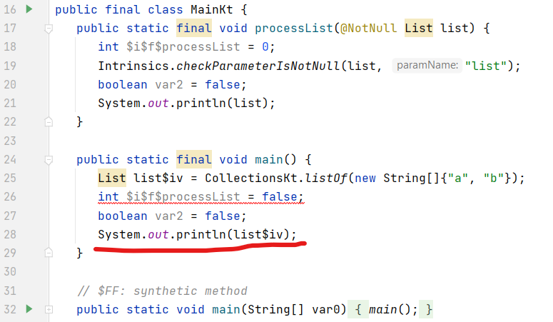

Hello developers 👋,

In this article, I’ll walk you through some basic recipes to cook your code tasty 😋 in Kotlin. You’re here in the first part of this series. I’ll present some of my views in front of you and I hope you’ll like it. This article is basically for the people who are a beginner in Kotlin, want to start development in Kotlin or people who are coming from other programming languages.

I’m working with Kotlin for **2 years as of now** and in these days I’m actively working with a community of Kotlin developers. In this time span, I always noticed that the community is using Kotlin but it’s not leveraging this beautiful programming language. In short, I would say — Developers are using Kotlin programming language syntax but they’re writing code as they’re writing code in Java 😶. That’s it!.

Kotlin is a really easy or friendly programming language which is expressive and concise, allowing you to express your ideas with less code. This helps in reducing the amount of boilerplate code in your project and there are so many features of Kotlin which can’t be explained in a single article 😄.

That’s enough introduction, I guess, and now I think we should start talking about Kotlin. So here are some Kotlin-ish concepts which I would recommend to use in your codebase 👇. Let’s take advantage of this superpower programming language.

***

## ⭐️ Function

Kotlin allows us to do Object Oriented Programming as well as Functional programming. We can use it in both OO and FP styles or mix elements of the two. So it’s not necessary to wrap your logic in a class unnecessarily.

*   See below code and notice difference 👇:

*   Here you can see we extracted methods out of `object MathUtils`. This is just a small example and this is how we can refactor code. Such functions (declared out of class) in Kotlin are resolved as static members in JVM.

***

## ⭐️ Single Expression Functions

As we already discussed that Kotlin provides us with a way to write expressive code. If your function is doing only one thing then you can directly write a function using `=`.

*   See the difference in both of the below code snippet 👇:

> **Note:** It’s not necessary to mention return type of a function when we use such expression but IMO it makes code more readable for a person who’s seeing your code for the first time 😃.

***

## ⭐️ Default Argument Functions

In Java, we generally overload functions if we want to allow configurations with different combinations. It’s not necessary in Kotlin because here Default argument comes for help.

*   If you see above snippet, you’ll notice function `startSomething()` has parameter `config` as default argument which will be considered if parameter not provided by caller function.
*   It’s a very helpful feature where we can allow a developer to configure things. We can even replace **Builder** pattern using default arguments in Kotlin. We can achieve it using default arguments + named arguments.

***

## ⭐️ Named Arguments Function

Ideally, functions should not have more than 3–4 parameters. But if your function has many parameters then there’s a possibility that wrong value might be assigned to the wrong parameter (as we are humans 😆). Here named arguments comes to rescue.

As we discussed in the previous section, we can use functions over the **Builder pattern** in Kotlin. Even we can safely change the order of parameters without any conflicts.

*   As you can see, using named arguments, our code now looks even more readable. We don’t need to see function definition now. We can directly get to know what’s happening by just looking at the caller function. This really makes it easy to configure things and this is how we can use it instead of Builder pattern.
*   Default Arguments + Named Arguments = Sweet Code 🍠 😍

***

## ⭐️ Scope Functions

Scope functions are part of Kotlin standard library functions. When you call such a function on an object with a lambda expression provided, it forms a temporary scope.

In this scope, you can access the object without its name. Such functions are called *scope functions*. There are five of them: `let`, `run`, `with`, `apply`, and `also`. These are very helpful utilities which you can also use to chain consecutive code tasks.

*   Also, we can take advantage of using scope functions for handling nullability. For example, see this code:

In this code, we used `?` operator on a `person` and used function `let {}` which provides a lambda parameter `p` (it remains `it` if not provided explicitly). Then we can safely use that property.

`let {}` can be also used to obtain some value after processing. For e.g. here we are getting age from the evaluation performed in the body of a lambda:

*   When we want to perform repetitive operations on any specific field which might modify properties of that instance then `apply {}` is best for such scenarios. See below example 👇:

The body of lambda of function `apply {}` provides `this` scope of instance on which we’re calling it and returns the same instance which we can use for chaining later.

*   Thus, here are examples of other scope functions:

There’s a lot more we can do with scope functions. Know more about Scope functions [here](https://kotlinlang.org/docs/reference/scope-functions.html).

***

## ⭐️ Extension Function

This is one of the best features of Kotlin which allows us to extend the functionality of a class without actually inheriting it. These functions are resolved statically i.e. they don’t actually modify classes.

*   By using this, we can get rid of traditional utility classes. For example, see code 👇:

As you can see, we directly called `date.format("pattern")`.

As extension function exists, extension properties also exist. Let’s see them.

***

## ⭐️ Extension Property

As we discussed the extension function, extension property does the same. It does not add the actual field in that class. It just creates a getter function under the hood.

*   See the example below:

Here we created extension properties on `Int` which returns binary, octal and hexadecimal.

> **Observe carefully:** we have used `get() =` which is invoked everytime when we’ll access the field.

***

## ⭐️ Operator Overloading

Yes, we can overload operators in Kotlin for custom types i.e. classes 😍. By using it, we can reduce some boilerplate or can improve the readability of code.

*   See the code 👇:

If you look, the first snippet looks bit confusing but the second snippet looks good and we get a clear idea of what’s happening. Know more about operator overloading [here](https://kotlinlang.org/docs/reference/operator-overloading.html).

***

## ⭐️ Infix Function

Infix function improves the beauty of our code. It allows us to create our own DSLs. It can make our code even more readable in the form of simple language. For example, see this 👇:

Did you saw that line? `task assignTo user`. It’s sweet, isn’t it? 😃

Just mark a function as `infix` and you can create your own sweetness in your codebase. You can even cook beautiful code by using Extension Function + Infix Function together ♨️.

***

## ⭐️ Inline Function

As we saw, Higher-order functions in Kotlin are resolved statically and as they’re stored as an object which might introduce runtime overhead. We can reduce this runtime overhead using `inline` function.

When a function is marked as `inline` it actually generates the code from where it’s called. For example, see this 👇:

Now as you can see, we have marked `processList()` as `inline`. Now see generated bytecode here 👇 and you’ll see that whatever we’ve written in inline function is exactly present in `main()` function.

***

## ⭐️ Reified type parameters in Inline Function

How to access the type of parameter in Inline function 🤔. **reified** keyword comes to rescue here. See code first 👇:

As you can see, now the type of class is accessible inside the function, almost as if it were a normal class. Since the function is inlined, no reflection is needed. Otherwise, without reified we might need to use **reflections** to deserialize that JSON.

***

## ⭐️ Typealias

*   It allows you to specify an alternative name for existing types.
*   If the type name is too long you can introduce a different shorter name and use the new one instead. For example, see this 👇, here we used type alias `Features` to shorten the long generic type:

***

## ⭐️ Import As

If you have created a class with the same name as of another class. If we try to use both classes in a single file it would be a clash ⚠️. We can use `as` to import specific class with another name. For example, see this 👇:

Here, we have imported `java.util.Date` class as `JDate` and we can use it by using that name only in this file.

***

Yeah! 😍 That’s how we cooked tasty code with Kotlin in this first part of this article and I hope you liked this article. In this article, we saw some basic important concepts of the Kotlin. In the next article, we’ll see some advanced one. Stay tuned for the next one 🚀.

Next part of this series is available 😍 🔽:

[**Cooking Tasty code in Kotlin 🍴 — Part 2**](https://blog.shreyaspatil.dev/cooking-tasty-code-in-kotlin-part-2)

If you liked this article, share it with everyone! 😄

***"Sharing is caring!"***

Thank you! 😃