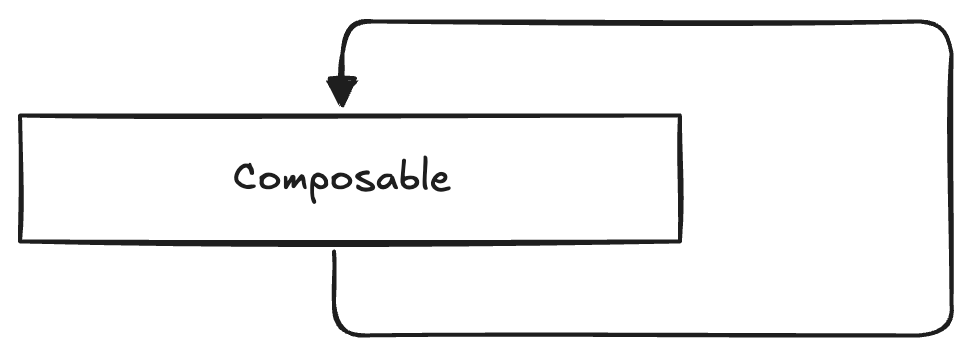
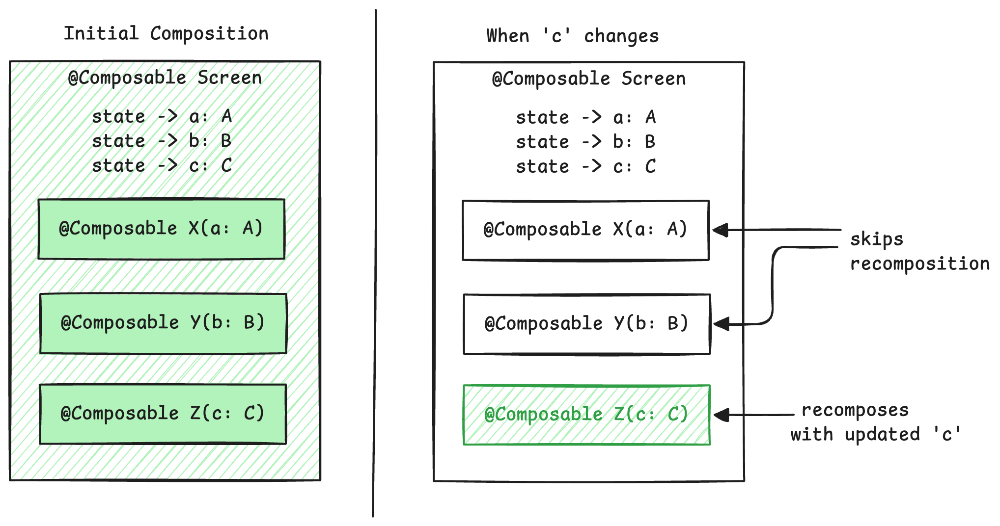
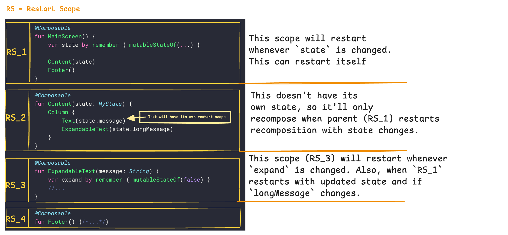
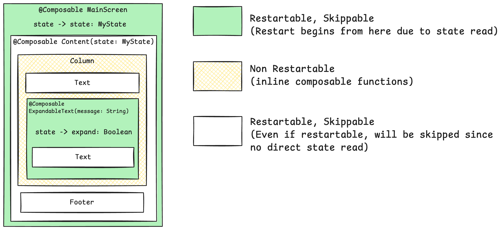

Hey Composers 👋, when walking through the internal code in different Compose libraries, we often encounter variety annotations commonly used in Jetpack Compose's standard libraries. Understanding their meanings and uses is quite beneficial and these annotations can also help to **improve the performance of composables***if used correctly* , so I decided to write about it. Let's get started.

This post aims to demystify three such compiler annotations: `@ReadOnlyComposable`, `@NonRestartableComposable`, and `@NonSkippableComposable`. For Jetpack Compose developers already familiar with the basics, this exploration will provide clearer insights into how these annotations work, when to use them, and how they can help build even more polished and performant applications, complete with practical examples.

# ⚡ Quick Refresher

Before diving into the specific annotations, it's essential to revisit some fundamental concepts of Jetpack Compose's rendering model. These mechanisms are central to how Compose achieves its efficiency and dynamism.

## **Recomposition**

Recomposition is the process by which Jetpack Compose re-executes composable functions when their underlying state or inputs change. This is the core mechanism that keeps the UI in sync with the application's data. Typically, a change to a `State<T>` object that is read within a composable will trigger its recomposition. Compose diligently tracks which composables depend on which state objects to perform these updates efficiently.



## **Skipping - Compose's Intelligent Laziness**

To avoid unnecessary work, Compose features an intelligent skipping mechanism. If a composable's inputs have not changed since its last execution, Compose can skip re-running that composable and its children, reusing the previously emitted UI. This is a cornerstone of Compose's performance strategy, as it prevents entire subtrees from re-rendering if their data remains constant. Several conditions must be met for a composable to be eligible for skipping: its parameters must be stable, it should not have a non-`Unit` return type, and it must not be annotated with `@NonSkippableComposable` or be a non-restartable composable (which has its own skipping implications, let’s have a look on it later in this post).



## **Restartability - Independent Re-invocation**

Restartable composables are functions that the Compose runtime can re-invoke independently during recomposition. This means they establish their own " **restart scope** ." If a state read within a restartable composable changes, Compose can restart the execution from that specific composable. In contrast, if a non-restartable composable needs to update due to its own parameter changes, the recomposition process might be initiated from its nearest restartable parent scope.

A **restartable** composable function serves as a distinct "scope" where the recomposition process can initiate. It acts as a specific point of entry from which Jetpack Compose can begin re-executing code in response to state changes or updated parameters. Essentially, each non-inline composable function that returns `Unit` (the typical return type for UI-emitting composables) is transformed by the Compose compiler to establish such a scope. The compiler achieves this by wrapping the function's body within mechanisms that define this restartable boundary. This transformation includes injecting calls to functions like `startRestartGroup` and passing additional parameters such as a `Composer` instance and `changed` flags, which are instrumental in managing these scopes during runtime.

When a state object, such as a `MutableState<T>`, that is read *within *the body of a restartable composable changes its value, the scope associated with that composable is invalidated. This invalidation marks the scope as "dirty" and schedules it for recomposition. Similarly, if a parameter passed *into* a restartable composable changes from its previous value, this also serves as a trigger for its re-evaluation, assuming the composable is not skipped for other reasons.

Take a look here to understand it better:





So, in the above example: `MainScreen` and `ExpandableText` hoists a state that adds a capability in them to restart themselves.

`Content` is also a non-inline composable, so it forms its **own restartable scope **but the `Content` composable will only recompose when recomposition begins at the nearest restartable scope, such as `MainScreen`, which reads state changes. In short, even if `Content` has restartable scope (RS\_2) still it’s not going to restart ever. Since it’s **skippable** too, it’ll skip recomposition if state is same as it was last time. However, for `ExpandableText`, recomposition can start from the parent restartable scope, moving from `MainScreen` → `Content` → `ExpandableText` if `state.longMessage` changes, or it can recompose itself due to reading the `expand` state.

Also, since `Column` is a inline-fun in compose, it’ll not have its own scope but it’ll take parent’s scope i.e. `Content`.

## **The Role of Parameter Stability**

Parameter stability is a contract that informs Compose whether the value of a type can change and, if it does, whether Compose will be notified of that change. Primitive types (like `Int`, `Boolean`), `String`, and function types (lambdas) are inherently considered stable by the Compose compiler. Custom classes, however, need to meet specific criteria (e.g., all public properties are `val` and of stable types) or be explicitly marked with annotations like `@Stable` or `@Immutable` to be treated as stable. Stable inputs are a prerequisite for enabling the skipping optimization.

The interplay between skipping and restartability is nuanced. A composable function might be restartable, meaning it can serve as an independent starting point for recomposition, yet still be skipped if its inputs haven't changed. Conversely, a non-restartable composable might still undergo recomposition if its parent forces it to. A solid understanding of these core mechanisms: recomposition, skipping, restartability, and stability is foundational for effectively utilizing the advanced annotations discussed next. Misinterpreting these fundamentals can lead to the misapplication of these specialized tools.

## **Relationship Between Restartable and Skippable**

A composable function can be restartable but not skippable. This typically occurs if it has one or more unstable parameters. In such a scenario, if its parent composable triggers a recomposition, this restartable-but-not-skippable child will also re-execute its body, regardless of whether its own direct inputs appear to have changed from the perspective of simple equality (because Compose cannot trust the stability of those inputs). For optimal performance, the ideal state for a composable is to be both restartable and skippable. Being restartable allows it to function as an independent unit of recomposition, and being skippable ensures that this unit will only perform work if its inputs have genuinely changed.

The connection here is fundamental: a restartable scope provides the *granularity *for recomposition, it defines " **what *can* be redrawn independently **." Skippability, which is heavily influenced by parameter stability, provides the *intelligence *to decide " **whether it *should *be redrawn.** " One capability is less effective without the other. A non-restartable (inline) function, for example, cannot be skipped on its own; its parent's skippability determines its fate. Inline composables like `Box`, `Column`, `Row` do not create their own scopes; they are part of their parent's scope. Conversely, a restartable but non-skippable function acts as a well-defined boundary that will always redraw if its parent initiates a recomposition pass that includes it. This underscores the importance of striving for parameter stability in restartable composables to maximize performance benefits. **Summarizing concepts:**|**Parameters**|**Description**|**Role in Recomposition**|**How It's Achieved** |
| --- | --- | --- | --- |
| **Restartable** | A composable that serves as a "scope" or entry point where recomposition can begin. | Enables Compose to re-execute only a specific part of the UI tree. | Compiler marks most non-inline, `Unit`\-returning composables as restartable (e.g., via `startRestartGroup`). |
| **Skippable** | A composable whose execution can be skipped during recomposition if its inputs haven't changed. | Prevents unnecessary work, improving performance. | All inputs must be stable and unchanged (compared via `equals`). Compiler marks based on parameter stability. Not applicable to non-`Unit` returning functions. |

This comparative framework helps to clarify how these distinct but related concepts work together to achieve efficient recomposition.

---

# 🪧 Annotations

## 1\. `@ReadOnlyComposable`: Reading Without Writing UI

The `@ReadOnlyComposable` annotation is a marker for `@Composable` functions that are intended only to read from the current composition context and *must not emit any UI nodes* . Such functions might access `CompositionLocal` values (like `LocalContext.current` or theme attributes) or compute values based on the compositional environment. It establishes a contract with the compiler about the function's read-only nature regarding UI output.

### **How it helps?**

By guaranteeing that no UI nodes are written, `@ReadOnlyComposable` allows the compiler to perform certain optimizations. When examining the compiled code, functions annotated this way typically do not include the `startReplaceableGroup` and `endReplaceableGroup` calls that are standard for composables emitting UI elements. This directly reduces the overhead associated with managing nodes in the slot table for functions that don't contribute to the UI tree. Beyond optimization, it clearly signals the function's purpose: it's a composable designed for data retrieval or computation within the composition, not for UI construction. This promotes a cleaner separation of concerns, allowing data retrieval logic that depends on composition (e.g., current theme, screen density) to exist outside of UI-emitting composables, enhancing reusability and testability.

### **Examples:**

1. Accessing `MaterialTheme` properties:


```kotlin
object MaterialTheme {
val colors: Colors
@Composable
@ReadOnlyComposable
get() = LocalColors.current // LocalColors.current is a CompositionLocal

val typography: Typography
@Composable
@ReadOnlyComposable
get() = LocalTypography.current // LocalTypography.current is a CompositionLocal
}
```

The `MaterialTheme.colors` getter needs to be `@Composable` to access `LocalColors.current`. However, it doesn't draw any UI itself; it merely returns the `Colors` object. The `@ReadOnlyComposable` annotation informs the compiler of this characteristic.

2. Accessing resources like strings or dimensions:


```kotlin
@Composable
@ReadOnlyComposable
fun localizedGreeting(userName: String): String {
// stringResource is also @ReadOnlyComposable
val greetingFormat = stringResource(R.string.greeting_format)
return String.format(greetingFormat, userName)
}

@Composable
@ReadOnlyComposable
fun screenPadding(): Dp {
return dimensionResource(R.dimen.screen_padding)
}
```

*Explanation:* These utility functions leverage the composable context (via `stringResource` and `dimensionResource`, which are themselves `@ReadOnlyComposable`) to fetch values. They don't emit UI but provide data for other composables.

### **When to use it:*** For utility functions that need to access `CompositionLocal`s (e.g., `LocalContext.current`, `LocalDensity.current`, `LocalLayoutDirection.current`) but do not render UI.

*For theme property accessors, as demonstrated in the `MaterialTheme` example.* For any function that computes and returns a value based on compositional information, which will then be used by other UI-emitting composables.


**Important Constraint:** A crucial rule is that `@ReadOnlyComposable` functions can only call other `@Composable` functions that are also marked as `@ReadOnlyComposable`. Attempting to invoke a regular UI-emitting composable from within a `@ReadOnlyComposable` function will lead to a compile-time error. This restriction is vital for maintaining the integrity of the "no UI emission" contract. If a `@ReadOnlyComposable` could call a UI-emitting composable, the compiler could no longer guarantee that the `@ReadOnlyComposable` itself doesn't indirectly cause UI to be emitted, thereby invalidating potential optimizations. Furthermore, these functions should not introduce (write) side effects or host `State` in a way that would trigger the recomposition of other UI elements. Using `remember` inside a `@ReadOnlyComposable` function can also be problematic, as `remember` interacts with the composer to store values in the slot table, which isn't strictly a "read-only" operation from the composer's perspective and can violate the annotation's contract.

---

## 2\. `@NonRestartableComposable` - Controlling Recomposition Boundaries

The `@NonRestartableComposable` annotation is applied to a `@Composable` function to signal to the Compose compiler that it should not generate the usual machinery that allows this function's execution to be independently restarted or skipped during recomposition. In essence, it tells Compose that this particular composable does not require its own "restart scope". A restart scope is what allows Compose to re-execute a specific part of the UI tree without re-executing its parents if only local state changes.

In simple words: `@NonRestartableComposable` tells the Compose compiler that a particular composable function **does not need to be independently restartable **. Instead, it will **always recompose if its parent composable recomposes** . This can save the small overhead associated with managing its restartability.

### How it helps?

This annotation can serve as a micro-optimization in specific, limited scenarios. It's potentially beneficial for small, simple composable functions that act as direct wrappers around another single composable, contain very little internal logic, and are themselves unlikely to be invalidated (i.e., recomposed due to their own parameter changes or direct state reads). By marking such a function as non-restartable, the compiler avoids allocating a restart scope for it, which can make the composition process marginally cheaper for these specific cases. If the Compose compiler reports indicate that a function is `restartable` but not `skippable` (perhaps due to one or more unstable parameters that are difficult to make stable), marking it with `@NonRestartableComposable` is one of the two suggested optimization paths. The alternative path is to make the function skippable by ensuring all its parameters are stable.

### **Example**

```kotlin
@NonRestartableComposable // Potential candidate if 'content' rarely changes independently
@Composable
fun SimpleIconWrapper(icon: ImageVector, modifier: Modifier = Modifier) {
// Very little logic, primarily passes parameters to Icon.
// Assumes 'icon' and 'modifier' are stable and don't change often.
Icon(imageVector = icon, contentDescription = null, modifier = modifier)
}

// Contrast with a composable that reads state directly:
@Composable
fun UserProfileHeader(userState: State<User>) {
// This composable reads 'userState'. If 'userState.value' changes,
// this composable needs to recompose.
// @NonRestartableComposable would likely be inappropriate here as it's
// expected to be a root of recomposition for its own state changes.
Text(text = userState.value.name)
//... other user details
}
```

Here, `SimpleIconWrapper` does very little beyond calling the `Icon` composable. If its parameters (`icon`, `modifier`) are stable and seldom change in a way that would require `SimpleIconWrapper` itself to be the starting point of a recomposition, it *might* be a candidate. The crucial factor is that it's "unlikely to be invalidated themselves".

### When to consider using it?

***Simple and Stateless: **It doesn't use `remember` to manage its own internal state. It primarily depends on the parameters passed to it. For small, stateless functions that primarily delegate to another single composable, have minimal internal logic, and are unlikely to be the "root" of a recomposition (i.e., they don't directly read state that changes frequently, and their parameters are stable).***Frequently Used (Potentially): **The benefits are more likely to be noticeable (though still often marginal) if the composable is instantiated many times, such as in a long list or a complex UI, where the saved overhead per instance might add up.***Leaf-like or a Thin Wrapper: **It often appears as a leaf node in the UI tree or as a very simple wrapper around another composable, applying a fixed modifier or a simple transformation.* When compiler reports show a function is `restartable` but not `skippable`, and making it skippable by stabilizing all parameters is impractical or undesirable, this annotation offers an alternative optimization strategy.


### **Important Considerations and Caveats:** ***Micro-optimization: **This is for fine-tuning performance. The actual gains are often very small and may not be noticeable in most applications.***Do profiling first: **Always use profiling tools (like Android Studio's Layout Inspector or recomposition tracking) to identify actual performance bottlenecks before applying such optimizations. Premature optimization can make code harder to read and maintain for negligible benefit.***Risk of Incorrect UI: **If you incorrectly assume a composable doesn't need to be restartable (i.e., there are cases where it *should *be skipped but now won't be because its parent recomposed), it could lead to unnecessary recompositions or even incorrect UI if the parent recomposes but the child's specific inputs (that should have led to a skip) haven't changed.***Not for Complex Logic:** If a composable has complex logic or could truly benefit from being skipped independently, it should remain restartable.


### Impact on recomposition scope

If a `@NonRestartableComposable` function *does* need to recompose (e.g., because one of its parameters changes), the recomposition will be initiated by its nearest restartable ancestor scope in the composable tree. This could potentially lead to a larger portion of the UI tree recomposing than if the function had its own dedicated restart scope. This trade-off is central to its use: a minor saving in scope allocation versus a potentially wider recomposition if the composable itself changes. This makes its ideal use case quite narrow, typically for stable passthrough wrappers. If the composable has significant internal logic or multiple child composables with their own potential state reads, the overhead of its own restart scope is likely justified to enable more granular recomposition.

---

## 3\. `@NonSkippableComposable` - Forcing Re-evaluation

The `@NonSkippableComposable` annotation ensures that a composable function will *always* be executed (recomposed) whenever its parent composable recomposes, even if all of its own input parameters are stable and have not changed since the last composition. It effectively allows a composable to opt out of Compose's normal skipping mechanism.

### How it helps?

This annotation is useful in particular situations where the default skipping behavior is undesirable.

*It can be used when a composable has important side effects or internal logic that *must *be re-evaluated on every recomposition cycle of its parent.* It serves as a mechanism to opt out of "strong skipping" mode for a specific composable if there's a need for it to be restartable but explicitly non-skippable. Strong skipping, enabled by default in newer Compose versions, makes more composables skippable; `@NonSkippableComposable` is the explicit override.

* It can also be a tool for debugging, to ensure a specific composable is indeed being called during recomposition cycles as expected.


```kotlin
@NonSkippableComposable
@Composable
fun DebuggableCounterDisplay(count: Int, label: String) {
// This composable will always execute its body if its parent recomposes,
// regardless of whether 'count' or 'label' has changed.
Log.d("RecompositionLogger", "DebuggableCounterDisplay executed with: $label - $count")
Text("Label: $label, Count: $count (I always recompose with my parent!)")
}

@Composable
fun ControllingParent() {
var parentStateTrigger by remember { mutableStateOf(0) }
val stableCount = 5
val stableLabel = "Current Value"

Button(onClick = { parentStateTrigger++ }) {
Text("Force Parent Recomposition: $parentStateTrigger")
}

// Even though 'stableCount' and 'stableLabel' do not change,
// DebuggableCounterDisplay will re-execute (and log) every time
// ControllingParent recomposes due to 'parentStateTrigger' changing.
DebuggableCounterDisplay(count = stableCount, label = stableLabel)
}
```

In this scenario, `DebuggableCounterDisplay` will print its log message and redraw its `Text` component every time `ControllingParent` undergoes recomposition. This happens irrespective of whether the `stableCount` or `stableLabel` values have actually changed, due to the `@NonSkippableComposable` annotation. This represents a deliberate choice to prioritize execution over optimization for this specific composable.

### **When to use it (Cautiously):*** For composables that contain critical side effects that absolutely must run on each parent recomposition. However, it's important to critically evaluate if these side effects are better managed by dedicated side-effect handlers like `LaunchedEffect`, `DisposableEffect`, or `SideEffect`. These handlers offer more granular control over lifecycle and cancellation, and forcing a whole composable to re-run just for a side effect might be less clean.

*For debugging purposes, to confirm that a particular composable is being invoked during recomposition cycles. *When strong skipping mode is enabled (default in Kotlin 2.0.20+), and there's a specific need for a restartable composable to *not* be skippable.


**Performance Implication:** This annotation deliberately bypasses a core Compose optimization (skipping). Consequently, its overuse can lead to performance degradation, as composables will perform more work than might be strictly necessary. While skippable composables might involve more generated code for the skipping logic, non-skippable ones incur the runtime cost of re-execution.

---

`ReadOnlyComposable` is pretty straightforward to understand but `@NonRestartableComposable` & `@NonSkippableComposable` are bif different and may sound confusing. So let’s understand the difference better.

## Key Differences in `NonRestartableComposable` & `NonSkippableComposable`

While both `@NonRestartableComposable` and `@NonSkippableComposable` influence recomposition behavior and are listed as conditions that can make a composable ineligible for standard skipping , they operate on distinct aspects of the process. Confusion between them can arise because both represent deviations from "normal" composable behavior. However, the *reason* they deviate from the default skipping path is different.

`@NonRestartableComposable` primarily affects whether the composable function establishes its *own restart scope *. A restart scope allows Compose to re-execute just that composable and its children if its direct inputs or read state change. `@NonSkippableComposable`, on the other hand, directly dictates whether the composable's execution can be *skipped* if its inputs remain unchanged when its parent recomposes.

Crucially, `@NonRestartableComposable` does **not** imply `@NonSkippableComposable`. A composable function can be non-restartable (meaning it relies on its parent's restart scope if its own parameters change) but still be skippable if its own parameters are stable and haven't changed when that parent scope initiates a recomposition. Conversely, a composable can be restartable (possessing its own scope) yet be marked with `@NonSkippableComposable` to ensure it always re-executes with its parent.

The following table provides a side-by-side comparison to clarify their distinct characteristics:

| **Annotations** | `@NonRestartableComposable` | `@NonSkippableComposable` |
| --- | --- | --- |
| **Primary Effect** | Prevents the composable from having its own independent restart scope. | Prevents the composable's execution from being skipped, even if inputs are unchanged. |
| **If Inputs Change** | The nearest restartable parent scope initiates recomposition that includes this composable. | The composable always re-executes if its parent recomposes. |
| **If Inputs Don't Change (and parent recomposes)** | Can still be skipped if its parameters are stable and unchanged. | Always re-executes. |
| **Goal** | Micro-optimization for simple wrappers by avoiding restart scope allocation. | Forcing execution for side-effects, debugging, or explicitly opting out of strong skipping for a restartable composable. |
| **Interaction with Strong Skipping**| Remains unskippable (as strong skipping applies to *restartable *composables). | Explicitly makes a *restartable* composable non-skippable, overriding strong skipping's default. |
| **Typical Use Case** | Small, stateless wrapper functions with stable inputs. | Debugging; specific side-effects (use with caution); opting out of strong skipping. |
| **Performance Implication** | Saves minor overhead of a restart scope; potential for wider recomposition if it changes. | Deliberately incurs the cost of re-execution; bypasses a core optimization. |

Choosing between these annotations requires a clear understanding of *why* the default behavior needs to be altered. Is the goal to save the minor overhead of a scope for a trivial, stable function (`@NonRestartableComposable`), or is it to ensure a function always runs regardless of its inputs (`@NonSkippableComposable`)? Misapplying one for the other's intended purpose could lead to negligible benefits or, worse, unintended performance issues.

## Interaction with Strong Skipping Mode

Strong Skipping Mode, which is enabled by default in Kotlin 2.0.20 and later versions of the Compose compiler , significantly alters the default skippability behavior of composables. This mode represents a notable shift in Compose's optimization strategy, aiming to make more composables skippable out-of-the-box and thereby reducing the developer's burden to manually ensure parameter stability just for skipping purposes.

The key changes introduced by Strong Skipping Mode are :

1. **Composables with unstable parameters become skippable:** Under strong skipping, even if a composable function receives parameters of types that the compiler cannot infer as stable, the function can still be skipped. The comparison for these unstable parameters is done using instance equality (`===`).

2. **Lambdas with unstable captures are remembered/memoized: **The compiler automatically wraps lambda expressions, even those capturing unstable variables, in a `remember` call, using appropriate keys based on the stability of captures. Essentially, with strong skipping, *all restartable composable functions become skippable by default* .


### `@NonSkippableComposable` as an Opt-Out

In a strong skipping environment, the `@NonSkippableComposable` annotation becomes particularly important. If there is a *restartable *composable that should *not* be skipped (despite strong skipping's tendency to make it skippable), `@NonSkippableComposable` is the explicit way to enforce its re-execution. This gives developers precise control to override the aggressive default skipping behavior when necessary. Without it, developers would have limited recourse if the strong skipping heuristic was unsuitable for a specific restartable composable that requires guaranteed execution.

### `@NonRestartableComposable` and Strong Skipping

Functions annotated with `@NonRestartableComposable` remain unskippable even when strong skipping is enabled. The rationale is that strong skipping primarily modifies the conditions under which *restartable* functions can be skipped. Since a `@NonRestartableComposable` function, by definition, lacks its own independent restart scope, the rules of strong skipping do not fundamentally alter its non-skippable nature in this context. Its non-skippability is inherently tied to its lack of a restart scope, not just parameter stability considerations.

---

# Conclusion

The annotations `@NonRestartableComposable`, `@ReadOnlyComposable`, and `@NonSkippableComposable` are potent instruments in the Jetpack Compose developer's toolkit. They offer fine-grained control over the Compose compiler and runtime, enabling optimizations and enforcing behavioral contracts that go beyond the default capabilities. Still, these annotations can often seem confusing, so it's ***highly recommended to use them correctly by profiling and assessing performance***thoroughly before implementing them and only use these annotations with proper understanding. This approach can boost confidence in your implementation. **Use tools like the Layout Inspector in Android Studio (to check recomposition counts), Jetpack Macrobenchmark for broader performance testing, and Compose compiler reports (for analyzing stability and skippability)** .

I hope you got the idea about how exactly these annotations works in Jetpack Compose.

Awesome. I hope you've gained some valuable insights from this. If you enjoyed this write-up, please share it 😉, because...

*** "Sharing is Caring" ***

Thank you! 😄

Let's catch up on [ **X**](https://twitter.com/imShreyasPatil) or [**visit my site** ](https://shreyaspatil.dev/) to know more about me 😎.