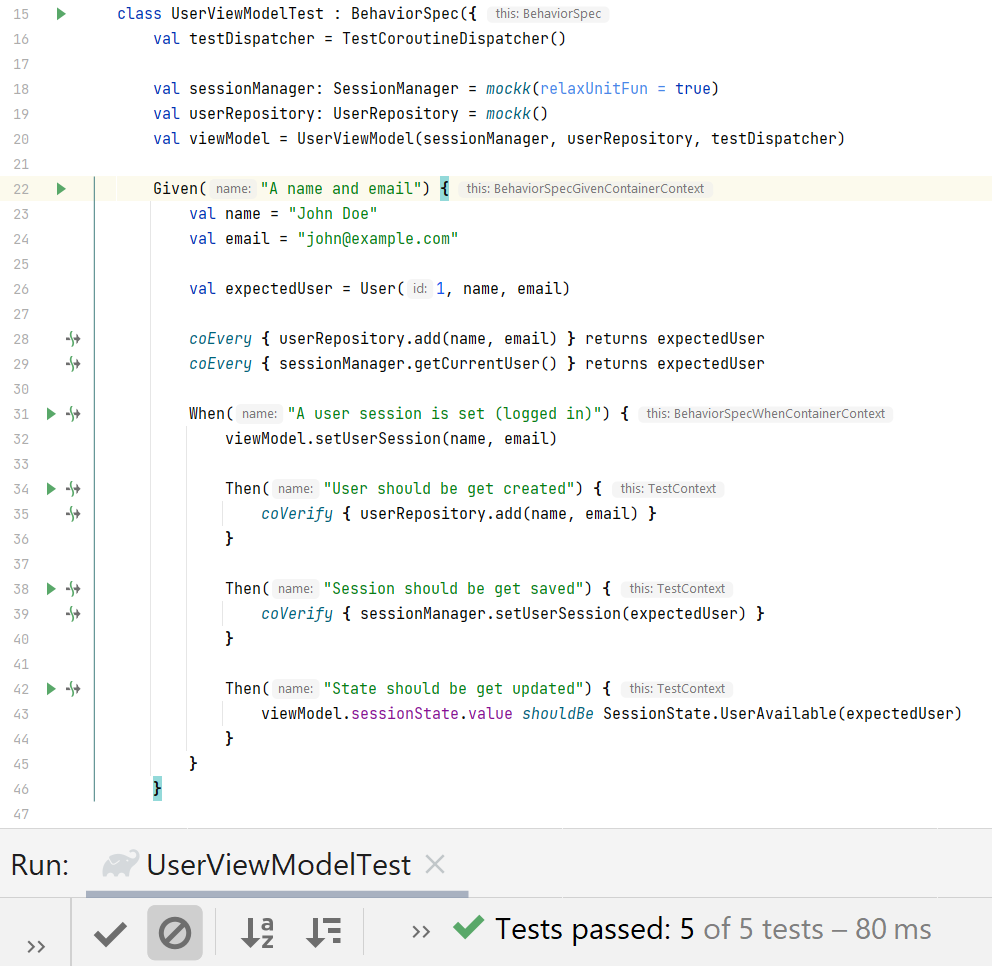

Hey Android developers 👋, Most of today's developers are adopting *MVVM architecture* primarily for Android app development 👨‍💻. While adopting these things, anyone can do certain mistakes (which is absolutely fine). In this article, we are gonna see how to follow good practices with *ViewModels in Android* and how some decisions can make us *helpless*. Okay, let's start 🏃‍♂️.

***

## 👁 Overview

Let's understand the concept of ViewModel and what's its purpose.

### 🤷‍♂️ What's ViewModel?

In MVVM architecture, it suggests separating the data presentation logic (Views or UI) from the core business logic part of the application. ViewModel is such a component whose work is to execute core business and prepare required data for UI. So that ViewModel can be used by Activities/Fragments.

*   In Android, ViewModel is a part of Android's Architecture component. UI shouldn't hold the logic, have to move it to ViewModel.
*   UI will subscribe to any state changes in ViewModel and will update UI accordingly (*reactive approach*). ViewModel is lifecycle aware and can survive changes.
*   🔴 ViewModel should not hold Android framework references (**Not Mandatory**). For e.g. Activity, Context, View, Drawable, etc.

### 🤔 Why ViewModel shouldn't hold framework references?

As we discussed earlier that ViewModel is lifecycle aware but `View` is not. Many developers also pass the `Activity`/`View` references to the ViewModel which is the most common case that developers make the ViewModel framework aware. But ViewModel should not be treated like this. If the `View` reference remains in ViewModel and it gets destroyed then `ViewModel` still hold that reference which may lead to the memory leaks 😮. Thus, the purpose for which ViewModel came into the picture is broken 💔.

***

## 🥽 Continue...

As you can see in the title, I've mentioned **"Don't let ViewModel know about FRAMEWORK LEVEL DEPENDENCIES"**. So let's discuss what's exactly *Framework Level Dependencies*.

So as you might be aware of [*AndroidViewModel*](https://developer.android.com/reference/android/arch/lifecycle/AndroidViewModel) and have used already for some rare cases.

> **Note:** `AndroidViewModel` is a `ViewModel` that has Application Context awareness.

Now when we are introducing `Context` in ViewModel, the last point 🔴 mentioned above is breaking. Why? Because `Context` is a part of Android's framework. Then it **decreases** *testability, modularity and maintainability* of the codebase. No matter our application is small scale or large scale but having tests is always good because it acts as a safeguard as it gets expanding. That thing is breaking by using `AndroidViewModel`. Because it doesn't let us write **unit tests** for that part of code (integration testing is possible only) ☹. After all, everyone knows how tricky it is to control memory leaks from the usage of `Context` if something goes wrong.

### Why do we need AndroidViewModel? 🤔

For handling framework supported tasks in ViewModel sometimes we may need it. Example: File management, storage, WorkManager APIs, etc. But it's completely up to us to implement business without using it.

Let's see the example implementation to understand the problems...

***

## 👨‍💻 Example Implementation

Okay, so we have to develop a simple android app that stores a user session and performs simple login/logout actions. Now it's obvious that we'll need to use `SharedPreferences`. So let's see how we can implement it.

### ❌ Example using AndroidViewModel way

I'm skipping UI code and will be only showing the `ViewModel` code. So let's create `UserViewModel`. Need to inherit `AndroidViewModel` and create `SharedPreferences` for storing a user session. Also, let's implement business for setting a user session.

Have you seen this code 😕? Let's discuss **key issues** with this.

#### 👎 Disadvantages of this approach

*   The `ViewModel` is not unit-testable.
*   If we need to use sessions in let's say another `ViewModel` we'll again need to copy the same code there. It’ll lead to code duplication 👯‍♂️.
*   Hard to maintain if something changes.
*   Lost single-responsibility principle since ViewModel does **everything**.

Isn't it painful? 🤕 Let's see how can we make it better 🦸‍♂️.

***

### ✔ Example using ViewModel way

So after coming from the previous approach, we need a solution that will be modular, easy to maintain, easy to plug whenever needed. So we can extract the logic of session management into a separate class 😃.

Let's create a `SessionManager`. Create and implement operations/business logic of session management.

Now, it's time to refactor and clean up `UserViewModel` 🧹.

😃 Can you see the difference? Now it has inherited *core* `ViewModel`. Too much code is now removed.

#### 👍 Advantages of this approach

*   **Only** `SessionManager` and its implementation will be responsible for managing user session related business. Thus, we achieved the Single-responsibility principle from **S**OLID.
*   ViewModel now only care about executing required business and updating UI state accordingly. `SessionManager` is handling session management.
*   Now `UserViewModel` is referencing **interface** `SessionManager` not a *class* so it (ViewModel) doesn't care or know what's happening under the hood. It means, now ViewModel doesn't have knowledge of Framework dependencies 😀.
*   If any other `ViewModel` or part of code needs to handle the session management then they just get an instance of `SessionManager` and that's all!
*   Easy to maintain.
*   Testable.

#### 👎 Disadvantages of this approach

🙄 Obviously NOT 😅.

***

### 🧪 Testing

After using the best approach, `UserViewModel` is ready for testing. Let's write code to test the code 😂.

***

Cool! That's all. I hope this article helped to understand the pitfalls of `AndroidViewModel`.

If you need to have a look at both approaches, [refer to this](https://github.com/PatilShreyas/ViewModelGoodPractice) GitHub Repository. Here you'll find both approaches. Also, if you want to take a look at **just diff only** ➕➖ then [refer to this Pull Request](https://github.com/PatilShreyas/ViewModelGoodPractice/pull/1) which is a change from the first approach to the second.

***

Thank you! 😀

***"Sharing is caring"***

***

## 📚 References

*   [**ViewModelGoodPractice - GitHub Repository**](https://github.com/PatilShreyas/ViewModelGoodPractice)
*   [**Refactoring AndroidViewModel to ViewModel - Pull Request**](https://github.com/PatilShreyas/ViewModelGoodPractice/pull/1)