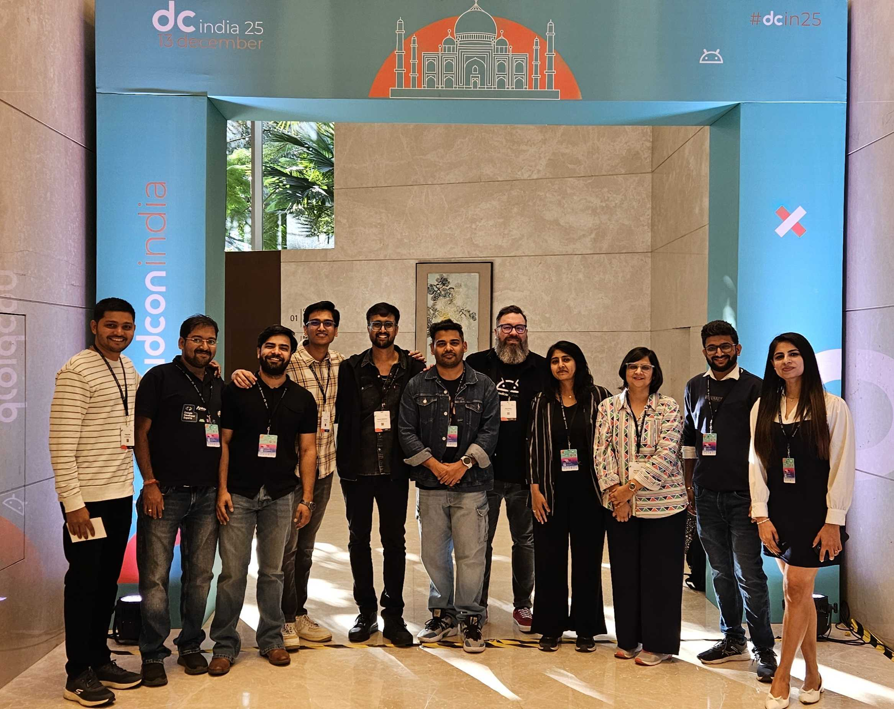
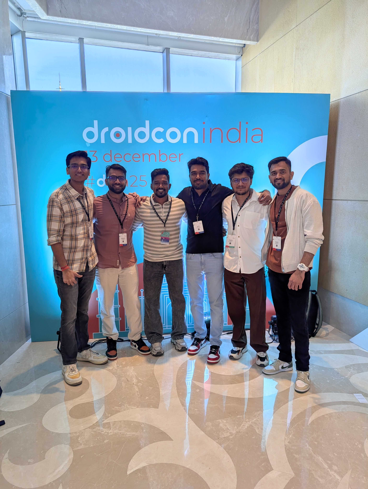
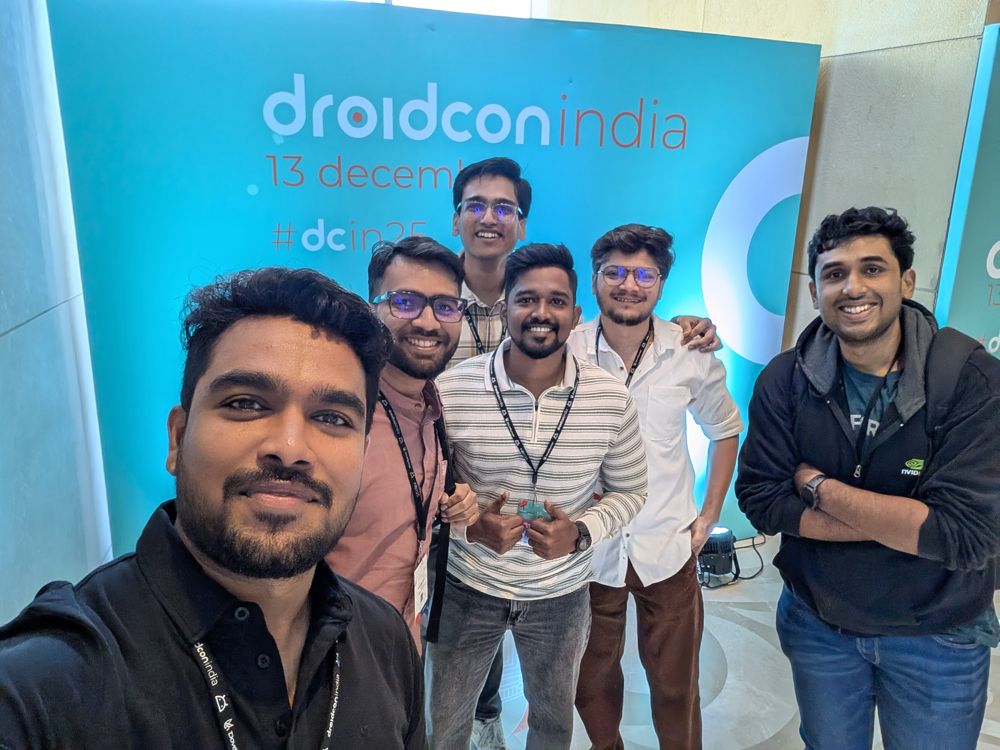

Hello 👋🏻,

It was an absolutely amazing experience at DroidCon India 2025. Seeing so many Android engineers under one roof at the world's largest Android conference was something special. The energy at DroidCon India 2025 was high. There were incredible speakers, people from different backgrounds, and so many ideas coming together.

## Watch the Talk

If you could not make it or want to watch the talk again, the recording is now out.

### 📺 Session Recording

<iframe
src="https://www.youtube.com/embed/t4xYihWEcaA"
title="YouTube video player"
allow="accelerometer; autoplay; clipboard-write; encrypted-media; gyroscope; picture-in-picture; web-share"
referrerpolicy="strict-origin-when-cross-origin"
allowfullscreen>
</iframe>

### 📊 Slides

[https://docs.google.com/presentation/d/1vUjziS5fX-0IlorgzchxVxrKbRYW9kBmLI08qaeQtJM/edit?usp=sharing](https://docs.google.com/presentation/d/1vUjziS5fX-0IlorgzchxVxrKbRYW9kBmLI08qaeQtJM/edit?usp=sharing)

## My Session: Android App Performance ⚡

I got the chance to speak on a topic I really care about: **Android App Performance** .

My session was the very last one of the event, so I was surprised by the crowd. The room was full with almost **~400 developers** ! It was great to see so many people stay until the end to learn about performance. The feedback I got was really nice, and I am glad people found the talk useful.

I have always been a big fan of DroidCon. This event is very special to me. The last time DroidCon happened in India, I was just a student in college. I looked up to the experts on stage back then.

Now in 2025, it felt great to see it return to India. It was even better to be part of the **Program Committee** . It felt like a full circle moment for me to contribute to the event that inspired me when I was starting out.

## The Community

Meeting people outside the sessions was just as good as the talks. I met so many passionate developers and had great conversations. Met my friends with whom I always have Android-ish tech chats.

One of the best parts was when people came up to me to say that my blogs or open-source work helped them. That feeling is hard to describe. It is exactly why I love this community. 🙌

Some photos:

---

A big thank you to everyone who attended, the organizers, and the volunteers who made DroidCon India 2025 a success. See you at the next one! 👋