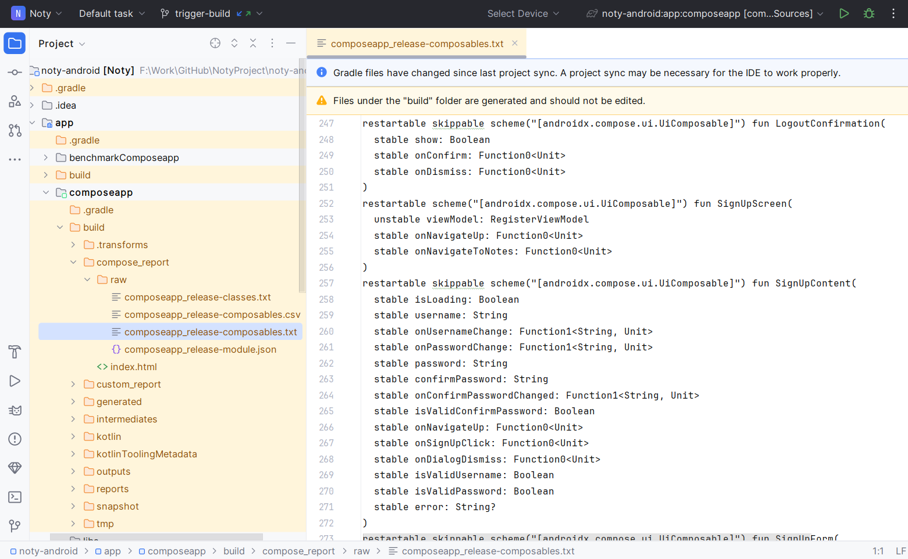
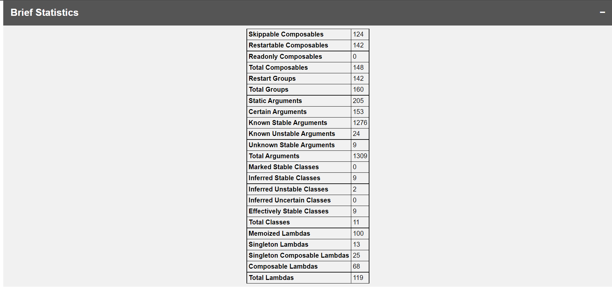
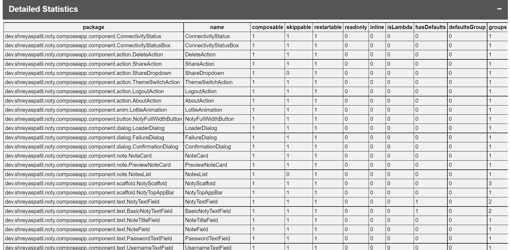
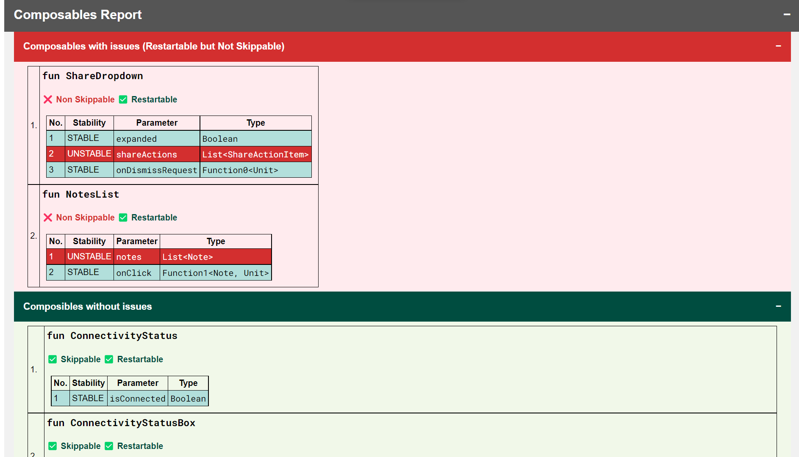
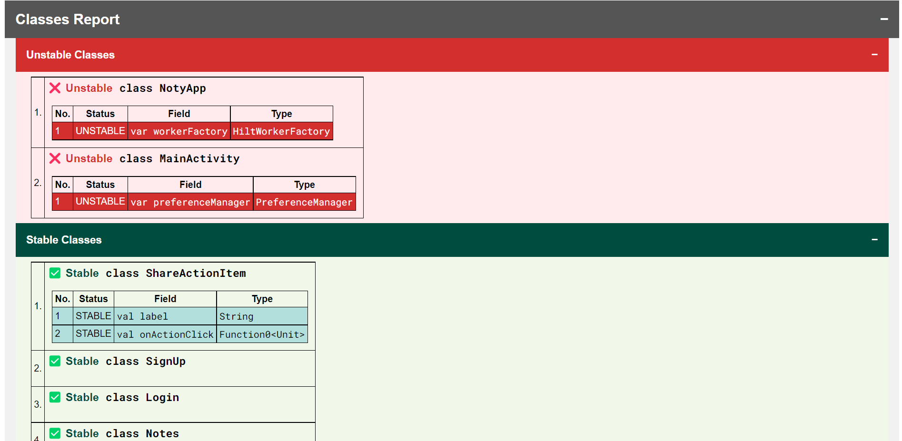
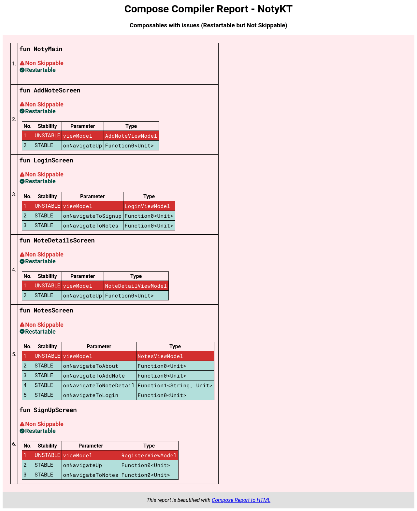

Hey Androiders 👋🏻, If you're building an app with Jetpack Compose, you might know that to make your app perform well with as few recompositions as possible, you should use stable parameters in the composable function, and so on.

To do this, the [Compose compiler report](https://developer.android.com/develop/ui/compose/performance/stability/diagnose#compose-compiler) helps you check the status of a *Composable* function, whether it's a restartable function or a skippable function. The report includes statistics of composable functions based on various parameters, details of classes, and **specifics of a composable function** (*which is our main focus*).

After following the steps mentioned [here](https://developer.android.com/develop/ui/compose/performance/stability/diagnose#setup) for generating a report, the report of composable functions looks like this (*this is a sample report*) ⬇️.



This text file contains all the information about the composable functions in the module. It shows whether each function is **restartable, skippable,** or **inline**. Additionally, it includes details about each parameter of the function and its **stability**.

Now imagine an application built entirely with Jetpack Compose, containing many Composable functions. How can a developer look at this report and check what’s working well and what’s not in their project? Since this generates reports in `json`, `csv`, and `txt` files, they are not easily traceable for developers. Additionally, the reports on Composable functions and classes become large and difficult to review. It’s quite tedious, isn't it?

***

## 💡Solution

I've developed a utility (*Gradle plugin as well as CLI*) that you can simply apply to your module. That's all you need to do, and the plugin will handle the rest, helping you focus on the areas that need your attention. In this post, let's focus on the usage of the Gradle plugin which is super easy to plug and play.

[https://github.com/PatilShreyas/compose-report-to-html](https://github.com/PatilShreyas/compose-report-to-html)

> This tool parses the reports and metrics generated by the Compose compiler and converts them into an HTML page. It intelligently highlights problematic and non-problematic composable functions and classes, allowing you to focus on the actual issues in your Compose implementation.

To apply the plugin, add the entry of the plugin to your module's Gradle file:

```kotlin
plugins {
    id("dev.shreyaspatil.compose-compiler-report-generator") version "1.3.1"
}
```

After syncing the project, you'll see tasks will be generated as per the variants and build types of your project. *Example:*


To generate the report, run the Gradle task (*or directly run the task from the tasks pane available on the right side of IDE*). *Example:*

```bash
./gradlew :app:releaseComposeCompilerHtmlReport
```

After the task runs successfully, you'll see the output in the console with the details of the report in HTML format:

```text
Compose Compiler report is generated: .../noty-android/app/composeapp/build/compose_report/index.html

BUILD SUCCESSFUL in 58s
1 actionable task: 1 executed
```

> You can also [view a sample report here](https://patilshreyas.github.io/NotyKT/pages/noty-android/compose_report.html) to get a glimpse of what the report looks like.

The report will have four sections:

### 1. Brief Statistics

Parses metrics from `.json` file and represents in tabular format.



### 2. Detailed Statistics

Generates report from `.csv` file and represents in tabular format. It includes package-wise details of functions and their statuses.



### 3. Composable Report

Parses the `-composables.txt` file, separates composables with and without issues, and highlights the associated problems. This is our main focus. With this, we can separate the composable report based on ***stability*** and ***instability***, making it easier to find issues. It highlights the unstable parameters for better focus 👇🏻.



### 4. Class report

Parses `-classes.txt` file and separates stable and unstable classes out of it and properly highlights issues associated with them.



***

Cool 😎, what more could a developer need since it helps highlight the issues? After reading the report, developers can focus on fixing the problems instead of spending too much time on the raw report.

Not only that, but the plugin is highly ***customizable***. If you want to focus only on the Composable function part, specifically the unstable composable functions, you can configure the plugin to only have this info in the report. *For example: You can configure as follows to only include the unstable composable functions in the report at the specified directory.*

```kotlin
htmlComposeCompilerReport {
    // ONLY show unstable composables in the report without stats and classes
    showOnlyUnstableComposables.set(true)

    // Output directory where report will be generated
    outputDirectory.set(layout.buildDirectory.dir("custom_dir").get().asFile) // Default: module/buildDir/compose_report
}
```

And then, this is how the report would look like ⬇️:



Only Composables with issues. Isn't this nice? 😎

You can explore the plugin and its usage further by visiting the [official documentation](https://patilshreyas.github.io/compose-report-to-html/use/using-gradle-plugin/). You can also see how to [use the CLI](https://patilshreyas.github.io/compose-report-to-html/use/using-cli/). If you want to extend this for your use cases, it's also available in the form of a [library as a maven artifact](https://patilshreyas.github.io/compose-report-to-html/use/using-utility-as-library/).

***View sample app with implementation of this plugin:***

[https://github.com/PatilShreyas/NotyKT/blob/0305688042f5809cfa4a10c9bcecf5740a446be4/noty-android/app/composeapp/build.gradle#L182-L185](https://github.com/PatilShreyas/NotyKT/blob/0305688042f5809cfa4a10c9bcecf5740a446be4/noty-android/app/composeapp/build.gradle#L182-L185)

*Currently, this plugin does not support KMP's Compose multiplatform, but it will be added soon. If you're interested in solving this, feel free to contribute.*

***

Awesome 🤩. I trust you've picked up some valuable insights from this. If you like this write-up, do share it 😉, because...

***"Sharing is Caring"***

Thank you! 😄

Let's catch up on [**X**](https://twitter.com/imShreyasPatil) or [**visit my site**](https://shreyaspatil.dev/) to know more about me 😎.

***

## 📚 Resources

*   [Official docs - Compose Report to HTML](https://patilshreyas.github.io/compose-report-to-html/)
*   [GitHub - Compoe Report to HTML](https://github.com/PatilShreyas/compose-report-to-html)