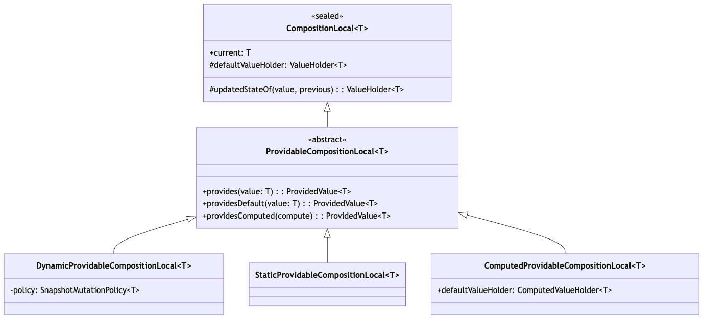
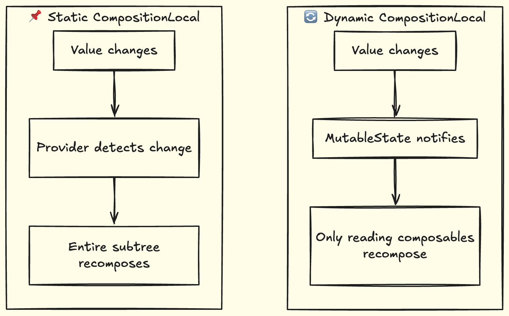
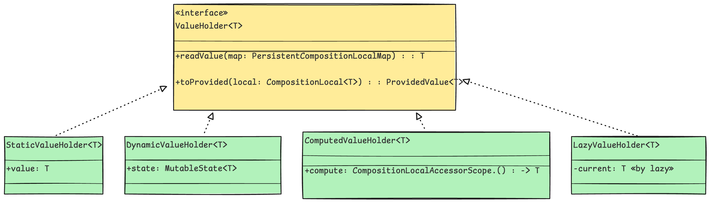
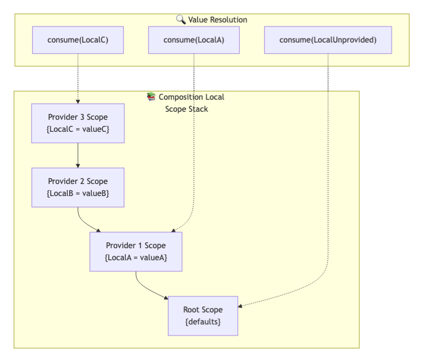
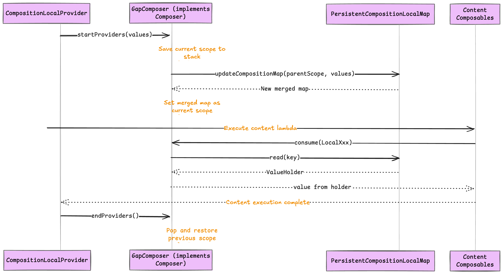
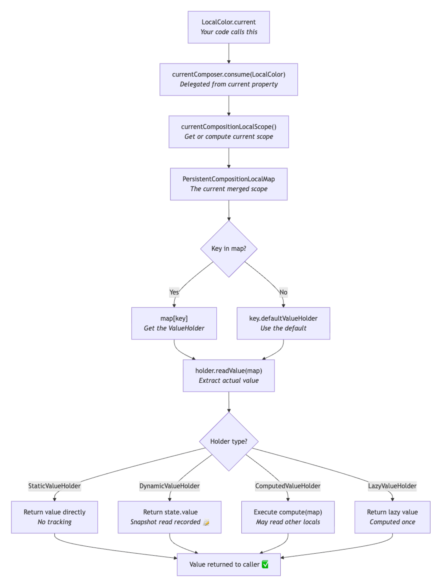

Hello Composers 👋,

In this post, we are going to dive deep into the **internals** of Composition Local API of Jetpack Compose.

When you call `LocalContentColor.current` in your Compose code, a lot happens behind the scenes. Behind that simple property access lies a smart system of persistent maps, value holders, and composer integration that passes values down your composition tree efficiently. In this deep dive, we'll trace that journey through the actual AndroidX source code and understand exactly how ***CompositionLocal*** works under the hood.

***

## **🤔 What Problem Does CompositionLocal Solve?**

Compose passes data through the composition tree explicitly via parameters to composable functions. While this is often the simplest approach, it becomes annoying when:

*   Data is needed by many components deep in the tree (prop drilling)
*   Components need to pass data between one another while keeping implementation details private

CompositionLocal provides an **implicit** way to have data flow through a composition hierarchy without explicitly passing it through every intermediate composable. Think of it like **"ambient"** data that's just *there* when you need it.

If you need a quick refresher, here is the basic usage pattern:

```kotlin
// 1. Create the Local
val LocalUser = compositionLocalOf { "Guest" }

@Composable
fun App() {
    // 2. Provide a value
    CompositionLocalProvider(LocalUser provides "Alice") {
        UserProfile()
    }
}

@Composable
fun UserProfile() {
    // 3. Consume the value (magic!) 🪄
    val name = LocalUser.current
    Text("Hello, $name")
}
```

***

### **📋 Prerequisites**

This article assumes you're familiar with:

*   Compose basics (composables, recomposition, `remember`)
*   State in compose (`MutableState` and `mutableStateOf` for state management)
*   Basic Kotlin features (data classes, lambdas, `lazy` delegate)
*   Have used Composition local API (like `LocalContext`, `LocalContentColor`, etc)

### **🗺️ What We'll Explore**

In this deep dive, we'll cover:

1.  **The Type Hierarchy** - How `CompositionLocal`, `ProvidableCompositionLocal`, and their variants are structured
2.  **Factory Functions** - What `compositionLocalOf`, `staticCompositionLocalOf`, and `compositionLocalWithComputedDefaultOf` actually create
3.  **Providing & Consuming** - How `CompositionLocalProvider` and `.current` work, plus passing locals between compositions
4.  **Under the Hood** - The internal machinery: Value Holders, Persistent Maps, and Composer integration
5.  **Practical Insights** - Performance considerations and common pitfalls to avoid

Let's start by understanding the class hierarchy that makes it all possible.

***

## **🏗️ The Type Hierarchy**

At the heart of the CompositionLocal system is a carefully designed class hierarchy:



**Understanding the hierarchy:**

*   `CompositionLocal<T>` is the sealed base class that holds the `current` property you use to read values. It's sealed so that all implementations are controlled within the Compose runtime.
*   `ProvidableCompositionLocal<T>` adds the ability to *provide* values using `provides`, `providesDefault`, and `providesComputed`.
*   The three concrete implementations (`Dynamic`, `Static`, `Computed`) decide *how* values are stored and *how* changes trigger recomposition.

### **The Base Class: CompositionLocal**

```kotlin
// Source: CompositionLocal.kt
@Stable
public sealed class CompositionLocal<T>(defaultFactory: () -> T) {
    // Stores the default value lazily - only computed when actually needed
    internal open val defaultValueHolder: ValueHolder<T> =
        LazyValueHolder(defaultFactory)

    // Called during recomposition to check if the ValueHolder
    // can be reused or if a new one needs to be created
    internal abstract fun updatedStateOf(
        value: ProvidedValue<T>,
        previous: ValueHolder<T>?,
    ): ValueHolder<T>

    // The public API - asks the Composer to find the current value
    @OptIn(InternalComposeApi::class)
    public inline val current: T
        @ReadOnlyComposable @Composable get() = currentComposer.consume(this)
}
```

The `@Stable` annotation tells the Compose compiler that this class has stable equality - two instances with the same data are considered equal. The `current` property is marked `@ReadOnlyComposable`, meaning it only reads from the composition and doesn't change it. This lets the compiler make certain optimizations.

**What if you try to access `.current` outside a `@Composable` function?** You'll get a compile-time error:

> *"@Composable invocations can only happen from the context of a @Composable function"*.

The Compose compiler enforces this because `current` needs access to `currentComposer`, which only exists during composition.

### **ProvidableCompositionLocal: The Provider Interface**

```kotlin
// Source: CompositionLocal.kt
@Stable
public abstract class ProvidableCompositionLocal<T> internal constructor(defaultFactory: () -> T) :
    CompositionLocal<T>(defaultFactory) {

    // Subclasses implement this to create the right ProvidedValue
    internal abstract fun defaultProvidedValue(value: T): ProvidedValue<T>

    // Always overrides any parent-provided value
    public infix fun provides(value: T): ProvidedValue<T> = defaultProvidedValue(value)

    // Only provides if no ancestor has already provided this local
    public infix fun providesDefault(value: T): ProvidedValue<T> =
        defaultProvidedValue(value).ifNotAlreadyProvided()

    // Provides a lambda that computes the value on each read
    // The lambda runs in CompositionLocalAccessorScope, letting
    // it read other locals
    public infix fun providesComputed(
        compute: CompositionLocalAccessorScope.() -> T
    ): ProvidedValue<T> =
        ProvidedValue(
            compositionLocal = this,
            value = null, // No static value
            explicitNull = false,
            mutationPolicy = null,
            state = null,
            compute = compute, // Store the computation lambda
            isDynamic = false,
        )
}
```

The `infix` modifier enables the clean DSL syntax: `LocalColor provides Color.Red`. The three methods serve different purposes:

*   `provides` - Always sets the value, overriding any parent-provided value.
*   `providesDefault` - Only sets the value if no ancestor has already provided it. Useful for library components that want to offer a default but respect app-level overrides:

```kotlin
// Library code: provide a default, but let app override
@Composable
fun LibraryUsage() {
    CompositionLocalProvider(
        LocalAnalytics providesDefault NoOpAnalytics()
    ) {
        LibraryComponent()
    }
}

// App code: this takes precedence over the library's default
@Composable
fun App() {
    CompositionLocalProvider(
        LocalAnalytics provides RealAnalytics()
    ) {
        LibraryUsage() // Uses RealAnalytics, not NoOpAnalytics
    }
}
```

*   `providesComputed` - Derives the value from other CompositionLocals.

The `providesComputed` option is powerful - it lets you derive values from other CompositionLocals. The lambda runs in `CompositionLocalAccessorScope`:

```kotlin
// Source: CompositionLocal.kt
public interface CompositionLocalAccessorScope {
    // Extension property to read other locals inside computed lambdas
    public val <T> CompositionLocal<T>.currentValue: T
}
```

Inside a `providesComputed` lambda, you use `LocalXxx.currentValue` (not `.current`) to read other locals.

**Why `.currentValue` instead of `.current`?** The `.current` property requires being inside a `@Composable` function (it's marked `@Composable`), but the `providesComputed` lambda isn't composable - it's just a regular lambda. The `.currentValue` extension property reads directly from the scope's map without needing a composition context.

Here's a complete example:

```kotlin
// Define the locals
val LocalBaseColor = compositionLocalOf { Color.Blue }
val LocalAccentColor = compositionLocalOf { Color.Blue }

@Composable
fun ThemedContent() {
    // Provide both: one with a value, one computed from the other
    CompositionLocalProvider(
        LocalBaseColor provides Color.Red,
        LocalAccentColor providesComputed {
            // 'this' is CompositionLocalAccessorScope,
            // so we use .currentValue
            LocalBaseColor.currentValue.copy(alpha = 0.5f)
        }
    ) {
        // When LocalBaseColor changes, LocalAccentColor
        // automatically reflects it
        val accent = LocalAccentColor.current // Color.Red with 0.5 alpha
        Text("Accent color applied", color = accent)
    }
}
```

> [!NOTE]
> The compute lambda runs on **every read** of the local, not reactively. Keep computations cheap.

### **⚡ Dynamic vs Static: The Performance Trade-off**

The two main implementations differ in a single but important flag:

```kotlin
// Source: CompositionLocal.kt
internal class DynamicProvidableCompositionLocal<T>(
    // Controls when values are "different"
    private val policy: SnapshotMutationPolicy<T>,
    defaultFactory: () -> T,
) : ProvidableCompositionLocal<T>(defaultFactory) {

    override fun defaultProvidedValue(value: T) =
        ProvidedValue(
            compositionLocal = this,
            value = value,
            explicitNull = value === null,
            mutationPolicy = policy,// Used for change detection
            state = null,
            compute = null,
            isDynamic = true, // ← This flag changes everything!
        )
}
```

```kotlin
// Source: CompositionLocal.kt
internal class StaticProvidableCompositionLocal<T>(
    defaultFactory: () -> T
) : ProvidableCompositionLocal<T>(defaultFactory) {

    override fun defaultProvidedValue(value: T) =
        ProvidedValue(
            compositionLocal = this,
            value = value,
            explicitNull = value === null,
            mutationPolicy = null, // No mutation policy needed
            state = null,
            compute = null,
            isDynamic = false, // ← Static behavior
        )
}
```

The `isDynamic` flag decides the recomposition strategy:



**Why two strategies?** First, a quick note on the **snapshot system**: This is Compose's change-tracking mechanism. When you read `state.value`, Compose records that your composable depends on that state. When the state changes later, Compose knows exactly which composables need to recompose - it's like an automatic subscription system.

*   **Dynamic** wraps values in `MutableState`, so the snapshot system tracks exactly which composables read the value. When the value changes, only those specific composables recompose. This is great for values that change often (theme colors, user preferences).
*   **Static** stores values directly without snapshot tracking. When the value changes, Compose doesn't know who read it, so it must recompose the entire subtree under the provider. This sounds wasteful, but it skips the overhead of snapshot tracking - perfect for values that rarely or never change (Android Context, configuration objects).

***

## **🏭 Factory Functions**

These are the APIs you use to create CompositionLocals:

```kotlin
// Source: CompositionLocal.kt
// Creates a dynamic local with optional custom equality policy
public fun <T> compositionLocalOf(
    policy: SnapshotMutationPolicy<T> = structuralEqualityPolicy(),
    defaultFactory: () -> T,
): ProvidableCompositionLocal<T> = DynamicProvidableCompositionLocal(policy, defaultFactory)

// Creates a static local - use for values that rarely change
public fun <T> staticCompositionLocalOf(defaultFactory: () -> T): ProvidableCompositionLocal<T> =
    StaticProvidableCompositionLocal(defaultFactory)

// Creates a local whose default is computed from other locals
public fun <T> compositionLocalWithComputedDefaultOf(
    defaultComputation: CompositionLocalAccessorScope.() -> T
): ProvidableCompositionLocal<T> = ComputedProvidableCompositionLocal(defaultComputation)
```

The `policy` parameter in `compositionLocalOf` is often ignored but important. By default, it uses `structuralEqualityPolicy()` which compares values using `==`. For large objects or objects with expensive equality checks, you might want `referenceEqualityPolicy()` (uses `===`) or a custom policy.

***

## **🔗 Providing and Consuming Values**

Now that we know how to create CompositionLocals, let's see how to provide and consume values. This is the API you'll use most often.

### **ProvidedValue: The Key-Value Pair**

When you write `LocalColor provides Color.Red`, the `provides` infix function creates a `ProvidedValue`:

```kotlin
// Source: Composer.kt
public class ProvidedValue<T>
internal constructor(
    // The CompositionLocal key this value is for
    public val compositionLocal: CompositionLocal<T>,
    // The actual value (may be null if using state or compute)
    value: T?,
    // True if null was explicitly provided (vs. unset)
    private val explicitNull: Boolean,
    // For dynamic locals: how to compare values for changes
    internal val mutationPolicy: SnapshotMutationPolicy<T>?,
    // For dynamic locals: an existing State to reuse
    internal val state: MutableState<T>?,
    // For computed locals: the computation lambda
    internal val compute: (CompositionLocalAccessorScope.() -> T)?,
    // True if this should use snapshot tracking
    internal val isDynamic: Boolean,
) {
    private val providedValue: T? = value

    // Whether this value can override a parent-provided value
    // Set to false by providesDefault()
    public var canOverride: Boolean = true
        private set

    // Gets the effective value, handling the different ways a
    // value can be stored
    internal val effectiveValue: T
        get() = when {
            explicitNull -> null as T
            state != null -> state.value // Read from State
            providedValue != null -> providedValue // Use direct value
            else -> composeRuntimeError("Unexpected form of a provided value")
        }

    // Returns this with canOverride = false (for providesDefault)
    internal fun ifNotAlreadyProvided() = this.also { canOverride = false }
}
```

The multiple nullable fields (`value`, `state`, `compute`) represent different "modes" of providing a value. Only one is typically active at a time:

| Mode | Primary field | When used |
| :--- | :--- | :--- |
| Direct value | `value` | Initial `provides` call (both static and dynamic) |
| State reuse | `state` | When reusing an existing `DynamicValueHolder` across recompositions |
| Computed | `compute` | `providesComputed` |

The `isDynamic` flag determines whether the value eventually gets wrapped in a `MutableState` (by the ValueHolder), not which field is used in `ProvidedValue` itself.

### **CompositionLocalProvider**

The composable that sets up a new scope:

```kotlin
// Source: CompositionLocal.kt

@Composable
@NonSkippableComposable // Must always execute - can't be skipped even if inputs unchanged
public fun CompositionLocalProvider(
    vararg values: ProvidedValue<*>,
    content: @Composable () -> Unit,
) {
    // Tell the composer we're starting a provider block
    currentComposer.startProviders(values)
    // Execute the content with the new scope active
    content()
    // Tell the composer we're done - restore the previous scope
    currentComposer.endProviders()
}
```

The `@NonSkippableComposable` annotation is important - even if the provided values haven't changed, we must execute this composable to maintain the scope stack correctly.

**API Variants:**

| Function | Use Case |
| :--- | :--- |
| `CompositionLocalProvider(vararg values, content)` | Multiple values |
| `CompositionLocalProvider(value, content)` | Single value (avoids array allocation) |
| `CompositionLocalProvider(context, content)` | From a captured `CompositionLocalContext` |
| `withCompositionLocal(value, content): T` | Returns a value (non-Unit) |
| `withCompositionLocals(vararg values, content): T` | Multiple values, returns a value |

The `withCompositionLocal` variants are useful when you need to return a value from the content block instead of just rendering UI:

```kotlin
// Example: Measure text with a specific density
@Composable
fun measureTextWidth(text: String, customDensity: Density): Int {
    val textMeasurer = rememberTextMeasurer()

    // Temporarily use custom density and return the measured width
    return withCompositionLocal(LocalDensity provides customDensity) {
        textMeasurer.measure(text).size.width // Returns Int, not Unit
    }
}
```

***

### **🔀 Passing Locals Between Compositions**

Sometimes you need to pass CompositionLocals to a composition that isn't a direct child - like a `Dialog`, `Popup`, or a custom composition created via `Composition()`. Compose provides `CompositionLocalContext` for this:

```kotlin
// Source: CompositionLocal.kt
public class CompositionLocalContext internal constructor(
    internal val compositionLocals: PersistentCompositionLocalMap
) {
    // Wraps the persistent map and provides equals/hashCode
}
```

**Capturing the current context:**

```kotlin
// Source: Composables.kt
public val currentCompositionLocalContext: CompositionLocalContext
    @Composable
    get() =
        CompositionLocalContext(
            currentComposer.buildContext().getCompositionLocalScope()
        )
```

**When do you need this?** Components like `Dialog` and `Popup` create **separate window compositions** - they're not children in the composition tree. Without special handling, your theme colors and other locals wouldn't flow through.

**Realistic example - Custom Dialog:**

```kotlin
@Composable
fun MyScreen() {
    var showDialog by remember { mutableStateOf(false) }

    // We're inside MaterialTheme, so LocalContentColor is available
    Button(onClick = { showDialog = true }) {
        Text("Show Dialog")
    }

    if (showDialog) {
        // Capture ALL current locals before entering the dialog
        val capturedContext = currentCompositionLocalContext

        Dialog(onDismissRequest = { showDialog = false }) {
            // Dialog creates a NEW composition (separate window)
            // Without this, LocalContentColor would be the default,
            // not the theme's!
            CompositionLocalProvider(capturedContext) {
                Surface {
                    Text(
                        "This text uses the theme's content color!",
                        color = LocalContentColor.current // ✅ Works
                    )
                }
            }
        }
    }
}
```

**How it works internally:**

The `CompositionContext` abstract class has a `getCompositionLocalScope()` method. When you create a child composition (like inside `Dialog`), it calls this method on its parent context to inherit locals. By providing `capturedContext`, you're bridging the gap between separate compositions.

***

## **🔧 Under the Hood: The Internal Implementation**

Now that we've covered how to use CompositionLocals, let's dive into how they actually work. We'll explore three key pieces:

1.  **Value Holders** - How values are stored
2.  **Persistent Maps** - How scopes are organized
3.  **Composer Integration** - How the runtime manages it all

### **📦 Value Holders: The Storage Mechanism**

Values in the CompositionLocal system are wrapped in `ValueHolder` instances. This abstraction allows different storage strategies depending on whether the value is dynamic, static, computed, or a default:



**The four holder types serve different purposes:**

| **Holder** | **Storage** | **When Used** | **Snapshot Tracked?** |
| :--- | :--- | :--- | :--- |
| `StaticValueHolder` | Direct value | Static locals | ❌ No |
| `DynamicValueHolder` | `MutableState<T>` | Dynamic locals | ✅ Yes |
| `ComputedValueHolder` | Lambda | `providesComputed` | Depends on what it reads |
| `LazyValueHolder` | Lazy delegate | Default values | ❌ No |

### **StaticValueHolder**

The simplest holder - a direct wrapper around the value:

```kotlin
// Source: ValueHolders.kt
internal data class StaticValueHolder<T>(val value: T) : ValueHolder<T> {
    // Simply returns the stored value - no indirection
    override fun readValue(map: PersistentCompositionLocalMap): T = value

    override fun toProvided(local: CompositionLocal<T>): ProvidedValue<T> =
        ProvidedValue(
            compositionLocal = local,
            value = value,
            explicitNull = value === null, // Handle explicit null vs unset
            mutationPolicy = null,
            state = null,
            compute = null,
            isDynamic = false,
        )
}
```

Because it's a `data class`, equality comparison is automatic - two `StaticValueHolder`s with the same value are equal. This helps with efficient change detection during recomposition.

### **DynamicValueHolder**

The key to fine-grained recomposition:

```kotlin
// Source: ValueHolders.kt
internal data class DynamicValueHolder<T>(val state: MutableState<T>) : ValueHolder<T> {
    // Reading state.value registers a read in the snapshot system
    // This is how Compose knows to recompose only the readers
    // when value changes
    override fun readValue(map: PersistentCompositionLocalMap): T =
        state.value

    override fun toProvided(local: CompositionLocal<T>): ProvidedValue<T> =
        ProvidedValue(
            compositionLocal = local,
            value = null,
            explicitNull = false,
            mutationPolicy = null,
            state = state, // Pass the State so it can be reused across recompositions
            compute = null,
            isDynamic = true,
        )
}
```

The magic happens in `readValue()`: accessing `state.value` is a snapshot read. The snapshot system records this read against the current `RecomposeScope`. Later, when `state.value` is written, only the scopes that read it get invalidated. 🎯

### **ComputedValueHolder**

For values derived from other locals:

```kotlin
// Source: ValueHolders.kt
internal data class ComputedValueHolder<T>(
    val compute: CompositionLocalAccessorScope.() -> T
) : ValueHolder<T> {
    // The map IS the scope - it implements CompositionLocalAccessorScope
    // This lets the compute lambda access other locals via
    // `LocalXxx.currentValue`
    override fun readValue(map: PersistentCompositionLocalMap): T =
        map.compute()

    override fun toProvided(local: CompositionLocal<T>): ProvidedValue<T> =
        ProvidedValue(
            compositionLocal = local,
            value = null,
            explicitNull = false,
            mutationPolicy = null,
            state = null,
            compute = compute, // Store the lambda, not the computed value
            isDynamic = false,
        )
}
```

Notice that `readValue` calls `map.compute()` - the map itself implements `CompositionLocalAccessorScope`. Inside your compute lambda, you can call `LocalOtherThing.currentValue` to read other locals. This creates a dependency chain: if the upstream local changes, your computed value updates automatically.

### **LazyValueHolder**

Used for default values to avoid unnecessary computation:

```kotlin
// Source: ValueHolders.kt
internal class LazyValueHolder<T>(
    valueProducer: () -> T
) : ValueHolder<T> {
    // Kotlin's lazy delegate - computed once on first access
    private val current by lazy(valueProducer)

    override fun readValue(map: PersistentCompositionLocalMap): T = current

    // Defaults can't be re-provided - this is an error
    override fun toProvided(local: CompositionLocal<T>): ProvidedValue<T> =
        composeRuntimeError("Cannot produce a provider from a lazy value holder")
}
```

Note this is a `class`, not a `data class` - each instance is unique. The lazy delegate makes sure the default factory runs at most once, even if multiple composables read the default.

***

## **🗺️ The Persistent Map Architecture**

CompositionLocals are organized in persistent (immutable) maps. Understanding this architecture is key to understanding how scopes work:



**How scope resolution works:**

When you call `LocalXxx.current`, the composer looks for the key in the current scope. Each `CompositionLocalProvider` creates a new scope that contains its provided values merged with the parent scope. The arrows show inheritance - Provider 3's scope contains all values from providers 1, 2, and 3, plus any unprovided defaults from the root.

The **"persistent"** in persistent map means these maps use **structural sharing**. When Provider 3 adds one value to Provider 2's scope, it doesn't copy the entire map - it creates a new map that shares most of its structure with the parent. This makes scope creation O(log n) instead of O(n).

### **The Read Function**

The core lookup logic is simple:

```kotlin
// Source: CompositionLocalMap.kt
internal fun <T> PersistentCompositionLocalMap.read(
    key: CompositionLocal<T>
): T =
    // Try to find the key in the map; if not found,
    // use the key's default holder, then call readValue
    // to get the actual value from the holder
    getOrElse(key as CompositionLocal<Any?>) {
        key.defaultValueHolder
    }.readValue(this) as T
```

This single line does a lot:

1.  Look up the key in the current scope map
2.  If not found, fall back to the key's `defaultValueHolder`
3.  Call `readValue()` on the holder to get the actual value
4.  Cast back to `T` (the unchecked cast is safe because the key and value types are linked)

### **Concrete Implementation**

The actual storage uses a **trie-based** persistent hash map from *kotlinx.collections.immutable*. **A trie is a tree structure where keys are broken into smaller pieces** (like individual hash digits) - this allows multiple maps to share common branches, making copy-on-write operations efficient:

```kotlin
// Source: PersistentCompositionLocalMap.kt
internal class PersistentCompositionLocalHashMap(
    node: TrieNode<CompositionLocal<Any?>, ValueHolder<Any?>>,
    size: Int,
) :
    // Extends the immutable collections library's PersistentHashMap
    PersistentHashMap<CompositionLocal<Any?>, ValueHolder<Any?>>(node, size),
    PersistentCompositionLocalMap {

    override fun <T> get(key: CompositionLocal<T>): T = read(key)

    override fun putValue(
        key: CompositionLocal<Any?>,
        value: ValueHolder<Any?>,
    ): PersistentCompositionLocalMap {
        // put() returns null if the value is unchanged (optimization)
        val newNodeResult = node.put(key.hashCode(), key, value, 0)
            ?: return this

        // Create new map with updated node and size delta
        return PersistentCompositionLocalHashMap(
            newNodeResult.node,
            size + newNodeResult.sizeDelta
        )
    }
}
```

The `putValue` method shows the immutability pattern: instead of changing the map, it returns a new map (*or* `this` *if nothing changed*). The trie structure means only the path from root to the changed leaf is copied - everything else is shared.

***

## **🧠 Composer Integration: The Heart of It**

Now we reach the core implementation in `GapComposer`. This is where the value holders and maps come together with the composition runtime.



1.  `CompositionLocalProvider` calls `currentComposer.startProviders(values)` - since `currentComposer` is a `GapComposer` instance (*which implements the* `Composer` *interface*), it goes directly there.
2.  `GapComposer` saves the current scope and creates a new merged scope containing the provided values.
3.  The content lambda executes with the new scope active.
4.  When content calls `LocalXxx.current`, it calls `consume()` on the same `GapComposer`, which reads from the current scope.
5.  After content finishes, `CompositionLocalProvider` calls `endProviders()`, which restores the previous scope.

This push/pop pattern means nested providers work correctly - inner providers shadow outer ones, and exiting a provider restores the outer scope.

### **Getting the Current Scope**

Before diving into the code, a quick note on `reader`: Compose stores the composition tree in a `SlotTable` - a flat, array-based data structure using a gap buffer algorithm. The `reader` is a `SlotReader` that navigates this structure. It provides methods like:

*   `parent` / `parent(group)` - get parent group index
*   `groupKey(group)` - get the key identifying a group type
*   `groupAux(group)` - get auxiliary data stored with a group (like provider maps)

Think of it as a cursor that can walk up and down the composition tree.

```kotlin
// Source: GapComposer.kt
private fun currentCompositionLocalScope(): PersistentCompositionLocalMap {
    // Fast path: return cached scope if available
    providerCache?.let { return it }
    // Slow path: walk up the tree to find the nearest provider
    return currentCompositionLocalScope(reader.parent)
}

private fun currentCompositionLocalScope(
    group: Int
): PersistentCompositionLocalMap {
    // ... inserting path omitted for simplicity ...

    if (reader.size > 0) {
        var current = group
        // Walk up the group tree looking for a provider group
        while (current > 0) {
            if (
                reader.groupKey(current) == compositionLocalMapKey &&
                reader.groupObjectKey(current) == compositionLocalMap
            ) {
                // Found it! Check for pending updates first,
                // then fall back to stored value
                val providers = providerUpdates?.get(current)
                    ?: reader.groupAux(current) as PersistentCompositionLocalMap
                providerCache = providers // Cache for later reads
                return providers
            }
            current = reader.parent(current) // Move to parent group
        }
    }
    // No provider found - use root scope
    providerCache = rootProvider
    return rootProvider
}
```

The `providerCache` is a performance optimization. During a single composition pass, many composables might read locals. Caching avoids repeated tree walks. The cache is cleared when entering/exiting provider groups.

### **Starting a Provider**

```kotlin
// Source: GapComposer.kt
override fun startProvider(value: ProvidedValue<*>) {
    val parentScope = currentCompositionLocalScope()
    startGroup(providerKey, provider)

    // Get the previous ValueHolder for this local (if any)
    val oldState = rememberedValue().let {
        if (it == Composer.Empty) null else it as ValueHolder<Any?>
    }

    // Ask the CompositionLocal to create/update the ValueHolder
    val local = value.compositionLocal as CompositionLocal<Any?>
    val state = local.updatedStateOf(value as ProvidedValue<Any?>, oldState)

    // If the holder changed, remember the new one
    val change = state != oldState
    if (change) {
        updateRememberedValue(state)
    }

    // Create the new scope by adding this value to the parent scope
    val providers: PersistentCompositionLocalMap
    val invalid: Boolean

    if (inserting) {
        // First composition: create new scope
        providers = if (value.canOverride || !parentScope.contains(local)) {
            parentScope.putValue(local, state)
        } else {
            parentScope // providesDefault and parent already has value
        }
        invalid = false
        writerHasAProvider = true
    } else {
        // Recomposition: check if scope actually changed
        // ... change detection logic omitted for simplicity ...
    }

    // Push invalidation state and set new scope as current
    providersInvalidStack.push(providersInvalid.asInt())
    providersInvalid = invalid
    providerCache = providers
    start(compositionLocalMapKey, compositionLocalMap, GroupKind.Group, providers)
}
```

The key insight here is the `updatedStateOf` call. This is where dynamic vs static behavior splits:

```kotlin
// Source: CompositionLocal.kt
override fun updatedStateOf(
    value: ProvidedValue<T>,
    previous: ValueHolder<T>?,
): ValueHolder<T> {
    return when (previous) {
        is DynamicValueHolder ->
            if (value.isDynamic) {
                // REUSE the existing MutableState, just update its value
                // This triggers snapshot invalidation for readers ✨
                previous.state.value = value.effectiveValue
                previous // Return the same holder
            } else null // Switching from dynamic to static

        is StaticValueHolder ->
            // Only reuse if value unchanged
            if (value.isStatic && value.effectiveValue == previous.value) previous
            else null

        is ComputedValueHolder ->
            // Only reuse if same lambda instance
            if (value.compute === previous.compute) previous
            else null

        else -> null
    } ?: valueHolderOf(value) // Create new holder if can't reuse
}
```

For dynamic values, the **same** `MutableState` **instance is reused** across recompositions. When `previous.state.value = value.effectiveValue` runs, the snapshot system notifies all readers of that state. This is the mechanism for fine-grained recomposition!

### **Consuming a Value**

After all that complexity, consumption is refreshingly simple:

```kotlin
// Source: GapComposer.kt
override fun <T> consume(key: CompositionLocal<T>): T =
    currentCompositionLocalScope().read(key)
```

It gets the current scope and calls `read()`, which we saw earlier handles the lookup and default fallback.

### **Ending a Provider**

```kotlin
// Source: GapComposer.kt
override fun endProvider() {
    endGroup()
    endGroup()
    providersInvalid = providersInvalidStack.pop().asBool() // Restore parent's invalid state
    providerCache = null // Clear cache so next read walks the tree
}
```

**Why two `endGroup()` calls?** Looking back at `startProvider()`, it creates two nested groups:

1.  First group (`providerKey`) - Wraps the provider itself and stores the `ValueHolder` via `rememberedValue()`
2.  Second group (`compositionLocalMapKey`) - Stores the merged scope map as auxiliary data

This nesting allows Compose to store both the individual value holder (for reuse across recompositions) and the merged map (for scope resolution) in the slot table.

***

## **🔄 Putting It All Together: The Complete Flow**

Now that we've seen all the pieces, let's trace what happens when you write `LocalColor.current`:



**The critical difference** is in the `DynamicValueHolder` path: calling `state.value` records a snapshot read. The snapshot system links this read to the current `RecomposeScope`. Later, when the state changes, only this scope (and others that read the same state) will recompose.

***

## **🔁 Invalidation and Recomposition**

Now that we've seen the implementation details, here's a quick summary of how the two recomposition strategies play out in practice:

### **Dynamic CompositionLocal Flow**

1.  Provider calls `startProvider()` with a new value.
2.  `updatedStateOf()` finds the existing `DynamicValueHolder`.
3.  It updates `holder.state.value = newValue`.
4.  The snapshot system marks all readers of this state as invalid.
5.  On next frame, only those specific composables recompose ✨.

### **Static CompositionLocal Flow**

1.  Provider calls `startProvider()` with a new value.
2.  `updatedStateOf()` sees the value changed.
3.  It creates a new `StaticValueHolder` (can't reuse the old one).
4.  The new scope map is different from the old one.
5.  `providersInvalid` is set to `true`.
6.  The entire content subtree must recompose because Compose doesn't know who read this value 🌳.

### **When to Use Which (Examples):**

| **Use Case** | **Type** | **Reason** |
| :--- | :--- | :--- |
| Theme colors 🎨 | Dynamic | May animate or change based on user preference |
| Text styles | Dynamic | May change with accessibility settings |
| Android Context | Static | Never changes during composition lifetime |
| Window insets | Static | Changes require full layout recalculation anyway |
| Computed accent colors | Computed | Derived from base theme color |

***

## **💡 Practical Insights**

### **Performance Things to Know**

1.  **Dynamic locals have per-read overhead**: Each `LocalXxx.current` records a snapshot read. For locals read in tight loops or many places, this adds up.
2.  **Static locals have per-change overhead**: Changing a static local recomposes everything below the provider. But if it never changes, there's no overhead.
3.  **Computed locals run on every read**: The lambda runs each time you call `.current`. Keep computations cheap, or use dynamic locals with remembered computed values.

***The CompositionLocal system shows thoughtful API design:***

*   **Simple surface API**: `provides` and `.current` cover 99% of use cases.
*   **Layered complexity**: Value holders, persistent maps, and composer integration work together smoothly.
*   **Clear trade-offs**: Dynamic vs static makes the performance implications obvious.
*   **Efficient implementation**: Structural sharing, lazy evaluation, and precise invalidation minimize overhead.

The sealed class hierarchy ensures type safety. Value holders abstract storage strategies. Persistent maps enable efficient scope management. And the composer integration ties it all together with the rest of the composition system.

Understanding these internals helps you make better decisions: use `compositionLocalOf` for values that might change, `staticCompositionLocalOf` for stable configuration, and `compositionLocalWithComputedDefaultOf` for derived values. Place providers as close to consumers as practical, and remember that every `LocalXxx.current` call has implications for recomposition tracking.

***

Awesome. I hope you've gained some valuable insights from this. If you enjoyed this write-up, please share it 😉, because...

***"Sharing is Caring"***

Thank you! 😄 Happy composing! 😎

Let's catch up on [**X**](https://twitter.com/imShreyasPatil) or [**visit my site**](https://shreyaspatil.dev/) to know more about me 😎.

***

## **📚 Resources**

*   [Source: CompositionLocal.kt](https://cs.android.com/androidx/platform/frameworks/support/+/androidx-main:compose/runtime/runtime/src/commonMain/kotlin/androidx/compose/runtime/CompositionLocal.kt)
*   [Source: ValueHolders.kt](https://cs.android.com/androidx/platform/frameworks/support/+/androidx-main:compose/runtime/runtime/src/commonMain/kotlin/androidx/compose/runtime/ValueHolders.kt)
*   [Source: PersistentCompositionLocalMap.kt](https://cs.android.com/androidx/platform/frameworks/support/+/androidx-main:compose/runtime/runtime/src/commonMain/kotlin/androidx/compose/runtime/PersistentCompositionLocalMap.kt)