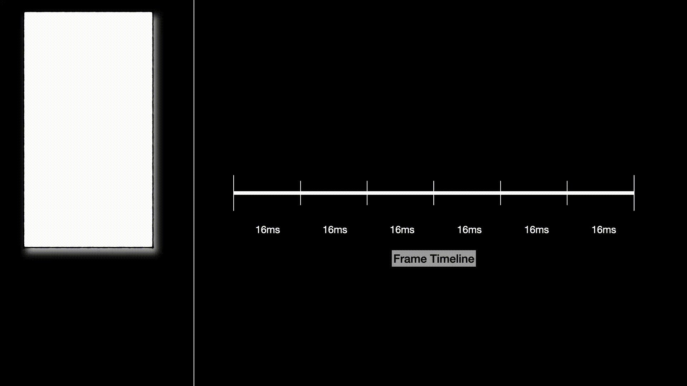
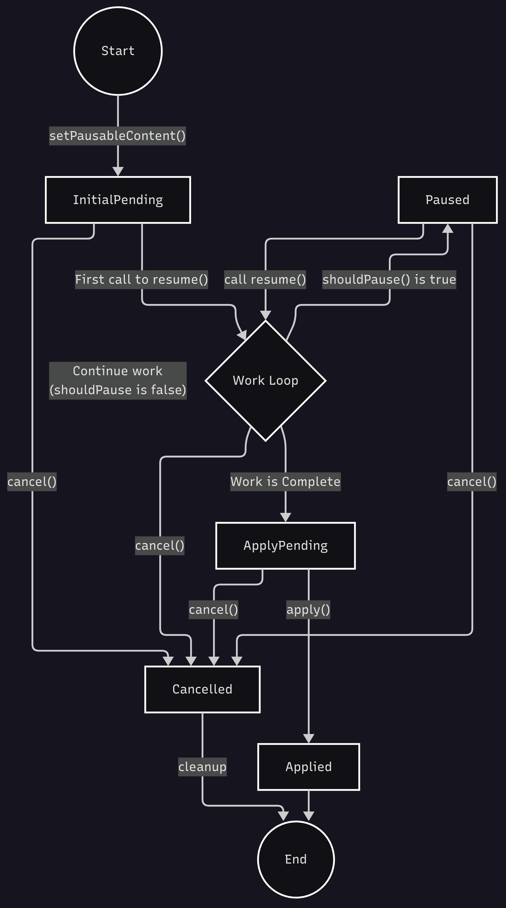
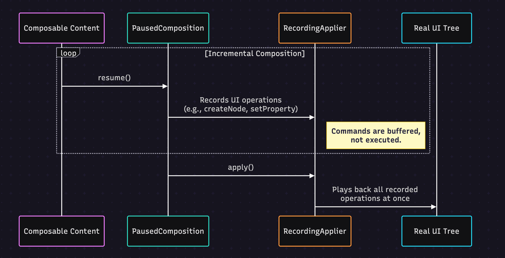
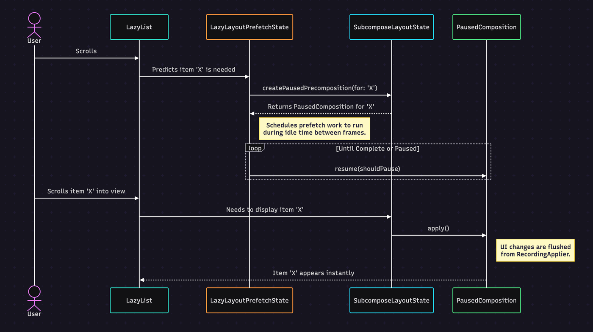

Hey Composers 👋, In the recent Compose release 1.9.X, a new *internal* API in compose-runtime called `PausableComposition` was introduced, which claims to solve performance issues. It can feel like magic, but under the hood, it's all thanks to some very clever engineering. While digging into the Compose runtime to understand this better, I came across a powerful internal tool that makes it all possible.

This post will break down that mechanism: `PausableComposition`. This is internal API of compose and it’s not necessary for developers to know about it. But it’s good to know how it works under the hood. For Jetpack Compose developers who want to look behind the curtain and understand *how* Compose achieves its incredible performance, this exploration will give you a clearer picture. We'll dive into the runtime source code to see how it works, why it's so important for performance, and how everything is coordinated to make our UIs feel so fluid. Let's get started!

## The “Why”

To get a fluid 60 frames per second (fps), our app needs to draw each frame in under 16.7 milliseconds. When a user scrolls through a `LazyColumn`, new items have to be created, measured, and drawn within this tiny window.

If an item is complex, with nested layouts, images, and lots of logic, the work needed to compose it can easily take longer than 16ms. When this happens, the main thread gets blocked, a frame is dropped, and the user sees a "jank" or stutter in the scroll. 😩

This is exactly the problem `PausableComposition` was created to solve.

## The "What": A Smarter Way to Compose

Imagine you're a chef preparing a big meal for an event. 👨‍🍳 Instead of frantically trying to cook everything from scratch when the first guest arrives, you do your *mise en place* (the prep work) hours before. You chop vegetables, prepare sauces, and bake desserts. When it's time to serve, the final cooking and assembly are incredibly fast.

`PausableComposition` brings this "prep work" idea to Compose. It lets the runtime:

1. **Compose Incrementally:** Break down the composition of a big UI element into smaller, more manageable pieces.

2. **Prepare Asynchronously: **Do this composition work *before* the UI is actually needed on screen, often using the idle time between frames.


This pre-warming of composables means that when an item finally scrolls into view, most of the heavy lifting is already done, allowing it to show up almost instantly.

To visualize the concept, have a look on the below animation:



As scrolling occurs, let's say items A, B, C, D, and E are already visible on the screen, and the next item is **F **. If item **F** has a complex layout or structure that requires more time for layout computation or other pre-processing before rendering on the UI, this pre-processing happens in chunks within the frame timeline (i.e., 16ms). So, if it requires 2 frames, the necessary pre-processing for **F** is completed over 2 frames***in the idle times***without causing any jank to the frames. Finally, it is drawn on the UI when it needs to be visible. The same process applies to items **G** and **H** .

---

## How It Works: The Core Components

By looking at the runtime source code, we can see how this is handled through a few key interfaces and classes. While you won't use these APIs directly, understanding them shows how `LazyColumn` gets its performance. 🕵️‍♂️

### The Lifecycle: `PausableComposition` and its Controller

The journey starts with the `PausableComposition` interface, which extends `ReusableComposition` to add the ability to be paused.

<details data-node-type="hn-details-summary"><summary>A quick note on ReusableComposition</summary><div data-type="detailsContent">Before we talk about pausing, what is <code>ReusableComposition</code>? It's a special kind of composition made for high-performance situations where UI content needs to be recycled efficiently. Think of the items in a <code>LazyColumn</code>. Instead of destroying the whole composition of an item that scrolls off-screen, <code>ReusableComposition</code> lets the runtime <code>deactivate</code> it. This keeps the underlying UI nodes but clears out the remembered state. This deactivated composition can then be quickly "re-inflated" with new content, saving the cost of creating nodes from scratch. <code>PausableComposition</code> builds directly on this powerful recycling foundation.</div></details>

Here’s how `PausableComposition` looks like:

```kotlin
// https://cs.android.com/androidx/platform/frameworks/support/+/8d08d42d60f7cc7ec0034d0b7ff6fd953516d96a:compose/runtime/runtime/src/commonMain/kotlin/androidx/compose/runtime/PausableComposition.kt;l=66
sealed interface PausableComposition : ReusableComposition {
fun setPausableContent(content: @Composable () -> Unit): PausedComposition
fun setPausableContentWithReuse(content: @Composable () -> Unit): PausedComposition
}
```

*(Note: The interface is* `sealed` because it has a closed, limited set of implementations only inside the Compose runtime. This gives the compiler more information to make optimizations.)

Calling `setPausableContent` doesn't immediately compose the UI. Instead, it returns a `PausedComposition` object, which acts as our controller for the step-by-step process.

```kotlin
// https://cs.android.com/androidx/platform/frameworks/support/+/8d08d42d60f7cc7ec0034d0b7ff6fd953516d96a:compose/runtime/runtime/src/commonMain/kotlin/androidx/compose/runtime/PausableComposition.kt;l=112
sealed interface PausedComposition {
val isComplete: Boolean
fun resume(shouldPause: ShouldPauseCallback): Boolean
fun apply()
fun cancel()
}
```

This lifecycle is best shown as a state machine:



*`resume(shouldPause: ShouldPauseCallback)`: This is the engine. The prefetching system (*here in the context of* `LazyColumn`) repeatedly calls `resume()` to do chunks of composition work. The magic is in the `shouldPause` callback. The Compose runtime calls this lambda often during composition. If it returns `true` (for example, because the frame deadline is near), the composition process stops, giving the main thread back to more important work like drawing the current frame.

*`apply()`: Once `resume()` returns `true`, which signals it's finished, `apply()` is called. This takes all the calculated UI changes and commits them to the actual UI tree.* `cancel()`: If the user scrolls away and the pre-composed item is no longer needed, `cancel()` is called to throw away the work and free up resources.


### A Look at the Internals: `PausedCompositionImpl`

The state machine above is managed by the internal `PausedCompositionImpl` class. This class holds the state and connects all the pieces.

```kotlin
// https://cs.android.com/androidx/platform/frameworks/support/+/8d08d42d60f7cc7ec0034d0b7ff6fd953516d96a:compose/runtime/runtime/src/commonMain/kotlin/androidx/compose/runtime/PausableComposition.kt;l=202
internal class PausedCompositionImpl(...) : PausedComposition {
private var state = PausedCompositionState.InitialPending
internal val pausableApplier = RecordingApplier(applier.current)
// ...

override fun resume(shouldPause: ShouldPauseCallback): Boolean {
when (state) {
PausedCompositionState.InitialPending -> {
// This is the first time resume() is called.
// It starts the initial composition of the content.
invalidScopes =
context.composeInitialPaused(composition, shouldPause, content)
state = PausedCompositionState.RecomposePending
if (invalidScopes.isEmpty()) markComplete()
}
PausedCompositionState.RecomposePending -> {
// This is for subsequent calls to resume().
state = PausedCompositionState.Recomposing
// It tells the Composer to continue where it left off,
// processing any pending invalidations.
invalidScopes =
context.recomposePaused(composition, shouldPause, invalidScopes)
state = PausedCompositionState.RecomposePending
if (invalidScopes.isEmpty()) markComplete()
}
// ... other states like Recomposing, Applied, Cancelled are handled here ...
}
return isComplete
}

override fun apply() {
// ... other state checks ...
if (state == PausedCompositionState.ApplyPending) {
applyChanges() // The call site
state = PausedCompositionState.Applied
}
// ...
}

private fun applyChanges() {
// ...
pausableApplier.playTo(applier, rememberManager)
rememberManager.dispatchRememberObservers()
rememberManager.dispatchSideEffects()
// ...
}
}
```

When `resume()` is called, it checks its internal state and acts accordingly:

1. `InitialPending`: On the first call, it kicks off the composition process by calling `context.composeInitialPaused`. This tells the core `ComposerImpl` to start executing the `@Composable` content, honoring the `shouldPause` callback.

2. `RecomposePending`: On subsequent calls, it continues the work by calling `context.recomposePaused`. This is used to process any parts of the composition that were invalidated (due to state changes) or to continue work that was previously paused.

3. `Applier`: Throughout this process, the `ComposerImpl` directs all its UI-changing operations to the `pausableApplier` (the `RecordingApplier`), which buffers them instead of applying them immediately.

4. This continues until the work is complete or the `shouldPause` callback returns true.


### The `RecordingApplier`: Deferring the Final Touches

A key performance trick is the [`RecordingApplier`](https://cs.android.com/androidx/platform/frameworks/support/+/8d08d42d60f7cc7ec0034d0b7ff6fd953516d96a:compose/runtime/runtime/src/commonMain/kotlin/androidx/compose/runtime/PausableComposition.kt;l=344). When `resume()` is called, the `Composer` doesn't change the live UI tree directly. Doing that in small pieces could be slow and lead to a weird, half-updated UI.

Instead, the `PausableComposition` uses a `RecordingApplier`. This special `Applier` just records all the UI operations it's supposed to do (like "create a `Text` node," "set its `text` property," or "add a child `Image`") into an internal list.

Only when `PausedComposition.apply()` is called does the `RecordingApplier` "play back" its recorded list of operations onto the *real*`Applier`, updating the UI tree in one efficient, single step. The public `apply()` method on `PausedComposition` is a simple state-machine guard. The real work happens in the internal `applyChanges()` method (*as in the above snippet* ).

When `applyChanges` is called, it does three critical things in order:

1. It tells the `RecordingApplier` to play back all of its buffered commands onto the real `applier`. This is what makes the UI actually appear on screen.

2. It dispatches all the `onRemembered` lifecycle callbacks for any `RememberObserver`s (like `DisposableEffect`) that were created.

3. Finally, it runs any `SideEffect`s that were queued during the composition.


This ordered, batched process ensures the UI is updated efficiently and all lifecycle events happen at the correct time.



---

## LazyList using PausableComposition

LazyList has started using PausableComposition API. In a `LazyList`, `PausableComposition` doesn't work alone. It's part of a well-coordinated system.

***The Conductor (**`Recomposer`): The main `Recomposer` keeps the beat, driving the frame-by-frame updates for the visible UI.***The Planner (**`LazyLayoutPrefetchState`): As the user scrolls, this component predicts which items are about to show up.***The Stage Manager (**`SubcomposeLayout`): This powerful `SubcomposeLayout` is the foundation of `LazyList`. Its `SubcomposeLayoutState` can create and manage compositions for individual items when needed. Most importantly, it provides the [`createPausedPrecomposition()`](https://cs.android.com/androidx/platform/frameworks/support/+/8d08d42d60f7cc7ec0034d0b7ff6fd953516d96a:compose/ui/ui/src/commonMain/kotlin/androidx/compose/ui/layout/SubcomposeLayout.kt;l=250) API.***The Stagehand (** `PrefetchScheduler`): This scheduler finds idle time between frames to do the pre-composition work requested by the Planner.


It's also interesting to see how this feature was developed. Inside the [`LazyLayoutPrefetchState`](https://cs.android.com/androidx/platform/frameworks/support/+/8d08d42d60f7cc7ec0034d0b7ff6fd953516d96a:compose/foundation/foundation/src/commonMain/kotlin/androidx/compose/foundation/lazy/layout/LazyLayoutPrefetchState.kt;l=647) file, you can find the feature flag that controls it:

```kotlin
// A simplified look inside LazyLayoutPrefetchState.kt: https://cs.android.com/androidx/platform/frameworks/support/+/8d08d42d60f7cc7ec0034d0b7ff6fd953516d96a:compose/foundation/foundation/src/commonMain/kotlin/androidx/compose/foundation/lazy/layout/LazyLayoutPrefetchState.kt;l=647
if (ComposeFoundationFlags.isPausableCompositionInPrefetchEnabled) {
// This is the future, modern path.
performPausableComposition(key, contentType, average)
} else {
// This is the older, non-pausable fallback.
performFullComposition(key, contentType)
}
```

This flag, `isPausableCompositionInPrefetchEnabled`, acts as a kill-switch. While its default value in the source code is `false`. If you want to enable pausable composition behaviour in the Lazy layouts (LazyColumn, LazyRow, etc), then we can simply enable it as follows:

```kotlin
class MyApplication : Application() {
fun onCreate() {
ComposeFoundationFlags.isPausableCompositionInPrefetchEnabled = true
super.onCreate()
}
}
```

#### The Planner: `LazyLayoutPrefetchState` in Detail

The `LazyLayoutPrefetchState` is the brain of the prefetching operation. Its job is to take the prediction from the `LazyLayout` (e.g., "item 25 is coming up") and turn it into an actual pre-composition task.

It does this through a `PrefetchHandleProvider`, which creates a `PrefetchRequest`. This request is a unit of work that the `PrefetchScheduler` can execute. Inside this request, we find the heart of the pausing logic.

When the `PrefetchScheduler` executes a request, it enters a loop that calls `resume()` on the `PausableComposition`. The lambda passed to `resume` is where the decision to pause is made.

So if the above feature flag is enabled, it executes request through Pausable composition API as follows:

```kotlin
// https://cs.android.com/androidx/platform/frameworks/support/+/8d08d42d60f7cc7ec0034d0b7ff6fd953516d96a:compose/foundation/foundation/src/commonMain/kotlin/androidx/compose/foundation/lazy/layout/LazyLayoutPrefetchState.kt;l=754
// Simplified from HandleAndRequestImpl inside LazyLayoutPrefetchState
private fun PrefetchRequestScope.performPausableComposition(...) {
val composition = // get the composition for the item of the LazyLayout
pauseRequested = false

while (!composition.isComplete && !pauseRequested) {
composition.resume {
if (!pauseRequested) {
// 1. Update how much time is left in this frame's idle window.
updateElapsedAndAvailableTime()

// 2. Save how long this work chunk took, to improve future estimates.
averages.saveResumeTimeNanos(elapsedTimeNanos)

// 3. The Core Decision: Is there enough time left to do another
// chunk of work without risking a frame drop?
pauseRequested = !shouldExecute(
availableTimeNanos,
averages.resumeTimeNanos + averages.pauseTimeNanos,
)
}
// 4. Return the decision to the composition engine.
pauseRequested
}
}

updateElapsedAndAvailableTime()
if (pauseRequested) {
// If we decided to pause, record how long the final pause check took.
averages.savePauseTimeNanos(elapsedTimeNanos)
} else {
// If we finished without pausing, record the time for the final resume chunk.
averages.saveResumeTimeNanos(elapsedTimeNanos)
}
}
```

Let's break down this logic:

1. `updateElapsedAndAvailableTime()`: Inside the `resume` lambda, the system constantly checks how much time is left before the next frame needs to be drawn.

2. `averages.saveResumeTimeNanos(...)`: It records how long each small piece of composition work takes. This helps it build an average (`averages`) to predict the cost of future work.

3. `!shouldExecute(...)`: This is the core decision. It compares the `availableTimeNanos` against a budget. This budget is a smart estimate: the average time it takes to do another chunk of work *plus* the average time it takes to pause. If there isn't enough time, `pauseRequested` becomes `true`.

4. **Final Timing** : After the loop exits for this cycle (either because the work is done or a pause was requested), one final `updateElapsedAndAvailableTime()` is called. This captures the time of the very last operation.

5. **Saving Averages** : The system then saves this final timing. If a pause was requested, it contributes to `pauseTimeNanos`. If the loop completed naturally, it contributes to `resumeTimeNanos`. This ensures the historical data used for future predictions is always accurate.


This self-regulating feedback loop allows the prefetcher to be aggressive when the system is idle but polite and respectful of the main thread when it's time to render the UI.

#### The Final Act: Applying the Pre-Composed UI

So, what happens when the pre-composed item is actually needed on screen? This is where the `SubcomposeLayout` takes center stage. During its normal measure pass, it calls its `subcompose` function for the now-visible item. Internally, this triggers the final step.

```kotlin
// https://cs.android.com/androidx/platform/frameworks/support/+/8d08d42d60f7cc7ec0034d0b7ff6fd953516d96a:compose/ui/ui/src/commonMain/kotlin/androidx/compose/ui/layout/SubcomposeLayout.kt;l=1186
// Simplified from LayoutNodeSubcompositionsState inside SubcomposeLayout.kt
private fun NodeState.applyPausedPrecomposition(shouldComplete: Boolean) {
val pausedComposition = this.pausedComposition
if (pausedComposition != null) {
// 1. If the work must be completed now...
if (shouldComplete) {
// ...force the composition to finish by looping `resume`
// and always passing `false` to the `shouldPause` callback.
while (!pausedComposition.isComplete) {
pausedComposition.resume { false }
}
}
// 2. Apply the changes to the real UI tree.
pausedComposition.apply()
this.pausedComposition = null // Clear the handle.
}
}
```

When an item becomes visible, its composition is no longer a low-priority background task; it's a high-priority, synchronous requirement. The `shouldComplete = true` parameter ensures that any remaining composition work is finished immediately, without pausing. Then, `apply()` is called, and the fully formed UI appears on screen instantly.

Here’s how they work together:



---

## Conclusion

After a deep dive into the Compose runtime, the design of `PausableComposition` is a really smart piece of performance engineering.

***It's Not Magic, It's Deferral: **The main idea is to do work *before *it's urgent. By composing items during idle time, the work needed on the main thread during a fast scroll is much, much smaller.***Cooperative & Non-Blocking: **The `shouldPause` callback is a brilliant way to handle multitasking. It lets long-running composition tasks politely step aside for the more urgent task of rendering the current frame, which directly prevents jank.***Efficiency Through Batching:** The `RecordingApplier` avoids the overhead of many small, separate changes to the UI tree by grouping them into a single, efficient update.


While `PausableComposition` is an internal feature you may never use directly, understanding its existence and operation gives you a real appreciation for the smart decisions that make Jetpack Compose so performant. The next time you effortlessly scroll through a complex `LazyColumn` without a single stutter, you'll know about the clever, well-orchestrated dance happening just beneath the surface. ✅ This architecture not only solves today's performance challenges but also paves the way for even more advanced rendering strategies in the future of Compose.

---

I hope you got the idea about how this new API works in Jetpack Compose.

Awesome. I hope you've gained some valuable insights from this. If you enjoyed this write-up, please share it 😉, because...

*** "Sharing is Caring" ***

Thank you! 😄

Let's catch up on [ **X**](https://twitter.com/imShreyasPatil) or [**visit my site** ](https://shreyaspatil.dev/) to know more about me 😎.