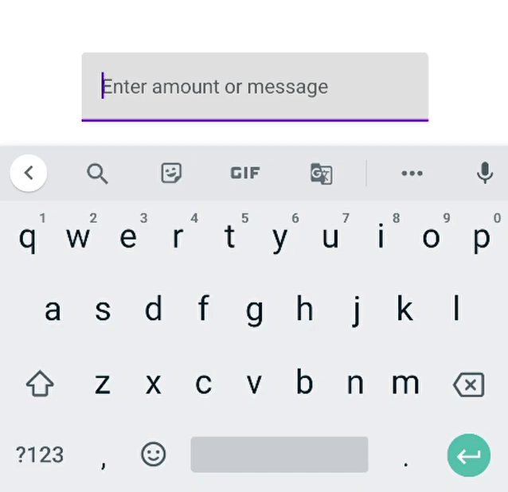
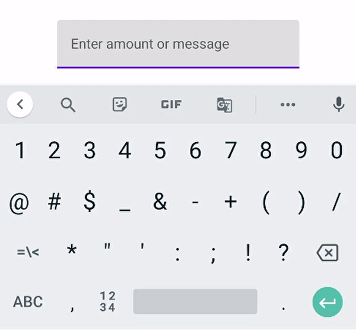
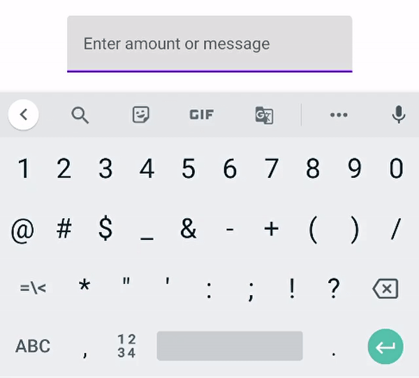

Hey Composers 👋,

Jetpack compose is getting good attention and many developers and organizations giving it a try for using in actual apps. Migrating from the existing view system to Jetpack compose is not that much hard (*in my personal opinion*). But there's still like a puzzle sometimes in some cases. Many developers get issues while trying some cases or building PoCs. In this article, I'm gonna talk about the case where I was confused and hopefully I was able to fix it with help from the community.

***

## The case 🧐

We want to create a `TextField` in which users can type either *amount or message*. If an amount is entered, it should be formatted and replaced in the `TextField`.

For example: If an input is fully numeric like **250000**. Then in the TextField, we have to modify it like **2,50,000**. Otherwise, the text should be displayed as it is (i.e. treated as a message).

That's the simple case, isn't it? 😀

Let's try to implement it and see where we go...

***

## The initial implementation and problems 🧑‍💻

As per the above case, let's create a `TextField` in the Jetpack Compose and modify input after getting the event in `onValueChange` callback.

```kotlin
@Composable
fun TextFieldDemo() {
    var message by remember { mutableStateOf("") }

    TextField(
        value = message,
        placeholder = { Text("Enter amount or message") },
        onValueChange = { message = formatAmountOrMessage(it) },
    )
}

/** Returns true if the text has maximum 6 digits */
val String.isValidFormattableAmount get(): Boolean = isNotBlank() && isDigitsOnly() && length <= 6

/**
 * If [input] only include digits, it returns a formatted amount. Otherwise returns plain input as it is
 */
fun formatAmountOrMessage(
    input: String
): String = if (input.isValidFormattableAmount) {
    DecimalFormat("#,##,###").format(input.toDouble())
} else {
    input
}
```

### Issues with this 💥

Let's run this and see. So it is behaving like this 👇:

*When "1111" is entered, Keyboard's view is changed from numeric to alphabet which is bad UX* 🙅‍♂️. *Also, the cursor position was not proper.*



***

After getting these issues, I tried to search about it on Google, StackOverflow, but no luck! So I asked a question on [StackOverflow](https://stackoverflow.com/questions/70401519/android-jetpack-compose-keyboard-changing-from-numeric-to-alphabets-after-modif) and hopefully, I got the answer to the question. Let's see how to resolve this issue.

***

## Solution 💡

As per the [answer to my question](https://stackoverflow.com/a/70403143/11326621) *(It's referenced from [Google's Issue Tracker](https://issuetracker.google.com/issues/193187530#comment2))* there are some facts. After reading a Googler's comment, he recommends 👇:

*   The filtering text in `onValueChanged` callback is generally not recommended because the text state is shared with out process IME (software keyboard).
*   The filtering text means the text content changes internally, then the new state is notified to IME. This is not a normal path to IME and different IMEs reacts differently to this unexpected state change. Some IME may try to reconstruct the composition, others may give up and start a new session, etc.
*   There are alternatives for this:
    *   Don't filter and show error message (*Not useful for our use case*)
    *   Use `VisualTransformation`

So we have to use `VisualTransformation`. Because that's the only option that seems fit from the above discussion.

### What is `VisualTransformation` ? 🤔

`VisualTransformation` is a useful interface for **changing the visual output of the text field without modifying the edit buffer**. *For example: Showing masked characters for a password field*.

It's a SAM interface (interface having a **Single abstract method**) that filters input text. Let's see how it can be useful in fixing our case.

### Let's solve it! 👨‍💻

So let's create our own `VisualTransformation` implementation which fits our use case.

```kotlin
class AmountOrMessageVisualTransformation : VisualTransformation {
    override fun filter(text: AnnotatedString): TransformedText {
        return TransformedText(
            text = AnnotatedString(formatAmountOrMessage(text.text)),
            offsetMapping = OffsetMapping.Identity
        )
    }
}
```

And set this to our `TextField`:

```kotlin
@Composable
fun TextFieldDemo() {
    var message by remember { mutableStateOf("") }

    TextField(
        value = message,
        placeholder = { Text("Enter amount or message") },
        onValueChange = { message = it },
        visualTransformation = AmountOrMessageVisualTransformation()
    )
}
```

As you can see above, we set `visualTransformation` using our recently created implementation. *Also, notice that in `onValueChange` now we are not modifying value*.

After executing this implementation, this is how it works 👇:



Okay, this time keyboard's view is not changing back to the alphabet. But the cursor issue is still there ☹️.

Here we missed one thing in the implementation of **VisualTransformation** i.e. `OffsetMapping`.

### What is `OffsetMapping` ? 🤔

It is an Interface that provides bidirectional offset mapping between original and transformed text. It has two methods as below:

```kotlin
interface OffsetMapping {
    /**
     * Convert offset in original text into the offset in transformed text. If a cursor advances in the original text, the cursor in the
     * transformed text must advance or stay there.
     */
    fun originalToTransformed(offset: Int): Int

    /**
     * Convert offset in transformed text into the offset in the original text. If a cursor advances in the transformed text,
     * the cursor in the original text must advance or stay there.
     */
    fun transformedToOriginal(offset: Int): Int
}
```

Now, let's use it in our implementation. In the existing implementation, we used `OffsetMapping.Identity` which is the default OffsetMapping that does nothing.

Let's revisit `VisualTransformation`'s implementation.

```kotlin
class AmountOrMessageVisualTransformation : VisualTransformation {
    override fun filter(text: AnnotatedString): TransformedText {

        val originalText = text.text
        val formattedText = formatAmountOrMessage(text.text)

        val offsetMapping = object : OffsetMapping {

            override fun originalToTransformed(offset: Int): Int {
                if (originalText.isValidFormattableAmount) {
                    val commas = formattedText.count { it == ',' }
                    return when {
                        offset <= 1 -> offset
                        offset <= 3 -> if (commas >= 1) offset + 1 else offset
                        offset <= 5 -> if (commas == 2) offset + 2 else offset + 1
                        else -> 8
                    }
                }
                return offset
            }

            override fun transformedToOriginal(offset: Int): Int {
                if (originalText.isValidFormattableAmount) {
                    val commas = formattedText.count { it == ',' }
                    return when (offset) {
                        8, 7 -> offset - 2
                        6 -> if (commas == 1) 5 else 4
                        5 -> if (commas == 1) 4 else if (commas == 2) 3 else offset
                        4, 3 -> if (commas >= 1) offset - 1 else offset
                        2 -> if (commas == 2) 1 else offset
                        else -> offset
                    }
                }
                return offset
            }
        }

        return TransformedText(
            text = AnnotatedString(formattedText),
            offsetMapping = offsetMapping
        )
    }
}
```

In the offset mapping, we provided offset based on commas. For example, when "2,50,000" is input then the offset of a transformed string will be always computed as **current offset** and **addition of a number of commas**. And exactly reverse process for the transformed to original text's offset. This will help us in defining cursor position in the visualized and actual input text.

Okay, Let's run this and see results 👇:



Yeah! 😍 Our issues are solved and finally it's working as expected with good UX 😀.

> [!NOTE]
> You will not get contents of transformed text (let's say `,` in our case) in the callback of `onValueChange` since it's not modified directly but it's just a visual change by `VisualTransformation`.

That's all!

***

If you found it helpful, share it with everyone.

Sharing is caring!

Thank you 😀

***

## References 📚

*   [Text in Jetpack Compose](https://developer.android.com/jetpack/compose/text)
*   [VisualTransformation API Docs](https://developer.android.com/reference/kotlin/androidx/compose/ui/text/input/VisualTransformation)