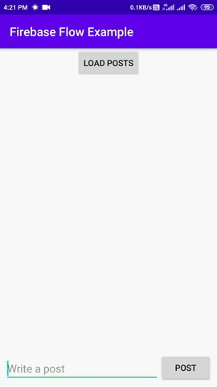
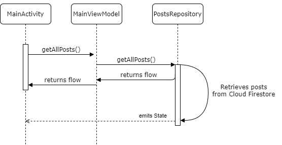

🔥 Firebase-ing with Kotlin Coroutines + Flow 🌊

In this article, we’ll demonstrate using Kotlin Coroutines and 🌊 F *low*with 🔥 Firebase*Cloud Firestore*in Android*.*

Firebase APIs are asynchronous i.e. you’ll need to register a *listener*if you want to***read data***or want the***result of written data***. As you might know, Kotlin coroutines are developed for*asynchronous/non-blocking* programming. Firebase developers have developed a separate library to use with Kotlin which is backed by Kotlin superpower! Thus, we’ll get to know how to implement firebase Cloud Firestore with Coroutines and Flow.

### It’s Okay, but **what is**Flow?**🤷‍♂️ Here’s a quick introduction.* Kotlin Flow is an implementation of reactive streams made on top of coroutines and channels for Kotlin.

*You might have used*RxJava/RxKotlin*. `Observable` and `Flowable` types in `RxJava` are an example of a structure that represents a cold stream of items. Then Kotlin Coroutines Flow 🌊 is the alternative for it.* Flow API in Kotlin is a better way to handle the stream of data asynchronously that executes sequentially.

*Flow API is cold in nature ❄️ (It means it’ll only emit values whenever there is a receiver to collect it. Otherwise, the hot producer represents a host stream which emits values thought there’s no receiver. For e.g. [Channels](https://kotlinlang.org/docs/reference/coroutines/channels.html) in Kotlin is a hot ♨️ stream)* `flow{}` builder is used for creating flow which can contain asynchronous and heavy operations. and value is not emitted until the terminal function `collect` is called.

## ⚡️ Getting Started

Let’s write some code!

Open *Android Studio* and create a new project. Alternatively, you can simply clone [this repository](https://github.com/PatilShreyas/FirebaseFlowExample). This is a very simple app for demonstrating the use of Kotlin Coroutine’s Flow API to show a list of posts.

## Gradle Setup

In the app module of `build.gradle,` include following dependencies:

Next, let’s create our model class. Create a new file and name it `Post.kt`.

In this application, we’ll need to manage the state of operations in our UI. For example handling the *Loading, Success*or*Failure* states. For that, we’ll create a `State.kt` class.

Now let’s design a ***Repository***for this application.*It’ll be a single source of the data throughout the application* .🚀

This is how our repository will look like. We’ll declare these two functions here:

***`getAllPosts()`**— this will return a `Flow<State>`.***`addPost()`** — this will add a post into the Cloud Firestore collection and will return `Flow<State>`.

Let’s implement `getAllPosts()`

As you can see, we are returning a flow with the`flow {}` builder.

*First of all, we are emitting the***Loading***state which will inform the UI that our data is now in loading state.*Then we’re collecting posts with `await()` which will block this thread until it’s retrieved. Then we’re emitting the***Success***state along with the posts.*If any `Exception` is thrown, a `catch` operator will handle the exception for the upstream ⬆️ flow. Then it’ll be executed and we’ll be emitting the***Failed*** state along with a message.
> No need to write code within the`try { } catch { }` block when using Flow: if any `Exception` is thrown on the upstream ⬆️ *flow* , it will be handled by the downstream `catch` operator.

Now we’ll implement the same for `addPost()` :

This should look familiar to you by now :-)

### Now, let’s implement the Android Part 😃

After having implemented our repository (which will handle all data reads/writes to/from Cloud Firestore, we can create a `ViewModel` which will be useful to interact with Android `Activities`. The`ViewModel` will be the bridge between `PostsRepository` and `MainActivity`.

Finally, it’s time to retrieve posts on the UI (`MainActivity`).

We’ll need to perform *flow*operations on the***coroutine context***because the*flow*is asynchronous and for this, we’ll need to create a`suspend` function to handle repository operations from*ViewModel* . The `suspend` function can be paused and resumed at a later point in time.

And the same for adding posts:

Now let’s discuss what’s happening:

*Once we call the terminal operator `collect{}` on flow, this flow will be executed.* Whenever we’re emitting a`State` it will be collected here and any UI updates will be executed based on this. This is how we handled the UI state using 🌊 Flow.

This is how posts will be loaded in the application. 🚀

### What have we achieved? 🚀

*The synchronous flow of Data using a `ViewModel` and a`Repository`.*We can handle state easily in our UI, since there’s always a defined state for each operation, such as*Loading, Success, Failure* .

* We haven’t used any listener with Cloud Firestore 😄.

The following state chart outlines the `getAllPosts()` operation:

We have successfully implemented Cloud Firestore using Kotlin Coroutines and Flow.

The source code for this article is available in [this GitHub repo](https://github.com/PatilShreyas/FirebaseFlowExample/).

## Resources:

[https://github.com/PatilShreyas/FirebaseFlowExample/](https://github.com/PatilShreyas/FirebaseFlowExample/)

- https://kotlin.github.io/kotlinx.coroutines/kotlinx-coroutines-core/kotlinx.coroutines.flow/-flow/index.html