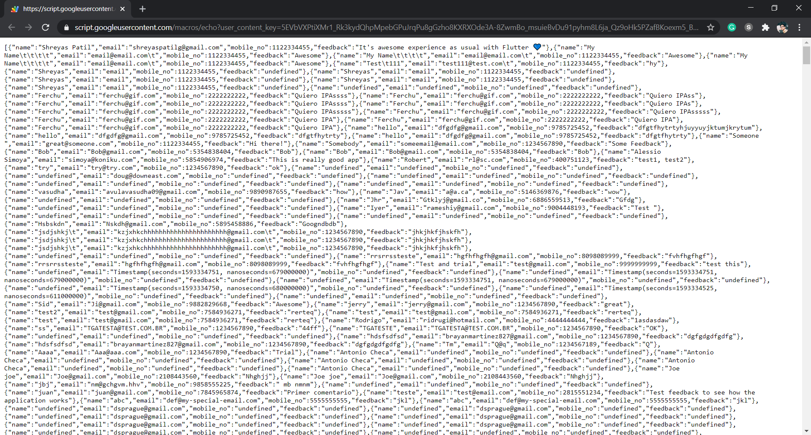
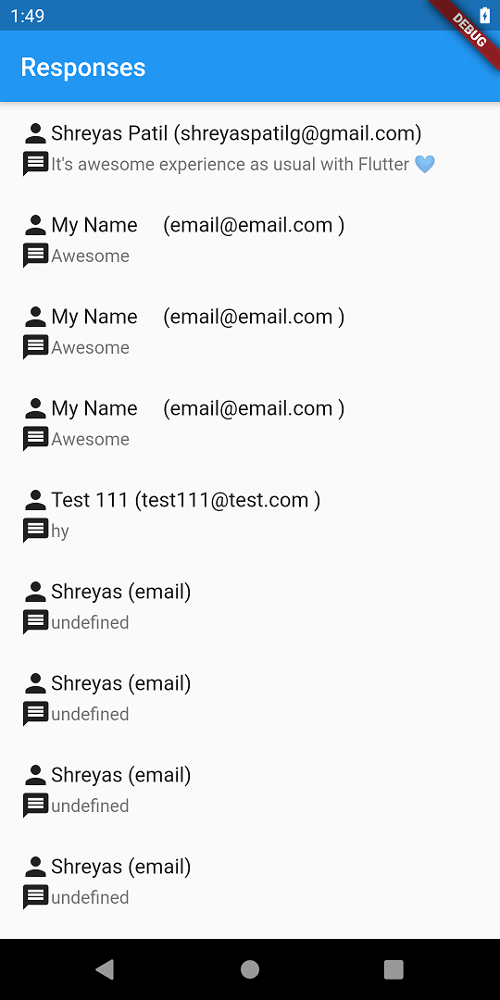

In this article, We’ll learn to load data from Google Sheets and show it into the list in the Flutter app.

Hello everyone, this is Part 2 of this series where we’ll learn to get data from Google Sheets into the Flutter app. If anyhow you missed Part 1 of this article series then here’s the link:
[**Storing data from the Flutter app → Google Sheets 📊 — Part 1**](https://medium.com/mindorks/storing-data-from-the-flutter-app-google-sheets-e4498e9cda5d)

***

### Continuing from the previous article…

In the previous article, we set up Google AppScript to insert/append fields into the Google Sheet using `doPost()` method. Now we’ll be implementing `doGet()` method which will return the list of feedback responses as JSON array of objects 😃. So let’s start…

Now, Just open your Google AppScript code again and just add a new method `doGet()` as below:

<script src="https://gist.github.com/PatilShreyas/27c2c784ab8e984f406f02837a25869e.js"></script>

Here’s a quick ⚡️ explanation for the above script:

*   First of all, after opening Google Sheet, we’ve received all values. Then iterating data in descending order so that we’ll be able to see recent feedback item first.
*   Adding each feedback to `data`. Finally returning data as a JSON.

***

### Deploy New version 🚀

*Once AppScript is ready, again deploy your AppScript by Selecting a tab:* **Publish → Deploy as a web app**. *Assign a new version to your app and click* '**Deploy**' 🚀. After that, you can check if it’s working or not by visiting that URL. You’ll see it like below:


*URL response*

Nice 😍. This is working perfectly! Now let’s start *Flutter* 💙.

***

## ⚡️ Let’s Flutter 💙

In the previous article, we’ve already done setting up the Flutter project. So let’s continue directly from there.

In **form.dart**, you can see we have a factory method called `fromJson()` which instantiates object from JSON. We will be using that function here in this article.

```dart
factory FeedbackForm.fromJson(dynamic json) {
    return FeedbackForm(
        "${json['name']}",
        "${json['email']}",
        "${json['mobileNo']}",
        "${json['feedback']}"
    );
}
```

Now just go to **form_controller.dart** and we’ll create a new method called `getFeedbackList()` which will return List of Feedback from AppScript URL via `GET` request which we recently created in the previous step.

<script src="https://gist.github.com/PatilShreyas/c57fb9b83c6bfed4437d719163930456.js"></script>

Okay! We’re now done with data controlling part. Now let’s develop UI for it. Create another dart file for UI let’s say **feedback_list.dart** as below.

> You can refer full code from GitHub repository [here](https://github.com/PatilShreyas/Flutter2GoogleSheets-Demo). Here I’m just showing an important part of code.

<script src="https://gist.github.com/PatilShreyas/14db1630730670a56f2b858f0e745f36.js"></script>

So this is `ListView` which is being populated from `initState()` method once the list is loaded from the network. Once this screen is loaded, `initState()` will be invoked and after some seconds, you’ll see a list of responses.

We’ve done the implementation of our flutter app. Let’s test it 😄.

Run command — `flutter run` and see the magic! 💙



> Yeah! 😍 It’s working as expected. As you can see, this data is loaded from Google Sheets using Google AppScript. Hope you liked that. If you find it helpful please share this. Maybe it’ll help someone needy!

***

## Wanna try it right now? 🤷‍♂️

You can try the web version of this app [here](https://patilshreyas.github.io/Flutter2GoogleSheets-Demo/demo/).

> If you found this project useful, then please consider giving it a ⭐️ on GitHub and sharing it with your friends via social media.
> 
> Sharing is Caring!
> 
> Thank You! 😃

***

## Resources

Here’s GitHub repo which contains **Flutter** + Google **AppScript** Code.

*   [**PatilShreyas/Flutter2GoogleSheets-Demo**](https://github.com/PatilShreyas/Flutter2GoogleSheets-Demo)
*   Web Version: [**Flutter To Google Sheets Demo**](https://patilshreyas.github.io/Flutter2GoogleSheets-Demo/demo/)

Feel free to reach me anytime on…
[**Shreyas Patil - Android Developer, Web Developer**](https://shreyaspatil.dev)