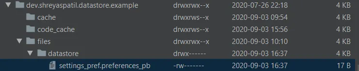
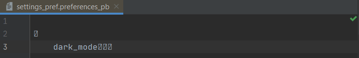

Welcome Android developers 👋. This article is the first part of a series article based on the new Jetpack library 🚀 i.e. ***DataStore*** 🗄️. Currently, its alpha version is released. Let’s see ***what’s*** DataStore and ***why*** DataStore.

***

## What is DataStore 🤷‍♀️?

*Jetpack DataStore is a data storage solution.* It allows us to store key-value pairs (like `SharedPreferences`) or typed objects with [protocol buffers](https://developers.google.com/protocol-buffers) *(We’ll see it in next article)*. DataStore uses Kotlin, Coroutines and Flow to store data asynchronously with consistency and transaction support 😍.

In short, it’s the new data storage solution which is the replacement of `SharedPreferences`.

***

## Why DataStore 🤷‍♂️

*   First and my favourite reason 😃 — Built with ❤️ Kotlin, Coroutines and Flow.
*   If you have used `SharedPreferences` you might abuse or blamed it for something 😆 then `DataStore` is here to rescue!
*   `SharedPreference` has some drawbacks like it provided synchronous APIs — but it’s not MAIN-thread-safe! Whereas DataStore is safe to use in UI thread because it uses `Dispatchers.IO` under the hood 👀.
*   It’s safe from runtime exceptions! ❌⚠️. What would be more satisfying that? 😅 It also provides a way to migrate from `SharedPreferences` 😍.
*   It provides **Type safety!** (Using Protocol buffers).

These are some reasons which encourage us to use DataStore and finally say goodbye to beloved `SharedPreferences` 👋.

***

## That’s not only the reason

`DataStore` provides two different types of implementations to store data:

*   **Preference DataStore:** This uses key-value pairs to store data. But it doesn’t provide type-safety.
*   **Proto DataStore:** It stores data as a custom type with specified schema using [Protocol Buffers](https://developers.google.com/protocol-buffers) *(We’ll see about it in the next article)*.

I think that’s enough introduction to `DataStore`. It’s time to write some code 👨‍💻😎.

***

## Let’s begin code 👨‍💻

You can simply [clone or refer this repository](https://github.com/PatilShreyas/DataStoreExample) to get example code demonstrating `DataStore` 📁.

We’ll develop a sample Android application which stores a UI mode preference from user i.e. 🌞 *Light Mode* or 🌑 *Dark Mode*.

First of all, let’s add a Gradle dependency in `build.gradle` of your app module. Currently `1.0.0-alpha01` is the latest release. You can keep an eye [here](https://developer.android.com/topic/libraries/architecture/datastore) to get info about the latest version.

```groovy
dependencies {
    // Preferences DataStore
    implementation "androidx.datastore:datastore-preferences:1.0.0-alpha01"
}
```

***

## Start implementing DataStore 📁

For UI mode preference i.e. Dark mode or Light mode, we’ll create an enum class as below:

```kotlin
enum class UiMode {
    LIGHT, DARK
}
```

We’ll create a class — `SettingsManager` where we’ll be managing setting preferences set by users in our app.

```kotlin
class SettingsManager(context: Context) {
    private val dataStore = context.createDataStore(name = "settings_pref")
    // ...
}
```

This will initialize the instance `dataStore` field by creating `DataStore` using the file name as *“settings_pref”*. `createDataStore()` is extension function created on `Context`.

Now we’ll be storing UI mode preference using a key (as we managed in `SharedPreference`). Key in `DataStore` is created as below 👇:

```kotlin
companion object {
    val IS_DARK_MODE = preferencesKey<Boolean>("dark_mode")
}
```

Here 👆 we’ve created a 🔑 KEY `IS_DARK_MODE` which will store a boolean value (`false` *for Light mode / *`true`* for Dark mode*). Because Preferences DataStore does not use a predefined schema, you must use `Preferences.preferencesKey()` to define a key for each value that you need to store in the `DataStore<Preferences>`.

Now we’ll create a method which will set UI mode from our UI/Activity i.e. `setUiMode()` 🔧.

> **Note:** Preferences `DataStore` provides a method `edit()` which transactional updates value in `DataStore`.

```kotlin
suspend fun setUiMode(uiMode: UiMode) {
    dataStore.edit { preferences ->
        preferences[IS_DARK_MODE] = when (uiMode) {
            UiMode.LIGHT -> false
            UiMode.DARK -> true
        }
    }
}
```

Now it’s time to get preference 🔥. `DataStore` provides `data` property which exposes the preference values using `Flow`. Means it’s time to leverage Flow 🌊 😍. See the code below 👇:

```kotlin
val uiModeFlow: Flow<UiMode> = dataStore.data
    .catch {
        if (it is IOException) {
            it.printStackTrace()
            emit(emptyPreferences())
        } else {
            throw it
        }
    }
    .map { preference ->
        val isDarkMode = preference[IS_DARK_MODE] ?: false

        when (isDarkMode) {
            true -> UiMode.DARK
            false -> UiMode.LIGHT
        }
    }
```

👆 You can see we’ve exposed a Flow `uiModeFlow` which will emit values whenever preferences are edited/updated. If you remember, we have been storing boolean in our `DataStore`. Using `map{}`, we’re mapping boolean values to the `UiMode` i.e. `UiMode.LIGHT` or `UiMode.DARK`.

> **Note:** DataStore throws `IOException` when it failed to read a value. So we have handled it by emitting `emptyPreferences()`.

So that’s all about setting up `DataStore` 😃. Now let’s design UI.

***

## Setup Activity

In this activity, We have just an `ImageButton` which will have image resources i.e. 🌞 and 🌘 based on UI mode.

```kotlin
class MainActivity : AppCompatActivity() {

    private lateinit var settingsManager: SettingsManager
    private var isDarkMode = true

    override fun onCreate(savedInstanceState: Bundle?) {
        super.onCreate(savedInstanceState)
        setContentView(R.layout.activity_main)

        settingsManager = SettingsManager(applicationContext)

        observeUiPreferences()
        initViews()
    }
}
```

In `initViews()` we’ll update preferences (UI Mode) on click of `ImageButton`.

```kotlin
private fun initViews() {
    imageButton.setOnClickListener {
        lifecycleScope.launch {
            when (isDarkMode) {
                true -> settingsManager.setUiMode(UiMode.LIGHT)
                false -> settingsManager.setUiMode(UiMode.DARK)
            }
        }
    }
}
```

In `observeUiPreferences()`, we’ll observe `DataStore` UI Mode preference using a field which we exposed in `SettingsManager` which is a `Flow` 🌊 which will emit values whenever preferences are updated.

```kotlin
private fun observeUiPreferences() {
    settingsManager.uiModeFlow.asLiveData().observe(this) { uiMode ->
        when (uiMode) {
            UiMode.LIGHT -> onLightMode()
            UiMode.DARK -> onDarkMode()
        }
    }
}
```

👆 Here we’ve used `asLiveData()` flow extension function which gives emitted values from Flow in `LiveData`. *(Otherwise, we can also use `lifecycleScope.launch{}` here if you don’t like to use `LiveData`)*.

We’re just updating **image resource** and **background color of root layout** when UI mode is changed. *(Actual mode can be changed using `AppCompatDelegate.setDefaultNightMode()`)*.

```kotlin
private fun onLightMode() {
    isDarkMode = false

    rootView.setBackgroundColor(ContextCompat.getColor(this, android.R.color.white))
    imageButton.setImageResource(R.drawable.ic_moon)
}

private fun onDarkMode() {
    isDarkMode = true

    rootView.setBackgroundColor(ContextCompat.getColor(this, android.R.color.black))
    imageButton.setImageResource(R.drawable.ic_sun)
}
```

Yeah! That’s it 😃. It’s time to run this app 🚀. When you run this app, you’ll see it like 👇:


Looking Awesome! 😍, isn’t it?

This is how we implemented Preferences `DataStore` instead of `SharedPreferences`.

So, `DataStore` is cool 🆒, isn’t it? Give it a try 😃. Since it’s currently in alpha, maybe many more is on the way to come 🛣️.

***

DataStore uses file management mechanism for storing data. But it’s different than managed in `SharedPreferences`. Now if you want to see how’s your data getting stored then using Android Studio’s *‘Device File Explorer’* you can go to `/data/app/YOUR_APP_PACKAGE_NAME/files/datastore` and you can see the file there like below 👇:



But its content is not readable as you can see in below image 👇:



***

Let me know your valuable feedback about this article. 🙏

In the next article, we’ll see how to use **Proto DataStore.**

Thank you! 😃

***

## Resources

*   [**PatilShreyas/DataStoreExample**](https://github.com/PatilShreyas/DataStoreExample)
*   [**DataStore | Android Developer**](https://developer.android.com/topic/libraries/architecture/datastore)