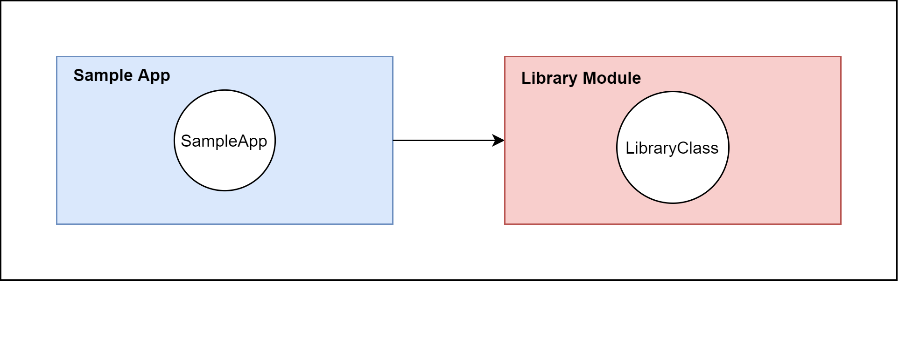
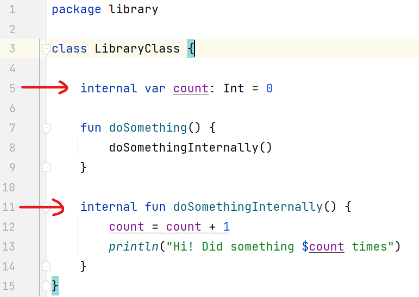
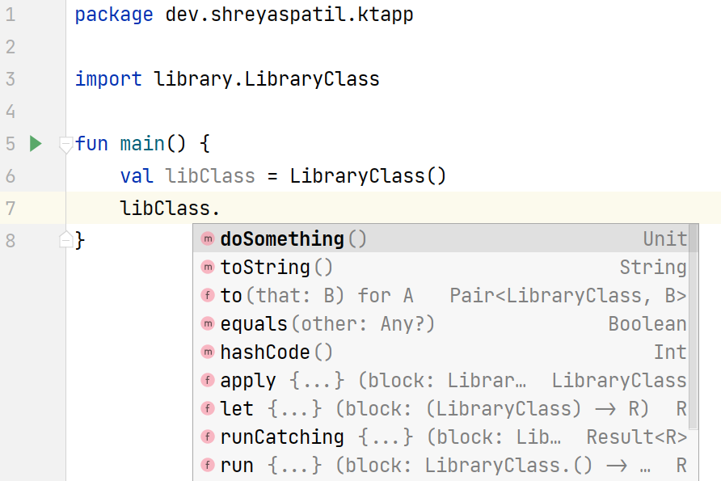
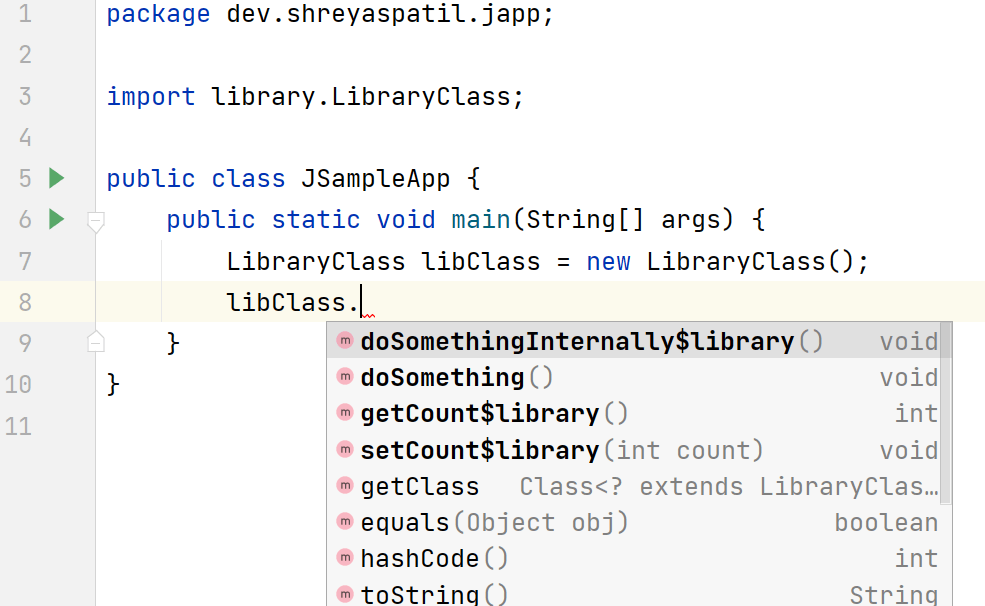
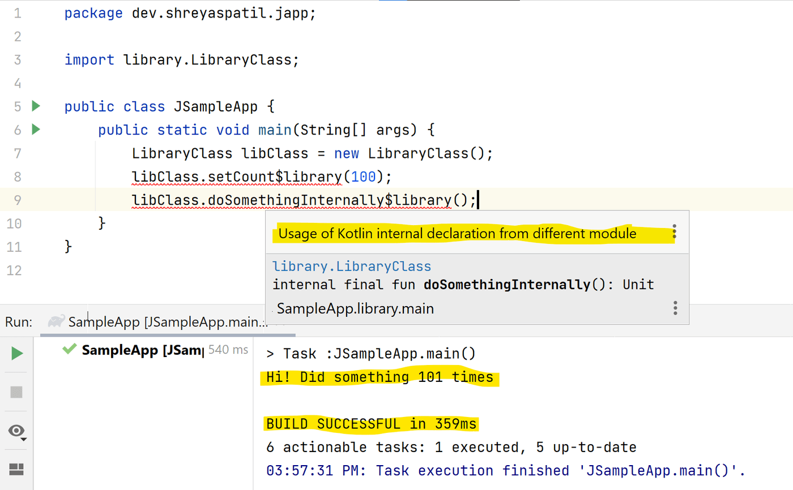
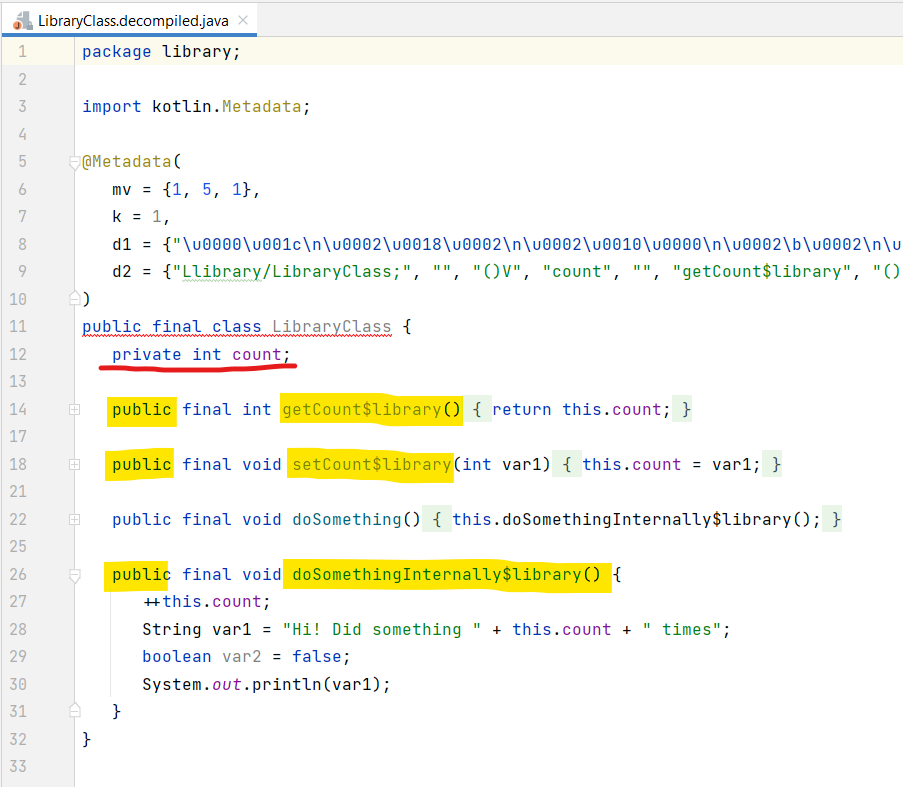
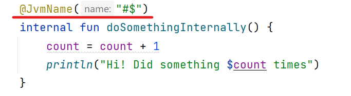
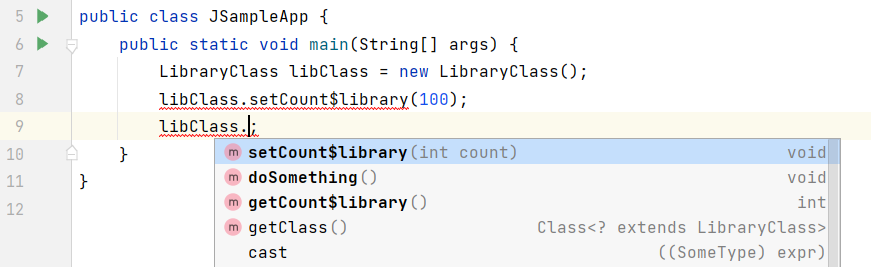
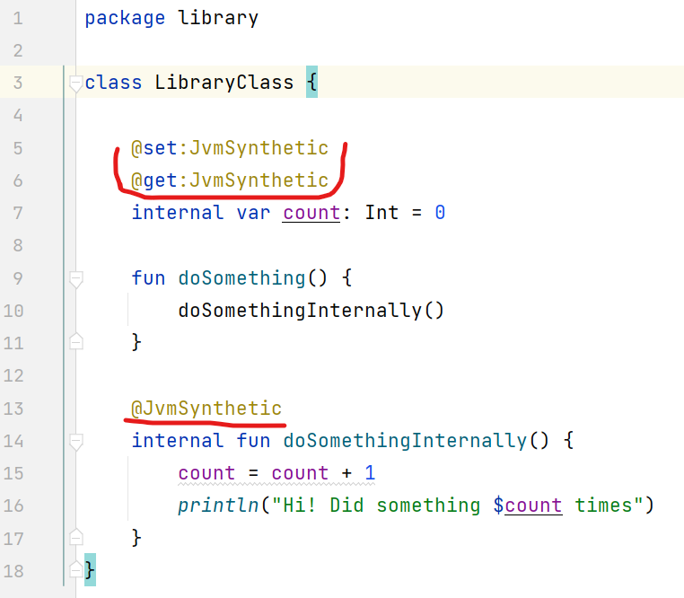
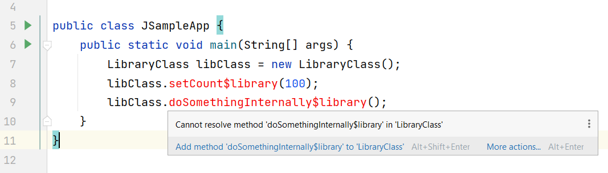

Hello developers, in this article we’ll explore some things which need attention if you’re developing a library/SDK using Kotlin programming language which targets JVM or you want to make it interoperable with Java.

---

## Introduction

If you are developing a library or SDK then it’s obvious that you don’t want to expose some classes or don’t want any member function or field of a class visible to the module which is going to implement your library.

Kotlin has the following visibility modifiers: _public, protected, private and internal._ `internal` modifier means that the member is **visible within the same module** (For e.g. Gradle module, IntelliJ IDEA module, etc). This means other Kotlin modules can’t access classes/members marked with an **internal** modifier. This feature of Kotlin is helpful in a way such that you can easily access, modify and test the internal functionalities or properties of a module.

But this can lead to issues if not handled properly while developing library projects.

How? Let’s see it 😃

---

## Understand 🤔

Let's assume that you're developing a library in Kotlin. Your library has a public class `LibraryClass`.



`LibraryClass.kt` looks like this:



As you can see, this class has an internal member field `count` and member function `doSomethingInternally()` which can’t be directly accessed. The only function `doSomething()` is invoking a call to the internal member function.

Now imagine that you’ve published this library. Now let’s say I’m using your library in some application (here it’s _SampleApp_). If I’m using Kotlin as a primary language for the development of my application and If I try to use `LibraryClass` in the application, it’ll look like this 👇:



As you can see, I’ve declared `libClass` as an instance of `LibraryClass`. When I tried to access the instance, I can just access `doSomething()` method and nothing other than that since other members are declared with an internal visibility modifier. That’s obvious, right?

Why I’m writing an article on that? Let’s see the **real** problem.

---

## Problem 🥴

Now imagine if I'm using Java as the primary programming language for the development of my application then see what happens if I try to access `LibraryClass` 👇:



Did you notice it 😲? From the Java code, I'm able to access internal members of the Kotlin class.
In the following image, you can see IntelliJ IDEA gives a warning but still I can successfully build and execute the application.



I modified the value of `count` and invoked the function. Both were marked as **internal** members still I was able to access them from the Java source.

If this is the case, any developer (_whoever is using your library_) can misuse your library. How to avoid this? Let’s see…

---

## Why this is happening? 🤷‍♂️

If you try to See the decompiled source of a Kotlin Bytecode of a `LibraryClass.kt` then it looks like this 👇:



As you can see, the members which were declared with an internal visibility modifier are actually treated as `public` in JVM bytecode 😅.

OK. Let's see the solution to this problem.

---

## Solution 💡

After facing this issue, I [asked a question on StackOverflow](https://stackoverflow.com/questions/62937511/how-to-hide-visibility-of-kotlin-internal-class-in-java-from-different-modules/62951988#62951988). Later on, I found a solution after exploring some official resources. So basically there are two solutions.

### 1. Using `@JvmName`

Annotation `@JvmName` specifies the name for the Java class or method which is generated from this element. So if you provide any name which can cause an error in Java byte-code. Such as blank whitespace (' '), symbols such as `$`, `#`, etc.

For e.g. I annotated the internal function with **`@JvmName`** as `#$` 👇:



After this, I'm not able to access that function from Java code since for JVM Bytecode, its name is `#$` which are not valid symbols to be resolved at compile time. You can see in the image below 👇:



If you see the decompiled Java source of the class, you’ll see that the function name in bytecode is changed as `#$`:

```diff
 public final void doSomething() {
-    this.#$();
+    this.#$();
 }

 @JvmName(
-    name = "#$"
+    name = "#$"
 )
-public final void _$_/ *FF was: #$* /_() {
+public final void doSomethingInternally() {
     ++this.count;
     String var1 = "Hi! Did something " + this.count + " times";
     boolean var2 = false;
     System.out.println(var1);
 }
```

But this annotation is not applicable for the Field so we are not able to protect the field `count`. Also, it's not good to change the JVM name to accomplish it. Let’s see how to protect it properly.

### 2. Using `@JvmSynthetic`

According to the official documentation:

> `@JvmSynthetic` Sets `ACC_SYNTHETIC` flag on the annotated target in the Java bytecode. Synthetic targets become inaccessible for Java sources at compile time while still being accessible for Kotlin sources. Marking target as synthetic is a binary compatible change, already compiled Java code will be able to access such target.

The flag `ACC-SYNTHETIC` indicates that an element wasn't actually present in the original source code, but was instead generated by the compiler. That's why it'll be inaccessible from the Java language.

Now let’s annotate all the **internal** members with `@JvmSynthetic`.



Let's check out our Java application once again:



Yeah 😃! Now internal members aren’t resolved from the Java source.

So that’s what we wanted to achieve, isn’t it? 😍

Now if you see the decompiled Java source of class, you’ll see that members are marked with the flag `$FF: synthetic method`.

```java
public final class LibraryClass {
    private int count;

    // $FF: synthetic method
    public final int getCount$library() {
        return this.count;
    }

    // $FF: synthetic method
    public final void setCount$library(int var1) {
        this.count = var1;
    }

    public final void doSomething() {
        this.doSomethingInternally$library();
    }

    // $FF: synthetic method
    public final void doSomethingInternally$library() {
        ++this.count;
        String var1 = "Hi! Did something " + this.count + " times";
        boolean var2 = false;
        System.out.println(var1);
    }
}
```

That’s all. So the final conclusion is `@JvmSynthetic` is useful in such cases where want to hide the internal members of the _Kotlin module_ from the _Java source_. Also, we should take care of such things while developing libraries, SDKs, etc. Otherwise, your library will be on 🔥.

---

If you liked this article, share it with everyone! 😄

Sharing is caring!

Thank you! 😃

---

## Resources

- [StackOverflow: How to hide visibility of Kotlin internal class in Java from different modules](https://stackoverflow.com/questions/62937511/how-to-hide-visibility-of-kotlin-internal-class-in-java-from-different-modules/62951988#62951988)
