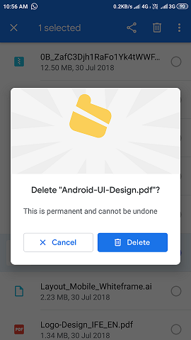
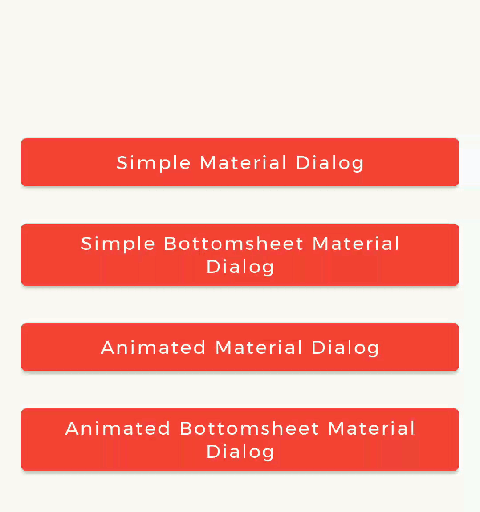
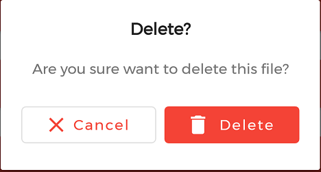
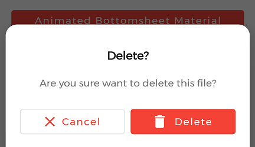
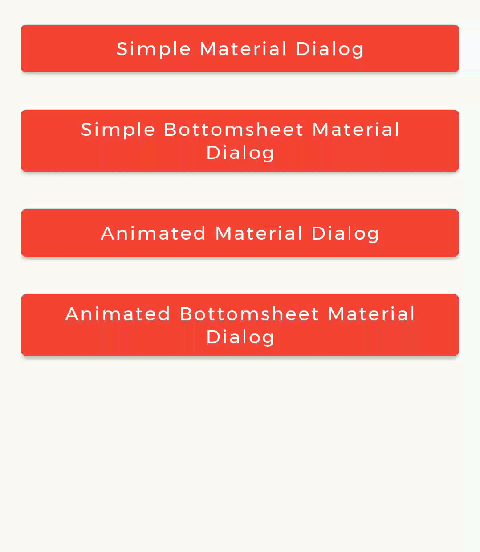
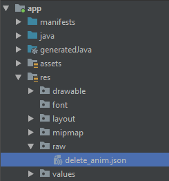
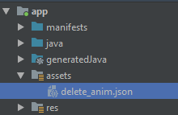

---
title: "Animated Material Dialog — Android 📱 😍🎨"
pubDatetime: 2019-06-13T08:15:23.722Z
description: "TODO: Add a description"
tags:
- others
coverImage: "../../assets/images/cover-implementing-animated-material-dialog-in-android-c4fb35d7d050.png"
---

Hello everyone, in this article we will learn to implement animated, 😍 beautiful, rich and stylish 🎨 Material Dialog in the app using **MaterialDialog** android library.


*Screenshot of [Google Files](https://files.google.com/) App.*

Have you ever seen this dialog in [Google Files](https://files.google.com/) app? When I saw it, I was impressed by its structure and design and curious about its implementation and how it works! Then I decided to develop a library for it which will help many developers to implement such dialog easily in their Android apps. After this, I started work on it and finally, I successfully developed library — **MaterialDialog** 😍.

***

## 👉 About MaterialDialog Library

[https://github.com/PatilShreyas/MaterialDialog-Android](https://github.com/PatilShreyas/MaterialDialog-Android)

MaterialDialog library is built upon Google’s Material Design library. This API will be useful to create rich, animated, beautiful dialogs in Android app easily. This library implements Airbnb’s [Lottie](https://github.com/airbnb/lottie-android) library to render After Effects animation in the app. Refer [this](https://airbnb.io/lottie/#/) for Lottie documentation.

👇 Library provides two types of Dialogs:

### 1. Material Dialog



> This is basic material dialog which has two material buttons (Same as Android’s `AlertDialog`) as you can see in the image. For e.g. Here you can see the animated **Material Dialog with Animation, Title, Message and two buttons.**

### 2. Bottom Sheet Material Dialog


> This is Bottom Sheet material dialog which has two material buttons which is created at bottom of device as you can see in the image. For e.g. Here you can see the animated Bottom Sheet Material Dialog with Animation, Title, Message and two buttons.

***

## 💻 Getting Started

This project is available on GitHub and you can clone this repository: [https://github.com/PatilShreyas/MaterialDialog-Android](https://github.com/PatilShreyas/MaterialDialog-Android).

Implementation of this Library is so easy. This library is developed as similar as `AlertDialog` of Android so that structure of implementation is also similar.

### * Prerequisite

#### i. Gradle

In `build.gradle` of app module, include these dependencies. If you want to show animations, include *Lottie* animation library.

```groovy
dependencies {
    // Material Dialog Library
    implementation 'com.shreyaspatil:MaterialDialog:2.1'

    // Material Design Library
    implementation 'com.google.android.material:material:1.0.0'

    // Lottie Animation Library
    implementation 'com.airbnb.android:lottie:3.3.6'
}
```

#### ii. Set up Material Theme

Setting Material Theme to the app is necessary before implementing Material Dialog library. To set it up, update [styles.xml](https://github.com/PatilShreyas/MaterialDialog-Android/blob/master/app%5Csrc%5Cmain%5Cres%5Cvalues%5Cstyles.xml) of a *values* directory in the app.

```xml
<resources>
    <style name="AppTheme" parent="Theme.MaterialComponents.Light">
        <!-- Customize your theme here. -->
        ...
    </style>
</resources>
```

After these main two steps, we are done. Remaining work is so easy. Now, we are ready to create `MaterialDialog` instance.

#### iii. Customize Dialog Theme (Optional)

If you want to customize dialog view, you can override the style in `styles.xml` as below:

```xml
<!-- Base application theme. -->
<style name="AppTheme" parent="Theme.MaterialComponents.Light.DarkActionBar">
    <item name="colorPrimary">@color/colorPrimary</item>
    <item name="colorPrimaryDark">@color/colorPrimaryDark</item>
    <item name="colorAccent">@color/colorAccent</item>
    <item name="android:fontFamily">@font/montserrat</item>

    <!-- Customize your theme here. -->
    <item name="material_dialog_background">#FFFFFF</item>
    <item name="material_dialog_title_text_color">#000000</item>
    <item name="material_dialog_message_text_color">#5F5F5F</item>
    <item name="material_dialog_positive_button_color">@color/colorAccent</item>
    <item name="material_dialog_positive_button_text_color">#FFFFFF</item>
    <item name="material_dialog_negative_button_text_color">@color/colorAccent</item>
</style>
```

***

## Create Dialog Instance

As there are two types of dialogs in the library. Material Dialogs are instantiated as follows:

### i. Material Dialog

`MaterialDialog` class is used to create Material Dialog. Its static `Builder` class is used to instantiate it. After building, to show the dialog, `show()` method of `MaterialDialog` is used.

<script src="https://gist.github.com/PatilShreyas/33a0ecf470ac84a7c70ce901c3a5950c.js"></script>

After running this code, its ***output*** will be as:



### ii. Bottom Sheet Material Dialog

`BottomSheetMaterialDialog` class is used to create Bottom Sheet Material Dialog. Its static `Builder` class is used to instantiate it. After building, to show the dialog, `show()` method of `BottomSheetMaterialDialog` is used.

<script src="https://gist.github.com/PatilShreyas/ed547d917b1c5b28af2864168666ebbc.js"></script>

After running this code, its ***output*** will be as:



***

## 🎞 Showing Animations




Animations in this library are implemented using Lottie animation library. You can get free animations files [here](https://lottiefiles.com/). You can find varieties of animation files on [https://lottiefiles.com](https://lottiefiles.com/). `*.json` file downloaded from *LottieFiles* should be placed in android project. There are two ways to place the animation file (`*.json`).

For example, here `delete_anim.json` animation file is used to show file delete animation.

### i. Using `Resource` File

Downloaded `*.json` file should be placed in `raw` directory of ***res***.



In code, `setAnimation()` method of `Builder` is used to set Animation to the dialog. Its prototype is as follows: `setAnimation(int resourceId)`.

Resource file should be passed to the method. e.g. `R.raw.delete_anim`.

<script src="https://gist.github.com/PatilShreyas/5d4c853c4aa9c93544fdf027012495a6.js"></script>

### ii. Using `Asset` File

Downloaded `*.json` file should be placed in `asset` directory.



In code, `setAnimation()` method of `Builder` is used to set Animation to the dialog. Its prototype is as follows: `setAnimation(String fileName)`.

<script src="https://gist.github.com/PatilShreyas/45242fc3b02391ab511ea8c0ce7ecdda.js"></script>

### iii. Getting `LottieAnimationView`

To get `View` of Animation for any operations, there is a method in Material Dialogs which returns `LottieAnimationView` of dialog.

```java
LottieAnimationView animationView = mDialog.getAnimationView();
// Do operations on animationView
```

***

## ◀️ Dialog State Listeners

There are three callback events and listeners for Dialog.

Following are interfaces for implementations:

*   **`OnShowListener()`** - Listens for dialog Show event. Its `onShow()` is invoked when dialog is displayed.
*   **`OnCancelListener()`** - Listens for dialog Cancel event. Its `onCancel()` is invoked when dialog is cancelled.
*   **`OnDismissListener()`** - Listens for dialog Dismiss event. Its `onDismiss()` is dismiss when dialog is dismissed.

🎉 Hurrah!!! As thus, we have successfully implemented and demonstrated the use of ***MaterialDialog*** Android library. If you have any questions, suggestions and want any help you can contact me on details given at the end of the article.

Thank You! 😃

If you need any help get in touch with me on:
[https://patilshreyas.github.io](https://patilshreyas.github.io)

***GitHub Repository (Material Dialog):**
[https://github.com/PatilShreyas/MaterialDialog-Android](https://github.com/PatilShreyas/MaterialDialog-Android)