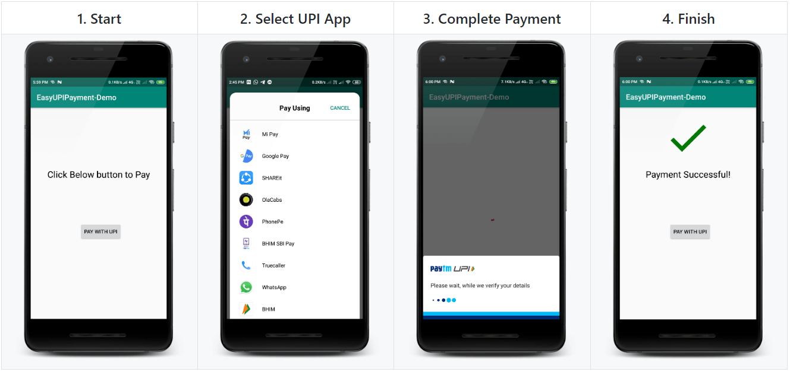

Hello everyone, in this article we will learn to implement UPI payment integration easily in any android app.

**_EasyUpiPayment_** is developed by me and available open-source on GitHub. You can find the repository at the end of the article. This library identifies installed UPI apps on the device and when a user chooses to pay with a specific app, it connects with an app via deep-linking and completes the payment procedure and returns back to the app with the transaction details.

The one and only one basic requirement of this library:

- At least one UPI app should installed on Device.

---

## See Demo Output

Its implementation and flow is so easy and only of four steps as you can see below:

1.  Implement a caller to start transaction/payment.
2.  User will choose UPI app to pay with.
3.  User will complete the procedure of payment using UPI PIN.
4.  Transaction Details will get on the app and finished.


_Demo of EasyUpiPayment Android Library_

---

## 💻 Getting Started

Let’s get started to the code!

Open _Android Studio._ Create a new project OR you can simply _clone this repository_: [https://github.com/PatilShreyas/EasyUpiPayment-Android.git](https://github.com/PatilShreyas/EasyUpiPayment-Android.git)

### Gradle Setup

In `build.gradle` of _app_ module, include this below dependency to import the EasyUpiPayment library in the app.

```groovy
dependencies {
    implementation 'com.shreyaspatil:EasyUpiPayment:2.0'
}
```

### App Setup

In the Android app, make any activity where you want to implement payment integration. Here, I have created `MainActivity.java`.

---

## Initializing `EasyUpiPayment`

You can see below code, these are minimum and mandatory calls to enable payment processing. If any of it is missed then an error will be generated. For example, consider parameters as follows:

<script src="https://gist.github.com/PatilShreyas/9d2eaaa21ab98828c100015bb83cd0b7.js"></script>

**Calls and Descriptions:**

- `with()`: **Mandatory** and this call take `Activity` as a parameter.
- `setPayeeVpa()`: **Mandatory** and takes VPA address of payee for e.g. **shreyas@upi**
- `setTransactionId()`: **Mandatory** and used in Merchant Payments generated by PSPs.
- `setTransactionRefId()`: **Mandatory** Transaction reference ID. This could be order number, subscription number, Bill ID, booking ID, insurance renewal reference, etc. Needed for merchant transactions and dynamic URL generation. It's mandatory because some apps like PhonePe generates the error if this field is absent.
- `setDescription()`: **Mandatory** and have to provide a valid small note or description about payment. For e.g. **For Food**
- `setAmount()`: **Mandatory** and it takes the amount in String decimal format (`xx.xx`) to be paid. For e.g. `90.88` will pay Rs. 90.88.
- `setPayeeMerchantCode()`: Payee Merchant code if present it should be passed.
- `build()`: It will build and returns the `EasyUpiPayment` instance.

---

## App-Specific Payment

If you want to pay only with a specific app like BHIM UPI, PhonePe, PayTm, etc. Then you can use a method `setDefaultPaymentApp()` of `EasyUpiPayment`.

Following ENUM can be passed to this method:

- `PaymentApp.BHIM_UPI`
- `PaymentApp.AMAZON_PAY`
- `PaymentApp.GOOGLE_PAY`
- `PaymentApp.PHONE_PE`
- `PaymentApp.PAYTM`

Example:

```java
easyUpiPayment.setDefaultPaymentApp(PaymentApp.BHIM_UPI);
```

After this while payment, this app will be opened for a transaction.

---

## Proceed to Payment

To start the payment, just call `startPayment()` method of EasyUpiPayment and after that transaction is started.

```java
easyUpiPayment.startPayment();
```

---

## Event Callback Listeners

To register for callback events, you will have to set `PaymentStatusListener` with `EasyUpiPayment` as below:

```java
easyUpiPayment.setPaymentStatusListener(this);
```

**Description:**

- `onTransactionCompleted()` - This method is invoked when a transaction is completed. It may either `SUCCESS`, `SUBMITTED` or `FAILED`.

> **NOTE:** If `onTransactionCompleted()` is invoked it doesn’t means that payment is successful. It may fail but transaction is completed is the only purpose.

- `onTransactionSuccess()` - Invoked when Payment is successful.
- `onTransactionFailed()` - Invoked when Payment is unsuccessful/failed.
- `onTransactionCancelled()` - Invoked when Payment cancelled (User pressed back button or any reason).
- `onAppNotFound()` - Invoked when app specified with `setDefaultPaymentApp()` is not exists on device.

<script src="https://gist.github.com/PatilShreyas/94f1080939ba1d801d9d24bab1b14c43.js"></script>

---

## Getting Transaction Details

To get details about transactions, we have a callback method `onTransactionCompleted()` with a parameter of `TransactionDetails`. `TransactionDetails` instance includes details about the previously completed transaction.

To get details, below method of `TransactionDetails` are useful:

- `getTransactionId()` - Returns Transaction ID
- `getResponseCode()` - Returns UPI Response Code
- `getApprovalRefNo()` - Returns UPI Approval Reference Number (beneficiary)
- `getStatus()` - Returns Status of transaction (_Submitted/Success/Failure_)
- `getTransactionRefId()` - Returns Transaction reference ID passed in the input.

---

## Remove Listener

To remove listeners, you can invoke `detachListener()` after the transaction is completed or you haven’t to do with payment callbacks.

```java
easyUpiPayment.detachListener();
```

---

Thus, we have successfully integrated the UPI payment service in our Android app easily 😃.

**_Thank You!_ 😃**

If you need any help get in touch with me on:
[https://shreyaspatil.dev](https://shreyaspatil.dev)

**GitHub Repository:** [https://github.com/PatilShreyas/EasyUpiPayment-Android](https://github.com/PatilShreyas/EasyUpiPayment-Android)

**GitHub Page Documentation:** [https://patilshreyas.github.io/EasyUpiPayment-Android/](https://patilshreyas.github.io/EasyUpiPayment-Android/)
