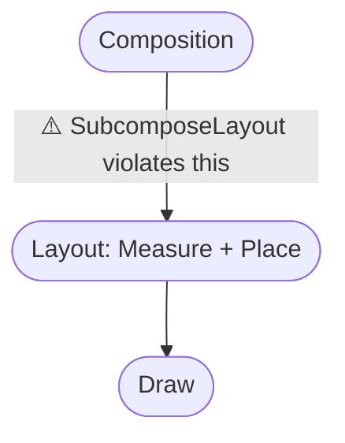
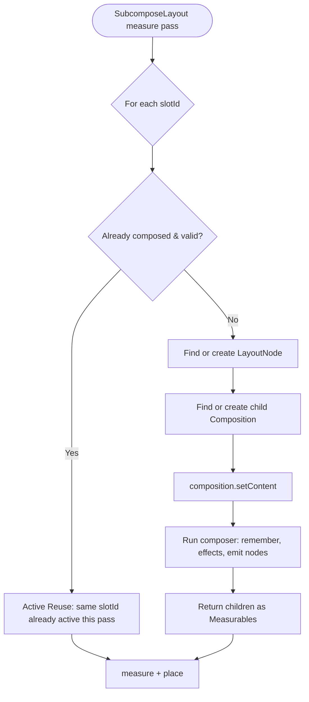
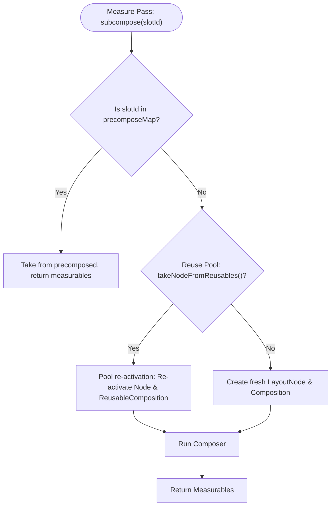

Hey Composers 👋, if you've built a complex UI in Jetpack Compose, you've probably reached for `BoxWithConstraints`. And by doing so, you've probably paid a performance tax you didn't fully understand.

`SubcomposeLayout` (the engine powering `BoxWithConstraints`, `LazyColumn`, and complex custom layouts) is a blunt instrument that breaks the fundamental rules of the Compose pipeline.

There's a popular piece of advice floating around: _"`SubcomposeLayout` is expensive, avoid it."_ But _why_ is it expensive? What exactly happens under the hood when you subcompose? In this post, we'll look directly at the AOSP source code to understand what subcomposition really does, why it stalls the layout pipeline, and where the real cost comes from.

<div class="post-callout">
  <div class="emoji">🚨</div>
  <div class="content">
    <strong>TL;DR / The Decision Matrix:</strong><br/>
    Before you write a <code>SubcomposeLayout</code>, ask yourself:
    <ul class="mb-0">
      <li><strong>Need child A's size to measure child B?</strong> &rarr; Use a standard <code>Layout</code> or <code>LookaheadScope</code>.</li>
      <li><strong>Need parent constraints to change the size or position logic?</strong> &rarr; Use a standard custom <code>Layout</code>.</li>
      <li><strong>Need parent constraints to dictate if a Composable is even emitted?</strong> &rarr; Use <code>SubcomposeLayout</code>.</li>
    </ul>
  </div>
</div>

---

## A quick refresher: composition then layout

In a standard Compose layout, there's a clean separation of phases. First, **composition** fully constructs the tree of `LayoutNode`s by running your `@Composable` functions. Then, **layout** (measure + place) figures out the size and position of every node. Finally, **draw** paints them.



| Aspect                    | Regular `Layout` |      `SubcomposeLayout`       |
| :------------------------ | :--------------: | :---------------------------: |
| When children compose     |  Before measure  |        During measure         |
| Compositions involved     |  Shares parent   |      One **per slotId**       |
| Cost paid in measure pass | Measurement only | Composition **+** measurement |
| Best for                  |   Most layouts   | Constraint-dependent content  |

The key rule here is: **composition happens before layout**. You can't decide _which_ composables to emit based on a measured size, because by the time you're measuring, composition is already done.

But what if you genuinely need to? What if a child's _content_ depends on the constraints handed down by the parent? That's exactly the problem `SubcomposeLayout` was built to solve.

---

## The "What": composing during the layout pass

`SubcomposeLayout` does something that sounds almost contradictory: it lets you **run composition _inside_ the measure or layout (placement) pass**.

Think of a standard `Layout` as a restaurant kitchen with a prix fixe menu. You order everything upfront (Composition), and then the chef plates it all at once (Layout). `SubcomposeLayout` is like stopping the entire kitchen mid-plating, walking back to the stove, and cooking a brand new side dish because you realized the plate had extra room. It stalls the pipeline.

Instead of composing all children up front, you get a `subcompose` function that you call during measurement, once you already know the incoming constraints.

Here's the canonical example everyone meets first, `BoxWithConstraints`, which is itself built on `SubcomposeLayout`:

```kotlin file="ResponsiveContent.kt"
@Composable
fun ResponsiveContent() {
    BoxWithConstraints {
        // We now know the constraints BEFORE deciding what to compose.
        if (maxWidth < 600.dp) {
            CompactLayout()
        } else {
            ExpandedLayout()
        }
    }
}
```

The mechanism here is that `CompactLayout()` and `ExpandedLayout()` are not composed until the box has been measured. The decision is deferred to the layout phase.

The lower-level API looks like this:

```kotlin file="MySubcomposeLayout.kt"
@Composable
fun MySubcomposeLayout() {
    SubcomposeLayout { constraints ->
        // `subcompose` runs composition for the given slotId NOW,
        // during the measure pass, and returns measurables.
        val measurables = subcompose(slotId = "content") {
            // 🚨 CRITICAL: Check for infinite constraints before passing them down!
            // If this layout is inside a LazyColumn, constraints.maxWidth will be Infinity.
            // If you return an infinite dimension from the layout() block, or if a child
            // attempts to fill unbounded width, the framework will crash.
            val widthPx = if (constraints.hasBoundedWidth) constraints.maxWidth else 0
            val widthDp = with(LocalDensity.current) { widthPx.toDp() }
            MyContent(availableWidth = widthDp)
        }

        val placeables = measurables.map { it.measure(constraints) }

        // Protect against exceeding constraints if we have multiple children
        val width = (placeables.maxOfOrNull { it.width } ?: 0).coerceAtMost(constraints.maxWidth)
        val height = placeables.sumOf { it.height }.coerceAtMost(constraints.maxHeight)

        layout(width, height) {
            var y = 0
            placeables.forEach { placeable ->
                // Always use placeRelative to respect RTL!
                // Using x = 10 to demonstrate RTL placement (mirrored in RTL mode)
                placeable.placeRelative(10, y)
                y += placeable.height
            }
        }
    }
}
```

<div class="post-callout">
  <div class="emoji">💡</div>
  <div class="content">
    <strong>Mental model:</strong> A regular <code>Layout</code> receives already-composed children as <code>measurables</code>. A <code>SubcomposeLayout</code> receives a <em>lambda</em> and decides when (and whether) to turn it into measurables by calling <code>subcompose</code> during measurement.
  </div>
</div>

---

## How it works: the core machinery

By looking at the [`SubcomposeLayout` source](https://cs.android.com/androidx/platform/frameworks/support/+/androidx-main:compose/ui/ui/src/commonMain/kotlin/androidx/compose/ui/layout/SubcomposeLayout.kt), we can see that the real workhorse isn't the public composable at all, it's an internal state holder called `LayoutNodeSubcompositionsState`.

The `SubcomposeLayout` composable mostly wires up three things:

1.  A `SubcomposeLayoutState`, which owns the `LayoutNodeSubcompositionsState`.
2.  The root `LayoutNode` that will host all the subcomposed children.
3.  A measure policy that gives you the `subcompose { }` function inside the `SubcomposeMeasureScope`.

```kotlin
// Simplified shape of the internal state holder
internal class LayoutNodeSubcompositionsState(
    private val root: LayoutNode,
    private var slotReusePolicy: SubcomposeSlotReusePolicy,
) {
    // Even the bookkeeping is allocation-optimized with ScatterMap
    private val nodeToNodeState = mutableScatterMapOf<LayoutNode, NodeState>()
    private val slotIdToNode = mutableScatterMapOf<Any?, LayoutNode>()

    // Each slotId gets its OWN child composition.
    fun subcompose(slotId: Any?, content: @Composable () -> Unit): List<Measurable> {
        // ...
    }
}
```

Two things in that snippet are the whole story of why subcomposition costs what it does:

- Each `slotId` maps to its **own `LayoutNode`**, and
- each of those nodes gets its **own child `Composition`** that is a sub-composition of the parent.

### Each slot is its own little composition

When you call `subcompose(slotId, content)`, the state holder:

1.  Finds (or creates) a `LayoutNode` for that `slotId`.
2.  Finds (or creates) a child `Composition` for that node, parented to the enclosing composition context.
3.  Calls `composition.setContent(content)` to actually run your composable.
4.  Returns the node's children as a `List<Measurable>` so you can measure them.

```kotlin
// Conceptually, inside subcompose(...)
private fun subcompose(node: LayoutNode, content: @Composable () -> Unit) {
    val nodeState = nodeToNodeState.getOrPut(node) { NodeState(...) }

    nodeState.content = content
    subcomposeInto(node) {
        // Runs composition for just this slot's content,
        // creating a child composition under the parent's context.
        // It uses createPausableSubcomposition or createSubcomposition based on state.
        composition = reuseOrCreateComposition(existing, node, ...)

        // Wrapping in withoutReadObservation ensures that measure-time
        // composition doesn't register phantom snapshot-read dependencies on the parent.
        Snapshot.withoutReadObservation {
            composition.setContent(content)
        }
    }
}
```

**Subcomposition is real composition.** It runs the composer, allocates slot tables, processes `remember`s, registers `RememberObserver`s and `SideEffect`s, the full machinery. It's not a cheap "layout-only" shortcut. The cost is the cost of composing those composables, just shifted into the measure pass.

If you're wondering how parent recomposition propagates into child subcompositions, `SubcomposeLayout` achieves this by executing a `SideEffect { state.forceRecomposeChildren() }` in its public composable.



---

## The real cost, broken down

So where does the "`SubcomposeLayout` is expensive" reputation actually come from? Here is what is actually happening in the frame budget.

### 1. Composition runs during measurement

In a normal layout, composition is already finished before measuring begins, so the measure pass is pure math on already-built nodes. With `SubcomposeLayout`, the first time a slot is measured you pay for **composition + measurement together**, on the layout thread, inside the frame's measure budget.

If your subcomposed content is heavy (lots of composables, expensive `remember` calculations, etc.), that work now competes with the time you have to measure and draw the current frame.

### 2. The per-frame subcompose tax

The real devil of subcomposition isn't just the one-time layout overhead: it's the **per-frame tax**.

What happens if you animate a parent's size and read those continuously-changing constraints inside your `subcompose` block? It forces subcomposition _every single frame_. Because the constraints change, the content lambda is a _new closure instance_ each measure pass. You aren't just running math calculations; you are **re-running composition — the composer, every `remember`, every invalidation check — on the reused node, 60 times a second**.

### BoxWithConstraints vs Modifier.layout

`BoxWithConstraints` isn't the villain — reading a _continuously-changing_ constraint inside it is. A breakpoint boolean (`maxWidth < 600.dp`) rarely flips, so it's cheap. But a pixel-precise animating read causes a 60×/s composition tax.

Watch this drop frames on your own device:

```kotlin
val padding by animateDpAsState(targetValue = if (toggled) 32.dp else 0.dp)
BoxWithConstraints(Modifier.padding(padding)) {
    // Recomposes 60x a second during animation!
    MyHeavyContent(constraints.maxWidth)
}
```

The fix is ripping out `BoxWithConstraints` and using `Modifier.layout` to mathematically calculate the offset during the placement phase, completely bypassing the need to subcompose. This is the #1 way developers shoot themselves in the foot, causing massive UI jank.

### 3. Extra compositions = extra bookkeeping

Each slot owns a separate child `Composition`. Compositions aren't free; they each maintain their own slot table and lifecycle. A `SubcomposeLayout` with many distinct `slotId`s is maintaining many child compositions, which means more memory and more work to keep them in sync, dispose them, and so on.

---

## The escape hatch: slot reuse

The Compose team knew the per-slot composition cost would hurt in scrolling scenarios like `LazyColumn` (whose underlying `LazyLayout` primitive builds on `SubcomposeLayout`). So `SubcomposeLayout` ships with a powerful optimization: **slot reuse**, controlled by a `SubcomposeSlotReusePolicy`.

Instead of disposing a composition when a slot scrolls off-screen and rebuilding it from scratch when a new one scrolls in, the state holder keeps a small pool of **deactivated** compositions around and _reuses_ them.

```kotlin
// Reuse keeps the underlying nodes & composition, but resets state,
// so a new slot can be "re-inflated" cheaply.
// `SubcomposeSlotReusePolicy(maxSlotsToRetainForReuse)` is a public factory that
// returns a policy retaining up to N deactivated slots in the reuse pool.
SubcomposeLayout(
    state = remember { SubcomposeLayoutState(SubcomposeSlotReusePolicy(maxSlotsToRetainForReuse = 7)) }
) { constraints ->
    // ...
}
```

Under the hood, this leans on `ReusableComposition`:

- When a slot is no longer needed, it isn't immediately disposed. It's moved to a reusable pool and **deactivated** (nodes kept, remembered state cleared).
- When a new slot of a compatible content type appears, the runtime grabs a deactivated composition and re-runs content into it. Reusing the existing node structure is dramatically cheaper than creating it fresh.

(Note: Lazy lists also utilize `precompose()` to prefetch items into a `precomposeMap` before they are even needed for measurement, further optimizing the reuse flow.)



This is the exact same `ReusableComposition` foundation that newer features like [`PausableComposition`](https://blog.shreyaspatil.dev/exploring-pausablecomposition-internals-in-jetpack-compose) build upon. Lazy lists use `PausableComposition` to chunk composition work across frames, ensuring that pre-composing upcoming items during idle time doesn't blow past the 16ms frame deadline. Separately, an internal `OutOfFrameExecutor` is used to schedule the **deactivation and disposal** of compositions off the frame's critical path, keeping your scroll smooth.

---

## Practical takeaways

After all this digging, the advice "avoid `SubcomposeLayout`" becomes more nuanced and actionable:

- **Don't reach for it by default.** If your children don't actually need parent constraints to decide _what_ to compose, a plain `Layout` (or `Modifier`-based approach) is cheaper and clearer.
- **`BoxWithConstraints` is `SubcomposeLayout`.** It's convenient, but it carries the same cost. If you only need the size for sizing/positioning (not for _choosing_ content), prefer a custom `Layout` or `onSizeChanged`.
- **Keep subcomposed content lean.** Whatever runs inside `subcompose` is composed during the measure pass; heavy work there is felt directly in your frame budget.
- **Lean on reuse for repeated slots.** If you're building list-like UIs, a sensible `SubcomposeSlotReusePolicy` is what keeps the cost amortized.
- **Avoid invalidations that re-trigger subcomposition every frame.** As shown above, animating constraints -> new content lambda -> `contentChanged` -> recompose 60x/sec. Use `Modifier.layout` instead.

### "Asking for intrinsic measurements of SubcomposeLayout layouts is not supported"

- **Need sibling sizing? DO NOT use `SubcomposeLayout`.** If you just want a child to be as tall as its sibling (like a divider next to text), use `Modifier.height(IntrinsicSize.Min)`. If you ask for intrinsic measurements of a `SubcomposeLayout`, the framework will literally throw the `IllegalStateException` above. It crashes because the layout doesn't know what it contains until it measures!

### "Key was already used" in LazyColumn

- **Free real-world insight:** Have you ever seen the crash `"Key $slotId was already used. If you are using LazyColumn/Row please make sure you provide a unique key for each item"`? Under the hood, when you subcompose the same `slotId` twice in one measure pass, the second lookup returns a node already placed at an earlier index (`itemIndex < currentIndex`), and the internal `requirePrecondition` fails.

- **Prefer higher-level APIs when they exist.** Often you don't need to hand-write a `SubcomposeLayout` at all. Components like `BoxWithConstraints` and `LazyColumn`/`LazyRow` already wrap subcomposition for you. Even for complex flow layouts with dynamic overflow indicators (like a "+3 more" chip), use `FlowRow` or `FlowColumn` with the `overflow` and `maxLines` overloads. Reach for these built-in tools first and only drop down to a custom `SubcomposeLayout` when none of them fit.
- **Keep an eye on newer layout tools (and how they interact!).** `LookaheadScope` lets Compose pre-measure a target layout so children can animate toward it. In Compose 1.7+, `SubcomposeLayout` hooks deeply into this via `ApproachMeasureScopeImpl`. The subcomposition lambda evaluates the "lookahead" target state, and then dynamically manages slots during the "approach pass" to animate smoothly toward that target. It's highly optimized, but complex to author correctly.

---

## Conclusion

Stop prematurely optimizing. If you are building a static screen, the subcomposition cost of a `BoxWithConstraints` is mostly irrelevant; a single frame-1 subcomposition cost is virtually unnoticeable. Don't avoid it just because "Twitter said it's slow."

But when you move into scrolling lists or animating states, you must respect the pipeline.

The next time you build a custom layout, make a deliberate choice: do I _truly_ need to emit nodes based on measurement, or am I about to pay for subcomposition when a plain `Layout` would do?

`SubcomposeLayout` is a chainsaw. It’s incredibly powerful when cutting down a tree (like building a responsive `LazyColumn`), but you don't use a chainsaw to slice a tomato. Choose your layout tools wisely.

---

Let's catch up on [**X**](https://twitter.com/imShreyasPatil) or [**visit my site**](https://shreyaspatil.dev/) to know more about me 😎.
