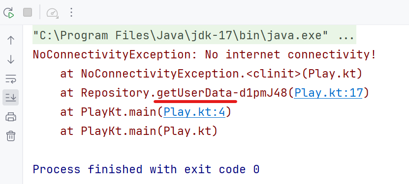

Hey developers 👋🏻, in this micro-blog we’ll walk through an important learning everyone should have while working with Exceptions/Errors in the Kotlin.

Have you ever seen or declared **Exceptions** as `object` in Kotlin? Something like this:

```kotlin
object NoConnectivityException : Exception("No internet connectivity!")
object ResourceNotFoundException : Exception("Blah Blah Blah!")
```

Can you think what it can lead to? 🤔

Let’s understand it with a simple example. Have a look at the following snippet:

```kotlin
/** Represents a network failure */
object NoConnectivityException : Exception("No internet connectivity!")

class Repository {
    fun getUserData(): Result<String> = runCatching {
        // Imagine user fetching operation here and
        // it fails due to connectivity issue!
        throw NoConnectivityException
    }

    fun getAppData(): Result<String> = runCatching {
        // Imagine some data fetching operation here and
        // it fails due to connectivity issue!
        throw NoConnectivityException
    }
}
```

Here, we have declared `NoConnectivityException` as an `object` and both the repository methods throw that Exception when these methods are called.

Then let’s simulate a real app flow:

```kotlin
val repository = Repository()

fun main() {
    val userDataResult = repository.getUserData()

    // << Few Moments Later in the real app >>

    val appDataResult = repository.getAppData()
    appDataResult.exceptionOrNull()?.printStackTrace()
}
```

So we want to print the **stack trace** if an error has occurred while getting the app data via `getAppData()` method. Now, can you guess what would be the output of this 🌚? Here you go ▶️:



Wrong stack trace for the wrong method! 😏 This was expected because `object` **creates a singleton instance of class lazily** when it’s accessed for the first time. In the above sample, we called the method `getUserData()` before `getAppData()` and inside `getUserData()` method when `throw NoConnectivityException` was executed, the instance was created and kept forever. Next time when `getAppData()` throws the Exception, it’s throwing an Exception which was earlier created by `getUserData()` method 🤷🏻‍♂️.

Now imagine what would happen if it's a critical exception that gets logged into your app's dashboard (_like 🔥Crashlytics or any other tool_). It could mislead developers 🌚.

Ideally, **<mark>Exception instances shouldn’t be singletons!</mark>** If some Exceptions are only used internally to represent state or info that won't be monitored at scale, it might be okay to make them singletons. In places where the stack trace is important and shouldn't be ignored, it can be dangerous 🔴 for the app.

These little things can easily be overlooked, but they have a big impact overall. Make sure to handle exceptions safely in your app 👍🏻.

---

Awesome 🤩. I trust you've picked up some valuable insights from this. If you like this write-up, do share it 😉, because...

**_"Sharing is Caring"_**

Thank you! 😄

Let's catch up on [**X**](https://twitter.com/imShreyasPatil) or [**visit my site**](https://shreyaspatil.dev/) to know more about me 😎.
