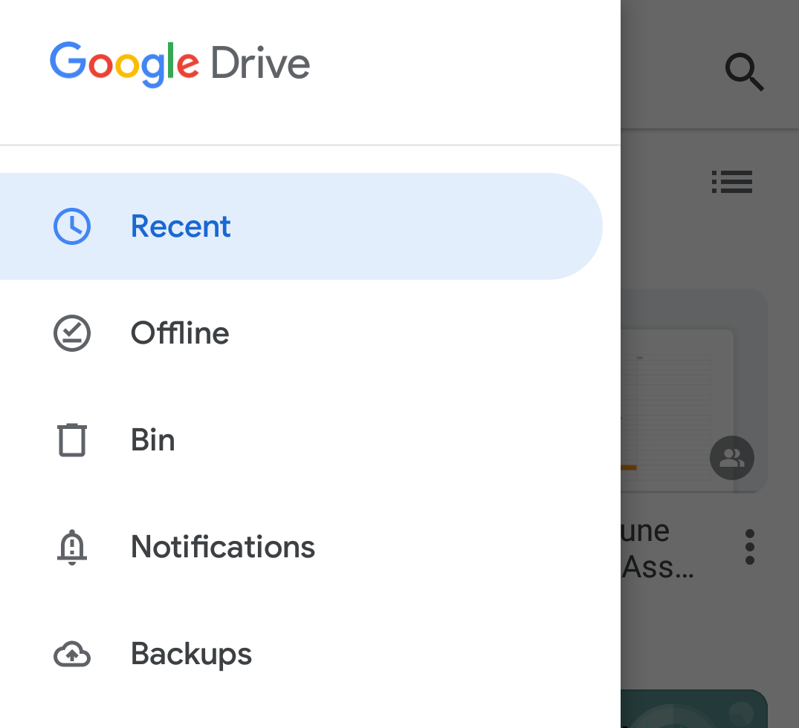
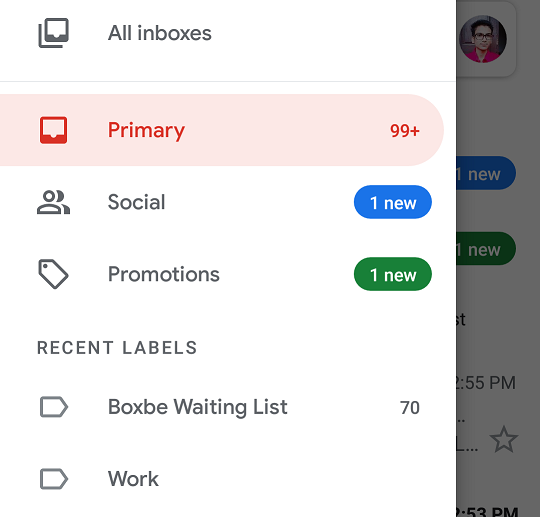
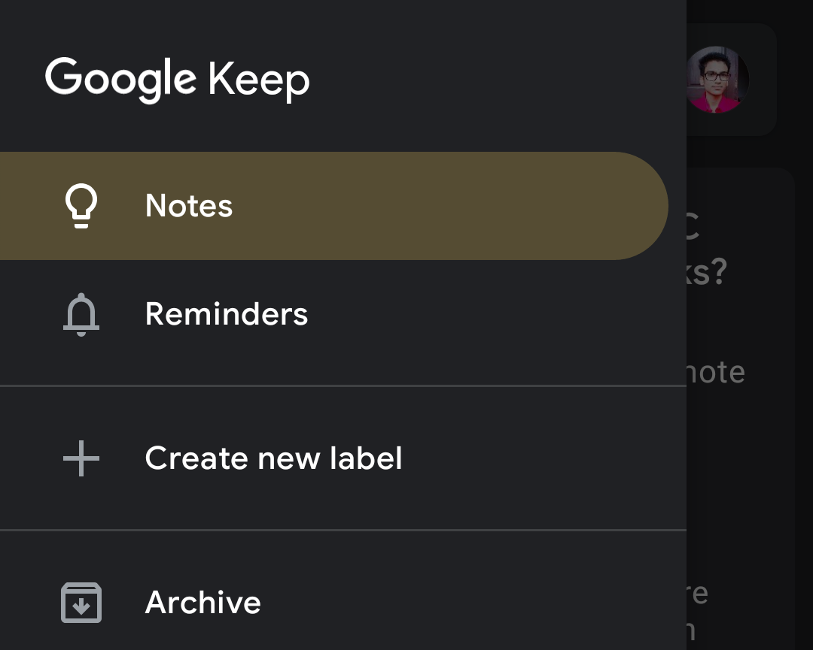
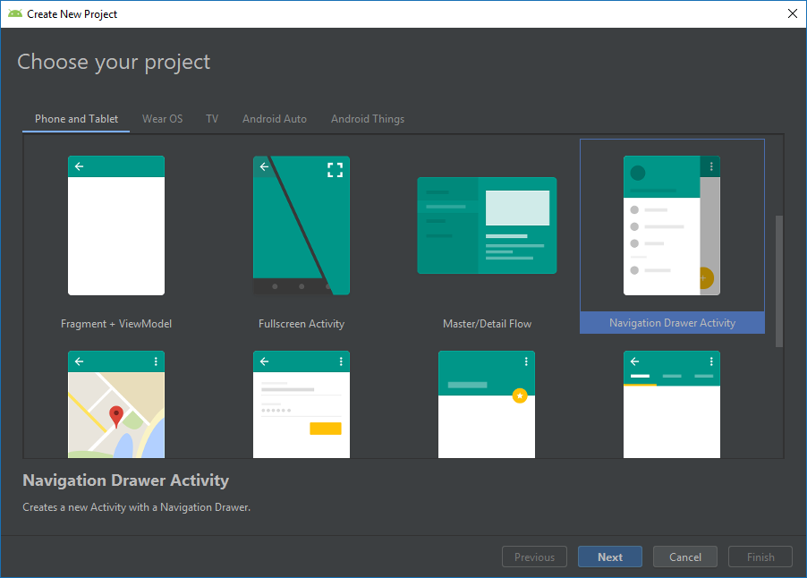
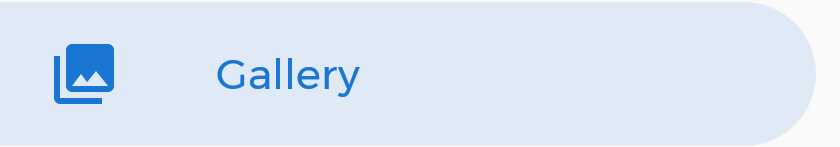
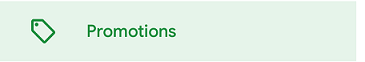
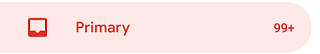
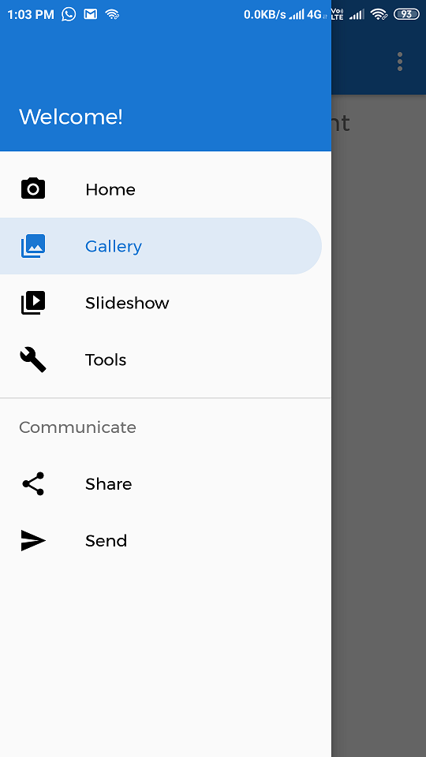
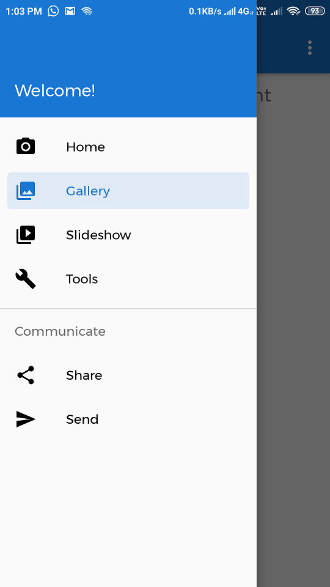

In this article, you will learn to implement Google Apps like Navigation View — Drawer in Android apps easily! 😃

Hello Developers, You might use Google’s Apps like *Gmail, Google Photos, Google Drive, Keep Notes, etc. *You have seen their Navigation drawer and it seems much attractive 😍 and best Material Design implementation there. After this, you wished to implement it. Right? You might search on Google*“How to implement Gmail like navigation drawer?”*or*“How to implement Google apps like Navigation Drawer”* But you found nothing helpful 😧. Then Here it is… 😃 In this article, I’ll explain to you how to achieve it.







After seeing such Navigation Drawers in Google-apps, I wanted to implement such design in my apps. Then I decided to develop the Library to easily implement it and to allow other developers to easily implement it.

### 👉 Introduction To Library:

As stated [here](https://material.io/develop/android/components/navigation-view/), NavigationView is an easy way to display a navigation menu from a menu resource. This is most commonly used in conjunction with [DrawerLayout](https://developer.android.com/reference/android/support/v4/widget/DrawerLayout.html) to implement [Material navigation drawers](https://material.io/go/design-navigation-drawer). Navigation drawers are modal elevated dialogs that come from the start/left side, used to display in-app navigation links.

MaterialNavigationView library is built upon Google’s Material Design library. This API will be useful to create rich, animated, beautiful Navigation View Drawer in Android app easily. It follows all Material Design Guidelines as stated [here](https://material.io/). MaterialNavigationView class in this library is inherited from [com.google.android.material.navigation.NavigationView](https://github.com/material-components/material-components-android/blob/master/docs/components/NavigationView.md) class. Just only difference is added extra design. So, we can use it as it is.

### ⭐️ Do you know How Simple it is?

*Just import Android Studio’s *Navigation Drawer Activity *Template.* Replace NavigationView class with Library class name.

And you’re done 🚀. Unbelievable? Let’s see…

## ⌨️ Implementation:

Implementation is so easy. It is same as it is we create ‘ **Navigation Drawer Activity’** in Android Studio. Just select that project template and go…



Okay then. You have now imported Navigation Drawer Activity template. Next step is to include library dependency.

### Gradle:

In build.gradle of app module, include below dependency.

```groovy
dependencies {

// Material Navigation View Library
implementation 'com.shreyaspatil:MaterialNavigationView:1.2'

// Material Design Library
implementation 'com.google.android.material:material:1.0.0'
}
```

**Setting up Material Theme:**

Setting Material Theme to the app is necessary before implementing Material Navigation View library. To set it up, update [styles.xml](https://github.com/PatilShreyas/MaterialNavigationView-Android/blob/master/app/src/main/res/values/styles.xml) of values directory of the app.

```xml
<resources>
<style name="AppTheme" parent="Theme.MaterialComponents.Light">
<!-- Customize your theme here. -->
<item name="colorPrimary">@color/colorPrimary</item>
<item name="colorPrimaryDark">@color/colorPrimaryDark</item>
<item name="colorAccent">@color/colorAccent</item>

<!-- colorSecondary will be applied to Menu item of NavigationView -->
<item name="colorSecondary">@color/colorPrimary</item>
...
</style>
</resources>
```

colorSecondary value is important here because this colour is applied to the menu item of Navigation View. The logic behind colorSecondary is that colour is set to the ***Icon and Text***of menu and after selection of that menu, that colour is applied to***background with alpha*** . As you can see it below.



### Activity XML:

In your auto-generated activity files. You may see [com.google.android.material.navigation.NavigationView](https://github.com/material-components/material-components-android/blob/master/docs/components/NavigationView.md) is there under DrawerLayout . You just have to change it to com.shreyaspatil.material.navigation.MaterialNavigationView and you’re done 😉.

Now, it’ll look like…

```xml
<androidx.drawerlayout.widget.DrawerLayout xmlns:android="http://schemas.android.com/apk/res/android"
xmlns:app="http://schemas.android.com/apk/res-auto"
xmlns:tools="http://schemas.android.com/tools"
android:layout_width="match_parent"
android:layout_height="match_parent">

<!-- Other Stuff here -->

<com.shreyaspatil.material.navigationview.MaterialNavigationView
android:id="@+id/nav_view"
android:layout_width="wrap_content"
android:layout_height="match_parent"
app:itemStyle="rounded_right"
app:menu="@menu/activity_main_drawer" />

</androidx.drawerlayout.widget.DrawerLayout>
```

As already mentioned, this class is inherited from NavigationView. You can use all existing flags of that class. You noticed something different flag. Right? It’s `itemStyle` flag. This new important flag is used to set the style of the menu item in Navigation View.

Currently, two values are accepted to a flag `itemStyle`. If it is not specified, default_style flag is set by default.

***default_style :** This flag sets default style design to a menu item of Navigation drawer as you can see below.



```xml
<com.shreyaspatil.material.navigationview.MaterialNavigationView
...
app:itemStyle="default_style"/>
```

***rounded_right : **This flag sets design to a menu item of Navigation drawer as**\*Rounded Corners **at right*** as you can see below.



```xml
<com.shreyaspatil.material.navigationview.MaterialNavigationView
...
app:itemStyle="rounded_right"/>
```

***rounded_rectangle : **This flag sets design to a menu item of Navigation drawer as***Rounded Rectangular Corners*** as you can see below.


```xml
<com.shreyaspatil.material.navigationview.MaterialNavigationView
...
app:itemStyle="rounded_rectangle"/>
```

### 💻 **Activity Code: **All the programmatic way of implementation of MaterialNavigationView is the same as NavigationView. Just change is the class name only. Two methods are added in this new class as follows. **setItemStyle(int itemStyle)*** : This method sets the Item Style of Menu in MaterialNavigationView at runtime. itemStyle should be one of the following constants :

1. `MaterialNavigationView.ITEM_STYLE_DEFAULT`
2. `MaterialNavigationView.ITEM_STYLE_ROUND_RIGHT`
3. `MaterialNavigationView.ITEM_STYLE_ROUND_RECTANGLE`

**getItemStyle()***: It returns the value of the **itemStyle** of the menu.

Here is a demo…

```kotlin
override fun onCreate(savedInstanceState: Bundle?) {
super.onCreate(savedInstanceState)
setContentView(R.layout.activity_main)

val navView = findViewById(R.id.nav_view)

navView.setItemStyle(MaterialNavigationView.ITEM_STYLE_ROUND_RIGHT)
navView.setItemStyle(MaterialNavigationView.ITEM_STYLE_ROUND_RECTANGLE)
}
```

> 😍 Yippie! We have successfully implemented Material Navigation View 🚀. Here is the output!

  

**Thanks for reading this article 😃. If you find it helpful, please share it with other’s who need it. Someone said…**>**“Sharing is Caring”**### Here is a link of **GitHub** Repository:

[https://github.com/PatilShreyas/MaterialNavigationView-Android/](https://github.com/PatilShreyas/MaterialNavigationView-Android/)