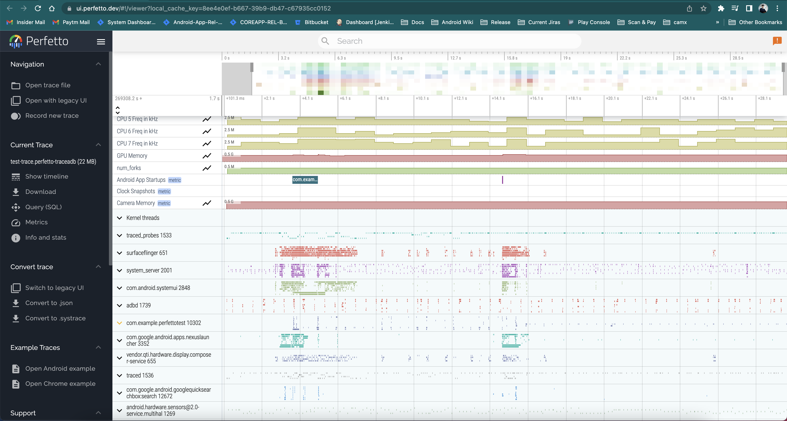
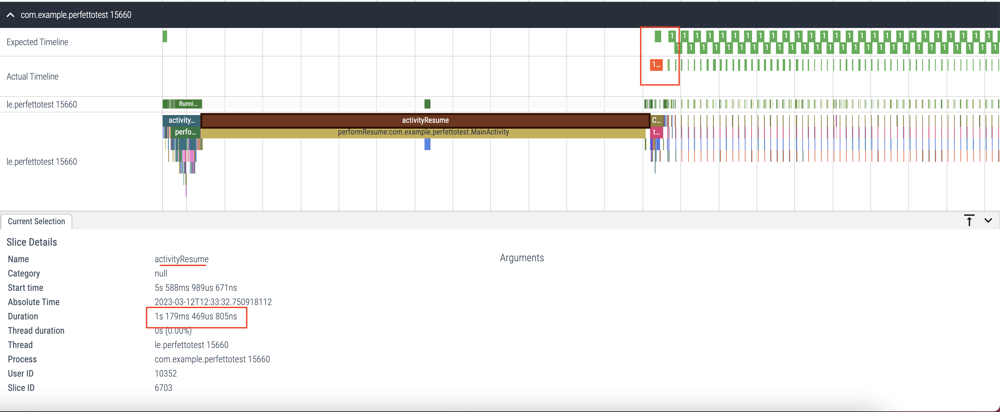
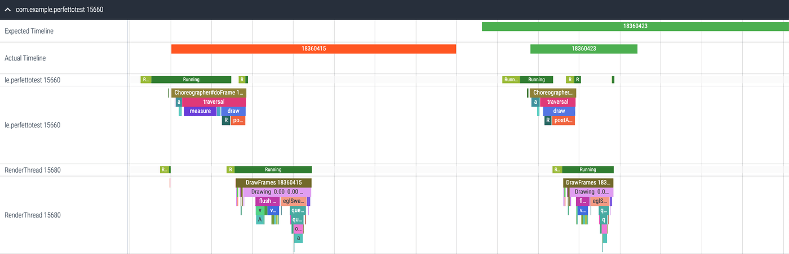
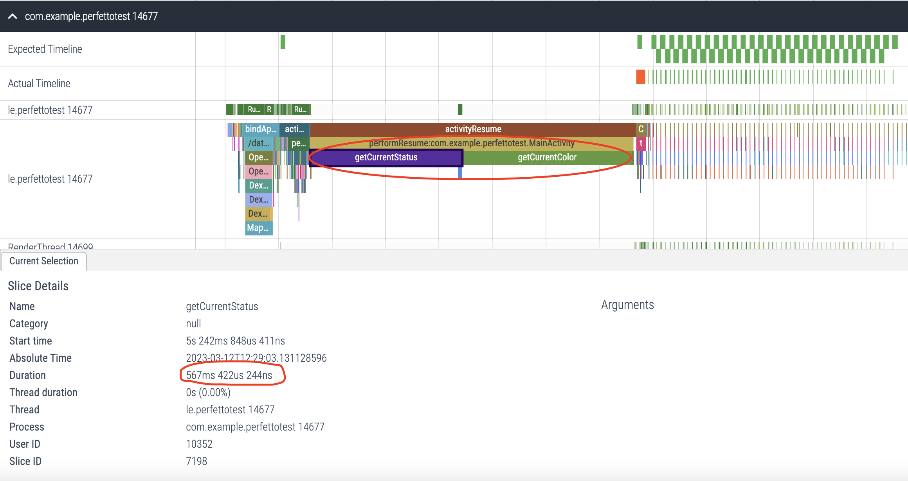
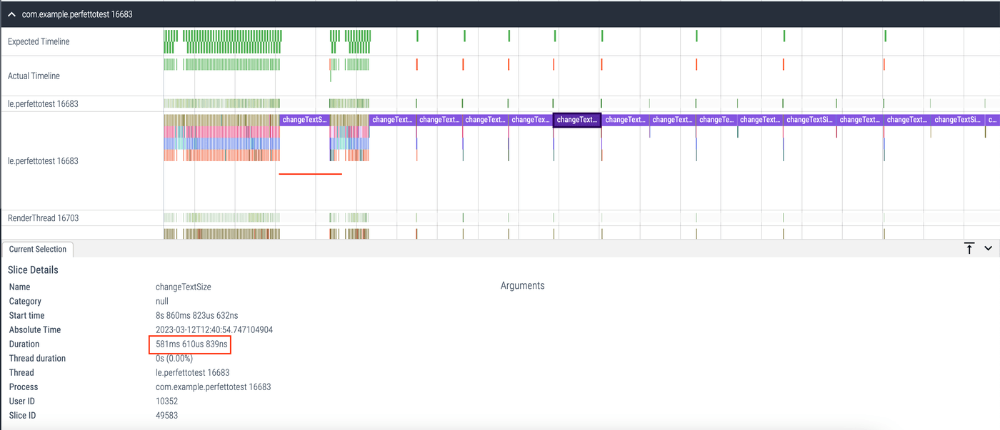

Hello Android-ers 🫡, after developing an application, we are mostly invested in improving the performance of the application and finding out the issues in the existing application that might be causing performance issues in the application. But finding out the exact root cause of performance bottleneck is sometimes tough. In this article, we are gonna see how to investigate performance bottlenecks in the application that might **cause UI slowness or janks** **with the help of** **_Perfetto_**.

This article will demonstrate how to identify issues using Perfetto, using a simple example. 😃

---

## 🧱 Setting up the App having performance issues

Let's create a sample app (_already available_ [_here_](https://github.com/PatilShreyas/play-with-perfetto/))\* and add a sample Activity in it having just a simple `TextView`.

```kotlin
class MainActivity : AppCompatActivity() {

    private lateinit var textView: TextView

    override fun onCreate(savedInstanceState: Bundle?) {
        // ...
        textView.setOnClickListener { changeTextSize() }
        animateTextBackground()
    }

    override fun onResume() {
        super.onResume()
        setStatusText()
        setStatusTextColor()
    }

    private fun animateTextBackground() {
        // Some animation logic that animates background
        // of TextView continiously after some duration
    }

    private fun changeTextSize() {
        pretendHeavyComputation()
        textView.textSize = Random.nextInt(20, 60).toFloat()
    }

    private fun setStatusTextColor() {
        textView.setTextColor(getCurrentColor())
    }

    private fun setStatusText() {
        val text = getCurrentStatus()
        textView.text = text
    }

    private fun getCurrentStatus(): String {
        // This is very heavy task.
        // Just pretend that this is very very heavy!
        pretendHeavyComputation()
        return statuses.random()
    }

    private fun getCurrentColor(): Int {
        // This is very heavy task.
        // Just pretend that this is very very heavy!
        pretendHeavyComputation()
        return colors.random()
    }

    private fun pretendHeavyComputation() {
        Thread.sleep(Random.nextLong(500, 700))
    }
}
```

Look at the above snippet and understand the flow:

- When the Activity is created, it starts animating the background of TextView continuously after some intervals.
- When the lifecycle reaches the **_RESUMED_** state, we set colour and status text to TextView and just look at the functions that do the work of getting colour and text.
- We have to pretend that getting text and colour is doing some heavy computation which will be holding **MAIN THREAD** for around 500-700ms.
- Also, whenever TextView is clicked, it does the same heavy computing and changes the text's size.

---

## 📐 Measuring this example with Perfetto

If you haven't used Perfetto much, you can look at this [official guide](https://perfetto.dev/docs/quickstart/android-tracing) to set it up and use it.

In this example, we can simply start recording a trace with Perfetto using the following command:

```bash
./record_android_trace -c perfetto.config -o test-trace.perfetto-trace
```

> **Parameter `-c`** is the configuration needed for Perfetto. You can refer to [this sample configuration](https://github.com/PatilShreyas/play-with-perfetto/blob/main/perfetto/perfetto.config). In this configuration, we can customize what to include and exclude in the Perfetto traces.

So just connect the device or emulator, and run the above command in the terminal. After running the above commands, we just need to launch our app and tap multiple times on that Text so that our heavy task will be executed with every click.

After this, just press <kbd>command</kbd> + <kbd>C</kbd>. This takes some time for collecting traces from the device and automatically launches the Perfetto's Web UI in the browser which looks like this ⬇️:



This displays the traces of all the applications which are running on the device. So just find the package of application which we have to investigate and just expand its details.

After expanding the application's package in which we are interested, it looks like this ⬇️:



In this, you can notice the timelines. Let's know what it means:

- **Expected Timeline:** Each slice represents the time given to the app for rendering the frame. To avoid janks in the system, the app is expected to finish within this time frame.
- **Actual Timeline:** These slices represent the actual time an app took to complete the frame (including GPU work) and send it to SurfaceFlinger for composition. If a slice in this timeline takes more time to execute as compared to its corresponding slice of "Expected Timeline", it's considered a **jank**. Such slices will be displayed in the 🔴 RED colour. Otherwise 🟢 GREEN.

And then a list of threads and corresponding slices of traces are listed.

Now just forget that we know we have introduced some issues in our application (_just pretend that we don't know that there are issues in the app_) 😅 and let's understand this trace.

In our example, we are interested in diagnosing the slowness of UI. So we'll have to investigate what exactly is happening on the **main thread**. As you can see, the first timeline is itself of the main thread only, after the Activity is created, the slice `activityResume` seems like taking a long time to execute. If we click on it, the status of that slice will be displayed at the bottom's sheet and we can see that `activityResume` is taking almost **_1.18 seconds_** which is bad. Also, look at the marked jank (the slice which seems red). Let's zoom that janky slice a bit and see what it shows ⬇:



So, when we check out the trace, we can tell that there's some animation happening now and then, the UI is lagging and the app is acting up. But, we can't really pinpoint what exactly is causing these issues. So, why don't we just set up tracing in our app to figure out where the problems lie?

---

## ⌛️ Setting up the tracing for methods

The tracing of a method call is very easy. Just include the following dependency in our app:

```groovy
implementation 'androidx.tracing:tracing-ktx:1.1.0'
```

Now just add tracing to all the methods in our application which we think might be causing issues in our application. So change looks like this ⬇️:

```diff
- private fun changeTextSize() {
+ private fun changeTextSize() = trace("changeTextSize") {
      pretendHeavyComputation()
      textView.textSize = Random.nextInt(20, 60).toFloat()
  }

- private fun getCurrentStatus(): String {
+ private fun getCurrentStatus() = trace("getCurrentStatus") {
      pretendHeavyComputation()
      // ...
  }

- private fun getCurrentColor(): Int {
+ private fun getCurrentColor() = trace("getCurrentColor") {
      pretendHeavyComputation()
      // ...
  }
```

Yeah, we just have to do this to trace our methods. Now, what does it do exactly?

So whenever we see the Perfetto trace, it adds the slices in the respective thread's timeline with the provided name in the `trace()` method which makes it easy for us to understand what is being executed in the certain timeline.

---

## ⌛️ Let's do it again

Cool, let's do tracing again with the above change and see the magic 🪄.

Look at the image below and now you can notice two slices under the `activityResume` slice 😃. These are `getCurrentStatus()` and `getCurrentColor()` and we can clearly see that both methods are taking around **_500ms_** to execute and thus blocking the main thread for around **_1 second_**.



Now let's look at the other janks by zooming in. We clicked multiple times on text causing the invocation of `changeTextSize()` method multiple times. We can see this ⬇️:



Here as well we can see that `changeTextSize()` slice takes around **_500ms_** and causes frequent janks in the application.

By analyzing the trace, we have gained invaluable insights into the root cause of the performance issues in our application. It's amazing to see how we can pinpoint the specific methods that are blocking the UI and causing these problems. With this newfound knowledge, we can confidently take action and make the necessary fixes to ensure our app runs super smoothly! How exciting! 🤩

---

## 🧐 Conclusion

Thus, we just diagnosed the performance issues of the main thread in this example to fix UI issues. The same can be done for the other parts of the application for the non-main thread as well to understand **what** XYZ operation is blocking **which** ABC thread and thus fixing those issues resulting in improving the performance.

Wow, you won't believe how easy it was to use Perfetto to uncover the bottlenecks in our application! And guess what? There's so much more we can do with Perfetto! 😍 Don't believe me? Check out the amazing resources below to become a Perfetto pro! 🤩

---

I am confident that you will find this blog extremely helpful! 😀

**_"Sharing is Caring"_**

Thank you! 😄

Let's catch up on [Twitter](https://twitter.com/imShreyasPatil) or [visit my site](https://shreyaspatil.dev) to know more about me 😎.

---

## 📚 Resources

- [GitHub Repository: Play with Perfetto](https://github.com/PatilShreyas/play-with-perfetto/)
- [Perfetto Documentation](https://perfetto.dev/)

<div class="video-container">
    <iframe
        src="https://www.youtube.com/embed/YEX26m89fco"
        title="YouTube video player"
        allow="accelerometer; autoplay; clipboard-write; encrypted-media; gyroscope; picture-in-picture; web-share"
        referrerpolicy="strict-origin-when-cross-origin"
        allowfullscreen>
    </iframe>
</div>

---

## 🐥 Related Posts

[https://twitter.com/imShreyasPatil/status/1635267616418959360?s=20](https://twitter.com/imShreyasPatil/status/1635267616418959360?s=20)
