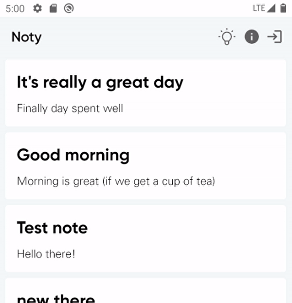

Hey Composers 👋, there are very rare mobile applications in today’s world that don’t use Internet connectivity for the execution of business. It’s now almost the need of every app. Also, some apps provide offline capabilities in the application so users can still interact with the app even if connectivity is not present.

While developing such apps, we also need to show the network status in the app so that users can aware of the current situation and can act accordingly. It becomes needed to show network status if connectivity changes from connected to a not-connected state and vice versa. In this article, we’ll implement live connectivity status and showing it in Jetpack Compose in its own beautiful way!

---

## 🏃 Get Started

So let’s start the implementation. Considering you have created a boilerplate setup of the Jetpack Compose application, let’s directly move to the main part of the application.

### Core utilities

First of all, let’s create core utilities for observing the network connectivity. Add a sealed model for holding connectivity status details as follows:

```kotlin
sealed class ConnectionState {
    object Available : ConnectionState()
    object Unavailable : ConnectionState()
}
```

Sometimes, we don’t need to observe connectivity but we need to know the status of connectivity in a single shot. So let’s create a utility for **getting the current connectivity status**.

```kotlin
/**
 * Network utility to get current state of internet connection
 */
val Context.currentConnectivityState: ConnectionState
    get() {
        val connectivityManager =
            getSystemService(Context.CONNECTIVITY_SERVICE) as ConnectivityManager
        return getCurrentConnectivityState(connectivityManager)
    }

private fun getCurrentConnectivityState(
    connectivityManager: ConnectivityManager
): ConnectionState {
    val connected = connectivityManager.allNetworks.any { network ->
        connectivityManager.getNetworkCapabilities(network)
            ?.hasCapability(NetworkCapabilities.NET_CAPABILITY_INTERNET)
            ?: false
    }

    return if (connected) ConnectionState.Available else ConnectionState.Unavailable
}
```

This way, we can check if the current network having internet capability or not. Here, we created a separate function `getCurrentConnectivityState()` for re-usability purposes (_we’ll see its usage_).

Now, on `Context` instance, we can directly access the current connectivity status by accessing _`currentConnectivityState` extension member_ which we just created 👆.

Now, let’s create a utility for observing _LIVE_ 🔴 network connectivity changes!

```kotlin
/**
 * Network Utility to observe availability or unavailability of Internet connection
 */
@ExperimentalCoroutinesApi
fun Context.observeConnectivityAsFlow() = callbackFlow {
    val connectivityManager = getSystemService(Context.CONNECTIVITY_SERVICE) as ConnectivityManager

    val callback = NetworkCallback { connectionState -> trySend(connectionState) }

    val networkRequest = NetworkRequest.Builder()
        .addCapability(NetworkCapabilities.NET_CAPABILITY_INTERNET)
        .build()

    connectivityManager.registerNetworkCallback(networkRequest, callback)

    // Set current state
    val currentState = getCurrentConnectivityState(connectivityManager)
    trySend(currentState)

    // Remove callback when not used
    awaitClose {
        // Remove listeners
        connectivityManager.unregisterNetworkCallback(callback)
    }
}

fun NetworkCallback(callback: (ConnectionState) -> Unit): ConnectivityManager.NetworkCallback {
    return object : ConnectivityManager.NetworkCallback() {
        override fun onAvailable(network: Network) {
            callback(ConnectionState.Available)
        }

        override fun onLost(network: Network) {
            callback(ConnectionState.Unavailable)
        }
    }
}
```

Here, we are using [`callbackFlow{}`](https://kotlin.github.io/kotlinx.coroutines/kotlinx-coroutines-core/kotlinx.coroutines.flow/callback-flow.html), which is a cold 🌊 stream by which we can _remove observer on cancellation_ with `awaitClose()` as you can see. Once we start collecting flow, live updates of the connectivity state will be sent over this flow and updates will be unregistered once the flow collector _cancels the subscription_.

Now we are done with the core utility needs.

---

### Compose utilities

Now let’s start developing Compose utilities for observing connectivity changes. In the previous part, we created core Android utilities. Since we want to use it in our Compose application, we need to convert it for Compose. Also, we are using `Flow` for observing connectivity, we need to leverage coroutines here.

For this, we’ll utilize [`produceState()`](<https://developer.android.com/reference/kotlin/androidx/compose/runtime/package-summary#produceState(kotlin.Any,kotlin.coroutines.SuspendFunction1)>), which launches coroutine scoped to the Composition which holds the [State](https://developer.android.com/reference/kotlin/androidx/compose/runtime/State). It’ll be automatically get cancelled once it leaves the composition.

```kotlin
@ExperimentalCoroutinesApi
@Composable
fun connectivityState(): State<ConnectionState> {
    val context = LocalContext.current

    // Creates a State<ConnectionState> with current connectivity state as initial value
    return produceState(initialValue = context.currentConnectivityState) {
        // In a coroutine, can make suspend calls
        context.observeConnectivityAsFlow().collect { value = it }
    }
}
```

As you can see, we created a Composable function that returns the Connectivity state. In the `produceState()`, we are subscribing to the previously created core utility `Flow` and setting **State**’s value on collecting every connectivity state.

> **Note:** Under the hood, `produceState` makes use of other effects! It holds a `result` variable using `remember { mutableStateOf(initialValue) }`, and triggers the `producer` block in a `LaunchedEffect`. Whenever `value` is updated in the `producer` block, the `result` state is updated to the new value. ([reference](https://developer.android.com/jetpack/compose/side-effects#producestate)).

We are done with the development of composable utility.

---

### Usage in Compose

Thus, the utility is now ready to be used in the Compose functions. Just plug it and see magic 👽. On UI, you can use it like 👇:

```kotlin
@ExperimentalCoroutinesApi
@Composable
fun ConnectivityStatus() {
    // This will cause re-composition on every network state change
    val connection by connectivityState()

    val isConnected = connection === ConnectionState.Available

    if (isConnected) {
        // Show UI when connectivity is available
    } else {
        // Show UI for No Internet Connectivity
    }
}
```

Yep, that’s it 😍. You can see its actual usage in one of my projects i.e. [NotyKT](https://github.com/PatilShreyas/NotyKT/pull/210). Here’s the sample outcome of this from the above-mentioned project:



> **Note:** Here, I’ve simulated network connectivity change with the help of emulator extended controls without using the system drawer since I’m showing the change in the top part of the application.

---

I hope you enjoyed reading this article and you liked it 😄.

_“Sharing is caring!”_

Thank you! 😃

---

## 📚 Resources

- [**NotyKT Repository**](https://github.com/PatilShreyas/NotyKT)
- [**Pull Request of a Change**](https://github.com/PatilShreyas/NotyKT/pull/210)
- [ConnectivityManager API](https://developer.android.com/reference/android/net/ConnectivityManager)
- [Side effect | Jetpack Compose | Android Developers](https://developer.android.com/jetpack/compose/side-effects#producestate)
