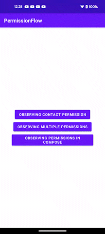

---
title: "PermissionFlow: A Reactive API for knowing the status of Android app permissions"
pubDatetime: 2023-05-22T05:19:08.251Z
description: "TODO: Add a description"
tags:
- android-app-development
- android-development
- android
- kotlin
- coroutines
coverImage: "../../assets/images/cover-permissionflow-a-reactive-api-for-knowing-the-status-of-android-app-permissions.jpeg"
---

Hey Android-ers 👋🏻, In big Android projects, it is common to divide the app into several modules. This can be done for a variety of reasons, such as to improve modularity, testability, or maintainability. However, when an app is divided into modules, it can be difficult to track the state of permissions across the app.

For example, let's say you have an app with a data module and a UI module. The data module needs to know the state of the contacts' permission in order to access the user's contacts. However, the UI module is responsible for requesting the contacts' permission from the user. This means that the data module needs to be notified when the contacts permission is granted or denied. One way to notify the data module of the state of the contacts' permission is to manually call a method in the data module when the permission state changes. However, this can be difficult to maintain.

To simplify this issue, **PermissionFlow** is here!

***

## What is PermissionFlow?

[PermissionFlow is an open-source library](https://github.com/PatilShreyas/permission-flow-android) which provides a reactive API for tracking the state of permissions across an Android app. This means that the data module (or any layer in the app) can subscribe to the state of **ANY permission** and be notified immediately when the permission state changes. PermissionFlow makes it easy to track the state of permissions across an Android app. This can help to improve the modularity, testability, and maintainability of your app.

Here are some additional benefits of using PermissionFlow:

*   **Reactive API:** PermissionFlow provides a reactive API that makes it easy to track the state of permissions. This means that you can subscribe to the state of permission and be notified immediately when the permission state changes.
*   **Easy to use:** PermissionFlow is an easy-to-use library that can be used in any Android project. It has a simple API that makes it easy to get started.
*   **Tracks permission grants from app settings:** It also tracks the permission changes in the app granted by users from the app settings.
*   **Safe:** PermissionFlow is a safe library that uses Kotlin Flow APIs to track the state of permissions. This means that you can be confident that your app will not leak memory or trouble the app's main thread when tracking permissions.
*   **Testable API:** Due to the simplicity of its API, it can be tested easily with mocks/fakes.
*   **Jetpack Compose support:** Yes, PermissionFlow also supports Jetpack Compose in which you can listen to the states of permission in compose UI.

***

## How to use it?

Let's see how you can use PermissionFlow in your Android projects.

### Add dependency

In `build.gradle` of app module, include this dependency:

```groovy
dependencies {
    implementation "dev.shreyaspatil.permission-flow:permission-flow-android:$version"

    // For using in Jetpack Compose
    implementation "dev.shreyaspatil.permission-flow:permission-flow-compose:$version"
}
```

### Requesting permission

It's necessary to use utilities provided by the **PermissionFlow** library to request permissions so that whenever the permission state changes, this library takes care of notifying respective flows.

#### Request permission from Activity / Fragment

Use `registerForPermissionFlowRequestsResult()` method to get `ActivityResultLauncher` and use `launch()` method to request permission.

```kotlin
class ContactsActivity : AppCompatActivity() {

    private val permissionLauncher = registerForPermissionFlowRequestsResult()

    private fun askContactsPermission() {
        permissionLauncher.launch(Manifest.permission.READ_CONTACTS)
    }
}
```

#### Request permission in Jetpack Compose

Use `rememberPermissionFlowRequestLauncher()` method to get `ManagedActivityResultLauncher` and use `launch()` method to request permission.

```kotlin
@Composable
fun Example() {
    val permissionLauncher = rememberPermissionFlowRequestLauncher()

    Button(onClick = { 
        permissionLauncher.launch(android.Manifest.permission.READ_CONTACTS) 
    }) {
        Text("Request Contact Permissions")
    }
}
```

Cool, that's all about asking for permission and it's exactly similar to how we regularly request permission in the Android app. Now let's see how can we add hooks to it to get updates.

***

### Observing a Permission State

A permission state can be subscribed by retrieving `StateFlow<PermissionState>` or `StateFlow<MultiplePermissionState>`.

*   If you want to observe **a single permission state**, use a method `PermissionFlow#getPermissionState`
*   If you want to observe multiple permissions' state, use a method `PermissionFlow#getMultiplePermissionState`

```kotlin
val permissionFlow = PermissionFlow.getInstance()

// Observe state of single permission
suspend fun observePermission() {
    permissionFlow.getPermissionState(android.Manifest.permission.READ_CONTACTS).collect { state ->
        if (state.isGranted) {
            // Do something
        }
    }
}

// Observe state of multiple permissions
suspend fun observeMultiplePermissions() {
    permissionFlow.getMultiplePermissionState(
        android.Manifest.permission.READ_CONTACTS,
        android.Manifest.permission.READ_SMS
    ).collect { state ->
        // All permission states
        val allPermissions = state.permissions

        // Check whether all permissions are granted
        val allGranted = state.allGranted

        // List of granted permissions
        val grantedPermissions = state.grantedPermissions

        // List of denied permissions
        val deniedPermissions = state.deniedPermissions
    }
}
```

Cool, that's simple, isn't it?

### Observing permission state in Jetpack Compose

The state of permission and state of multiple permissions can also be observed in the Jetpack Compose application as follows:

```kotlin
@Composable
fun ExampleSinglePermission() {
    val state by rememberPermissionState(Manifest.permission.CAMERA)
    if (state.isGranted) {
        // Render something
    } else {
        // Render something else
    }
}

@Composable
fun ExampleMultiplePermission() {
    val state by rememberMultiplePermissionState(
        Manifest.permission.CAMERA,
        Manifest.permission.ACCESS_FINE_LOCATION,
        Manifest.permission.READ_CONTACTS
    )

    if (state.allGranted) {
        // Render something
    }

    val grantedPermissions = state.grantedPermissions
    // Do something with `grantedPermissions`

    val deniedPermissions = state.deniedPermissions
    // Do something with `deniedPermissions`
}
```

***

That's all about using PermissionFlow 😍 and it'll simplify things about handling permissions in the Android app. **PermissionFlow** is not rocket science. It internally just adds hooks with permission request launchers and accordingly updates the state of permission. As you can see, the advantage of this is that we no longer need to manually ask any layer in the app to "DO CERTAIN THINGS" when permission is granted from the UI layer. The message will be automatically propagated via PermissionFlow APIs. This also ultimately simplifies dependency within multi-module apps.

If you want to check it out, see some [examples in the repository](https://github.com/PatilShreyas/permission-flow-android/blob/main/app/src/main/java/dev/shreyaspatil/permissionFlow/example/data/impl/AndroidDefaultContactRepository.kt) itself.

[](https://github.com/PatilShreyas/permission-flow-android/tree/main/app)

***

***"Sharing is Caring"***

Thank you! 😄

Let's catch up on [**X (formerly Twitter)**](https://twitter.com/imShreyasPatil) or [**visit my site**](https://shreyaspatil.dev/) to know more about me 😎.

***

## 📚 References

*   [**PermissionFlow - GitHub**](https://github.com/PatilShreyas/permission-flow-android)
*   [**PermissionFlow API Documentation**](https://patilshreyas.github.io/permission-flow-android/docs/permission-flow/dev.shreyaspatil.permissionFlow/-permission-flow/index.html)