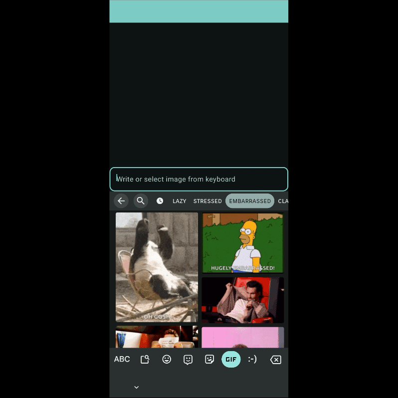

Hey Composers 👋🏻, if you're also a fan of Jetpack Compose and working on an application that needs to interact with rich media input then finally it's available. Especially, if you're working on a chat application and also using Jetpack Compose, then this is gonna solve a use case for you.

---

## Before

In the View system, the API for [_Receiving rich content_](https://developer.android.com/develop/ui/views/receive-rich-content) was already there. But there was no such straightforward API support for compose.

_Imagine we are building a chat app in which users can select GIFs or images from Keyboard and these media will be directly sent on chat._

Unfortunately, while using Compose components' `TextField` APIs, this was not supported, and if a user tried to insert a media, a toast was shown as below:


I tried to achieve this a lot with various approaches like wrapping `TextField` composable inside `ComposeView` or `AbstractComposeView` and trying to establish a connection between the text field and the keyboard with `onCreateInputConnection`, but no luck!

[The feature request](https://issuetracker.google.com/issues/198323023) was there on the issues-tracker for a long time but there was no workaround for this. The only thing that worked was **_wrapping View-based_** `EditText` **_inside_** `AndroidView` but it was not gonna help much.

---

## Now 🎉

Finally, after a long wait, In Jetpack Compose **1.7.x** there is an API that can support rich media content handling.

A new Modifier has been introduced for this: `Modifier.receiveContent()`. In this modifier, we can specify what kind of content we wish to handle (for _example: Image, plain text, HTML, or anything else_). A variety of content could be received from another app through Drag-and-Drop, Copy/Paste, or from the Software Keyboard.

Let's see how can we receive content from a keyboard (_for our chat app use case_).

### Code 🧑🏻‍💻

You might have used `BasicTextField` or `TextField`. A new foundation API has been introduced for the text field: `BasicTextField2`. This has been improvised and created to replace the existing `BasicTextField` and is _currently an experimental API to use._

> [!NOTE]
> [**Read about `BasicTextField2` in detail here**](https://proandroiddev.com/basictextfield2-a-textfield-of-dreams-1-2-0103fd7cc0ec) (by [Alejandra Stamato](https://medium.com/@astamato))

So instead of `Text` or `BasicTextField`, use `BasicTextField2` and use the modifier `receiveContent` along with it to get the rich content from keyboard input:

```diff
- BasicTextField(
+ BasicTextField2(
    value = value,
    onValueChange = { value = it },
    modifier = Modifier
        .fillMaxWidth()
+       .receiveContent(setOf(MediaType.Image)) { content ->
+           val selectedMediaUri = content.platformTransferableContent?.linkUri
+           null
+       }
  )
```

In modifier `receiveContent`, first, you need to specify what type of content you want to get. `MediaType` holds the MIME type. As needed, you can specify your MIME type. Second is lambda which gets invoked when content is selected (_in this case, content will be selected from the keyboard_). Lambda has a parameter `TransferableContent` that contain data, metadata, etc.

That's it! Once you handle the media retrieval through `Uri`, you're good to go 🎉.



How simple it was, wasn't it? 😀

You can explore `receiveContent` Modifier for other use cases like drag-and-drop, or from clipboard, or getting different types of files, etc.

You can refer to the following sample app project to try this out: [**PatilShreyas/ComposeKeyboardMediaInput**](https://github.com/PatilShreyas/ComposeKeyboardMediaInput)

---

## Final notes

As commented [here](https://issuetracker.google.com/issues/198323023#comment21), there are no plans from official teams to support this `BasicTextField` because it's going to be **_deprecated and replaced with_** `BasicTextField2`**_._** So if you need this to fulfill a use case, you anyway have to migrate to the new text field composable.

---

Awesome 🤩. I trust you've picked up some valuable insights from this. If you like this write-up, do share it 😉, because...

**_"Sharing is Caring"_**

Thank you! 😄

Let's catch up on [**X**](https://twitter.com/imShreyasPatil) or [**visit my site**](https://shreyaspatil.dev/) to know more about me 😎.

---

## 📚 References

- [**Android Review - Media support in BasicTextField2**](https://android-review.googlesource.com/c/platform/frameworks/support/+/2909937)
- [**PatilShreyas/ComposeKeyboardMediaInput**](https://github.com/PatilShreyas/ComposeKeyboardMediaInput)
