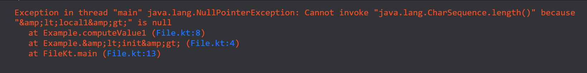
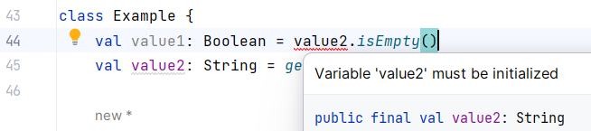

Hey Kotliners 👋🏻, This is a mini-blog about an issue I faced while working on some JVM-ish stuff with Kotlin. The issue was very stupid to reproduce but it highlighted the importance of a specific concept.

***

## The issue 🐛

We are writing a small snippet of [code](https://pl.kotl.in/YNdgCF-Ma) as below. Do you see any issue here? 👇🏻

```kotlin
fun getData() = "SomeData"

class Example {
    val value1: Boolean = computeValue1()
    val value2: String = getData()

    fun computeValue1(): Boolean {
        return value2.isEmpty()
    }
}

fun main() {
    Example()
}
```

Understanding the snippet:

*   There is a class `Example` having two fields.
*   Field `value1` gets initialized by `computeValue1()` which makes computation based on `value2`'s value.

Whenever this snippet is run, you'll see a runtime exception like this 👇🏻:



Strange! 🤯 no?

Even if fields are declared as **non-nullable** in Kotlin, if we are still getting `NullPointerException` then it's a serious issue if gets missed from a developer's eye or in the code review, isn't it?

***

## Reason 🤔

In the snippet, whenever the code is executed and `Example` is instantiated, first of all `value1` will be evaluated. But `value1` has an indirect dependency on the `value2` which is **not even initialized at that moment** causing `NullPointerException`.

If we remove the `computeValue1()` and directly replace the logic in the place of the initializer of `value1()` as in the [snippet](https://pl.kotl.in/BQJYxAyXO) 👇🏻:

```diff
 class Example {
-    val value1: Boolean = value2.isEmpty()
+    val value1: Boolean = value2.isEmpty()
     val value2: String = getData()

     // Method removed
 }
```

Here, in this case, we'll directly get a compile-time **error 🔴** in IDE saying "*Variable 'value2' must be initialized*" as below 👇🏻:



So it's safe in such cases ⬆️.

Also, if `value2` is declared and initialized before the `value1` then there's no issue. As seen in the [change](https://pl.kotl.in/eQbG7NCvT) below:

```diff
+ val value2: String = getData()
 val value1: Boolean = computeValue1()
- val value2: String = getData()
```

That's all!

***

## Conclusion 💡

As observed, Kotlin will generate a compile-time error if you attempt direct initialization, but it may **not catch** the issue when there is an indirect dependency through a method call. This situation **compromises Kotlin's guarantee of non-nullability for fields on the JVM**, potentially leading to runtime crashes that can significantly disrupt the implementation.

To fix such scenarios, always make sure to ***verify the order of declaration of fields to avoid indirect dependency on the uninitialized field***.

***

Awesome 🤩. I trust you've picked up some valuable insights into addressing inadvertent problems that can arise when working with Kotlin. These solutions can not only streamline your workflow but also alleviate potential confusion, ultimately saving you significant effort.

If you like this write-up, do share it 😉, because...

***"Sharing is Caring"***

Thank you! 😄

Let's catch up on [**X**](https://twitter.com/imShreyasPatil) or [**visit my site**](https://shreyaspatil.dev/) to know more about me 😎.

[**Follow my channel on WhatsApp**](https://www.whatsapp.com/channel/0029Va4DU4kLY6d03IhsCO11) to get the latest updates straight to your WhatsApp inbox.