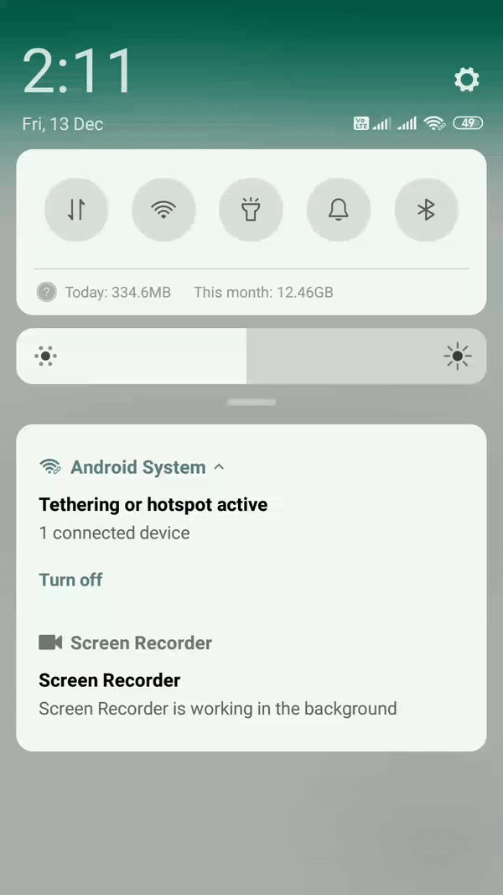

In this article, We will schedule On Device FCM (Firebase Cloud Messaging) Push Notifications *without using Cloud Pub/Sub or Cron jobs*.

Hello everyone, If you’re developing an app where you want to send scheduled Notifications to users then you can achieve in many ways. You can use **Google Cloud Pub/Sub** using Firebase Cloud Functions. Cloud Pub/Sub and Cron jobs are costly solutions. In this demo, we’ll schedule FCM Notifications by just sending normal *Push Notification* to subscribed channel and we’ll process/schedule it on the device.

***

## What will we do?

*   We’ll subscribe to FCM Topic.
*   We’ll send **Data** payload with scheduling information to the FCM topic.
*   Process received notification in a device, Schedule it using `AlarmManager`.
*   At the Scheduled time, create `WorkManager` for background processing and display notification on the system tray.

***

## What are the Advantages of using this technique? 😕

Imagine you have developed **XYZ** app which is related to **Online Shopping** and you always provides *exciting discount/offers* to users. It has **5000** active user installs. Imagine Following 2 Scenarios with respect to the above data:

### Scenario 1:
You have scheduled a ***50% discount offer*** notification to send on 12:00 am using Google Cloud Pub/Sub. This offer is going to expire in **5 minutes**. Out of **5000 users**, only **3000 users** are online at that time. Remaining 2000 users will receive notification after they’ll turn on data and till that time, the offer will be expired! 😔 Thus, you’ll lose **2000** users 😐.

### Scenario 2:
You have scheduled a ***50% discount offer*** notification to send on 12:00 am using the method we discussed earlier. Suppose we sent **Data** payload on 09:00 pm (i.e. Before 3 hours). In between that time period. All online users will receive payload on device and notification will be scheduled. Consider, out of **5000 users, 4500 users** were online between 9 pm to 12 am. Then all these 4500 users will receive a notification. Most exciting 🤩 will be… Though users are **offline on 12 am** still notification is displayed (because they already received notification earlier on device). Thus we’ll not lose many users. 😀

Thus from above both scenarios, the Second scenario seems efficient and useful for some use cases. Let’s implement it!

***

## 💻 Implementation

I have created a repository on GitHub. You can take reference of it: [**PatilShreyas/FCM-OnDeviceNotificationScheduler**](https://github.com/PatilShreyas/FCM-OnDeviceNotificationScheduler)

*   Set up Project on Firebase Console.
*   Download a `google-services.json` configuration file and paste it in **/app** directory of the project.
*   Add dependencies in `build.gradle` of *app* module:

```groovy
dependencies {
    implementation 'androidx.appcompat:appcompat:1.1.0'

    // Firebase
    implementation 'com.google.firebase:firebase-core:17.2.1'
    implementation 'com.google.firebase:firebase-iid:20.0.2'
    implementation 'com.google.firebase:firebase-messaging:20.1.0'

    // Work Manager
    implementation 'android.arch.work:work-runtime:1.0.1'
}
```

**Service** and **BroadcastReceiver** declarations in Manifest:

```xml
<service
    android:name=".fcm.MyFirebaseMessagingService"
    android:exported="false">
    <intent-filter>
        <action android:name="com.google.firebase.MESSAGING_EVENT" />
    </intent-filter>
</service>

<receiver android:name=".fcm.NotificationBroadcastReceiver" />
```

In **MainActivity.kt**, subscribe to FCM Notification Channel. Let’s say we’re subscribing to ***discount-offers*** FCM Channel:

```kotlin
FirebaseMessaging.getInstance().subscribeToTopic("discount-offers")
    .addOnCompleteListener { task ->
        showToast("Subscribed! You will get all discount offers notifications")
        if (!task.isSuccessful) {
            showToast("Failed! Try again.")
        }
    }
```

***

## Let’s Understand Format of Data Payload

We’ll send FCM **Data** payload as below:

```json
{
  "to": "/topics/discount-offers",
  "priority": "high",
  "data" : {
    "title" : "TITLE_HERE",
    "message" : "MESSAGE_HERE",
    "isScheduled" : "true",
    "scheduledTime" : "2019-12-13 09:41:00"
  }
}
```

When we send payload, if **isScheduled** is false then the notification is displayed instantly otherwise it’s displayed on **scheduledTime**. Format of scheduledTime: `YYYY-MM-DD HH:MM:SS`.

In **MyFirebaseMessagingService**, whenever Notification is received, `onMessageReceived()` is invoked. We have to do all the process of scheduling in this method. We have to parse data.

```kotlin
class MyFirebaseMessagingService : FirebaseMessagingService() {

    override fun onMessageReceived(remoteMessage: RemoteMessage) {
        // Check if message contains a data payload.
        remoteMessage.data.isNotEmpty().let {
            Log.d(TAG, "Message data payload: ${remoteMessage.data}")

            // Get Message details
            val title = remoteMessage.data["title"]
            val message = remoteMessage.data["message"]

            // Check that 'Automatic Date and Time' settings are turned ON.
            // If it's not turned on, Return
            if (!isTimeAutomatic(applicationContext)) {
                Log.d(TAG, "`Automatic Date and Time` is not enabled")
                return
            }

            // Check whether notification is scheduled or not
            val isScheduled = remoteMessage.data["isScheduled"]?.toBoolean()
            isScheduled?.let {
                if (it) {
                    // This is Scheduled Notification, Schedule it
                    val scheduledTime = remoteMessage.data["scheduledTime"]
                    scheduleAlarm(scheduledTime, title, message)
                } else {
                    // This is not scheduled notification, show it now
                    showNotification(title!!, message!!)
                }
            }
        }
    }
}
```

We’ll first parse data like *title, message, etc.* We’ll check if `Automatic Date and Time` is turned ON in system settings (otherwise notification can be displayed at the wrong time). Then check if `isScheduled` is true then schedule notification otherwise display the notification.

Let’s come to `scheduleAlarm()`:

```kotlin
private fun scheduleAlarm(
    scheduledTimeString: String?,
    title: String?,
    message: String?
) {
    val alarmMgr = applicationContext.getSystemService(Context.ALARM_SERVICE) as AlarmManager
    val alarmIntent =
        Intent(applicationContext, NotificationBroadcastReceiver::class.java).let { intent ->
            intent.putExtra(NOTIFICATION_TITLE, title)
            intent.putExtra(NOTIFICATION_MESSAGE, message)
            PendingIntent.getBroadcast(applicationContext, 0, intent, 0)
        }

    // Parse Schedule time
    val scheduledTime = SimpleDateFormat("yyyy-MM-dd HH:mm:ss", Locale.getDefault())
        .parse(scheduledTimeString!!)

    scheduledTime?.let {
        // With set(), it'll set non repeating one time alarm.
        alarmMgr.set(
            AlarmManager.RTC_WAKEUP,
            it.time,
            alarmIntent
        )
    }
}

private fun showNotification(title: String, message: String) {
    NotificationUtil(applicationContext).showNotification(title, message)
}
```

We’re using `AlarmManager` to set one-time (non-repeating) Alarm. We have parsed `scheduledTime` using **SimpleDateFormat** class to get its millisecond value.

Finally, we have scheduled alarm using **set()** method. It sets non-repeating one time alarm in the system and executes exactly on specified millies value. **RTC_WAKEUP** flag will trigger the alarm according to the time of the clock which will wake up the device when it goes off. At that time, `onReceive()` of **NotificationBroadcastReceiver** will be executed. Let’s see an implementation of it:

```kotlin
class NotificationBroadcastReceiver : BroadcastReceiver() {

    override fun onReceive(context: Context?, intent: Intent?) {
        intent?.let {
            val title = it.getStringExtra(NOTIFICATION_TITLE)
            val message = it.getStringExtra(NOTIFICATION_MESSAGE)

            // Create Notification Data
            val notificationData = Data.Builder()
                .putString(NOTIFICATION_TITLE, title)
                .putString(NOTIFICATION_MESSAGE, message)
                .build()

            // Init Worker
            val work = OneTimeWorkRequest.Builder(ScheduledWorker::class.java)
                .setInputData(notificationData)
                .build()

            // Start Worker
            WorkManager.getInstance().beginWith(work).enqueue()

            Log.d(javaClass.name, "WorkManager is Enqueued.")
        }
    }
}
```

In this, we’ll get data from the `Intent` and create **WorkManager** data. We’ll create **OneTimeWorkRequest** because this work should only be executed once. In the end, we’ll enqueue work and execution of Work will be started. Thus, `doWork()` method of `ScheduledWorker` is executed.

```kotlin
class ScheduledWorker(appContext: Context, workerParams: WorkerParameters) :
    Worker(appContext, workerParams) {

    override fun doWork(): Result {

        Log.d(TAG, "Work START")

        // Get Notification Data
        val title = inputData.getString(NOTIFICATION_TITLE)
        val message = inputData.getString(NOTIFICATION_MESSAGE)

        // Show Notification
        NotificationUtil(applicationContext).showNotification(title!!, message!!)

        // TODO Do your other Background Processing

        Log.d(TAG, "Work DONE")
        // Return result

        return Result.success()
    }

    companion object {
        private const val TAG = "ScheduledWorker"
        const val NOTIFICATION_TITLE = "notification_title"
        const val NOTIFICATION_MESSAGE = "notification_message"
    }
}
```

In that, we’ll get data (like title, message, etc) which we received from notification and finally, we’ll display it on the system tray. Other background tasks will also be processed here. If the process is successful, return using `Result.success()`. If you want to retry process simple return `Result.retry()` otherwise return `Result.failure()`.

Hurrah! 😍 we have successfully implemented and scheduled FCM Push Notification on Android device.

***

## What If Device is Rebooted? 😕

If a device is rebooted, Alarm will not work. For this, you’ll have to store all the information about FCM Notifications using **Room** database. After this, you’ll need to create a receiver (`ON_BOOT_COMPLETED`) which will be executed when Device is Rebooted. In that, all notifications in Room database should be scheduled again using `AlarmManager`.

***

## Let’s Test It 😃

I have sent below payload with to the FCM Channel (***discount-offers***):

```json
{
  "to": "/topics/discount-offers",
  "priority": "high",
  "data" : {
    "title" : "🎅 Christmas Offer 🎄",
    "message" : "Grab 90% Discount 😍 on Mobile Phones",
    "isScheduled" : "true",
    "scheduledTime" : "2019-12-13 14:12:00"
  }
}
```

**🚀** See output below and notice that **Internet/Wi-Fi** is **OFF** still at exactly 02:12 pm I’m getting a notification on the system tray 😃.



*At exact 02:12, Notification is displayed though Data is OFF.*

> **Yippie 😍!** It’s working as expected. Hope you liked that. If you find it helpful please share this article. Maybe it’ll help someone needy!

> Sharing is Caring!

***

## Support this repository:

[**PatilShreyas/FCM-OnDeviceNotificationScheduler**](https://github.com/PatilShreyas/FCM-OnDeviceNotificationScheduler)

**Thank you 😄!**