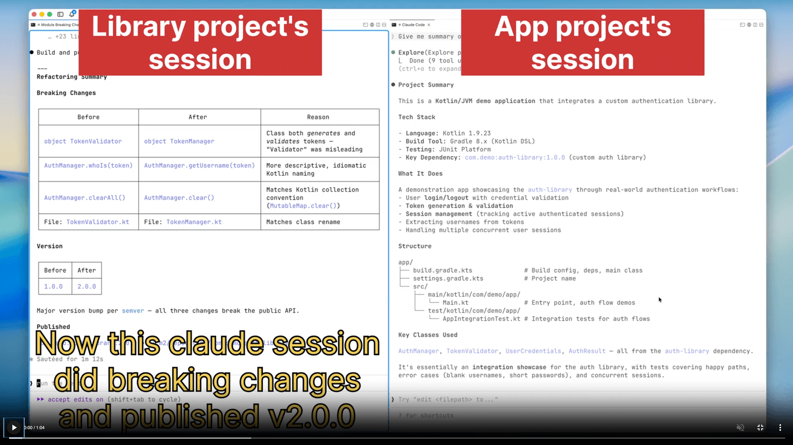

Hi everyone 👋

Every time I made breaking changes in a library, I had to manually explain them to the consumer app's Claude session. Copy-paste the diff. Re-explain what changed. Every single time. So I built a plugin to fix that.

Oh, and I built the plugin *with* Claude Code as well. The irony isn't lost on me 😄

This post is about that plugin, how I designed it, what broke, what I completely rethought, and what I finally shipped.

***##**The Situation 😮**

Here's what kept happening.

I have two separate Git repositories: `my-library` and `my-app`. They live in completely different directories on my machine. `my-app` depends on `my-library` as a published dependency — either from a remote package registry or a local Maven/npm/whatever repository.

These are separate repos for a reason. Different release cycles. Different teams. Different codebases. You can't just open a common root directory in Claude Code and get both into the same session. They're unrelated at the filesystem level. (Claude Code's `--add-dir` flag lets one session access multiple directories, but only when the code is on disk together — not when your library lives as a published package in a registry.)

So naturally I have **two Claude Code sessions** . One for each repo.

I'm in the library session, deep into making breaking API changes. Renamed functions, changed type signatures, removed deprecated stuff. My agent knows *everything* about what I did and why. It has the full conversation, the full diff, the full context.

Now I need to update the consumer app to use the new library version.

New terminal. New Claude session for `my-app`.

Zero context.

I'm copy-pasting diffs. Explaining what changed. Why the build broke. What to update. Manually.

Every. Single. Time.

The library agent and the consumer agent existed in complete isolation. They had no way to talk.

I thought: why not give them a way to talk?

***##**The Idea 💡**I decided to build a Claude Code plugin for this. I called it **session-bridge** . Here's what I had in mind.

In the library session:

```plaintext
> /bridge listen
Session ID: a1b2c3
Listening for peer messages...
```

In the consumer session:

```plaintext
> /bridge connect a1b2c3
> /bridge ask "What breaking changes did you make?"
Response from my-library:
3 changes in v2.0:
1. login() -> authenticate() (takes Config object now)
2. getUser() -> getCurrentUser() (returns UserProfile)
3. Removed refreshToken() (automatic now)
```

The library agent responding with full context, because it's the *same agent* that made the changes. No copy-pasting. No explaining. Just agents talking.

***##**First Design Decisions 🧠**Before writing any code, I spent time on the architecture. A few decisions shaped everything. **Transport: Files. **Each session gets a directory at `~/.claude/session-bridge/sessions/<id>/` with `inbox/` and `outbox/` folders. Messages are JSON files. I considered MCP (Model Context Protocol, Claude Code's native plugin API for external tools) and local HTTP. Both are more elegant architecturally. But files have one big advantage: they're debuggable. You can literally `cat` a message to see what happened. No logs needed. No server to start. Files it is. **Message format. **Each message is a JSON file with `id`, `from`, `to`, `type`, `status`, and `content`. The `status` field is the most important part. Messages start as `pending`. The moment a session picks one up, it atomically rewrites the file with `status: "read"`. This prevents the same message from being processed twice, no matter how many things are polling the inbox simultaneously. **Session IDs.** When a session starts a bridge, it generates a 6-char ID like `a1b2c3`. You copy that to the other terminal. Simple, but it works.

The core is 9 bash scripts and a `jq` dependency. No Node.js, no Python, no runtime. I wrote tests first — 124 test cases across 10 test files — and the tests caught so many edge cases before I ever ran the plugin manually.

***##**The Hook System Did Not Cooperate 😤**

My original plan was to use Claude Code's `UserPromptSubmit` hook to auto-check the inbox before every agent response. The hook fires before the agent processes each user message. I could inject inbox messages as context automatically.

First I tried a command hook — a shell script that runs on every prompt. But the working directory when hooks execute isn't the project root, so the script couldn't find the bridge session file. After hours of debugging I rewrote the inbox scanner to not depend on working directory at all.

Then I switched to a prompt-type hook, one that tells Claude what to do rather than running a script directly. My prompt said something like: * "Before responding, check if bridge-session exists, then run check-inbox.sh" * .

Claude's reply:

> * "This is a hook evaluation context without shell access to the user's system." *

Right. 🙃

Hooks were basically not going to work for what I needed. I ended up putting the inbox-check logic in the **bridge-awareness skill **, a piece of context that loads alongside the session and tells the agent how to behave with the bridge. Reliable enough, but not as automatic as I wanted.***##**The Background Watcher Detour 🤖**

At this point, the plugin worked if the user typed commands explicitly. But I wanted automatic responses even when the user wasn't actively typing in the library session.

So I built `bridge-watcher.sh`. A background bash process that polls the inbox every 5 seconds. When a query arrives, it calls `claude -p` (Claude Code's non-interactive mode) to generate a response. It gathered context from git diffs, recent commits, CLAUDE.md, and even read Claude Code's internal session JSONL files to approximate the conversation history.

This worked. But it had problems:

*Every query triggered a `claude -p` call. That costs real money on your Anthropic account. *The responses were generated from *approximated* context. I was sampling the agent's session history from outside and feeding it to a separate Claude process. Close, but not the real thing.

* The watcher was a whole separate process to manage: PID files, orphan detection, cleanup on crash.


The more I looked at it, the more it felt like I was solving the wrong problem. But it took one more bug to make that obvious.

***##**The Bug That Ate Sessions 🐛**

While the watcher was still in the picture, I hit a nasty bug: sessions were disappearing.

When you close Claude Code, it fires a `SessionEnd` hook which runs `cleanup.sh`. My cleanup script deletes the session directory. Fine.

But here's the problem: if you restart Claude quickly, the new session re-registers *before* the old session's cleanup hook finishes. Then the old cleanup runs and deletes the brand new session. Peers try to connect and get "session not found."

The fix: `cleanup.sh` now checks the session's `lastHeartbeat` before deleting. If the session was updated recently, it means another Claude instance just claimed it. So cleanup exits silently and leaves it alone.

This was fixable. But every fix revealed another crack. I was maintaining an architecture I didn't believe in.

***##**The Insight That Changed the Architecture 🤯**I was looking at the watcher code and feeling like something was fundamentally wrong. It was calling `claude -p` for every incoming query. That costs money. And it was generating responses from a *sampled approximation* of the session context, not the real thing.

Then someone asked a simple question: * "Why don't we just have the session answer directly?" *

I stopped. Thought about it.

The library agent has **complete context** . It was there for every change. Every decision. Every reason why `auth.login()` became `auth.authenticate()`. Why am I sampling its conversation history and feeding it to a separate Claude process to approximate that knowledge?

What if the agent just... entered a listening loop?

```plaintext
> /bridge listen
Session ID: a1b2c3
Listening for peer messages... (Ctrl+C to stop)
```

The agent runs `bridge-listen.sh`, which polls the inbox every 3 seconds. A message arrives. The agent reads it, formulates a response from its actual live context, and replies. Then it calls `bridge-listen.sh` again. Continuously. Until you press Ctrl+C.

This is it. This is what the plugin should have been from day one. The watcher was trying to approximate the agent's context from outside when the agent itself was already right there.

`bridge-watcher.sh` got deleted. The plugin shrank by ~300 lines. API costs for auto-responses dropped to zero. Context quality went from "pretty good" to "perfect."

***##**Agents Can Ask Each Other Questions Too 💬**

While testing, I realised the agents sometimes need to ask each other clarifying questions before they can answer. Here's what that looked like:

> **Consumer:*** "How should I handle the new error types?" *
>
> **Library:*** "What error types are you currently catching? Send me your error handler." ***Consumer:***(reads its own code, sends the relevant snippet)*
>
> **Library:*** "Replace AuthError with AuthException. Here's the updated hierarchy..." *This could deadlock. The consumer is blocked waiting for a response. The library wants to send a question back instead, but the consumer is waiting for an *answer* .

The solution: the library sends its question *as a response* , with `inReplyTo` pointing to the original message ID. The consumer finds it (it's a match on `inReplyTo`), reads the question, sends a new query with the answer, and waits again. The library's listen loop picks that up and gives the final answer.

No deadlock. One extra round trip. The conversation flows naturally.

***##**What It Looks Like Today 🎯**

Two terminals. Two projects. One bridge.

```plaintext
# Terminal 1 — Library (the session that has the answers)
> /bridge listen
Bridge auto-started! Session ID: a1b2c3
Listening for peer messages... (Ctrl+C to stop)
```

```plaintext
# Terminal 2 — Consumer (the session that needs answers)
> /bridge connect a1b2c3
Connected to 'my-library'
> /bridge ask "What changed in v2?"
Response from my-library:
3 breaking changes:
1. login() -> authenticate() (takes Config object)
2. getUser() -> getCurrentUser() (returns UserProfile)
3. Removed refreshToken() (automatic now)
```

That's the explicit way. But you don't even need to think about commands.

Just tell your agent what you want:

```plaintext
> Update our app to use the new version of my-library. Fix any breaking changes.
```

The agent detects it's a version bump, queries the library peer, gets the migration info, and applies the changes itself. You never type `/bridge ask`. You never copy-paste anything.

```plaintext
Agent: Asking my-library about breaking changes in v2...
Response from my-library:
login() → authenticate() (takes Config object)
getUser() → getCurrentUser() (returns UserProfile)
refreshToken() removed (automatic now)
Applying changes:
- Updated AuthService.kt: login() → authenticate()
- Updated UserRepository.kt: getUser() → getCurrentUser()
- Removed manual token refresh in SessionManager.kt
Build passing. Done.
```

I was honestly surprised when this worked the first time. I typed a plain English instruction, watched both sessions exchange messages I didn't initiate, and got back a passing build. Took maybe 30 seconds. The 45 minutes I used to spend copy-pasting context just... disappeared.

This is the real goal. Not new commands to learn. Just two agents coordinating on your behalf while you describe the outcome you want.

***

## How it's helping me at least?

At work, we manage numerous repositories, and I've been using git worktrees frequently in Claude. I prefer to keep worktrees close to the project directories, so I avoid opening a single Claude session in the parent directory, as it would create too much context. Instead, I make significant changes in one repository, and when I need to modify another, I simply ask it to connect via bridge, sharing the session's working context. The sessions then communicate and resolve issues without manual context sharing—it's all automated. The interesting part? Recently, while integrating work, my agent discovered a bug in the library. It immediately sent the details via bridge, and the library module quickly fixed the bug, published the update, and asked the consumer module to test it. Everything happened synchronously through their communication. I was thrilled to see this in action 😄.

See it in the action

[](https://github.com/PatilShreyas/claude-code-session-bridge)

***##**What's Missing (Being Honest) 🤔** **Single machine only. **Everything runs through the local filesystem. Two developers on different machines? Not supported. You'd need a relay server, which defeats the simplicity goal. **Context is only what the agent knows. **The library agent responds from its own active conversation context. If the session was just started fresh and the agent hasn't worked on the library yet in this session, the responses will be shallow. The agent's context doesn't persist across sessions. **Response latency is ~5-10 seconds end-to-end**(3-second poll interval plus the agent's response time). That's fine for this use case — cross-project coordination isn't real-time chat. But it's worth knowing.***##**Why This Matters 🌍**

Claude Code sessions are isolated by design. That isolation is usually good. Each session focuses deeply on one project.

But we work in multi-repo, multi-service worlds. The library that breaks the consumer. The backend that changes the contract. The shared module that everything imports. In those situations, isolation gets in the way.

The agents we use are smart enough to coordinate. They just need a mechanism to do it. session-bridge is that mechanism: a file-based mailbox, a handful of bash scripts, and a skill that teaches agents the protocol.

Could the MCP version be cleaner? Yes. Would native Agent Teams integration be even better? Absolutely. But this v1 works today, with no dependencies beyond `jq`, on any machine running Claude Code.

Sometimes the simplest thing that could possibly work... is the right thing. ✌️

** **The plugin is open source at*[*github.com/PatilShreyas/claude-code-session-bridge*](https://github.com/PatilShreyas/claude-code-session-bridge)*. Try it, break it, tell me what's missing. And if you found this useful, share it, it really helps*🙏** "Sharing is caring" 🤝🏻**Let's catch up on [**X**](https://twitter.com/imShreyasPatil) or [**visit my site**](https://shreyaspatil.dev/) to know more about me 😎.** **Fun fact: This blog was drafted by Claude Code, in the same session where I built the plugin😉*