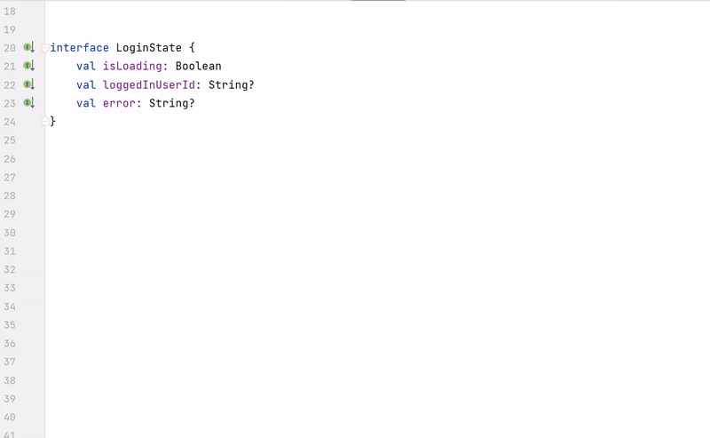

Hey Kotliners 🙋🏻‍♂️! When working on front-end applications, it's common to look for ways to simplify state management in your front-end applications. Right? Managing and mutating state models in Kotlin can be a challenging task, especially as your codebase grows and new states are introduced. Fortunately, Mutekt is a multiplatform utility that can help you simplify this process by allowing you to write simpler immutable update logic using "mutating" syntax. In this article, we'll take a closer look at Mutekt and how it can help streamline your state management in Kotlin.

In this blog, we'll learn how *Mutekt (Pronunciation:**/mjuːˈteɪt/**)* can help us simplify state management in Kotlin😊.

Before jumping directly into Mutekt, let's understand how we solve it currently.

## 💡Existing ways of solving state management

Let's understand the current approaches to holding and mutating state models in Kotlin. **There are three widely known approaches as follows:**

### 1\. Computing the next state by copying the previous state

In this approach, a `data class` is created for modelling a state. *For example, assume the following UI state model for the login screen.*

```kotlin
data class LoginState(
val isLoading: Boolean,
val loggedInUserId: String?,
val error: String?
)
```

Then in ViewModel, A mutable `StateFlow` is created with the initial state. Whenever a state needs to be mutated, previous the state is used to calculate the next state i.e. it just copies the previous state by modifying the required next state update. For example, this is how ViewModel implementation would look like 🔽.

```kotlin
class LoginViewModel: ViewModel() {
// Mutable reactive stream
private val _state = MutableStateFlow(LoginState(...))

// Read-only reactive state stream
val state = _state.asStateFlow()

fun login() {
_state.update { it.copy(isLoading = true) }

try {
val userId = performLogin(username, password)
_state.update {
it.copy(isLoading = false, loggedInUserId = userId)
}
} catch (e: Throwable) {
_state.update {
it.copy(
isLoading = false,
error = "Error Occurred"
)
}
}
}
}
```

In such code, `_state` is a **private **and **mutable **StateFlow that can be mutated in ViewModel. So whenever the state needs to be updated, `_state` should be updated with the method `update {}` that gives the existing state model in the lambda parameter allowing us to copy and modify state using `.copy()` method. **There are some disadvantages to this approach if the following things are not handled with care by developers:***The new state should be updated atomically and with synchronization otherwise, state inconsistency will occur (*i.e.*`update{}` method of StateFlow). If the `update{}` method is not used and if the state is modified directly (*as follows* ), the state would lose.

```kotlin
_state.value = _state.value.copy(...) // ❌
```

*By development mistake, while updating a new state if the previous state is not copied (*by*`it.copy()`) the previous state will be lost. *For example, directly assigning a new model is as follows.* In the following snippet, if previously `loggedInUserId` or `error` is set, then it would be lost!

```kotlin
_state.value = LoginState(isLoading = true) // ❌
```


---

### 2\. Combining multiple states to form a new one

Assuming we have a same-state model `data class` as seen in the previous approach, In this approach, multiple ***mutable***StateFlows are created and***they're combined to form a readable final state stream***. *For example, see this implementation:*

```kotlin
class LoginViewModel: ViewModel() {
// Individual mutable state streams
private val isLoading = MutableStateFlow(false)
private val loggedInUserId = MutableStateFlow<Int?>(null)
private val error = MutableStateFlow<String?>(null)

// Read-only state stream
val state: StateFlow<NotesState> =
combine(isLoading, userId, error) { isLoading, userId, error ->
LoginState(isLoading, notes, error)
}.stateIn(
viewModelScope,
WhileSubscribed(5000),
LoginState(false, null, null)
)

fun login() {
isLoading.value = true

try {
val userId = performLogin()
loggedInUserId.value = userId
} catch (e: Throwable) {
error.value = "Error occurred"
}

isLoading.value = false
}
}
```

This approach is better than the previously discussed approach, but a lot of boilerplate is needed for setting up states. Also, as the application is maintained in the future and new states are introduced in the application, for `N` states, `N` mutable streams need to be created, same needs to be fed to `combine()` function, and inside it, need to instantiate that *state model. *Also, in `stateIn()` the method, you again need to provide the initial value of a `LoginState` (*to make it a StateFlow).*

In my opinion, as code progresses and new states are required, it can become burdensome. This is because every time a new state is introduced, refactoring will be needed to fit it into the architecture.

---

### 3\. Exposing individual states without model

In this approach, individual read-only streams are exposed ( *without having a single state model*) and let UI consume it as per its need. *See example:*

```kotlin
class LoginViewModel: ViewModel() {
private val _isLoading = MutableStateFlow<Boolean>(false)
val isLoading: StateFlow<Boolean> = _isLoading.asStateFlow()

private val _loggedInUserId = MutableStateFlow<Int?>(null)
val loggedInUserId: StateFlow<Int?> = _loggedInUserId.asStateFlow()

private val _error = MutableStateFlow<String?>(null)
val error: StateFlow<String?> = _error.asStateFlow()

fun login() {
// ...
}
}
```

As we can see, for `N` states, we need to create `N x 2` fields i.e. **one mutable stream **and **one transformed immutable stream **from *the corresponding mutable stream* . There's no harm in doing this, but again as the number of new states is introduced in the future, it becomes scattered. So managing this, in the long run, can be overhead.

---

We've taken a look at all the current approaches being used and considered their disadvantages and overheads. But don't worry, ***Mutekt*** is here to solve these issues and make things easier for you! 😃

## 🔮What is *Mutekt* ?

Mutekt is a Kotlin-multiplatform utility that ***simplifies mutating "immutable" state models***😁 which is based on KSP (Kotlin Symbol Processing). This is inspired by the concept *Redux *and [*Immer *from JS](https://immerjs.github.io/immer/) world that let you write simpler immutable update logic using "mutating" syntax which helps simplify most reducer implementations. **So you just need to focus on actual development and *Mutekt *will write a boilerplate for you!** 😎.

### 🪄How to use its magic?

Let's leverage the magic of Mutekt

#### Add dependency

Just add a dependency on Mutekt and its code generator.

```kotlin
plugins {
id 'com.google.devtools.ksp' version '1.8.10-1.0.9'
}

...

dependencies {
implementation("dev.shreyaspatil.mutekt:mutekt-core:1.0.0")
ksp("dev.shreyaspatil.mutekt:mutekt-codegen:1.0.0")
}
```

#### Declare a state model

Once you define a state model, Mutekt does rest for you and lets you just focus on development and let it solve state management for you! You can declare a model as follows and just annotate it with `@GenerateMutableModel`.

```kotlin
@GenerateMutableModel
interface LoginState {
val isLoading: Boolean
val loggedInUserId: String?
val error: String?
}
```

After this, just build🔨 the project and Mutekt will generate the rest of the boilerplate for you.

> The mutable model can be created with the factory function which is generated with the name of an interface with the prefix `Mutable___`. *For example, if the interface name is* `LoginState` then the method name for creating mutable model will be `MutableLoginState()` and will have parameters in it which are declared as public properties in the interface.

#### Use it and mutate whatever you want to mutate!

So we can just use it like

```kotlin
/ ***Instance of mutable model [MutableLoginState]* that is generated by Mutekt.
* /
private val _state: MutableLoginState = MutableLoginState(
isLoading = true,
notes = emptyList(),
error = null
)
```

By this, you'll directly get instances on which you can **directly mutate **the state. Also, there's a method `asStateFlow()` that then returns a***read-only state stream*** so that it can be exposed. See this ⬇️

```kotlin
// Read-only state stream
val state: StateFlow<LoginState> = _state.asStateFlow()

fun login() {
_state.isLoading = true // You can directly mutate it 😀

try {
val userId = performLogin()
_state.update { // Mutate it atomically 😀
isLoading = false
loggedInUserId = userId
}
} catch (e: Throwable) {
_state.update {
isLoading = false
error = "Error Occurred
}
}
}
```

Voila! 😁 This is so simple! So in the future, whenever new states are added, just add them in that **interface **and just build the project. The required boilerplate will be taken care of by***Mutekt*** for you 😎. As simple as this ⬇️.



COOL! You can explore more about the usages of [ **Mutekt**](https://github.com/PatilShreyas/mutekt) in the Multiplatform project and can also refer to [***this Pull Request***](https://github.com/PatilShreyas/NotyKT/pull/633) which demonstrates how to migrate to the Mutekt from existing state management solutions 😁. *Mutekt *is not rocket science. It generates a similar boilerplate that we discussed in the second approach earlier. But it saves your time so you just define your model and let***Mutekt***do that boilerplate generation work for you which is repetitive and allows you to maintain your codebase easily. You can [learn here about exactly what code is generated by***Mutekt*** ](https://github.com/PatilShreyas/mutekt/wiki/Generated-Code-with-Mutekt).

---

I hope that you will find this blog extremely helpful! 😀

*** "Sharing is Caring" ***

Thank you! 😄

Let's catch up on [ **Twitter**](https://twitter.com/imShreyasPatil) or [**visit my site** ](https://shreyaspatil.dev/) to know more about me 😎.

---

### 🐤Related posts

[https://twitter.com/imShreyasPatil/status/1639252336395829248](https://twitter.com/imShreyasPatil/status/1639252336395829248)

---

# 📚References

[https://github.com/PatilShreyas/mutekt](https://github.com/PatilShreyas/mutekt)

[https://github.com/PatilShreyas/NotyKT/pull/633](https://github.com/PatilShreyas/NotyKT/pull/633)