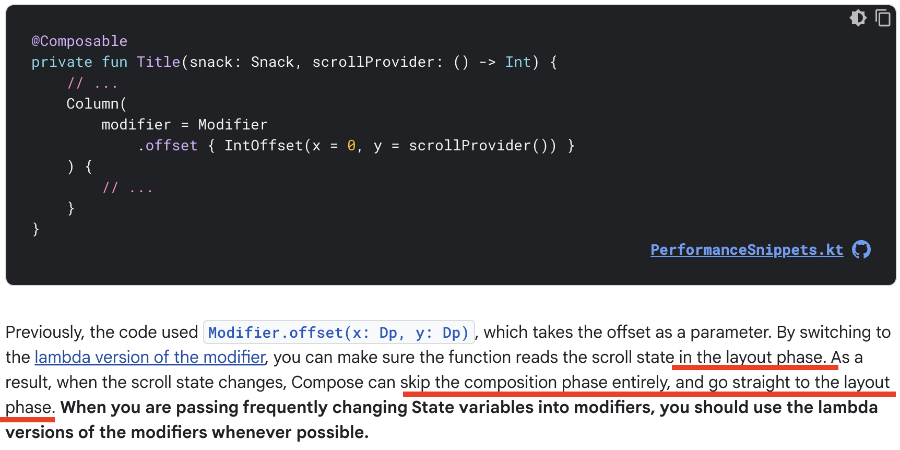
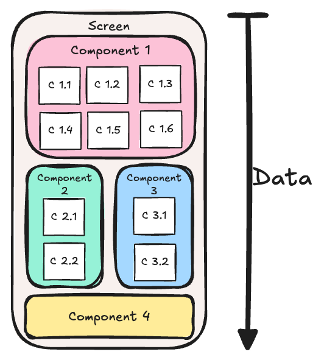
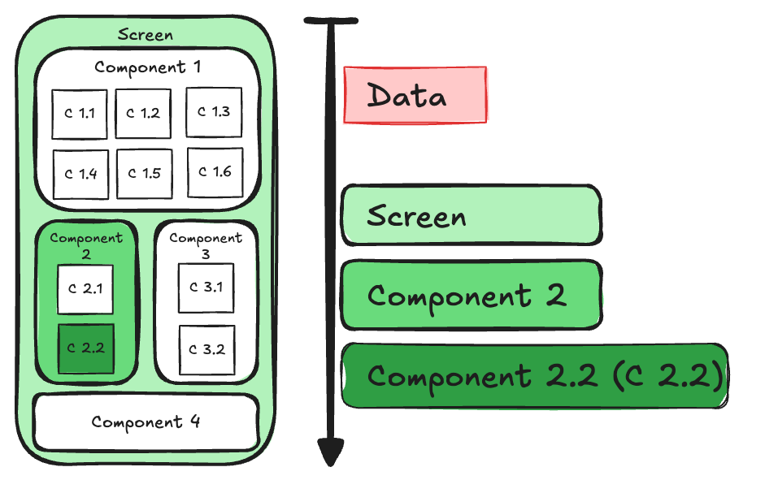
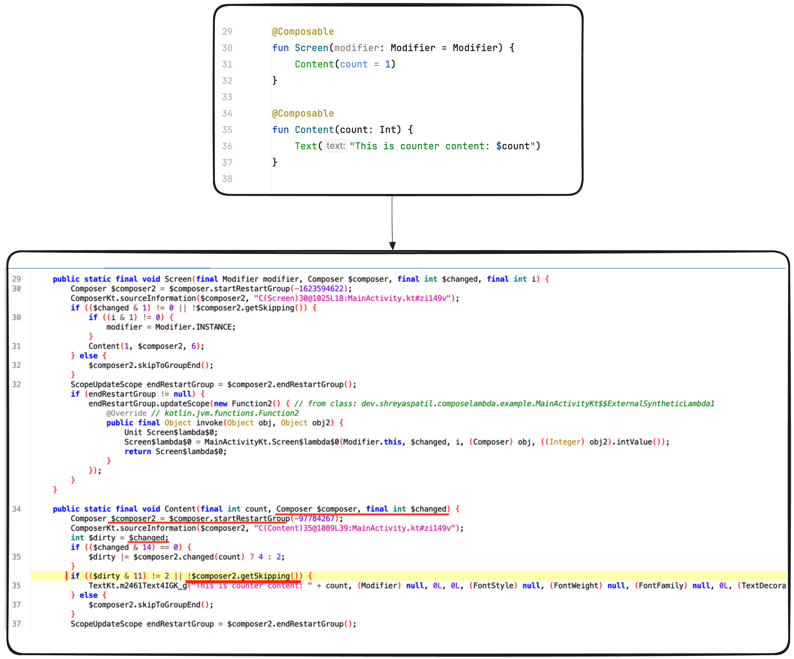
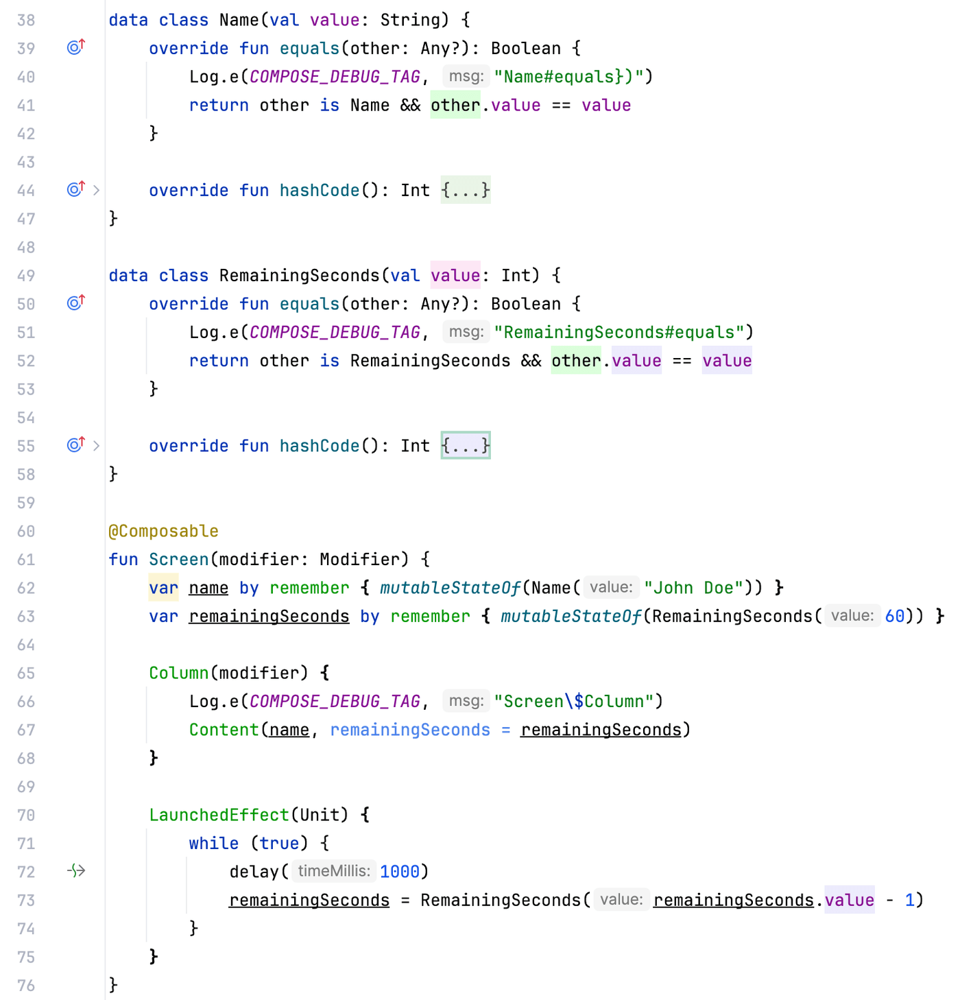
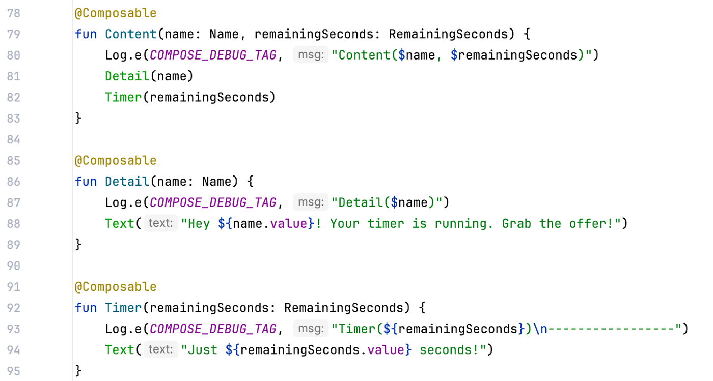
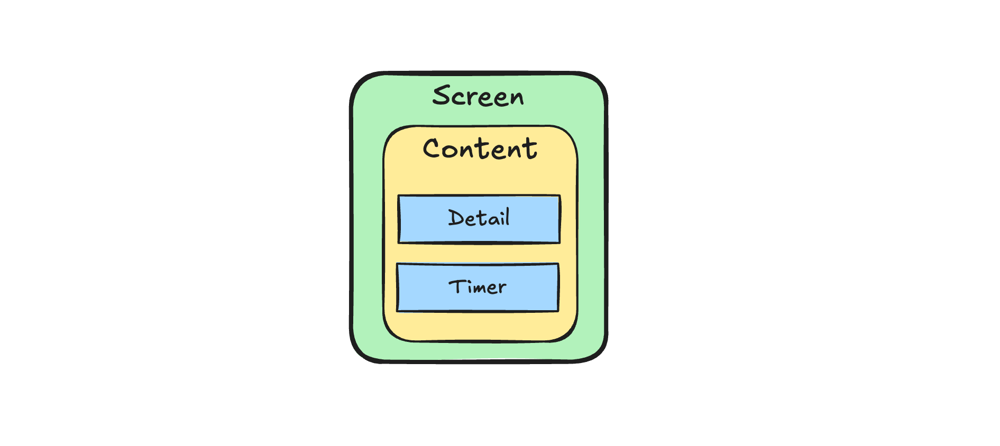
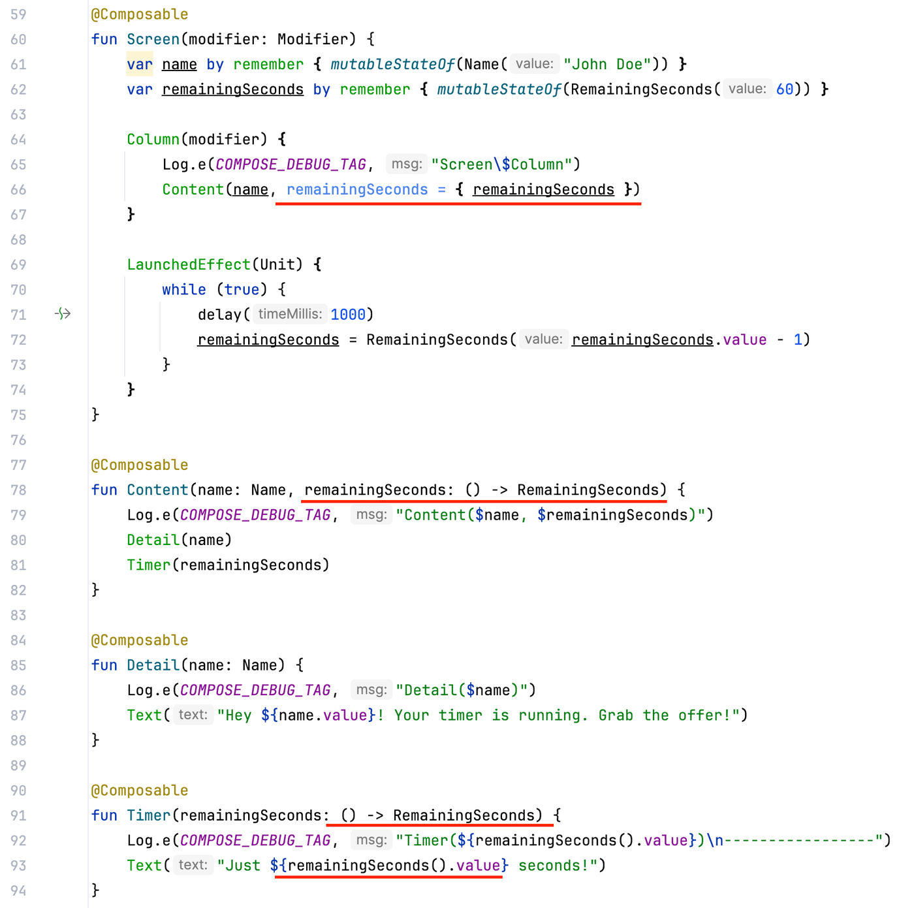

Hey Composers 👋🏻, Jetpack Compose is now standard in Android app development, making performance optimization with Jetpack Compose an important topic. This is a short blog about recomposition optimization, where I'll walk you through the concept of using lambdas in the composition scope and how they can be helpful in these situations. Let’s start 😉.

## Revising the officially recommended best practice

One of the best practices recommended officially is to [defer the reads as long as possible](https://developer.android.com/develop/ui/compose/performance/bestpractices#defer-reads) and everyone might be familiar with this code snippet:



It explains that using `offset()` directly updates the value in the composition, causing recompositions whenever the value changes. However, if we use `offset {}`, a lambda-based modifier, it skips the composition phase entirely and goes directly to the layout phase. This improves overall performance because there is no recomposition.

Now this was about the modifier that changes the layout, but this knowledge can be applied to the composition as well.

---

## Come to the point…

When we design a screen in Compose, it consists of components and sub-components. According to best practices, the **_screen is a stateful composable_**, and all components and sub-components within the screen should receive their state from the screen, making them **_stateless composables_**. Therefore, it is the screen's responsibility (actually taken from the ViewModel) to supply the data needed for the components.



In the **_real applications_**, this is actually very big. Sometimes, it’s more than 15-20 state parameters for a single screen in the real app. When any of the sub-component’s state gets changed, it flows from screen to the components in the journey.

Now let’s say **from the above figure**, **_if Component 2.2’s (C 2.2) state gets updated, then how compositions will occur_**? So, it’ll be as follows:



In this case, **Screen** and **Component 2** won't be recomposed (unless they're unstable). Recomposition means their UI logic won't run, but some parts will still execute. Before recomposition, it checks if it can be skipped. To do this, part of the function runs. If it can be skipped, the UI logic won't run; otherwise, it will. _Understand this with this simple example: \*\*See how the composable code looks like after the compilation (i.e. after reverse engineering)_



Notice the yellow highlighted line that checks whether the composition can be skipped. Only then is `Text()` called; otherwise, it is not. However, this means some lightweight operations will still occur in the `Content()` composable even if the composition is skipped. This skipping is decided based on the equality of previous and next state i.e. `equals()` method of the state parameter types. Now let’s see this actual code which we’ll try to improve:

So have a look on the snippet:



In this example, we first create a UI model to represent the state of the UI `Name` and `RemainingSeconds`. Although it's a data class, I've intentionally implemented the `equals()` method and added logs there. `Screen` composable is a stateful composable that decreases remaining seconds value every 100ms. Also, do notice that we have added logging statements to each block ⬆️.

Now, this is how our other composable looks:



Overall, this is how our structure looks:



Now, we can run this. What do you think logs will be? 🧐. So logs will be like these:

```diff
Content(Name(value=John Doe), RemainingSeconds(value=60))
Detail(Name(value=John Doe))
Timer(RemainingSeconds(value=60))
-----------------
RemainingSeconds#equals
! Screen$Column
! Name#equals})
RemainingSeconds#equals
! Content(Name(value=John Doe), RemainingSeconds(value=59))
Timer(RemainingSeconds(value=59))
-----------------
RemainingSeconds#equals
! Screen$Column
! Name#equals})
RemainingSeconds#equals
! Content(Name(value=John Doe), RemainingSeconds(value=58))
Timer(RemainingSeconds(value=58))
-----------------
RemainingSeconds#equals
! Screen$Column
! Name#equals})
RemainingSeconds#equals
! Content(Name(value=John Doe), RemainingSeconds(value=57))
Timer(RemainingSeconds(value=57))
-----------------
```

Now you can see that in our simple application, we are just updating `remainingSeconds` every 1000ms but still every time `Screen$Column`, `Content()` block is called (_obviously we knew that_) then equality of both `Name` and `RemainingSeconds` is checked and by compose compiler magic only `Timer` is recomposed and `Detail` is not recomposed (i.e. skipped).

If we get this `remainingSeconds` value via lambda, can it change this behaviour? Let’s try. So quickly making changes in the code:



And run the app now and see the results ⬇️.

```plaintext
Screen$Column
Content(Name(value=John Doe), dev.shreyaspatil.composelambda.example.MainActivityKt$$ExternalSyntheticLambda2@233875c)
Detail(Name(value=John Doe))
Timer(60)
-----------------
RemainingSeconds#equals
Timer(59)
-----------------
RemainingSeconds#equals
Timer(58)
-----------------
RemainingSeconds#equals
Timer(57)
-----------------
```

This time, we are just seeing the equality check for `RemainingSeconds` and recomposition of `Timer` composable and this way little execution of `Screen$Column` and `Detail` composable functions is also skipped 🎉.

<div class="post-callout">
  <span class="emoji">😁</span>
  <div class="content">So we've just skipped the intermediate composables otherwise they would have to see if they can skip by running their skippability checks, just so they can skip recomposing 😂.</div>
</div>

I believe we are not making any major improvements here, but we are saving a small amount of code execution time. This optimization can be particularly useful for screens where a deeply nested component is updated frequently, such as for animation states or similar scenarios. In such cases, it can reduce the number of equality checks and the number of times composable functions are invoked.

**Some examples could be:**

**Example 1:** When a component is updated often, like a timer or a frequently changing list of data, based on the state produced by the ViewModel.

**Example 2:** When a component is performing animations on the UI, and its state comes from the screen or ViewModel.

Additionally, this approach can be beneficial when intermediate composables are not marked as stable by the Compose compiler, allowing them to be skipped. Ultimately, decisions like these should be made based on the specific needs of the use case, as the Compose compiler already does an excellent job of skipping unnecessary recompositions. By carefully considering when to apply these optimizations, developers can ensure their applications run efficiently without unnecessary overhead.

---

Awesome 🤩. I trust you've picked up some valuable insights from this. If you like this write-up, do share it 😉, because...

**_"Sharing is Caring"_**

Thank you! 😄

Let's catch up on [**X**](https://twitter.com/imShreyasPatil) or [**visit my site**](https://shreyaspatil.dev/) to know more about me 😎.
