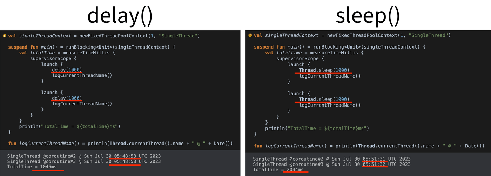
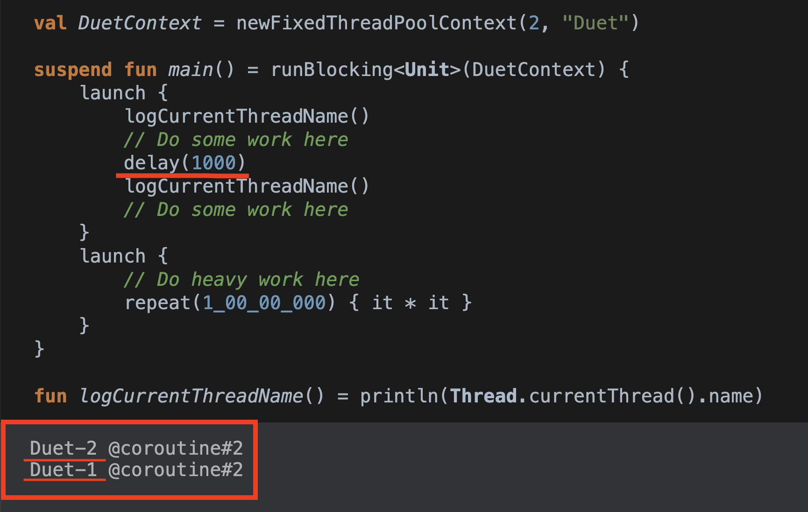
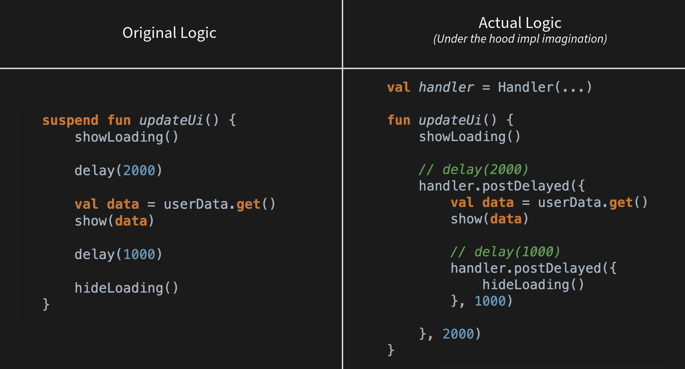

Hey Kotliners 👋🏻, there's no doubt that Kotlin coroutines have made developer's life easy for asynchronous programming. Coroutine comes with feature-packed powerful APIs by which developers don't need extra effort for achieving something. Just need to know which API to use where and that's all! When it comes to JVM, coroutines literally have improved the way of writing asynchronous code by reducing _callback hells_. But how exactly the coroutine achieves it under the hood is always an interesting thing. So here we are to know how delay API works inside the coroutines (inside JVM) 😁.

## What is a `delay()` ?

Everyone who has used coroutines might have used `delay()` method already. This is what official docs say about `delay()`:

> _"Delays coroutine for a given time without blocking a thread and resumes it after a specified time."_
>
> _Example:_ Perform Task-2 two seconds after performing Task-1

```kotlin
scope.launch {
    doTask1()
    delay(2000)
    doTask2()
}
```

But here are things to note about `delay()`:

- It does not block the thread that it's running on. Allows other coroutines to run (on the same thread).
- When the delay has expired, the coroutine will be resumed and will continue executing.

Interesting! 🧐

Many developers compare `delay()` with `Thread.sleep()` method of Java. But actually, there's no comparison at all since they both exist for different use cases. They might look the same but they're different. Let's compare...

## What's `Thread.sleep()` 😴 ?

This is Java's standard multi-threading API that **_"causes the currently executing thread to sleep (temporarily cease execution) for the specified number of milliseconds"_**

> "[This method is generally used for making processor time available to the other threads of an application or other applications that might be running on a computer system](https://docs.oracle.com/javase/tutorial/essential/concurrency/sleep.html)"

If this is used in coroutines: **It's a Blocking function** means that the function **blocks the thread** that it is running on. This means that **other coroutines cannot run** until the blocking function has finished executing.

Now, to understand it in detail, let's compare sleep() and delay()

---

## Comparing sleep() and delay()

Let's compare it with an example. Imagine we want to perform some tasks concurrently but only **_with a single thread._** Just like in Android development, there's a Main-thread which is a single thread.

Take a look at the below snippets. _In this, two coroutines are launched and a delay/sleep of 1000ms is applied._



**Comparison:**

**When both coroutines were launched:**

- With `delay()`, both coroutines were launched at **same-second** instant (05:48:58).
- With `sleep()`, the Second coroutine was launched exactly after **one second.**

**When both coroutines finished:**

- With `delay()`, it took a total execution time of **_1045ms_**.
- With `sleep()`, it took a total execution time of **2044ms**.

This brings us to conclude the same as we described initially that `delay()` just **_suspends the coroutine and allows the other coroutine to re-use the same thread_** whereas `Thread.sleep()` directly **blocks the Thread** for a specified duration.

Want to see a different superpower of a coroutine? Then just look at the snippet and case below:

**Case:**
_There is a Thread pool context of a **Maximum of 2 threads.** The first coroutine is launched, it does some work there, and then it adds a_ `delay()` _of one second and after that delay, it does some work. Concurrent with the first coroutine, a second coroutine is launched which performs heavy tasks in such a way that a Thread will be spending most of its time executing that task._



Amazing! Before a delay, it was running on a Thread **Duet-1.** After a delay, it resumed on another thread, **Duet-2.** Why so? Since the other thread was busy performing heavy work in another launched coroutine, so it resumed on a different thread after a delay.

Interesting 🧐, isn't it? That's the thing when Coroutine's docs say...

> "[Coroutines can suspend on one thread and resume on another thread."](https://kotlinlang.org/docs/coroutine-context-and-dispatchers.html#debugging-coroutines-and-threads)

Since we now know the powers of delay(), now let's understand how it works under the hood.

---

## Dissecting `delay()` under the hood 🕵🏻‍♀️

Whenever we call a `delay()` method, it finds a `Delay` implementation in the current Coroutine context and returns that.

```kotlin
public suspend fun delay(timeMillis: Long) {
    if (timeMillis <= 0) return // don't delay
    return suspendCancellableCoroutine sc@ { cont: CancellableContinuation<Unit> ->
        if (timeMillis < Long.MAX_VALUE) {
            cont.context.delay.scheduleResumeAfterDelay(timeMillis, cont)
        }
    }
}
```

[`Delay`](https://github.com/Kotlin/kotlinx.coroutines/blob/master/kotlinx-coroutines-core/common/src/Delay.kt#L21C1-L57C2) is an interface which has support for methods which schedules the execution of the coroutine after some delay. The methods `delay()`, `withTimeout()` are backed by the implementation of this interface.

```kotlin
public interface Delay {
    /** Schedules resume of a specified [continuation] after a specified delay [timeMillis]. */
    public fun scheduleResumeAfterDelay(timeMillis: Long, continuation: CancellableContinuation<Unit>)

    /**
     * Schedules invocation of a specified [block] after a specified delay [timeMillis].
     * The resulting [DisposableHandle] can be used to [dispose][DisposableHandle.dispose] of this invocation
     * request if it is not needed anymore.
     */
    public fun invokeOnTimeout(timeMillis: Long, block: Runnable, context: CoroutineContext): DisposableHandle =
        DefaultDelay.invokeOnTimeout(timeMillis, block, context)
}
```

Then this interface is implemented by the coroutine executor dispatchers. It provides freedom for dispatchers to implement this functionality as they want. _For example, real dispatchers like IO, Default supports delay. Test dispatchers (used in unit testing) can control the delay as needed._

`CoroutineDispatcher` is also an abstract class. Dispatchers make use of core threading APIs in the implementation dispatchers. For example, in JVM, Dispatchers like `Dispatchers.Default`, `Dispatchers.IO` use implementation of core [`java.util.concurrent`](https://docs.oracle.com/en/java/javase/17/docs/api/java.base/java/util/concurrent/package-summary.html) APIs like `Executor`. In Android, `Dispatchers.Main` makes use of Handler APIs. So if dispatchers want to support delaying, they also implement the `Delay` interface. The method `scheduleResumeAfterDelay()` resumes a continuation of a coroutine after a specified delay of milliseconds.

This is how [`ExecutorCoroutineDispatcherImpl`](https://github.com/Kotlin/kotlinx.coroutines/blob/master/kotlinx-coroutines-core/jvm/src/Executors.kt#L143-L156) implements the method.

```kotlin
override fun scheduleResumeAfterDelay(timeMillis: Long, continuation: CancellableContinuation<Unit>) {
    (executor as? ScheduledExecutorService)?.scheduleBlock(
        ResumeUndispatchedRunnable(this, continuation),
        continuation.context,
        timeMillis
    )
    // Other implementation
}
```

Thus, it just schedules a resumption of continuation with the help of `schedule()` method of [`ScheduledExecutorService`](https://docs.oracle.com/javase/8/docs/api/java/util/concurrent/ScheduledExecutorService.html).

Let's also take a look at Android's implementation of a Dispatcher ([HandlerDispatcher](https://github.com/Kotlin/kotlinx.coroutines/blob/master/ui/kotlinx-coroutines-android/src/HandlerDispatcher.kt)).

```kotlin
override fun scheduleResumeAfterDelay(timeMillis: Long, continuation: CancellableContinuation<Unit>) {
    val block = Runnable {
        with(continuation) { resumeUndispatched(Unit) }
    }
    handler.postDelayed(block, timeMillis.coerceAtMost(MAX_DELAY))
    // Other implementation
}
```

Straightforward 😄. It just posts continuation runnable on the `Handler` with `postDelayed()` with delay. **_That's the reason calling a_** `delay()` **_doesn't block the thread._**

_Example:_ So when you're writing delayed business logic in a single thread context (Android's Main thread in this example), this is how it's treated under the hood (just for imagination).



Interesting 🧐, isn't it? So whenever you call `delay()` in Android, it just creates a nested callback chain of `Handler#postDelayed()`. The same goes for JVM with `Executor` APIs. Whereas, if you write the same logic with `Thread.sleep()`, it blocks that thread till that duration. So, delay() and sleep() are two different things that are not similar.

---

Awesome 🤩. That's the beauty of coroutines. It just skips the writing of callback hell for developers and manages it well internally in such a way that we could synchronously write asynchronous code!

I hope you got the idea about how exactly `delay()` works in the coroutine 😃.

If you like this write-up, do share it 😉, because...

**_"Sharing is Caring"_**

Thank you! 😄

Let's catch up on [**Twitter**](https://twitter.com/imShreyasPatil) or [**visit my site**](https://shreyaspatil.dev/) to know more about me 😎.
