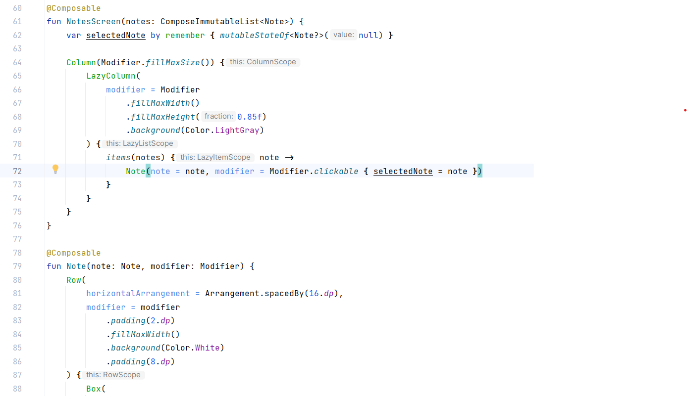
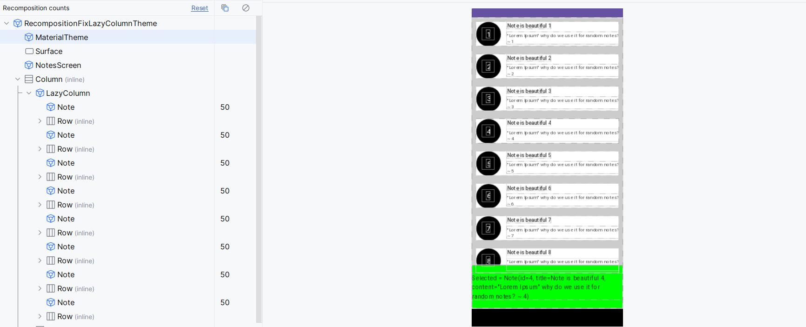
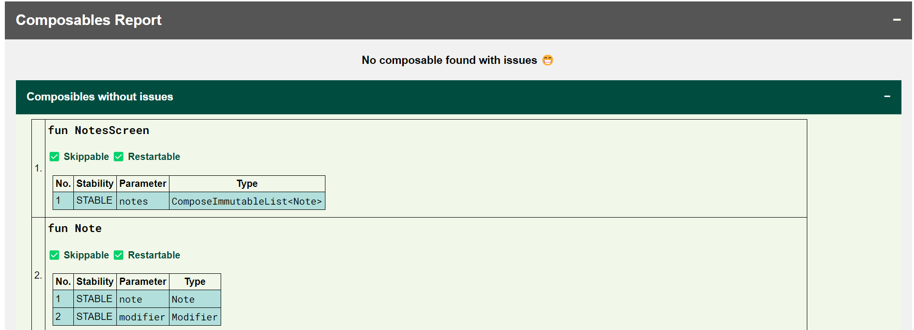
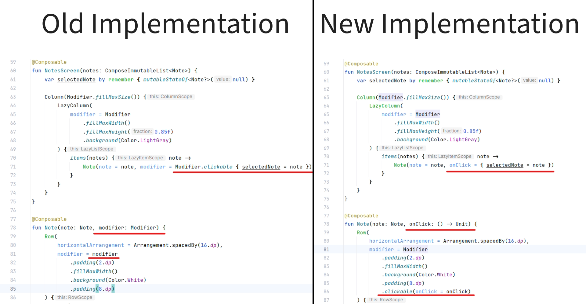
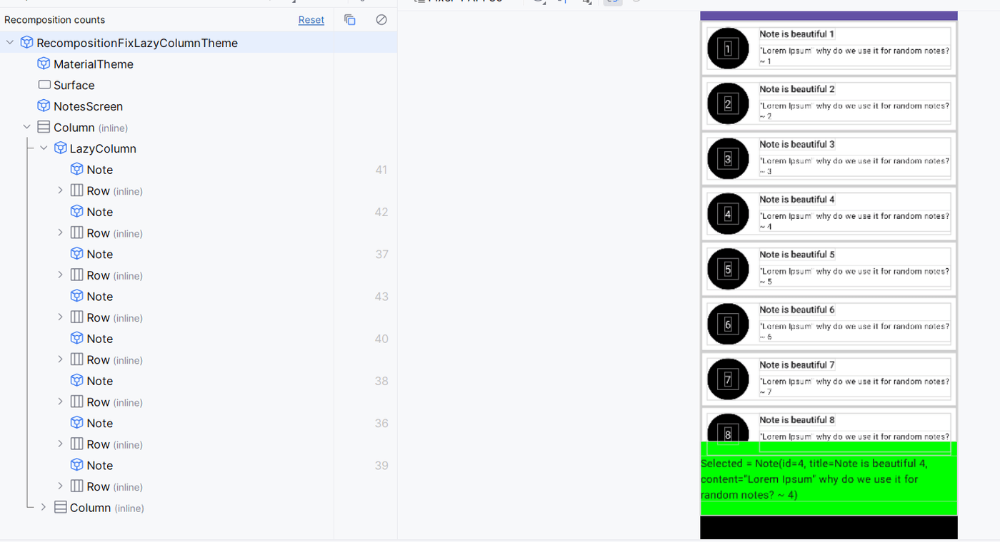
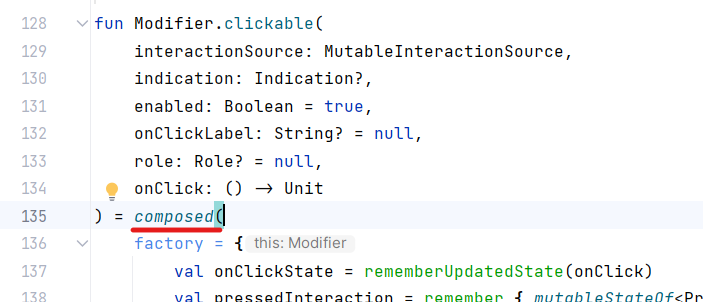
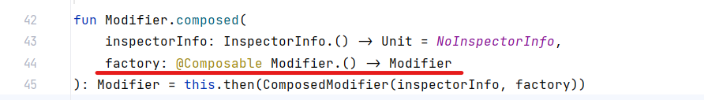
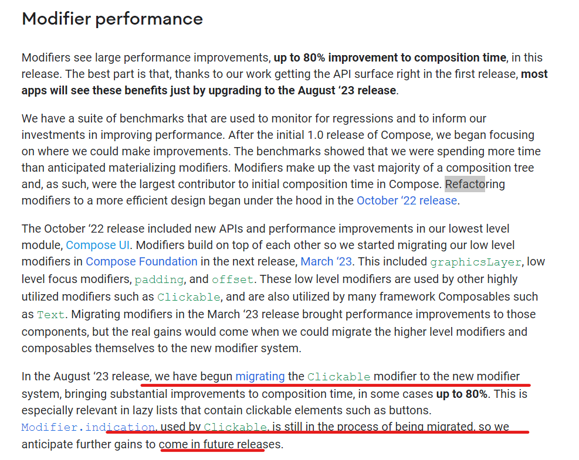

Hi Composers 👋🏻, in this blog we'll discuss the issue which generally affects the performance of the application which presents data on UI with the help of Jetpack Compose's **LazyList**components (*LazyColumn*or*LazyRow* ). I found this issue while working on my application and I fixed that issue. Later, I got queries about similar issues within the community which motivated me to write about this.

## Knowing the issue 🐞

If you are using Jetpack compose on a regular basis and utilizing **LazyList**APIs then you might have faced this issue in your app. So Let's build a sample app to demonstrate the issue. At the moment, imagine that we are developing our application with <mark>Jetpack Compose</mark>***<mark>1.4.x</mark>*** APIs. In the sample app, we are simply showing a list in which items are added continuously after some intervals and when clicking on an item in the list, the details are displayed in detail at the bottom of the screen. See the below preview.


Now here's what the code of the List's implementation looks like. Inside of `LazyColumn` simply all `notes` are passed as a list and each `Note` is composed.



Now when the app is run and checked for the recompositions count in the ***Layout Inspector,*** here's a surprise 😮.



As you can see, each item in the list is getting recomposed when a new item is added to a list 🤯. For example, a total of 50 items are added to a list then all 50 Composable note items are recomposed when a new ( *51st* ) item is added to a list.

After getting such issues, the first thought which comes to mind is ***"Stability"***, right? We can quickly verify the stability of models and composable functions. See, all our composable functions are stable. (*Verified with*[*this plugin* ](https://patilshreyas.github.io/compose-report-to-html/))



So what's the issue here? Let's understand

---

## Getting the root cause of the issue

After facing the issue, got a chance to study and investigate this issue in detail and the learnings were interesting.

While experimenting with a lot of code changes, tried one change that fixed the issue. Just note a difference in implementation from the below snippet.



In the previous implementation, `Modifier` was exposed as a parameter from a `Note` composable so that list can add behavior to it. Click of an item was handled inside `LazyColumn` of `NotesScreen` composable. In the new implementation, instead of exposing a modifier, we have exposed a **lambda** that takes care of the execution of logic on click, and internally Modifier is handled inside `Note` composable only without exposing it outside.

Now, after this change, see the recompositions with this new logic.



Surprised🤯? With this small change, a list item never got recomposed again and it smartly skipped recomposing the items inside the list. Also, this is not the only solution. There are several variants of potential fixes:

* Remembering a modifier

```kotlin
@Composable
fun NotesScreen(...) {
// ...
items(notes) { note ->
val clickableModifier = remember(note) {
Modifier.clickable { / *Do something* / }
}
Note(note = note, modifier = clickableModifier)
}
}
```

*Using a singleton modifier (*not usable in our case since we need a note* )

```kotlin
val clickableModifier = Modifier.clickable { / *Do something* / }

@Composable
fun NotesScreen(...) {
// ...
items(notes) { note ->
Note(note = note, modifier = clickableModifier)
}
}
```


But again, the question is ***"Why it's making a difference?".***

---

To understand more in detail, I even tried using `Modifier.pointerInput` with old implementation and performing clicks with `onTap` callback and found that the same issue is **not**happening with this modifier but**only happening** with `clickable{}` Modifier.

So it's not an issue with all `Modifier`s but only with `clickable{}` modifier. After checking the implementation of this modifier, we can see that *clickable* is a `composed` modifier which makes it different from another modifier.



### What is `composed` Modifier?

Docs says:

> Declare a just-in-time composition of a Modifier that will be composed for each element it modifies. composed may be used to implement stateful modifiers that have instance-specific state for each modified element, allowing the same Modifier instance to be safely reused for multiple elements while maintaining element-specific state.



You can see that `composed` takes a `factory` which is a `@Composable` lambda that returns a value. This lambda is executed when layout nodes are created. <mark>Composable functions/lambdas that return a value are </mark> **<mark>not skippable </mark>**<mark>and also </mark>**<mark>not automatically remembered</mark>** <mark>by Compose</mark>.

Whenever such a modifier is used directly inside the `LazyListScope`, all existing items are recomposed because a new instance of Modifier (with *clickable{}*) gets created which is not equal to the previous instance of the modifier.***In short, every time the function is called, it'll behave like Modifier is changed and it'll cause recompositions*** .

It means, <mark>if any Modifier that uses composed{} under the hood is used, then it will cause extra recompositions of composable components, despite them having the correct stability.</mark> When directly used within `LazyListScope`, it affects badly because it's a point where each item is laid inside LazyColumn/LazyRow.

#### The solution is simple to use with LazyListScope

*Avoid using composed{} modifier directly in `LazyListScope`* If there's any use case that you need to use Modifier in such place, then make sure that modifier is remembered.


## But... how can we live with it further? 🤔

Definitely, this is a genuine issue and we can't just live with it. That's a reason why the Jetpack Compose team is refactoring Modifiers. [In this talk](https://youtu.be/BjGX2RftXsU?t=462) @ Android Dev Summit 2022, [Leland Richardson](http://intelligiblebabble.com/) had already discussed the issue in detail and the performance issues with the usage of the composed{} modifier.

[](https://youtu.be/BjGX2RftXsU?t=462)

Also, in the [recent release of Jetpack Compose (August 2023)](https://android-developers.googleblog.com/2023/08/whats-new-in-jetpack-compose-august-23-release.html), the team has already improved significant performance with the Modifier refactoring and has promised to fix the issues with the Clickable modifier in future releases 👇🏻.

[](https://android-developers.googleblog.com/2023/08/whats-new-in-jetpack-compose-august-23-release.html)

So in the end, it's great news that we can soon get rid of this issue in the upcoming versions of Compose with which we won't even need to worry about these scenarios and we won't need to tweak solutions as we did so far. Till the time, we can fix the issues as we discussed 😀.

---

Awesome 🤩. I hope you learned how can we fix the performance issues so far till the time full refactoring of the Modifiers is officially made done by the Jetpack Compose team.

If you like this write-up, do share it 😉, because...

***"Sharing is Caring"***

Thank you! 😄

Let's catch up on [ **Twitter**](https://twitter.com/imShreyasPatil) or [**visit my site** ](https://shreyaspatil.dev/) to know more about me 😎.

---

*Many thanks to*[***Ben Trengrove***](https://twitter.com/bentrengrove?s=20)*for helping me understand this issue better and reviewing this blog post* 😀.

---

## 📚References

*[Compose Modifiers Deep dive](https://youtu.be/BjGX2RftXsU)* [Issue Tracker - Recomposition is not skipped if clickable modifier is used](https://issuetracker.google.com/issues/241154852#comment2)