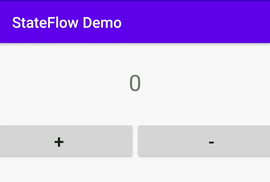

In this article, we’ll learn how to use Kotlin Coroutine `StateFlow` in Android instead of `LiveData`.

In the recent release of Kotlin coroutines library (1.3.6), you can see there a new class — `StateFlow`. So what’s this and how it works? Let’s see…

***

## What is `StateFlow`? 🤷‍♂️

*It’s basically a new primitive for state handling.* It’s designed to eventually replace [`ConflatedBroadcastChannel`](https://kotlin.github.io/kotlinx.coroutines/kotlinx-coroutines-core/kotlinx.coroutines.channels/-conflated-broadcast-channel/index.html) for state publication scenarios.

*It is a **flow** that emits updates to its collectors.* Value can be observed by collecting values from the **flow** 🌊.

***

## Still not getting? Here’s a quick demo to understand —

See [this demo program](https://pl.kotl.in/LWtbOSMEZ?theme=darcula) and play with it.

I think now you get it what’s exactly — `StateFlow` 😃. So what’s happening here is whenever we’re updating the value of **stateFlow** then it emits value to its *collectors*.

To manage state in Android we generally used Android Arch. component’s [`LiveData`](https://developer.android.com/topic/libraries/architecture/livedata) which is lifecycle-aware. We can replace it with *StateFlow*. Let’s see how to use it with Android. Let’s write some code!

***

## ⚡️ Getting Started

Open *Android Studio* and create a new project. Alternatively, you can simply clone [this repository](https://github.com/scalereal/StateFlow-Demo). This is a very simple *counter* app for demonstrating the use of Kotlin Coroutine’s *StateFlow* API.

We’ll be using `MainViewModel` to manage our data of `MainActivity`.

Now you can compare its implementation using *LiveData*.

*`MutableStateFlow` has a setter property for **value**.* We’ve declared an instance of `StateFlow` i.e. *countState* which we’re exposing for activity (*It’s a read-only field*). `StateFlow` has a property called **value** by which you can be safely read at any time.

Now let’s implement our `MainActivity` —

Here, we’ve initialized ViewModel for activity. Now let’s implement the `initView()` method which will initialize our Counter App UI.

Everything looks cool now! 😃. Let’s observe for count value now to keep track of counting and show it on UI accordingly.

Here’s we have collector which will be executed whenever the value of a *countState* is updated. We also made it **lifecycle-aware** as we’ve used it under `lifecycleScope`. It looks simple, right? That’s it! 😎

Now let’s run this app and see if it’s working:

*Counter app demo*

Ain’t it Sweettttt 😍.

***

## We can implement the same using **LiveData** too. What’s different then? 🤷‍♂️

We can use powerful *flow* operators with `StateFlow` like ***combine, zip, etc*** which can give us more great experience than *LiveData*. Yes, that’s it.

***

## Final Words

*   `StateFlow` is really easy to handle and implement. Currently, it doesn’t support LiveData’s `onActive()` or `onInactive()` like callbacks but this will be possible once [`SharedFlow`](https://github.com/Kotlin/kotlinx.coroutines/issues/2034) is officially released 🚀.
*   Its behaviour is the same as `LiveData` along with more operators and great performance 😎. Then we should consider using it instead of *LiveData*.

If you found this helpful please give some claps 👏 and share it with everyone.

*Sharing is Caring!*

Thank You :) 🙏

If you need any help, you can contact me [**here**](https://patilshreyas.dev).

***

## 📚 Resources

*   [**StateFlow Demo - GitHub**](https://github.com/scalereal/StateFlow-Demo)
*   [**StateFlow Documentation**](https://kotlin.github.io/kotlinx.coroutines/kotlinx-coroutines-core/kotlinx.coroutines.flow/-state-flow/index.html)