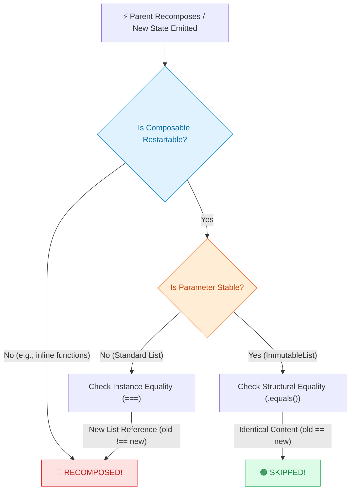

Hey Composers 👋,

Since Kotlin **2.0.20**, **Strong Skipping Mode (SSM)** has been enabled by default in the Compose Compiler (prior to 2.0.20, it required explicit Gradle opt-in). It's one of the biggest performance enhancements Jetpack Compose has received, drastically reducing the friction around composable skipping.

When Strong Skipping Mode landed, a common misconception quickly spread across the Android community:

> _Strong Skipping is enabled! All composables are now skippable regardless of parameter stability! We don't need `ImmutableList`, `@Stable`, or `@Immutable` anymore!_

If you've had this thought, you are definitely not alone 😅. It sounds logical at first glance. However, relying **solely** on Strong Skipping Mode without considering stability creates a false sense of security 🪤—leading to missed optimization opportunities where developers assume composables are skipping when they actually aren't.

In this post, we'll look at how Strong Skipping Mode actually compares parameters under the hood 🔬 and demonstrate with a live demo (using `List<T>` as a primary example) why unstable parameters can still cause unnecessary recompositions 🔄.

---

## What Changed with Strong Skipping Mode? 🚀

Strong Skipping Mode isn't just a single tweak—it is built on **two major pillars**:

1. **Composable Skipping with Unstable Parameters ⏩:** Before SSM, a composable was marked **skippable** _only if all of its parameters were stable_. If it accepted even one unstable parameter (like a standard `List<T>`), it was marked **un-skippable** and forced to recompose whenever its parent recomposed. With SSM, the compiler marks **all restartable composable functions as skippable**, even with unstable parameters.
2. **Automatic Lambda Memoization 🧠:** Previously, lambdas capturing unstable values were re-created on every recomposition pass—breaking parameter equality for child composables receiving lambda callbacks (like `onClick: () -> Unit`). Strong Skipping Mode automatically wraps **all** lambdas in a `remember` block, even if they capture unstable variables.

While automatic lambda memoization eliminates a massive class of re-allocation issues, composable skipping introduces a critical catch in **HOW parameter values are compared.**

---

## The Catch: `===` vs `.equals()` 📚

Let's look at what the [Official Android Developer Documentation on Strong Skipping](https://developer.android.com/develop/ui/compose/performance/stability/strongskipping) explicitly states:

<div class="post-callout">
  <div class="emoji">📖</div>
  <div class="content">
    <strong>Official Android Documentation:</strong><br/>
    <em>To determine whether to skip a composable during recomposition, Compose compares the value of each parameter with their previous values. The type of comparison depends on the stability of the parameter:
    <ul>
      <li><strong>Unstable parameters</strong> are compared using <strong>instance equality (<code>===</code>)</strong></li>
      <li><strong>Stable parameters</strong> are compared using <strong>object equality (<code>Object.equals()</code>)</strong></li>
    </ul>
    If you want an object using object equality instead of instance equality, continue to annotate the given class with <code>@Stable</code>.</em>
  </div>
</div>

In short, Strong Skipping Mode uses two completely different equality strategies depending on whether a parameter is stable or unstable:

| Parameter Classification                              | Stability Status | Equality Check Used by SSM   | Behavior on State Update                               |
| :---------------------------------------------------- | :--------------- | :--------------------------- | :----------------------------------------------------- |
| **Unstable** (e.g. standard `List<T>`, `Set<T>`)      | ❌ Unstable      | **Referential (`===`)**      | Recomposes if memory reference changes (`old !== new`) |
| **Stable** (e.g. `String`, `Int`, `ImmutableList<T>`) | ✅ Stable        | **Structural (`.equals()`)** | Skips if content is structurally identical             |

### The "Data Class" Trap 🪤

A very common trap in Kotlin Compose development is assuming that Kotlin `data class` instances are inherently stable.

In Jetpack Compose, a `data class` is inferred as **stable ONLY if ALL of its properties are of stable or immutable types** (like primitives, `String`, or `@Immutable` / `@Stable` classes). If even a single property inside a data class is unstable (such as a standard `List<T>`), the Compose Compiler marks the **entire data class as unstable**:

```kotlin
// ❌ Unstable! Because `tags` is a standard List<String>
data class UserState(
    val id: String,         // Stable
    val name: String,       // Stable
    val tags: List<String>  // Unstable! -> Infects entire UserState!
)
```

Under Strong Skipping Mode, if a composable accepts `state: UserState`, Compose compares `oldState === newState`. Any `state.copy(name = "New Name")` emission creates a new `UserState` instance in memory (`old !== new`). Because `===` fails, Compose **forces the composable to recompose**, even if `tags` didn't change!

---

## Seeing it in Action: Live Demo & Code 🎬

To prove how this impacts a real application, let's look at a typical MVI setup where UI state is updated in a `ViewModel`:

```kotlin file="DemoViewModel.kt"
import kotlinx.collections.immutable.PersistentList
import kotlinx.collections.immutable.persistentListOf

data class DemoUiState(
    val unstableItems: List<Item> = emptyList(), // Standard List (Unstable)
    val stableItems: PersistentList<Item> = persistentListOf() // PersistentList (Stable)
)

class DemoViewModel : ViewModel() {
    private val _uiState = MutableStateFlow(DemoUiState())
    val uiState: StateFlow<DemoUiState> = _uiState.asStateFlow()

    // 1. Modifies content (adds new items)
    fun addItem() {
        val newItem = Item("New Item")
        _uiState.update { state ->
            state.copy(
                unstableItems = state.unstableItems + newItem,
                stableItems = state.stableItems.add(newItem)
            )
        }
    }

    // 2. Re-creates the unstable list instance with identical content!
    fun recreateListInstance() {
        _uiState.update { state ->
            state.copy(
                // Re-creates List instance (newList !== oldList) -> fails === check
                unstableItems = state.unstableItems.toList(),
                // Same persistent structure (.equals() returns true) -> passes skipping check
                stableItems = state.stableItems
            )
        }
    }
}
```

Now, let's connect this state to our UI and render two card composables side-by-side:

```kotlin file="DemoScreen.kt"
@Composable
fun DemoScreen(viewModel: DemoViewModel = viewModel()) {
    val uiState by viewModel.uiState.collectAsStateWithLifecycle()

    Column {
        // Standard List<Item> parameter -> Unstable!
        UnstableListCard(items = uiState.unstableItems)

        // ImmutableList<Item> parameter -> Stable!
        ImmutableListCard(items = uiState.stableItems)
    }
}

// 🔴 Unstable Parameter: Standard List<Item>
@Composable
fun UnstableListCard(items: List<Item>) {
    // Note: SideEffect runs after composition, so the UI counter will trail by 1, but proves the recomposition triggers.
    val recompositions = remember { intArrayOf(0) }
    SideEffect { recompositions[0]++ }

    Text("Unstable List - Recompositions: ${recompositions[0]}")
}

// 🟢 Stable Parameter: kotlinx ImmutableList<Item>
@Composable
fun ImmutableListCard(items: ImmutableList<Item>) {
    // Note: SideEffect runs after composition, so the UI counter will trail by 1, but proves the recomposition triggers.
    val recompositions = remember { intArrayOf(0) }
    SideEffect { recompositions[0]++ }

    Text("Stable ImmutableList - Recompositions: ${recompositions[0]}")
}
```

### The Live Experiment

Here is a live screen recording from the app testing both actions:

<div class="flex justify-center">
  <video controls autoplay loop muted playsinline preload="none" class="max-h-[480px] w-auto rounded-xl shadow-lg border border-gray-200 dark:border-gray-800 object-contain">
    <source src="/videos/content/why-compose-stability-still-matters-in-strong-skipping-mode/demo.webm" type="video/webm">
    Your browser does not support the video tag.
  </video>
</div>

Notice what happens:

1. **Adding Items ➕:** When tapping **"Add"** twice, both counters increment from `1` to `3`. This is expected because new items were actually added to the list.
2. **Re-creating List Instance 🔄:** When tapping **"Re-create"** three times:
   - 🔴 **`UnstableListCard` (`List<Item>`):** Recomposes on **every single click** (`3 → 4 → 5 → 6`) because `newList !== oldList`.
   - 🟢 **`ImmutableListCard` (`ImmutableList<Item>`):** Stays completely calm and **skips recomposition** (`3` stays fixed at `3`) because `.equals()` returns `true`!

---

## Visualizing the Decision Path 📊

Here is a simple flowchart summarizing how Strong Skipping Mode evaluates both composables during recomposition:



---

## Real-World Impact: Where This Actually Hurts 📱💥

In simple screens, recomposing an extra card might only take fractions of a millisecond and go unnoticed. However, in production Android apps with complex UI hierarchies, this referential equality trap can lead to visible frame drops and battery drain 🔋:

- **Complex Feeds & Infinite Lists 📜:** In e-commerce product feeds or social media timelines, list items often render rich UI components (carousels, reaction bars, tag chips). If a feed item composable accepts an unstable `tags: List<String>` parameter, any state update in the parent screen (like toggling a bookmark or liking a post) forces every visible item to re-execute measure and layout passes.
- **High-Frequency State Updates ⏱️:** Audio/video players with progress sliders, live stock tickers, chat feeds, or real-time search inputs where UI state emits multiple times per second. Failing `===` checks during rapid state emissions cause continuous recomposition sweeps.
- **Deeply Nested Composable Trees 🧱:** Top-level recompositions cascade all the way down through unstable parameter boundaries, invalidating entire sub-trees that didn't actually have any visual changes.

---

## Recomposition Debugging & Stability Tools 🛠️

To verify parameter stability and debug recomposition behavior in your codebase:

- **Compose Compiler Reports 📊:** Enable official [Compose Compiler Metrics & Reports](https://developer.android.com/develop/ui/compose/performance/stability/diagnose) in Gradle to generate `*_classes.txt` and `*_composables.txt` files inspecting stability status.
- **Compose Stability Analyzer 🔍:** For instant, IDE-integrated feedback while coding, check out Jaewoong Eum's ([@skydoves](https://github.com/skydoves)) [Compose Stability Analyzer](https://github.com/skydoves/compose-stability-analyzer) Android Studio plugin.

---

## Edge Case: When Skipping Isn't Free (`@NonSkippableComposable`) ⚡

While we've focused on enabling skipping for unstable parameters, there is an interesting counter-edge-case every Compose expert should know: **Skipping isn't free.**

To skip a composable, the Compose Compiler generates extra code: saving parameter slots in the Slot Table, allocating `remember` keys, and executing `.equals()` checks across every parameter.

If a composable is extremely lightweight (e.g. a simple 2-line wrapper emitting a basic `Text` or `Icon`), but accepts a massive, deeply nested stable data class, evaluating `.equals()` across a huge object graph can actually cost **more CPU cycles** than simply running the layout code!

In these rare performance-critical scenarios, you can annotate your composable with `@NonSkippableComposable` to tell the compiler to bypass skipping code generation altogether. To learn more about how annotations work in Compose, check out [Deep Dive into Annotations in Jetpack Compose](https://blog.shreyaspatil.dev/deep-dive-into-annotations-in-jetpack-compose/).

---

## Key Takeaways 📌

- **Strong Skipping is a safety net, not a silver bullet 🛡️:** It makes composables skippable, but unstable parameters fall back to referential equality (`===`) checks.
- **Standard `List<T>` is still Unstable ⚠️:** Re-creating a collection via `copy()`, `map {}`, `filter {}`, or `toList()` changes its memory reference, forcing recomposition on state emissions.
- **Stability annotations and `ImmutableList` still matter 🚀:** Use `kotlinx-collections-immutable` (`ImmutableList<T>`) or annotate custom state classes with `@Immutable` / `@Stable` to enable true structural (`.equals()`) skipping.

---

Awesome. I hope this write-up clears up the confusion around Strong Skipping Mode and stability! If you found this helpful, please share it 😉, because...

**_"Sharing is Caring"_**

Thank you! 😄 Happy composing! 😎

Let's catch up on [**X**](https://twitter.com/imShreyasPatil) or [**visit my site**](https://shreyaspatil.dev/) to know more about me 😎.
