In this article, we’ll create a sample app which stores Feedback of user from the **Flutter** app into Google Sheets using AppScript.

---

## 💡 Introduction

Hello everyone, This is my first ever article on Flutter. Google Sheets is a very powerful tool 🔥 if we look deep in it. It provides us with an interface using [Google AppScript](https://script.google.com) so that we can do various types of operations on Google Spreadsheet. We can perform all types of operations like Reading/Inserting/Updating/Deleting using AppScript on Google Sheets. It’s so much powerful and capable than we can even use Google Sheets as a back-end of our application 📲.

Here we’ll develop a sample flutter application, which simply takes user User Feedback, makes HTTP request to Google AppScript and then stores that feedback in Google Sheets. So, let’s start. 😃

**You can try the [web demo of this Flutter app](https://patilshreyas.github.io/Flutter2GoogleSheets-Demo/demo/).**

Here’s the [link for Part 2](https://medium.com/scalereal/getting-data-from-google-sheets-flutter-app-part-2-d6e689fdbbed) of this article.

For implementation, we’ll perform the below steps.

---

## ⚡️ Setting up Google Sheets

1.  Sign in with your Google Account.
2.  Go to your [Google Drive](https://drive.google.com/drive/my-drive) and create a new **‘Google Sheets’** document where you want to store your responses and Open that.
3.  Setup **header columns** of sheet and you’ll see like this:

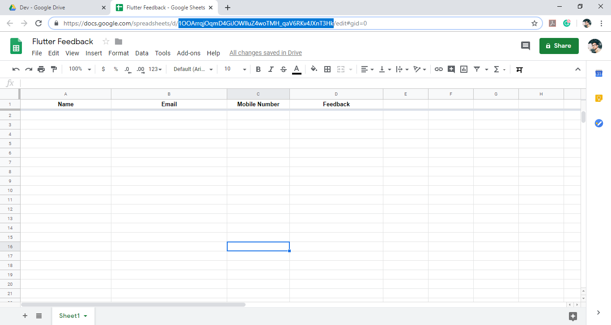

_Initialized Google Sheet. (Selected Part of URL is **Sheet ID**)._

As above, I’ve set up header columns of the sheet. You can see I’ve highlighted part of the URL. It is the **Sheet ID** of our current document. Just copy it, we’ll require it in the next step. Every document has a unique **Sheet ID**.

4.  As in below Image, Just go to **Tools → Script Editor**.

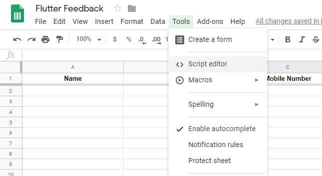

---

## ⚡️ Setting up Google AppScript

After the above steps, you’ll see AppScript Editor will be launched in the New Tab of your browser. You’ll see Code window like below.

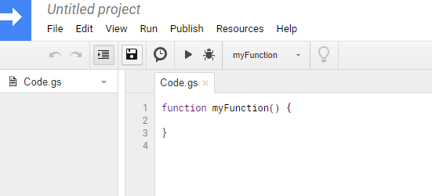

_AppScript Editor_

Here in this editor, we have to write AppScript which will act as a Web API and that will communicate with Google sheets.

> We’ll write code in `doPost()` which will be invoked when HTTP request using method POST is sent.

```gs
function doPost(request) {
  // Open Google Sheet using ID
  var sheet = SpreadsheetApp.openById(
    "1OOArrqjOqmD4GiJOWlluZ4woTMH_qaV6RKv4JXnT3Hk"
  );
  var result = { status: "SUCCESS" };
  try {
    // Get all Parameters
    var name = request.parameter.name;
    var email = request.parameter.email;
    var mobileNo = request.parameter.mobileNo;
    var feedback = request.parameter.feedback;

    // Append data on Google Sheet
    var rowData = sheet.appendRow([name, email, mobileNo, feedback]);
  } catch (exc) {
    // If error occurs, throw exception
    result = { status: "FAILED", message: exc };
  }

  // Return result
  return ContentService.createTextOutput(JSON.stringify(result)).setMimeType(
    ContentService.MimeType.JSON
  );
}
```

First of all, we’ll have to Open our spreadsheet, we can open that using `SpreadsheetApp.openById(sheetId)`.

**Sheet ID** which we’ve copied in the previous step has to be passed in this method.

Here, we’ll retrieve parameters using `request.parameter`. Finally, by using a method `appendRow([])`, we’ll insert feedback data into Google Sheet. In the end, we’ll return a JSON response with status: **SUCCESS/FAILED**.

1.  Select from tab, **Publish → Deploy as web app**.

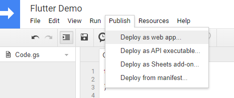

_Deploying the Web app_

2.  You’ll see a window like this, Just ensure that select ‘Execute the app’ as **‘Me’** and ‘Who has access to the app’ as **‘Anyone, even anonymous’**.

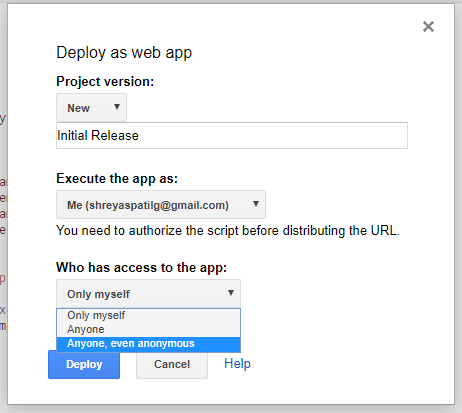

3.  Authorization is required! Just review permissions. Then select your Google Account.

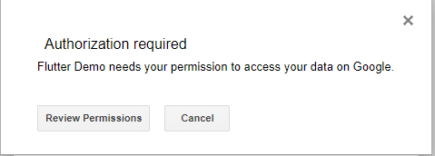

4.  You’ll see like this, Just expand that ‘Advanced’ and click on **‘Go to YOUR_PROJECT_NAME (unsafe)’**. As I’ve highlighted below.

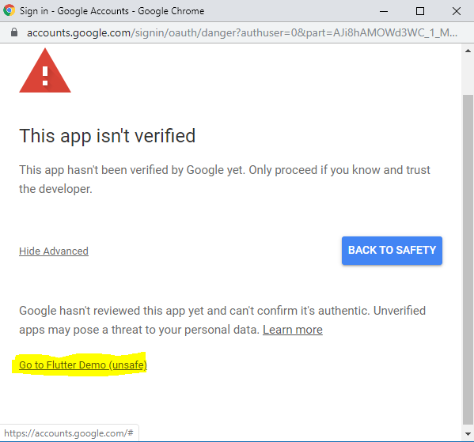

_Proceed this…_

5.  **Allow** these permissions and then you’re done!

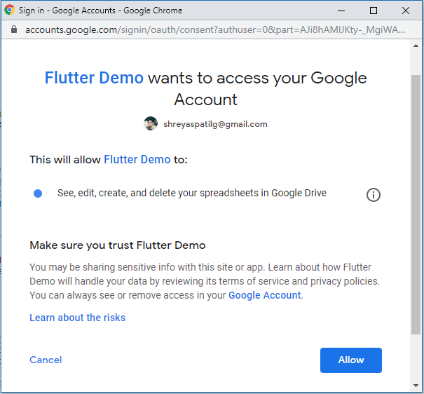

_Review and allow permissions._

6.  Finally, you’ll get a window like this with the Web app URL. Copy that Web URL for a reference. We’ll use this URL for making HTTP GET requests from our flutter app.

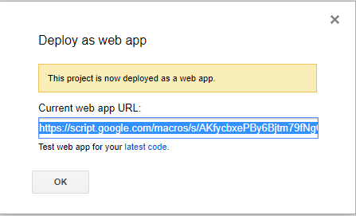

😃 We’ve done this part. Let’s see Flutter implementation.

---

## ⚡️ Setting up Flutter 💙 App

1.  Init a flutter directory using `flutter create PROJECT_NAME`.
2.  In **pubspec.yaml**, add the following dependency:

```yaml
dependencies:
  flutter:
    sdk: flutter
  http: ^0.12.0+3
```

3.  In **lib/model**, we’ll create a `form.dart` file as below:

```dart
/// FeedbackForm is a data class which stores data fields of Feedback.
class FeedbackForm {
  String name;
  String email;
  String mobileNo;
  String feedback;

  FeedbackForm(this.name, this.email, this.mobileNo, this.feedback);

  factory FeedbackForm.fromJson(dynamic json) {
    return FeedbackForm("${json['name']}", "${json['email']}",
        "${json['mobileNo']}", "${json['feedback']}");
  }

  // Method to make GET parameters.
  Map toJson() => {
        'name': name,
        'email': email,
        'mobileNo': mobileNo,
        'feedback': feedback
      };
}
```

Here, we have added a method `toParams()` which will make the body parameters of POST request from fields that we can use later while making HTTP requests.

4.  In **lib/controller**, we’ll create a `form_controller.dart` file as below:

```dart
import 'dart:convert' as convert;
import 'package:http/http.dart' as http;
import '../model/form.dart';

/// FormController is a class which does work of saving FeedbackForm in Google Sheets using
/// HTTP GET request on Google App Script Web URL and parses response and sends result callback.
class FormController {

  // Google App Script Web URL.
  static const String URL = "https://script.google.com/macros/s/AKfycbyAaNh-1JK5pSrUnJ34Scp3889mTMuFI86DkDp42EkWiSOOycE/exec";

  // Success Status Message
  static const STATUS_SUCCESS = "SUCCESS";

  /// Async function which saves feedback, parses [feedbackForm] parameters
  /// and sends HTTP GET request on [URL]. On successful response, [callback] is called.
   void submitForm(
      FeedbackForm feedbackForm, void Function(String) callback) async {
    try {
      await http.post(URL, body: feedbackForm.toJson()).then((response) async {
        if (response.statusCode == 302) {
          var url = response.headers['location'];
          await http.get(url).then((response) {
            callback(convert.jsonDecode(response.body)['status']);
          });
        } else {
          callback(convert.jsonDecode(response.body)['status']);
        }
      });
    } catch (e) {
      print(e);
    }
  }
}
```

In `FormController` class, we have created a default constructor which takes `function` callback as a parameter which will be invoked when the HTTP response is received.

Use that web URL which we’ve obtained in previous steps.

Finally, we’ve created an _async_ method `submitForm(FeedbackForm)` which takes `FeedbackForm` object as a parameter and makes HTTP GET request on `URL`.

5.  In **lib/main.dart**, we’ll write the below code:

```dart
import 'package:flutter/material.dart';
import 'controller/form_controller.dart';
import 'model/form.dart';

void main() => runApp(MyApp());

class MyApp extends StatelessWidget {
  @override
  Widget build(BuildContext context) {
    return MaterialApp(
      title: 'Flutter Google Sheet Demo',
      theme: ThemeData(
        primarySwatch: Colors.blue,
      ),
      home: MyHomePage(title: 'Flutter Google Sheet Demo'),
    );
  }
}

class MyHomePage extends StatefulWidget {
  MyHomePage({Key key, this.title}) : super(key: key);

  final String title;

  @override
  _MyHomePageState createState() => _MyHomePageState();
}

class _MyHomePageState extends State<MyHomePage> {

  // Create a global key that uniquely identifies the Form widget
  // and allows validation of the form.
  //
  // Note: This is a `GlobalKey<FormState>`,
  // not a GlobalKey<MyCustomFormState>.
  final _formKey = GlobalKey<FormState>();
  final _scaffoldKey = GlobalKey<ScaffoldState>();

  // TextField Controllers
  TextEditingController nameController = TextEditingController();
  TextEditingController emailController = TextEditingController();
  TextEditingController mobileNoController = TextEditingController();
  TextEditingController feedbackController = TextEditingController();

  // Method to Submit Feedback and save it in Google Sheets
  void _submitForm() {
    // Validate returns true if the form is valid, or false
    // otherwise.
    if (_formKey.currentState.validate()) {
      // If the form is valid, proceed.
      FeedbackForm feedbackForm = FeedbackForm(
          nameController.text,
          emailController.text,
          mobileNoController.text,
          feedbackController.text);

      FormController formController = FormController();

      _showSnackbar("Submitting Feedback");

      // Submit 'feedbackForm' and save it in Google Sheets.
      formController.submitForm(feedbackForm, (String response) {
        print("Response: $response");
        if (response == FormController.STATUS_SUCCESS) {
          // Feedback is saved succesfully in Google Sheets.
          _showSnackbar("Feedback Submitted");
        } else {
          // Error Occurred while saving data in Google Sheets.
          _showSnackbar("Error Occurred!");
        }
      });
    }
  }

  // Method to show snackbar with 'message'.
  _showSnackbar(String message) {
      final snackBar = SnackBar(content: Text(message));
      _scaffoldKey.currentState.showSnackBar(snackBar);
  }

  @override
  Widget build(BuildContext context) {
    return Scaffold(
      key: _scaffoldKey,
      resizeToAvoidBottomPadding: false,
      appBar: AppBar(
        title: Text(widget.title),
      ),
      body: Center(
          child: Column(
            mainAxisAlignment: MainAxisAlignment.start,
            children: <Widget>[
              Form(
                key: _formKey,
                child:
                  Padding(padding: EdgeInsets.all(16),
                  child: Column(
                    crossAxisAlignment: CrossAxisAlignment.start,
                    children: <Widget>[
                      TextFormField(
                        controller: nameController,
                        validator: (value) {
                          if (value.isEmpty) {
                            return 'Enter Valid Name';
                          }
                          return null;
                        },
                        decoration: InputDecoration(
                          labelText: 'Name'
                        ),
                      ),
                      TextFormField(
                        controller: emailController,
                        validator: (value) {
                          if (!value.contains("@")) {
                            return 'Enter Valid Email';
                          }
                          return null;
                        },
                        keyboardType: TextInputType.emailAddress,
                        decoration: InputDecoration(
                          labelText: 'Email'
                        ),
                      ),
                      TextFormField(
                        controller: mobileNoController,
                        validator: (value) {
                          if (value.trim().length != 10) {
                            return 'Enter 10 Digit Mobile Number';
                          }
                          return null;
                        },
                        keyboardType: TextInputType.number,
                        decoration: InputDecoration(
                          labelText: 'Mobile Number',
                        ),
                      ),
                      TextFormField(
                        controller: feedbackController,
                        validator: (value) {
                          if (value.isEmpty) {
                            return 'Enter Valid Feedback';
                          }
                          return null;
                        },
                        keyboardType: TextInputType.multiline,
                        decoration: InputDecoration(
                          labelText: 'Feedback'
                        ),
                      ),
                    ],
                  ),
                )
              ),
              RaisedButton(
                color: Colors.blue,
                textColor: Colors.white,
                onPressed:_submitForm,
                child: Text('Submit Feedback'),
              ),
            ],
          ),
        ),
    );
  }
}
```

We have created a Form with four _TextFields_ and a _‘Submit Feedback’_ button.

Whenever the button is pressed, a form is validated first. Then, we’re instantiating `FeedbackForm` object from TextField values. Finally, we’re passing that object to the `submitForm()` method of `FormController`.

We’ve done the implementation of our flutter app. Let’s test it 😄.

Run command — `flutter run`

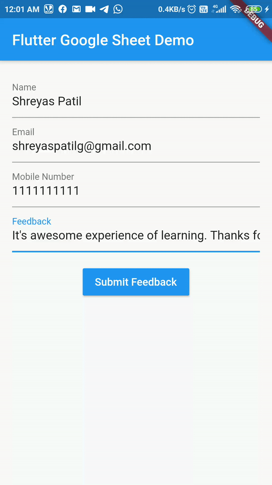

_Flutter App Response_

Our app is running and we can see SnackBar output. Now let’s see our Google Sheet.

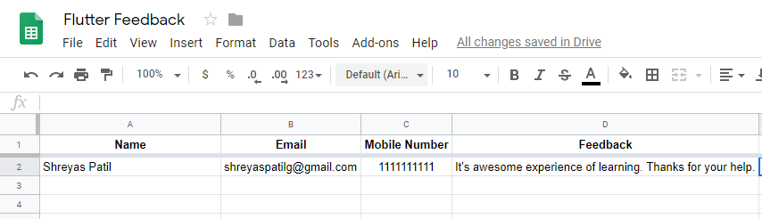

_Google Sheet_

> **Yippie! 😍.** You can see above, Data from flutter app is appended into Google Sheet. It’s working as expected. Hope you liked that. If you find it helpful please share this. Maybe it’ll help someone needy!

Thus, we’ve successfully stored User response from the Flutter app into Google Sheets using Google AppScript.

You can test a web version of this app from [this link](https://patilshreyas.github.io/Flutter2GoogleSheets-Demo/demo/).

---

## Part 2 — Getting data from Google Sheets into Flutter App

Here’s the link for the Part 2 of this article where we’ll see how to get data from Google Sheets into the flutter app.

[Part 2 - Getting data from Google Sheets](https://medium.com/scalereal/getting-data-from-google-sheets-flutter-app-part-2-d6e689fdbbed)

If you found this project useful, then please consider giving it a ⭐️ on GitHub and sharing it with your friends via social media.

> Sharing is Caring!

Thank You! 😃

---

## 📚 Repository

Here’s GitHub repo which contains **Flutter** + Google **AppScript** Code:

[**PatilShreyas/Flutter2GoogleSheets-Demo**](https://github.com/PatilShreyas/Flutter2GoogleSheets-Demo)

Feel free to reach me anytime on…

[**shreyaspatil.dev**](http://patilshreyas.github.io)
