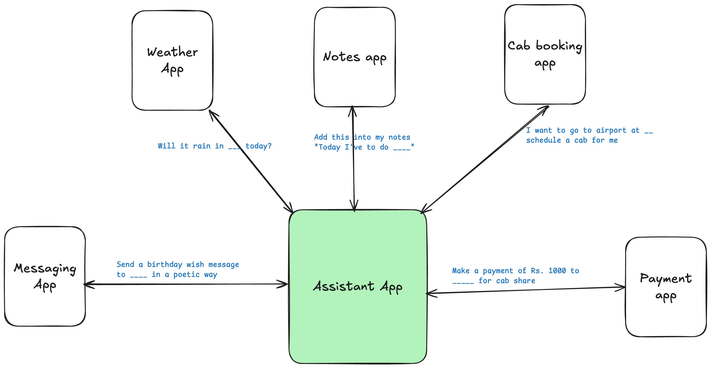
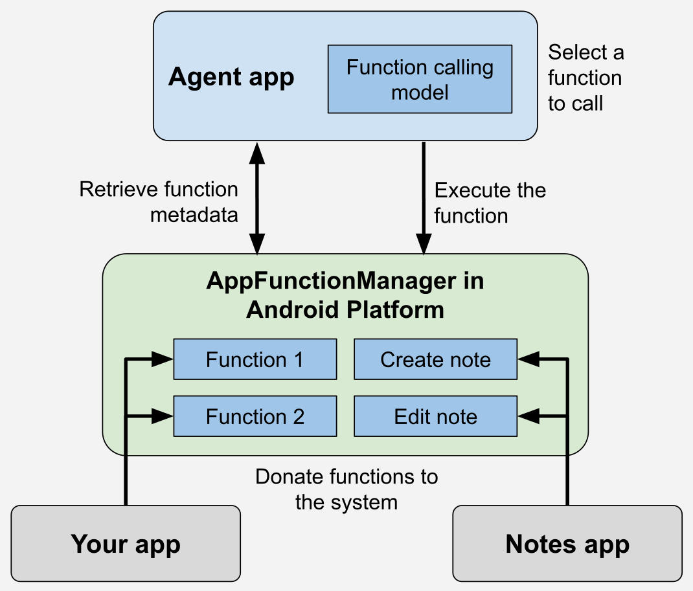
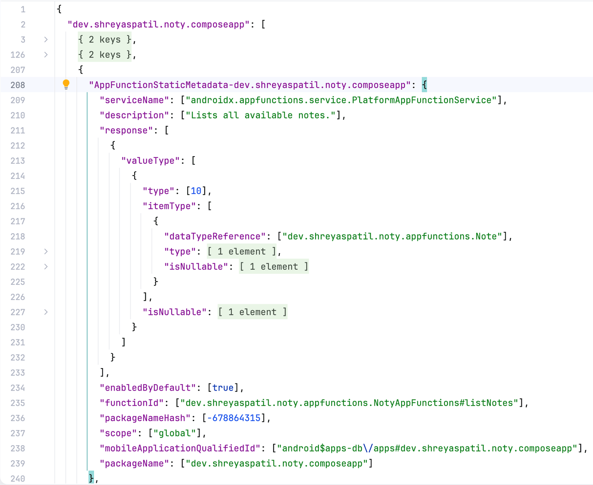
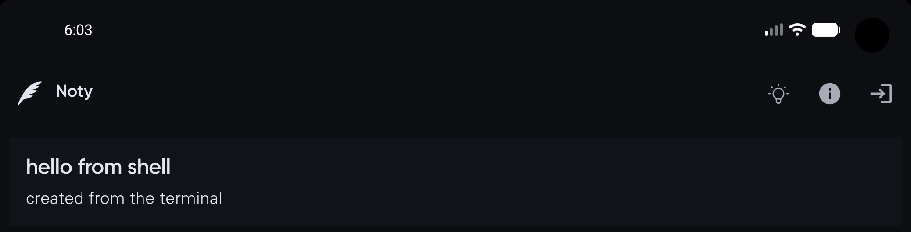
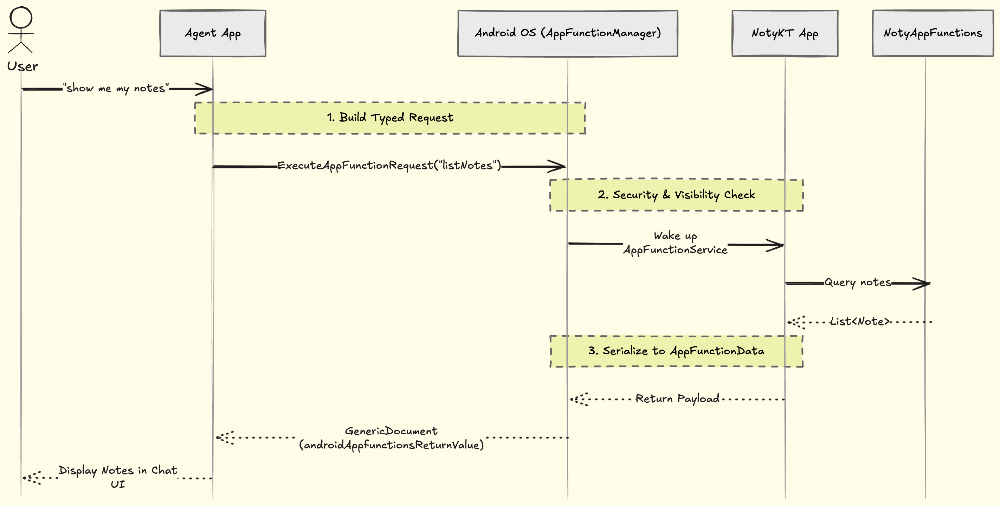

Hello Androiders 👋🏻!

We are currently witnessing the most significant shift in mobile computing since the invention of the App Store. We have officially entered the **Era of Agentic AI** , where the "search bar" is being replaced by the "chat bubble."

For a decade, we’ve obsessively optimized for Deep Links and SEO to make our Android apps discoverable and openable from Google Search. But in a world where users ask an AI Agent to * "book a flight" *or* "summarize my notes" *instead of opening an app, those old tools are becoming obsolete. If an AI Agent can’t "see" inside your app, your app doesn't exist. So, how do you make your app's functionalities discoverable to the brains of the future? The answer is **Android AppFunctions** . It's the new bridge that lets your app's core logic step out of the UI and into the world of autonomous agents. 🚀

## What is AppFunctions?

Android AppFunctions allows apps to share data and functionality with AI agents and assistants by enabling developers to create self-describing functions that agentic apps can discover and execute using natural language, providing an on-device solution for Android apps similar to backend capabilities declared via MCP cloud servers. Read more about it [here](https://android-developers.googleblog.com/2026/02/the-intelligent-os-making-ai-agents.html) on the official blog by Google.

Last year, when I first encountered the API, [I shared my thoughts on it](https://x.com/imShreyasPatil/status/1917213070444863605?s=20), recognizing the vast array of potential use cases.

[](https://x.com/imShreyasPatil/status/1917213070444863605?s=20)

According to the official blog, while not every interaction has a dedicated integration yet, Google is developing a UI automation framework for AI agents and assistants to intelligently execute generic tasks on users' installed apps, ensuring user transparency and control. Unless an app wants to provide a structured communication method with greater control, implementing AppFunctions is optional.

> *Currently, as I write this, it's only available on the Samsung S26 Ultra and Google Pixel 10. Users with these devices can access app functions from installed apps through the Gemini app* .

***

## 💡How to integrate AppFunctions?

AppFunctions are part of the SDK from Android 16 and are also available through the Jetpack library, enabling seamless integration into apps without compatibility issues. It utilizes the interprocess communication framework like AIDL, ensuring security measures are in place so that not just any app can call the functions of another app. More details will be covered in the later section.



*Source:*[*Overview of AppFunctions (Android Developers)* ](https://developer.android.com/ai/appfunctions)

The Jetpack library includes an annotation processor that simplifies creating type-safe schema models and functions. You just need to declare what the function does, what it requires, and what it returns. This annotation processor then generates a contract, allowing the agent app to understand how to call the app's function, including the necessary parameters and types. *This process is similar to how an LLM agent knows how to call a function when MCP is configured* .

As of now, the latest version of AppFunctions is v1.0.0-alpha08, so if you're reading this much later, expect many changes. I already have my [ *note taking sample app on my GitHub* ](https://github.com/PatilShreyas/NotyKT/), so thought of integrating it there. So apps need to add the following dependencies in the project.

```kotlin
dependencies {
val appfunversion = "1.0.0-alpha08"

implementation("androidx.appfunctions:appfunctions-service:$appfunversion")
implementation("androidx.appfunctions:appfunctions:$appfunversion")
ksp("androidx.appfunctions:appfunctions-compiler:$appfunversion")
}

// Configure KSP
ksp {
arg("appfunctions:aggregateAppFunctions", "true")
arg("appfunctions:generateMetadataFromSchema", "false")
}
```

NotyKT is a simple note-taking app that supports the following operations: create, insert, update, and delete.

```kotlin
// A model to expose via AppFunctions
@AppFunctionSerializable(isDescribedByKDoc = true)
data class Note(
/ **The note's identifier* /
val id: String,
/ *The note's title* /
val title: String,
/ *The note's content* /
val content: String,
)

// Function's entry point
class NotyAppFunctions @Inject constructor(
@LocalRepository private val repository: NotyNoteRepository
) {
/ ***Lists all available notes.*
*@param appFunctionContext The context in which the AppFunction is executed.* /
@AppFunction(isDescribedByKDoc = true)
suspend fun listNotes(appFunctionContext: AppFunctionContext): List<Note> =
repository.getAllNotes().map { Note(it.id, it.title, it.note) }

/ ***Adds a new note to the app.*
*@param appFunctionContext The context in which the AppFunction is executed.* @param title The title of the note.
*@param content The note's content.* /
@AppFunction(isDescribedByKDoc = true)
suspend fun createNote(
appFunctionContext: AppFunctionContext,
title: String,
content: String,
): Note? = / *Implementation* /

/ ***Edits a single note.*
*@param appFunctionContext The context in which the AppFunction is executed.* @param noteId The target note's ID.
*@param title The note's title if it should be updated.* @param content The new content if it should be updated.
* /
@AppFunction(isDescribedByKDoc = true)
suspend fun editNote(
appFunctionContext: AppFunctionContext,
noteId: String,
title: String?,
content: String?,
): Note? = / *Implementation* /

/ ***Deletes a single note.*
*@param appFunctionContext The context in which the AppFunction is executed.* @param noteId The target note's ID.
**@return Whether the note was deleted or not.* /
@AppFunction(isDescribedByKDoc = true)
suspend fun deleteNote(
appFunctionContext: AppFunctionContext,
noteId: String,
): Boolean = / *Implementation* /
}
```

Notice how it's clearly defined. The annotation processor handles the heavy lifting. The `@AppFunction(isDescribedByKDoc = true)` annotation generates a structured schema, providing a description of the function, detailing each parameter, and outlining the return model from the *KDoc* .

Since this function requires a repository as a dependency, how can the app create an instance of it on demand? Ideally, if this function were declared without dependencies, its instance could be automatically created. However, with a dependency present, a factory must be provided. Most apps use DI frameworks, so here's how to handle it: In the app's Application implemented class, implement the new interface and override its method as shown, using Dagger Hilt in this example.

```kotlin
// 1. Implement the interface
@HiltAndroidApp
class NotyApp : Application(), AppFunctionConfiguration.Provider {

@Inject lateinit var appFunctions: Provider<NotyAppFunctions>

/ *other impl* /

override val appFunctionConfiguration: AppFunctionConfiguration
get() = AppFunctionConfiguration
.Builder()
.addEnclosingClassFactory(NotyAppFunctions::class.java) {
appFunctions.get()
}
.build()
}
```

That's it! This is how AppFunctions can be implemented in the app 😄.

***

## 🧪How to test?

Currently Gemini app can't directly invoke them but the ADB command utility can help here in testing the integration. Make sure you've platform-tools installed in the SDK and following ADB commands can help.

### 1\. Listing functions

```shell
# Lists all the app functions exposed by all apps installed on the device.
adb shell cmd app_function list-app-functions

# Package specific
adb shell cmd app_function list-app-functions --package dev.shreyaspatil.noty.composeapp
```

Upon running this, it could give output like this



This allows you to see the complete details of all functions, including their IDs, descriptions, parameter types and descriptions, types, nullability, and the same information for the return type model.

### 2\. Executing app functions

The command to execute the app functions is:

```shell
adb shell cmd app_function execute-app-function \
--package <PACKAGE_NAME> \
--function <FUNCTION_ID> \
--parameters <PARAMS_IN_JSON>
```

Let's say I want to run the app function to perform simple READ operation: getting the list of notes in the app:

```shell
adb shell cmd app_function execute-app-function \
--package dev.shreyaspatil.noty.composeapp \
--function dev.shreyaspatil.noty.appfunctions.NotyAppFunctions#listNotes \
--parameters {}
```

*Currently when I tried, it was forcing me to pass the parameters, so I had to provide* `{}`.

It provides JSON output as follows, aligning with the contract model defined in our app:

```json
{
"androidAppfunctionsReturnValue": [
{
"id": ["TMP-053ffdbe-7997-4ba6-9187-3a4ef6be0833"],
"title": ["💡Ideas"],
"content": ["- Android AppFunctions demo\n- Android Foldable device APIs\n- Generative AI"]
},
{
"id": ["TMP-58832e3e-da0f-4542-aa55-68fbc9edea19"],
"title": ["👨🏻‍💻 Today's tasks"],
"content": ["Work on the open-source sample to demonstrate the use of Android AppFunctions"]
}
]
}
```

Let's say we want to create a note, the command for it could look as follows:

```plaintext
adb shell "cmd app_function execute-app-function \
--package dev.shreyaspatil.noty.composeapp \
--function dev.shreyaspatil.noty.appfunctions.NotyAppFunctions#createNote \
--parameters '{\"title\":\"hello from shell\",\"content\":\"created from the terminal\"}'"
```

When you execute this command, the note is created in the app and might appear as follows:

[](https://github.com/PatilShreyas/NotyKT)

This is what testing looks like!

[This is a PR](https://github.com/PatilShreyas/NotyKT/pull/823) with all changes for reference.

***

## 💰Bonus - Agent App

I attempted to mimic the agent app to get a sense of it ( *though it's not an actual agent, just hardcoded actions triggered by specific messages* ), and it appears as follows:

<video controls width="100%" poster="/assets/videos/the-future-of-android-apps-with-appfunctions/poster.gif">
<source src="/assets/videos/the-future-of-android-apps-with-appfunctions/demo.webm" type="video/webm">
Your browser does not support the video tag.
</video>

You can find this [sample app here](https://github.com/PatilShreyas/appfunctions-notyagent-app/) and play around it if interested.

However, this doesn't mean any random app can be installed as an agent app to invoke functions from any app that exposes them. If an app attempts this, a `SecurityException` will occur because this is a restricted API, accessible only to system apps. In the demo above, I installed the mock agent app as a system app in the emulator, which allowed me to experiment with it. The agent app must declare a permission in the manifest: `<uses-permission android:name="android.permission.EXECUTE_APP_FUNCTIONS" />`. Therefore, only official apps like those from Google/Gemini and OEMs are permitted to call these app functions. The agent apps can use [ *AppFunctionManager* ](https://cs.android.com/androidx/platform/frameworks/support/+/androidx-main:appfunctions/appfunctions-stubs/src/main/java/com/android/extensions/appfunctions/AppFunctionManager.java;l=76;drc=622f19cc100e54fe063acd87c5cd468653abb795;bpv=0;bpt=0?q=AppFunctionManager&sq=&ss=androidx%2Fplatform%2Fframeworks%2Fsupport) to query all the apps and their exposed functions. It works as follows:



***What are your thoughts on this new thing? I'm genuinely excited about its potential widespread use in apps. With the advancements in voice support and AI agents, this could become a standout feature in the future trends of Android development. Can imagine how it could be used:** "Repeat the last ordered Indian dish for me on Zomato" *** "I need to make a chocolate cake for four people; please order all the necessary ingredients from Swiggy Instamart." *** "Schedule a cab for airport for tomorrow 05:45 AM via Uber" *** "Compose a lovely poem to wish my friend X a happy birthday and send it to him on WhatsApp." *** "Send 500 to X for cab share via UPI app" * then it finds the X's details from phonebook and just prompts to enter the pin for payment, that's it!


and so on...

** **If you found this useful, share it, it really helps*🙏** "Sharing is caring" 🤝🏻**Let's catch up on [**X**](https://twitter.com/imShreyasPatil) or [**visit my site**](https://shreyaspatil.dev/) to know more about me 😎.***## 📚References* [AppFunctions](https://developer.android.com/ai/appfunctions)

*[NotyKT](https://github.com/PatilShreyas/NotyKT/)* [Agent demo app](https://github.com/PatilShreyas/appfunctions-notyagent-app)