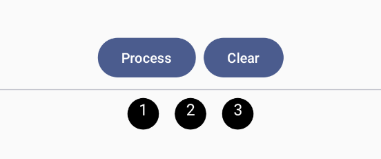
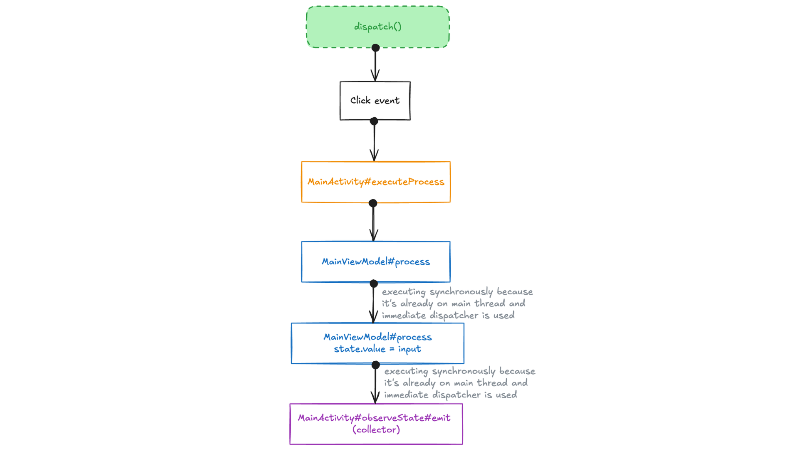
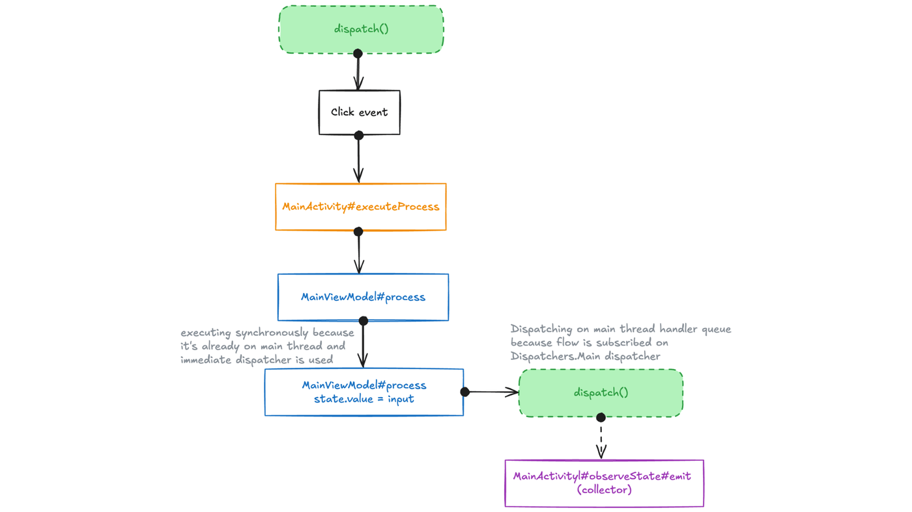
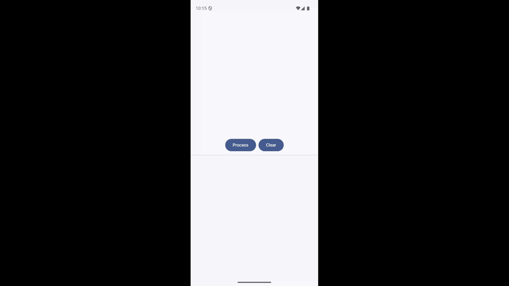
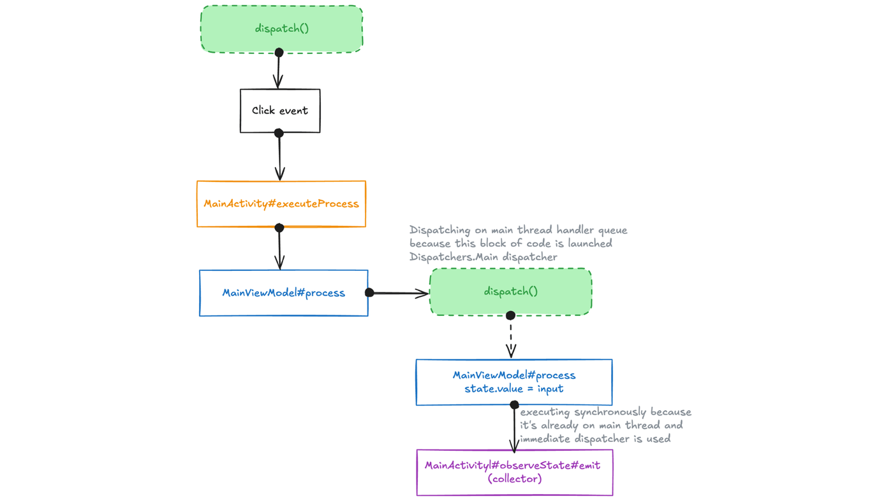
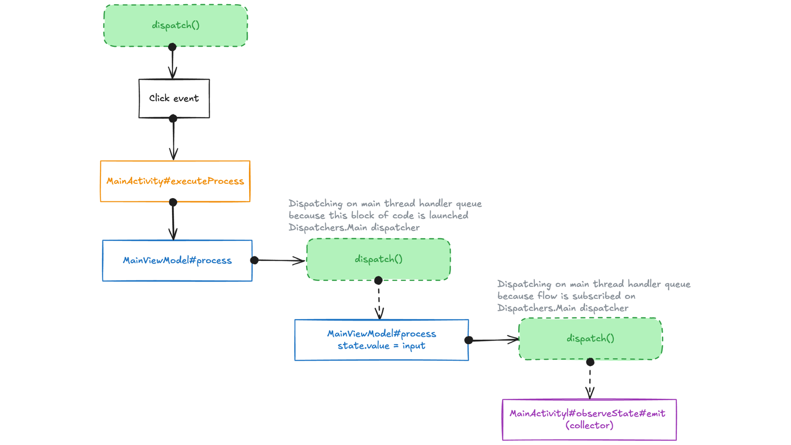

Hi Androiders 👋, there's no doubt that Kotlin coroutines have become the standard in the Android world for multithreading and reactive programming. Coroutines are easy to use, but there's always something that feels a bit complicated. I often get questions about the exact difference between `Dispatchers.Main` and `Dispatchers.Main.immediate`. In this blog, we'll explore this in detail with an example.

***

## Basics

Let’s go over some basics. Coroutines are supported by a thread pool. On the JVM, they use the `java.util.concurrent.Executor` API to manage execution for Dispatchers like Default and IO. On Android, they use the `Handler` APIs for Main dispatcher. For multi-platform, they use `Promise` APIs in JavaScript, and for native platforms like Apple, they use `DispatchQueue` under the hood. To understand this concept, *I’ve written [another blog](https://blog.shreyaspatil.dev/sleepless-concurrency-delay-vs-threadsleep) that goes through the concept of coroutines from platform perspective and explains how delay works in coroutine*. But for now let’s just talk about Android.

The `CoroutineDispatcher` handles dispatching tasks in coroutines, and each dispatcher must override the `dispatch()` method to execute tasks. [HandlerContext](https://github.com/Kotlin/kotlinx.coroutines/blob/1.10.1/ui/kotlinx-coroutines-android/src/HandlerDispatcher.kt#L110) is the implementation of Dispatchers.Main for Android platform. Here’s how its `dispatch()` implementation looks like:

```kotlin
override fun dispatch(context: CoroutineContext, block: Runnable) {
    if (!handler.post(block)) {...}
    // ...
}
```

In short, each time whenever we say `coroutineScope.launch(Dispatchers.Main) { doSomething() }` or `withContext(Dispatchers.Main) { doSomething() }` under the hood it works as `handler.post { doSomething() }`. It just executes that `Runnable` with Handler API.

Now let’s take a look at `HandlerContext` implementation from **Dispatchers.Main.immediate** perspective:

```kotlin
internal class HandlerContext private constructor(
    private val handler: Handler,
    private val name: String?,
    private val invokeImmediately: Boolean = false
) : HandlerDispatcher(), Delay {

    override val immediate: HandlerContext = if (invokeImmediately) this else
        HandlerContext(handler, name, true)

    override fun isDispatchNeeded(context: CoroutineContext): Boolean {
        return !invokeImmediately || Looper.myLooper() != handler.looper
    }

    override fun dispatch(context: CoroutineContext, block: Runnable) {
        if (!handler.post(block)) {
            cancelOnRejection(context, block)
        }
    }
}
```

When `Dispatchers.Main.immediate` is accessed it creates the HandlerContext instance with same Handler instance but with last parameter `invokeImmediately` as `true`. Otherwise for `Dispatcher.Main` its value remains `false`.

Now notice there’s one more method: `isDispatchNeeded`. Official docs say:

> [!NOTE]
> Returns `true` if the execution of the coroutine should be performed with `dispatch()` method. If this method returns `false`, the coroutine is resumed immediately in the current thread, potentially forming an event-loop to prevent stack overflows.

So if `isDispatchNeeded` returns `true` then it submits the tasks to the threadpool/executor/handler otherwise synchronously on the current thread.

In `HandlerContext`, `isDispatchNeeded()` returns `true` if currently flag `invokeImmediately` is `false` and current looper is not as same as Handler’s (Main thread’s) looper. It means whenever these conditions are met, a task will be dispatched and `dispatch()` method will be invoked and ultimately for main thread it’ll execute task by posting the task to Handler (`handler.post{}`) by adding it to main thread’s event queue. It means, if currently task is being executed on the main thread and if flag `invokeImmediately` is **true** then this method will return **false**. In such case, dispatch won’t be performed and it’ll immediately executed on the same thread synchronously.

> [!TIP]
> **Do you know that Dispatchers.Unconfined also works in similar way?**
> `Dispatchers.Unconfined` *also* uses the `isDispatchNeeded` check, but its implementation *always* returns `false`, leading to immediate execution in the current thread. However, unlike `Main.immediate`, if it suspends and resumes, it continues in the thread the suspending function used, which can lead to unpredictable thread switching.

In Android-Kotlin extensions, `lifecycleScope`, `viewModelScope` uses `Dispatchers.Main.immediate` as a dispatcher context.

***

## Understanding with example

Now let’s understand it better with an example. In this example, let’s understand it with a simple UI implementation with ViewModel based UI state emission. UI will subscribe the state provided by the ViewModel i.e. UI will be **consumer** and ViewModel will perform operation and produce the state i.e. **producer**.

So let’s create combinations of producer and consumer. Let’s try using `Dispatchers.Main` and `Dispatchers.Main.immediate` for producer and consumer combinations.

| Example | PRODUCER\_DISPATCHER | CONSUMER\_DISPATCHER |
| :--- | :--- | :--- |
| 1 | 🟢 Dispatchers.Main.immediate | 🟢 Dispatchers.Main.immediate |
| 2 | 🟢 Dispatchers.Main.immediate | 🟠 Dispatchers.Main |
| 3 | 🟠 Dispatchers.Main | 🟢 Dispatchers.Main.immediate |
| 4 | 🟠 Dispatchers.Main | 🟠 Dispatchers.Main |

Simple code would look like:

```kotlin
class MainViewModel : ViewModel() {
    private val _state = MutableStateFlow<String?>(null)
    val state = _state.asStateFlow().filterNotNull()

    fun process(input: String) {
        viewModelScope.launch(PRODUCER_DISPATCHER) {
            _state.value = input
        }
    }
}

class MainActivity : ComponentActivity() {

    private val viewModel by viewModels<MainViewModel>()

    private val items = mutableStateListOf<String>()

    override fun onCreate(savedInstanceState: Bundle?) {
        // ...
        setContent {
            Screen(
                items = items.toList(),
                onProcess = ::executeProcess,
                onClear = { items.clear() }
            )
        }
        observeState()
    }

    private fun observeState() {
        lifecycleScope.launch(CONSUMER_DISPATCHER) {
            viewModel.state.collect { state ->
                items.add(state)
                Log.d("StateStacktrace", Throwable().stackTraceToString())
            }
        }
    }

    private fun executeProcess() {
        (1..5).forEach {
            viewModel.process(it.toString())
        }
    }
}
```

Understanding the snippet:

*   `MainViewModel`: This ViewModel hoists a `state` for UI consumption. It has a method `process()` which upon execution launched task on `viewModelScope` with **PRODUCER_DISPATCHER** as discussed above and it just sets value coming from UI to the `_state`.
*   `MainActivity`: Simple activity that renders Composable `Screen`.
*   `observeState()` method observes a state coming from ViewModel and subscribed to the flow on **CONSUMER_DISPATCHER**. Notice that we also have logged something there with current stacktrace details. We’ll use it later to understand the sequence of execution.
*   On clicking the "Process" button on the UI, `executeProcess()` is called. This function calls `viewModel.process()` five times, passing numbers from 1 to 5.

Here’s how UI looks like (Compose preview):



*In the UI, these three circles with numbered texts are displayed from a list of `items` assuming currently `items` contents are ["1", "2", "3"].*

Now let’s try the app with our examples having four combination of dispatchers as discussed above.

***

### Example 1: Produce and Consume on 🟢 `immediate`


Each time “Process” is clicked, the 5 new text items are appearing on the UI. Now, if you remember, while collecting a flow of state, we logged the stack trace each time we received a new state. Let's review it.

```text
java.lang.Throwable
    at dev.shreyaspatil.maindispatcherexample.MainActivity$observeState$1$1.emit(MainActivity.kt:95)
    at dev.shreyaspatil.maindispatcherexample.MainActivity$observeState$1$1.emit(MainActivity.kt:93)
    at kotlinx.coroutines.flow.StateFlowImpl.collect(StateFlow.kt:396)
    at kotlinx.coroutines.flow.StateFlowImpl$collect$1.invokeSuspend(Unknown Source:15)
    at dev.shreyaspatil.maindispatcherexample.MainViewModel.process(MainActivity.kt:61)
    at dev.shreyaspatil.maindispatcherexample.MainActivity.executeProcess(MainActivity.kt:102)
    at dev.shreyaspatil.maindispatcherexample.MainActivity.access$executeProcess(MainActivity.kt:67)
    at android.view.ViewGroup.dispatchTransformedTouchEvent(ViewGroup.java:3144)
    at com.android.internal.os.ZygoteInit.main(ZygoteInit.java:911)
```

The stack trace at the bottom starts with a click event being dispatched from a View. It then propagates a click event from a Compose API, which invokes `MainActivity#executeProcess`. This calls `MainViewModel#process`, and from there, it directly propagates through coroutines, then StateFlow APIs, and finally into `MainActivity#observeState$emit` (collector). **This means, from a click event till flow collector, all the operations happened synchronously.** Let’s visualize the process:



Since both `PRODUCER_DISPATCHER` and `CONSUMER_DISPATCHER` were using **Dispatchers.Main.immediate** and all operations were already running on the main thread, no separate dispatch operation occurred. Task executions were not managed by `Handler#post()`, even when the state was being observed in a coroutine or the ViewModel was launching a coroutine.

***

### Example 2: Produce on `immediate`, consume on `Main`


Strange, no? On clicking “Process”, only last item i.e. “5” is rendered and then even after clearing UI’s state (not ViewModel’s) the data is never processed again! Let’s take a look at this combination’s stacktrace.

```text
java.lang.Throwable
    at dev.shreyaspatil.maindispatcherexample.MainActivity$observeState$1$1.emit(MainActivity.kt:95)
    at dev.shreyaspatil.maindispatcherexample.MainActivity$observeState$1$1.emit(MainActivity.kt:93)
    at kotlinx.coroutines.flow.StateFlowImpl.collect(StateFlow.kt:396)
    at kotlinx.coroutines.flow.StateFlowImpl$collect$1.invokeSuspend(Unknown Source:15)
    at kotlin.coroutines.jvm.internal.BaseContinuationImpl.resumeWith(ContinuationImpl.kt:33)
    at kotlinx.coroutines.DispatchedTask.run(DispatchedTask.kt:108)
    at android.os.Handler.handleCallback(Handler.java:995)
    at android.os.Handler.dispatchMessage(Handler.java:103)
    at android.os.Looper.loopOnce(Looper.java:239)
    at android.os.Looper.loop(Looper.java:328)
    at android.app.ActivityThread.main(ActivityThread.java:8952)
    at java.lang.reflect.Method.invoke(Native Method)
    at com.android.internal.os.RuntimeInit$MethodAndArgsCaller.run(RuntimeInit.java:593)
    at com.android.internal.os.ZygoteInit.main(ZygoteInit.java:911)
```

Nothing here. At very bottom we can see task has been newly executed on the Main thread and it is directly resuming on the `StateFlow`'s collector. Since this log is only added on the consumer side (flow collection), and this flow is collected on the `Main` dispatcher this time, not immediately, it means that each time a new value is produced in the flow, the collector will add the block to the main thread’s event queue (causing it to dispatch a call to `Handler.post{}`).

In short, when a click event is dispatched from the View APIs, the `MainViewModel#process` is called synchronously on the main thread, and flow collection occurs through dispatching.

Let’s visualize how this combination is working:



Okay, **why only 1 item is getting collected on the UI side?** Since we are using StateFlow here, StateFlow API has conflation behaviour. In the context of Flows (*and data streams in general*), conflation means that if a producer emits new values faster than a collector can process them, **the intermediate, unprocessed values are effectively dropped**. The collector is **guaranteed to get the most recent value**, but it might miss some values that were emitted while it was busy processing a previous one.

**StateFlow's Conflation Behavior:** `StateFlow` is designed specifically as a **state holder**. It always holds a single, current `value`. Its conflation behavior is **inherent and fundamental** to its design:

1.  **Value Updates:** When you update the `value` of a `StateFlow` (either by assigning to `mutableStateFlow.value` or using `tryEmit` or `emit`), the new value *immediately replaces* the previously held value. `StateFlow` doesn't maintain a buffer or queue of past values beyond the *current* one.

2.  **Collector Perspective:** When a collector is attached to a `StateFlow` (using `.collect { ... }`), it first receives the *current* value. Then, whenever a *new* value is emitted *after* the collector has finished processing the previous one, the collector receives that new value.

3.  **The Conflation:** If multiple values are emitted to the `StateFlow` *while* a collector is still busy processing a previously received value, that collector will **only receive the very last value** that was emitted before it became ready again. All the intermediate values emitted during its processing time are missed by that specific collector – they are conflated.

In our case, each time a value is produced by the ViewModel, it is collected from the UI side on the Main dispatcher. Before the dispatch can occur (*main thread’s event queue polling*) and execute the flow collection on the consumer's side (`Handler.post{}`), the ViewModel finishes processing all the items submitted to it from "1" to "5." This happens because it runs synchronously on the same thread, and no separate dispatch occurs while setting the state of the ViewModel. **Consumer doesn’t get a chance to collect all the items and before that ViewModel finishes setting the last state as “5”**, so UI just gets that. Even if the UI state is cleared and if "Process" is clicked again, the same thing happens. Since the previous state was "5" and the new state is still "5" after processing and this time as well consumer doesn’t gets chance to listen to all the updates and last state is “5” again, the emission is skipped because `StateFlow` only emits values if they are distinct.

***

### Example 3: Produce on `Main`, Consume on `immediate`



The behaviour seems similar as first example’s but difference is visible if we take a look on the stacktrace:

```text
java.lang.Throwable
    at dev.shreyaspatil.maindispatcherexample.MainActivity$observeState$1$1.emit(MainActivity.kt:95)
    at dev.shreyaspatil.maindispatcherexample.MainActivity$observeState$1$1.emit(MainActivity.kt:93)
    at kotlinx.coroutines.flow.StateFlowImpl.collect(StateFlow.kt:396)
    at kotlinx.coroutines.flow.StateFlowImpl$collect$1.invokeSuspend(Unknown Source:15)
    at kotlinx.coroutines.flow.StateFlowImpl.updateState(StateFlow.kt:349)
    at kotlinx.coroutines.flow.StateFlowImpl.setValue(StateFlow.kt:316)
    at dev.shreyaspatil.maindispatcherexample.MainViewModel$process$1.invokeSuspend(MainActivity.kt:62)
    at kotlin.coroutines.jvm.internal.BaseContinuationImpl.resumeWith(ContinuationImpl.kt:33)
    at kotlinx.coroutines.DispatchedTask.run(DispatchedTask.kt:108)
    at android.os.Handler.handleCallback(Handler.java:995)
    at android.os.Handler.dispatchMessage(Handler.java:103)
    at android.os.Looper.loopOnce(Looper.java:239)
    at android.os.Looper.loop(Looper.java:328)
    at android.app.ActivityThread.main(ActivityThread.java:8952)
    at java.lang.reflect.Method.invoke(Native Method)
    at com.android.internal.os.RuntimeInit$MethodAndArgsCaller.run(RuntimeInit.java:593)
    at com.android.internal.os.ZygoteInit.main(ZygoteInit.java:911)
```

The consumer side's stack trace begins with the `MainViewModel#process` logic, where the StateFlow's value is set, and the flow collector is called right away. On the producer side, each item from "1" to "5" is processed by dispatching a separate coroutine. This means a separate dispatch occurs five times, and the StateFlow's value is set each time. However, since the collection is immediate and doesn't require a separate dispatch for the collector (consumer), all values are directly sent to the consumer without missing any. Visualizing this would help understanding it better:



So even if the behavior of Example 1 and Example 3 looks the same, it is technically different. In Example 1, there were no dispatches on the Handler, whereas in this example, there are 5 dispatches from the producer side.

***

### Example 4: Produce on `Main`, Consume on `Main`


The behaviour is same as Example 2’s and stacktrace would be same as well since in Example 2 as well, consumer uses `Dispatchers.Main`:

```text
java.lang.Throwable
    at dev.shreyaspatil.maindispatcherexample.MainActivity$observeState$1$1.emit(MainActivity.kt:95)
    at dev.shreyaspatil.maindispatcherexample.MainActivity$observeState$1$1.emit(MainActivity.kt:93)
    at kotlinx.coroutines.flow.StateFlowImpl.collect(StateFlow.kt:396)
    at kotlinx.coroutines.flow.StateFlowImpl$collect$1.invokeSuspend(Unknown Source:15)
    at kotlin.coroutines.jvm.internal.BaseContinuationImpl.resumeWith(ContinuationImpl.kt:33)
    at kotlinx.coroutines.DispatchedTask.run(DispatchedTask.kt:108)
    at android.os.Handler.handleCallback(Handler.java:995)
    at android.os.Handler.dispatchMessage(Handler.java:103)
    at android.os.Looper.loopOnce(Looper.java:239)
    at android.os.Looper.loop(Looper.java:328)
    at android.app.ActivityThread.main(ActivityThread.java:8952)
    at java.lang.reflect.Method.invoke(Native Method)
    at com.android.internal.os.RuntimeInit$MethodAndArgsCaller.run(RuntimeInit.java:593)
    at com.android.internal.os.ZygoteInit.main(ZygoteInit.java:911)
```

In this example, the producer (ViewModel) dispatches tasks on the Main thread’s event queue, and the consumer (UI) also subscribes to the flow, which needs to be dispatched on the Main thread’s event queue. Let's visualize this:



Whenever `Handler.post{}` is called, it internally keeps a queue of `Runnable`s that are executed in order. In this example, both the producer and consumer need dispatching, which means the queue will first add 5 producer items, followed by the consumer’s dispatch for collection of item. According to the queue’s order, all the producer’s tasks will be processed from item “1” to “5.” By the time the consumer’s turn comes, the last value is already set to 5, so the consumer never gets a chance to collect the values from “1” to “4.”

Cool, that’s all about combinations of examples and here’s summary:

| Example | PRODUCER\_DISPATCHER | CONSUMER\_DISPATCHER | Behaviour | Collection at consumer side |
| :--- | :--- | :--- | :--- | :--- |
| 1 | 🟢 immediate | 🟢 immediate | Fully synchronous on Main thread. No event queing on main thread. | All items (1-5) |
| 2 | 🟢 immediate | 🟠 Main | Producer sync, Consumer dispatches; StateFlow Conflation. | Last item (5) |
| 3 | 🟠 Main | 🟢 immediate | Producer dispatches; Consumer sync. | All items (1-5) |
| 4 | 🟠 Main | 🟠 Main | Both dispatch; Producer queue finishes before Consumer; StateFlow Conflation | Last item (5) |

***

## Resuming from non-main dispatcher to `Dispatchers.Main.immediate`

By now, you might understand how behavior changes when using combinations of `Dispatchers.Main` and `Dispatchers.Main.immediate`. As we learned earlier, the `isDispatchNeeded()` implementation causes this behavior. For the Main dispatcher, we learned that `Dispatchers.Main.immediate` doesn't dispatch a task if it's already running on the Main thread's looper. But what happens if the `immediate` dispatcher is used and it's being resumed from another dispatcher? Let’s see this small example:

```kotlin
fun example() {
    lifecycleScope.launch(Dispatchers.Main.immediate) {
        setLoading(true)
        val profileData = withContext(Dispatchers.IO) { repository.fetchProfile() }
        showProfile(profileData)
        setLoading(false)
    }
}
```

In this example, whenever `example()` is called, `setLoading(true)` runs immediately because it's launched with the `immediate` dispatcher. On the next line, `fetchProfile()` is called by switching to the IO dispatcher. Once fetching is complete and `profileData` is loaded, the context switches back to the main thread. This time, `isDispatchNeeded()` will return **true** because the current looper is not the same as the Main thread's looper, as the IO thread was just used. Therefore, dispatching occurs to the main thread, and then `showProfile()` and the following methods are called after dispatching to the main thread.

So, behind the scenes, the above snippet can be visualized like this:

```kotlin
fun example() {
    setLoading(true) // Not dispatching to handler since it's on immediate

    ioExecutor.execute {
        val profileData = repository.fetchProfile()

        // Currently it's on IO dispatcher. So will need to dispatch call to main thread.
        handler.post {
            showProfile(profileData)
            setLoading(false)
        }
    }
}
```

> That's the beauty of coroutines. It just skips the writing of callback hell for developers and manages it well internally in such a way that we could synchronously write asynchronous code!

***

## Why Choose `immediate`?

We've dug deep into *how* `Dispatchers.Main` and `Dispatchers.Main.immediate` work differently, especially regarding the `isDispatchNeeded` check and interaction with the `Handler`. This might leave you wondering: *why* would you explicitly choose `immediate`? And why did the AndroidX team decide to make `Dispatchers.Main.immediate` the default dispatcher for key extension scopes like `lifecycleScope` and `viewModelScope`?

The core reasons boil down to **performance optimization** and **immediacy**, particularly targeting the common case where coroutine work starts on the main thread and needs to interact with the UI promptly.

1.  **Avoiding Unnecessary Overhead:**
    *   As we saw, `Dispatchers.Main` *always* posts the coroutine's execution block (as a `Runnable`) to the main thread's `Handler` queue.
    *   If your code launching or resuming the coroutine is *already* on the main thread, this `post` operation, while generally fast, still represents a small amount of overhead: creating the `Runnable`, enqueueing it, and waiting for the `Looper` to process it in a subsequent pass. `Dispatchers.Main.immediate`, thanks to its `isDispatchNeeded` check returning `false` when already on the main looper, skips this `handler.post()` step entirely in that specific scenario. It executes the code *directly* and synchronously within the current execution flow. This micro-optimization avoids the queueing delay and object allocation associated with the post.

2.  **Enhanced Responsiveness:**
    *   Beyond raw performance, `immediate` provides, well, *immediacy*. Imagine a button click handler (running on the main thread) launching a coroutine using `viewModelScope` to update some state and maybe show a loading indicator immediately.
    *   With `Dispatchers.Main.immediate`, that initial `setLoading(true)` call inside the coroutine runs *right now*, within the same event cycle as the button click handler. With `Dispatchers.Main`, that `setLoading(true)` would be posted to the Handler and run slightly later, after the current block of main thread work finishes and the Looper processes the queued item. While often imperceptible, using `immediate` guarantees the operation happens synchronously when possible, which can contribute to a snappier feel for UI updates initiated from the main thread.

### The AndroidX Choice

The designers of the AndroidX libraries likely chose `Dispatchers.Main.immediate` as the default for scopes like `lifecycleScope` and `viewModelScope` precisely because these scopes are heavily used for tasks tightly coupled with the UI lifecycle. Many operations initiated within these scopes start from main thread callbacks (like user interactions, lifecycle events, or observing data that was updated on the main thread). Using `immediate` optimizes for this frequent pattern, ensuring work happens without unnecessary dispatch delays when already on the correct thread.

And crucially, as we explored earlier, `immediate` doesn't break things when you *do* need dispatching. When resuming from a background thread (like after a `withContext(Dispatchers.IO)` block), `isDispatchNeeded` correctly returns `true`, and the necessary `handler.post{}` occurs to get you back to the main thread safely. It aims to provide the best of both worlds: synchronous execution when safe and efficient, and proper dispatching when required.

But if instant execution is not needed and if we are fine to perform operations on main thread by posting task on main thread’s event queue, it’s preferred to use `Dispatchers.Main`.

***

I hope you got the idea about how exactly dispatcher `Main` and `immediate` works in the coroutine and how their behaviour changes in different cases 😃.

Awesome 🤩. I hope you've gained some valuable insights from this. If you enjoyed this write-up, please share it 😉, because...

***"Sharing is Caring"***

Thank you! 😄

Let's catch up on [**X**](https://twitter.com/imShreyasPatil) or [**visit my site**](https://shreyaspatil.dev/) to know more about me 😎.