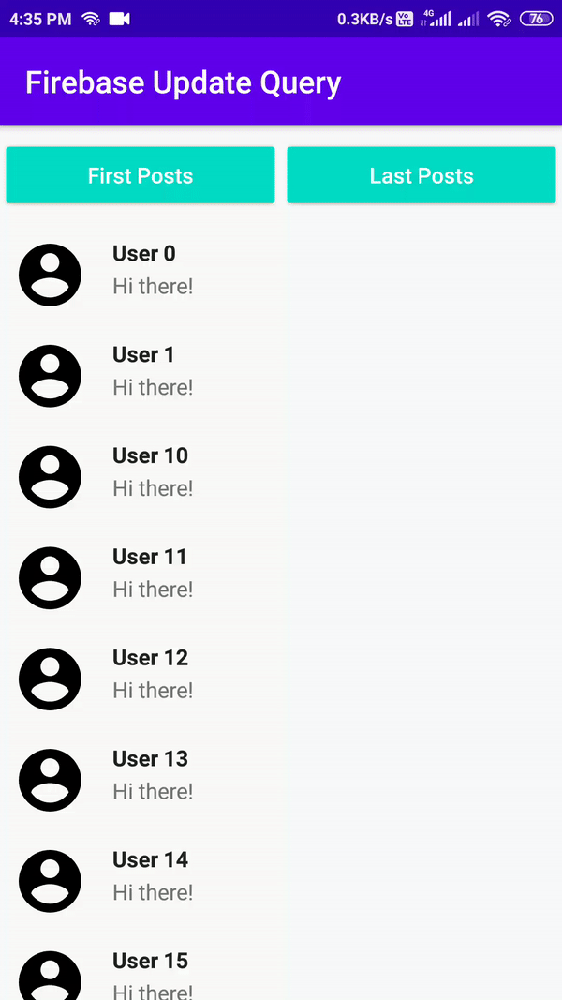

In this article, you will learn how to change Firebase Realtime Database/Cloud Firestore queries without changing the whole adapter of a `RecyclerView` in Android by using the FirebaseUI-Android library.

Let’s say you need to populate a list using *RecyclerView *to show data loaded from Firebase Realtime Database *or *Cloud Firestore and you have implemented a custom `RecyclerView.Adapter` to hold data or you used [FirebaseUI-Android](https://github.com/firebase/FirebaseUI-Android) which is an official open-source library developed by the Firebase team. In this article, we’re going to use the *FirebaseUI-Android* library.

We’ll load data from Firebase Realtime Database/Cloud Firestore and populate a *RecyclerView (Simple + Paginated)*using the adapter *.* After that, we’ll change/filter the query based on some user interaction at runtime without changing whole adapter.

In the end, you will see app like this 👇. After clicking on one of the buttons, data in *RecyclerView* will be replaced by new data.

 *Demo output after changing the query.*

## 🔥 About FirebaseUI 😃

*FirebaseUI is an open-source library for Android that allows you to quickly connect common UI elements to Firebase APIs. (*see [here](https://github.com/firebase/FirebaseUI-Android)*)*It makes it easy to bind data from Firebase Realtime Database** or Cloud Firestore to your app’s UI 🎨.

FirebaseUI-Android provides a number of adapters, such as:

*`FirebaseRecyclerAdapter` — or binding *Firebase Realtime Database**`FirebaseRecyclerPagingAdapter` — for binding *Firebase Realtime Database *with pagination support*`FirestoreRecyclerAdapter` — for binding *Cloud Firestore*

*`FirestorePagingAdapter` — for binding *Cloud Firestore* with pagination support

## ⚡️ Getting Started

Let’s write some code!

Open *Android Studio* and create a new project. Alternatively, you can simply clone [this repository](https://github.com/PatilShreyas/FirebaseRecyclerUpdateQuery-Demo). This is a very simple app for showing a list of posts.

## Gradle Setup

In the app module of `build.gradle,` include following dependencies.

```gradle
dependencies {
// Firebase SDKs
implementation 'com.google.firebase:firebase-firestore:21.4.1'
implementation 'com.google.firebase:firebase-database:19.2.1'

// FirebaseUI for Real-time database
implementation 'com.firebaseui:firebase-ui-database:6.2.0'

// FirebaseUI for Cloud Firestore
implementation 'com.firebaseui:firebase-ui-firestore:6.2.0'

// Paging Library (For Pagination Only)
implementation 'android.arch.paging:runtime:1.0.1'
}
```
> If you’re unsure how to use *FirebaseUI* 🔥, check out the official source [here](https://github.com/firebase/FirebaseUI-Android/). Or, take a look at the official sample👇.

[https://github.com/firebase/quickstart-android](https://github.com/firebase/quickstart-android)

## ⚡️ **How to Change the Query 🤔**In the adapter classes of *FirebaseUI *library, there’s a method `updateOptions()` which initialises an adapter with new options. Whenever this is invoked, the respective *RecyclerView* is populated with new data.

## 💻 Let’s Change the Queries 🔥

### #1 — Firebase Realtime Database

Here `mAdapter` is an instance of `FirebaseReyclerAdapter`. The `new` instance of `FirebaseRecyclerOptions` is created with a query: `newQuery`. Finally, we call `updateOptions()` . After this, you can observe the change in `RecyclerView`. 😃

```kotlin
fun changeQuery() {
val newQuery = mBaseQuery
.orderByChild("timestamp")
.limitToLast(100)

// Make new options
val newOptions = FirebaseRecyclerOptions.Builder<Post>()
.setQuery(newQuery, Post::class.java)
.build()

// Change options of adapter.
mAdapter.updateOptions(newOptions)
}
```

The same can be done in a paging adapter i.e. `FirebaseRecyclerPagingAdapter`. Just a small change is there while making options is we have to pass `PagedList.Config` as a parameter along with query in `setQuery()` .

### #2 — Firebase Cloud Firestore

Same as above, here `mAdapter` is an instance of `FirestoreReyclerAdapter`.

```kotlin
fun changeQuery() {
val newQuery = mCollectionReference
.orderBy("timestamp")
.whereEqualTo("seen", false)
.limitToLast(100)

// Make new options
val newOptions = FirestoreRecyclerOptions.Builder<Post>()
.setQuery(newQuery, Post::class.java)
.build()

// Change options of adapter.
mAdapter.updateOptions(newOptions)
}
```

Again, the same can be done in a paging adapter i.e. `FirestorePagingAdapter`.

We have successfully changed queries at runtime using the FirebaseUI library😃.

The source code for this article is available in [this GitHub repo](https://github.com/PatilShreyas/FirebaseRecyclerUpdateQuery-Demo).

***Thank You!*😃**

## Resources
[https://github.com/PatilShreyas/FirebaseRecyclerUpdateQuery-Demo](https://github.com/PatilShreyas/FirebaseRecyclerUpdateQuery-Demo)

[https://github.com/firebase/FirebaseUI-Android/](https://github.com/firebase/FirebaseUI-Android/)