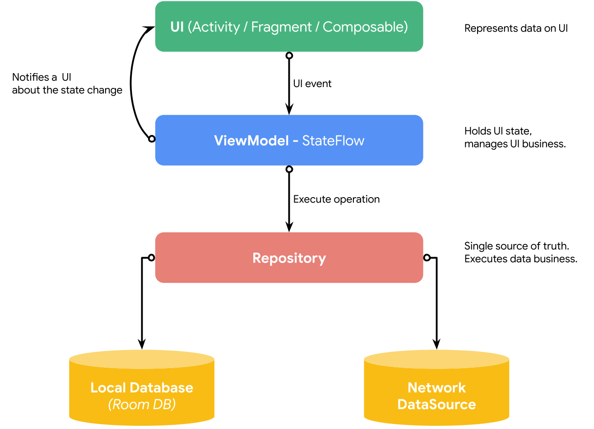
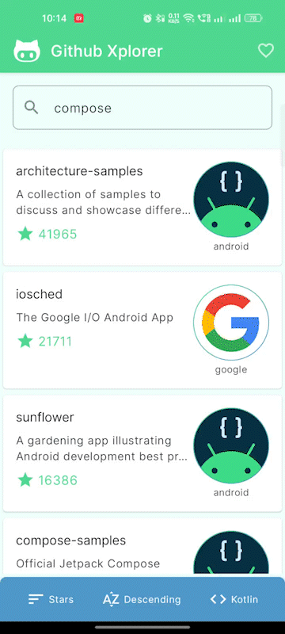

Hey tech Android🙋🏻‍♂️, this is an opinionated post about what ViewModels should do and what should not. It's based on recent experiences and seeing common mistakes or anti-patterns developers follow while developing Android applications with ***MVVM/MVI*** architecture. Let's see.

## What is ViewModel?

Before jumping into the discussion, let's understand what ViewModel is.

[](https://docs.google.com/presentation/d/1kc8wl5-S3B4oIuzMrD-yhPn5RJ0JDqc7d0WYmoHk0U4/edit?usp=sharing)

From the above figure, just focus on the **ViewModel** part. ViewModel is responsible for holding the state of UI and executing the business required for UI. Upon business execution, it also notifies UI about the updated state through a reactive stream.

Okay, this is very straightforward, but things go wrong when we try to write everything related to UI in the ViewModel. See examples below:

### 1\. Adding UI operational state in the state model

Imagine, we have an application screen for "Sign In" and when APIs of it gives an error, you want to show **a toast on UI with an error message** . Let's create a state model and ViewModel for it.

```kotlin
sealed interface LoginUiState {
object Loading: LoginUiState
data class UserLoggedIn(val user: User): LoginUiState
data class ShowToast(val message: String): LoginUiState
}

class LoginViewModel: ViewModel() {
// ...

fun login() {
try {
// ...
} catch (e: Exception) {
emitState(LoginUiState.ShowToast("Failed to login"))
}
}

fun resetPassword() {
try {
// ...
} catch (e: Exception) {
emitState(LoginUiState.ShowToast("Operation failed!"))
}
}
}
```

In this snippet, you can catch that there is a very UI-specific state got added: `ShowToast`. Also, it's used generically for different business operations: **1.**Logging in and**2.** Resetting password.

Now, what's the issue with it? The issue is that we are letting ViewModel know about the UI components used in the screen i.e. ***Toast**(in this case)*. In the future, instead of toast, if we want to show an error dialog/snackbar, then we have to again touch the ViewModel. This*tight coupling*between*UI and ViewModel* shouldn't happen.

This is how the state for it should be modelled

```diff
sealed interface LoginUiState {
...
- data class ShowToast(val message: String): LoginUiState
+ data class LoginFailed(val reason: String): LoginUiState
+ data class ResetFailed(val reason: String): LoginUiState
}
```

Now, ViewModel and state models are loosely coupled and they don't care about UI things. This way, ViewModel is ***only responsible for notifying UI about the business failure***and***letting UI decide how it wants to handle the state*** . That's it! 😎

### 2\. Handling user interaction state of UI component

Imagine, we have an application with UI like this 👇🏻



In this, you can see we have a bottom sheet that expands on click and collapses on clicking it again. Then one of the **anti-patterns**developers do is*holding that user interaction state in the ViewModel* as follows:

```kotlin
data class HomeUiState(
val isLoading: Boolean,
val searchQuery: String,
val repos: List<GithubRepo>,
val preference: Preference,
val expandPreferencesBottomSheet: Boolean // ❌
)

class HomeViewModel: ViewModel() {
// ...
fun togglePreferenceBottomSheet() {
val isExpanded = state.expandPreferencesBottomSheet
state = state.copy(expandPreferencesBottomSheet = !isExpanded)
}
}
```

Thus, the UI calls *this method (*`togglePreferenceBottomSheet()`*)*of ViewModel for expanding/collapsing the bottom sheet. But, the bottom sheet is a UI component and not the business of the UI. The UI component should**manage its own state upon user interactions** . ViewModel should not modify the user interaction state for a component.

What should be done here? 🤔

First of all, the state field `expandPreferencesBottomSheet` should be part of the state model and ViewModel shouldn't be holding the state. Then, UI should decide on its own whether to collapse/expand on user interactions as follows. UI should only send data to ViewModel ( *for e.g. preference from the bottom sheet is updated* ):

```kotlin
// Example Jetpack Compose Code
@Composable
fun HomeContent() {
//...
val bottomSheetState = rememberBottomSheetState(isExpanded = false)

BottomSheet(state = bottomSheetState) {
// ...
TopBanner(
onClick = {
val isExpanded = bottomSheetState.isExpanded
bottomSheetState.isExpanded = !isExpanded
}
)
// ...
}
}
```

That's enough!

There can be exceptions for some situations where for the business use case, you want some UI operation to happen. *For example, showing a dialog or expanding a bottom sheet dialog on some operation failure.*But even in such scenarios, our state variable should just update**data of failure**and not the**state of the UI component.** In such scenarios, the name of a state variable matters a lot. Like this 👇🏻

```kotlin
data class HomeUiState(
val isLoading: Boolean,
val failureReason: String?, // Not `showErrorDialog: Boolean`
...
)

// Jetpack Compose UI Code
@Composable
fun HomeContent(state: HomeUiState) {
// ...
if (state.failureReason != null) {
// Write logic of showing a dialog or showing a bottom sheet
}
}
```

Based on the state data we get from ViewModel ( *in this case,* `failureReason`), UI should decide how to present it. This way, ViewModel is not aware of the UI component, and UI is properly handling its logic.

These were just two examples of the demonstration of anti-patterns developers unintentionally follow while working with UI state management and there are a lot like these. Let's conclude it.

## What's the conclusion? 🤔

*When we say,***"ViewModel should handle the business of the UI"***it doesn't mean we should include literally "**everything**" related to UI in ViewModel.*ViewModel should hold**only**data**which is required for UI. Let UI decide* how it wants to present that data*.*UI should be dependent on*ViewModel for executing business*and ViewModel should provide a state for UI.*UI should blindly depend on the state provided by ViewModel* .

*ViewModel should**not be aware**of the*UI component used in the UI*.*UI components (*such as bottom sheet, dialog, etc*) should take care of managing their own state on user interactions (*like collapsing/expanding sheet, closing dialog, etc* ).

*UI should only tell ViewModel about the event which is produced via user interactions on UI components for further business execution (*for example, calling ViewModel method on the Login button click* ).


***

That's all about this post! If you like it, share it 👍🏻

> Sharing is caring🫡

Thank you! 😀