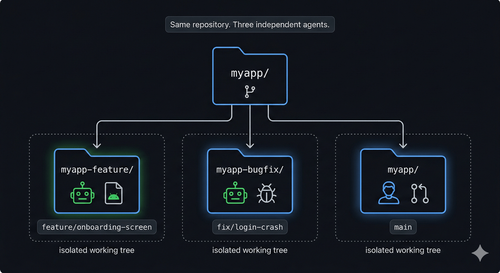
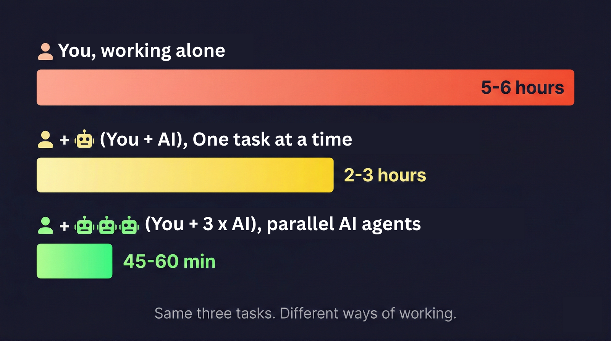

---
title: "You Can't Multitask. Your AI Agent Can."
pubDatetime: 2026-03-02T04:00:00.000Z
description: "Boost your productivity with AI agents. Learn how to delegate complex tasks to AI tools like Claude Code and Gemini to overcome human multitasking limitations."
tags:
  - ai
  - productivity
  - git
  - multitasking
  - codex
  - ai-agents
  - gemini
  - vibe-coding
  - claude-code
coverImage: "../../assets/images/cover-you-can-t-multitask-your-ai-agent-can.png"
---

Hey developers 👋🏻

If you've been following my blog, you know what I write about. Around 60 posts, almost all of them about Android, Kotlin, Compose, Coroutines. That was my world.

Today is different. 😉

This post is about how I changed the way I work, not what I work on. And honestly, it's the best productivity change I've made in years as a Software Engineer.

---

## 🧠 A quick fact before we begin.

Research shows that humans are actually terrible at multitasking. **The brain can't do two complex tasks at the same time.** It switches rapidly between them, and every switch has a cost. Psychologists call these "switch costs." They decrease your productivity by up to 40%, increase errors, and hurt short-term memory. The more you switch, the more tired your brain gets and the worse your work becomes.

Every time you drop a half-finished feature to review a PR, your brain pays a tax. Every time you jump from debugging a crash to writing new code, you pay it again.

We've always just accepted this as part of the job.

But here's the thing: **AI agents don't have this problem.** 😄 They don't get mentally tired. They don't lose their place. An agent working on your onboarding screen has no idea your bug fix agent even exists. It doesn't care. It just works.

That's what this post is about.

---

## 🧑🏻‍💻 Let's begin the story!

It's random day's morning and you've been in the zone for 45 minutes. Deep in a feature branch, working through some tricky state management and architecture-related logic in the app, and finally, finally, the pieces are coming together for the new feature you're going to develop. Your editor is exactly how you left it. You know exactly where everything is in the code. You are, for once, actually in flow.

Then Slack lights up ➡️ **A production crash, reported overnight**. Users are hitting some crashes 💣 on the **login** screen **on certain Android devices**. Now you've to fix that crash on priority and do a hotfix too. Scroll down a bit and there's a teammate waiting on your PR review. They've been blocked since yesterday, and the comment timestamp is starting to feel accusatory. You stare at your terminal. One of these has to wait. Two of them will kill your context. You'll spend the next hour not doing any of them well, jumping between half-finished thoughts and losing the thread on all three. The important thing is that **all of this has to be done in the same project!**

Then I found a better way.

Most developers use AI tools like a search engine. One question, one answer, one task at a time. But Claude Code (Anthropic's AI agent that runs in your terminal), combined with git's **worktree feature** (which most developers never read about in the docs), makes something different possible: **<mark class="bg-yellow-200 dark:bg-yellow-500/30">you can run multiple AI agents in parallel, each working on a separate task, while you focus on just one thing</mark>**. One developer, multiple agents, multiple tasks, all moving forward.

By the end of this post, you'll know how to set up multiple AI agents across isolated git worktrees, so you can work on a crash fix, a feature screen, and a code review all at the same time, without losing context on any of them.

If you don't know about Git worktree then let's have a quick understanding.

### 🌿 What Is a Git Worktree?

Most developers think of it this way: one repo, one working directory. Switch branches and your files change. Need to jump to a hotfix? Stash your work, switch branches, fix the bug, switch back, pop the stash. And hope nothing breaks.

Worktrees change that. With `git worktree add`, you check out a second (or third) branch in a completely separate folder. Same repo, same git history, no stashing, no switching. Both branches just exist on disk at the same time.

Think of it like having two tabs open in the same Google Doc, except each tab shows a different version of the file. What you do in one tab doesn't touch the other.

So you can have `main`, `feature/onboarding-screen`, and `fix/login-crash` all checked out at the same time, in separate folders, with no conflicts. Three commands get you there:

```shell
# Create a new worktree for a branch
git worktree add ../myapp-feature feature/onboarding-screen

# List all active worktrees
git worktree list

# Remove a worktree when done
git worktree remove ../myapp-feature
```

That's it. No extra setup needed. It ships with git.

---

### 🤖 Which AI agent?

This could work with any AI agent of your choice. Be it Claude Code CLI, Gemini CLI, Codex, Copilot, or anything. I'm using Claude Code CLI a lot since many months now. That's why you'll find mentions and usages of Claude in this blog but you can try it with your favourite agent. If you've not yet tried Claude Code CLI, it's an AI agent from Anthropic that runs in your terminal. Unlike a chat interface, it doesn't just answer questions. It reads your actual codebase, runs commands, writes and edits files, and works on its own. You point it at a problem and it goes.

Here's what makes it really useful: AI agent in terminal only sees the folder it's running in. Start a session inside `/myapp-feature` and it sees that branch, its files, its history, its context. Start a separate session in `/myapp-bugfix` and it sees that one. The two sessions don't know about each other at all.

This is the thing that clicked for me: **one worktree + one Claude Code session = one autonomous agent**. 🎯



> "Three worktrees, three Claude Code sessions: three agents working in parallel while you stay focused on what only you can do."

## ⚡ Let's continue: Three Tasks, Zero Blocking

Back to our story. same three tasks, except this time you don't pick one and let the others wait.

Here's exactly what I do now when this happens.

The three tasks:

1. **Feature:** implement a new onboarding feature in the app (`feature/onboarding-screen`). I already have a plan ready as I was in the zone for ~45m.
2. **Bug:** fix the crash in the app (`fix/login-crash`). This was an ad-hoc requirement and priority too!
3. **PR review:** teammate's work (in `main`). This was a work backlog.

Here's how to set up a worktree and a Claude Code agent for each one.

### Step 1: Create the Worktrees

From your main repo directory, create a worktree for each branch. Each folder is fully isolated. Same git history, but completely separate working trees.

```shell
# From your main repo directory
git worktree add ../myapp-feature feature/onboarding-screen
git worktree add ../myapp-bugfix fix/login-crash

# Verify
git worktree list
```

Git creates the `../myapp-feature` and `../myapp-bugfix` folders for you. You don't need to create them first.

You should see all three worktrees listed:

```shell
/Users/you/myapp abc1234 [main]
/Users/you/myapp-feature def5678 [feature/onboarding-screen]
/Users/you/myapp-bugfix ghi9012 [fix/login-crash]
```

If the branch doesn't exist yet, `git worktree add` creates it automatically. If it already exists remotely, use `-b` to create a proper local tracking branch: `git worktree add -b feature/onboarding-screen ../myapp-feature origin/feature/onboarding-screen`. Without the `-b` flag, passing a remote ref directly creates a detached HEAD instead of a named branch.

---

### Step 2: Launch Claude Code in Each Worktree

Open three terminal windows (or tmux panes) and point each one at its folder:

```shell
# Terminal 1 — onboarding screen feature
cd ../myapp-feature && claude

# Terminal 2 — login crash fix
cd ../myapp-bugfix && claude

# Terminal 3 — your main repo (for PR review)
cd ~/myapp
```

Each Claude session starts fresh and only sees its own folder. The agents don't know about each other. No shared state, no bleed-over between sessions. Terminal 3 is yours for the PR review. No agent needed there unless you want one.

---

### 💰 Claude CLI Bonus tip

In the previous section, I used raw git commands for creating worktrees so that you can use any AI agent with it but if you're only using Claude, then it has built-in command for quick worktree:

```shell
# Start Claude in a worktree named "feature-auth"
# Creates .claude/worktrees/myapp-feature/ with a new branch
claude --worktree myapp-feature

# Start another session in a separate worktree
claude --worktree myapp-bugfix

# Auto-generates a name like "bright-running-fox"
claude --worktree
```

So yeah, if you don't want to manage worktrees manually, this is the way to go 🚀.

---

### Step 3: Give Each Agent Its Task 📝

Let's write prompts that say exactly what done looks like.

**For the feature agent (Terminal 1):**

> "Implement the onboarding screen as described in `docs/onboarding-spec.md`. It should be built in Jetpack Compose and: (1) show a 3-step progress indicator, (2) validate each field before allowing the user to advance to the next step, (3) call `/api/onboarding/complete` via the existing `OnboardingRepository` on the final step. Write unit tests for the ViewModel logic. Don't touch the auth flow or `LoginActivity`."

**For the bug agent (Terminal 2):**

> "Investigate and fix the NullPointerException on the login screen described in `bug-reports/2026-02-27-login.md`. The crash reproduces on API 28 and below. Reproduce it first with a unit test, then fix the root cause. Don't change the login UI or touch `LoginViewModel`."

_(as this is just an example, the actual prompts would be very detailed)._

---

### Meanwhile: You Do the PR Review 👀

You hit Enter on both prompts, watch the agents start up, then switch to Terminal 3. Pull up the PR diff. Your teammate's work, 400 lines, needs a proper look. You open the first file. Launch agent in **Terminal 3** as well and maybe you could use it to understand your teammate's work or take help in reviewing that.

> **Review the <TASK_NAME> PR of my colleague:**
>
> - Check if <condition 1>
> - Give me a review summary including suggestions
> - Why there is usage of API in the change?
> - Or anything else here...

Behind you, Terminals 1 and 2 are still running. Agent is reading files, making a plan, running commands. You can peek over or ignore it completely. The work is happening either way.

A few minutes in, you take a quick look at Terminal 1:

```shell
Reading app/src/main/java/com/example/app/onboarding/OnboardingScreen.kt
Reading docs/onboarding-spec.md
Writing app/src/main/java/com/example/app/onboarding/OnboardingViewModel.kt

OnboardingViewModelTest > validates required fields before advancing PASSED
OnboardingViewModelTest > calls complete endpoint on final step PASSED

BUILD SUCCESSFUL in 18s
2 tests, 0 failures
```

Tests are green. ✅ It found the spec, read the composable, wrote the ViewModel logic, and confirmed everything works. All while you were reading someone else's code.

You finish the PR review, leave your comments, approve it. Then you check back in.

**Terminal 1:** the onboarding feature is drafted, two ViewModel tests passing, files updated exactly where the spec said.

**Terminal 2:** the login crash on API 28 reproduced, root cause found (a null pointer in the token refresh path), fix committed with a test that now passes. Both agents finished without asking me anything. No interruptions, no clarifying questions on this run. It feels the same way every time.

**Terminal 3:** It reviewed your colleague's PR, clarified your questions and also highlighted some changes your colleague should do.

You didn't manage them. You didn't step in. You did your own work, and when you came back, so had they.

---

### Step 4: Clean Up the Worktrees 🧹

When each agent is done and you've reviewed its work:

```shell
# Push each branch for review
cd ../myapp-feature
git push origin feature/onboarding-screen

cd ../myapp-bugfix
git push origin fix/login-crash

# Remove the worktrees
cd ~/myapp
git worktree remove ../myapp-feature
git worktree remove ../myapp-bugfix
```

> **Fact:** Agents/Claude can also push and create PR on behalf of you! So you don't even need to run these above commands these days.

One thing worth knowing: removing a worktree only deletes the folder. Your branches and commits are still there. You can check them out, open PRs, or delete them later in the usual way.

Two PRs open, one PR reviewed and approved. All from a single morning session. That's the whole workflow.

---

## 🔧 Patterns That Make This Work

### Naming convention

Use `../projectname-<branch-slug>` as your worktree path. Easy to find with a quick `ls`.

When all your worktrees follow the same prefix, a quick `ls ..` shows you everything that's active: `myapp`, `myapp-feature`, `myapp-bugfix`. No guessing which folder belongs to which task.

---

### Shell aliases

Typing out the full `git worktree add` command every time gets old. Two aliases handle the common cases:

```shell
# Add to .zshrc / .bashrc

## Create a new worktree (works for both new and existing branches)
alias wt-new='f() { local slug="${1//\//-}"; local wt_path="../$(basename $PWD)-$slug"; git worktree add "$wt_path" "$1" 2>/dev/null || git worktree add -b "$1" "$wt_path"; }; f'

## Remove a worktree (does NOT delete the branch)
alias wt-clean='f() { local slug="${1//\//-}"; git worktree remove "../$(basename $PWD)-$slug"; }; f'

# Usage
wt-new feature/onboarding-screen
wt-clean feature/onboarding-screen
```

`wt-new` builds the worktree path from your repo name and the branch you pass in. `wt-clean` removes it using the same pattern. One argument, done.

---

### When NOT to use worktrees ⚠️

Worktrees don't work well for every situation. Skip them when:

- Tasks share a build cache with side effects (common in multi-module projects).
- Both tasks modify the same build files (such as `build.gradle`, `gradle/libs.versions.toml`).
- Task B depends on task A finishing first.

In these cases, running agents in parallel will cause conflicts or wasted work. Run them one at a time instead, and keep the parallel setup for tasks that are truly independent of each other.

---

## ⏱️ The Time Math

Let's put some real numbers on this. Those three tasks from this morning (new onboarding screen, login crash fix, PR review) are a pretty normal engineer morning. Here's roughly how the time looks across three different ways of working:



The first row is the usual dev day: context switching, stashing, losing focus. The second is what most people think of when they say they "use AI": faster, but still one task at a time.

The third is what this whole post is about.

That's not a small difference. That's shipping three things in a morning instead of one. Over a week, that's actually clearing your backlog instead of just feeling busy.

The bottleneck was never your skill. It was the one-task-at-a-time model. AI agents remove that limit, if you let them.

---

## 💡 What This Actually Changed

The speed improvement was real, but that's not what I think about. What changed was how day feel. I stopped staring at three tasks trying to figure out which one to sacrifice. Instead of "what do I have to skip today?" it became "what do I want to work on while the rest gets handled?"

You're not just a developer anymore. **<mark class="bg-yellow-200 dark:bg-yellow-500/30">You're the person who decides what gets built and reviews what comes back. The agents handle the actual execution.</mark>**

I remember the moment it really hit me. There was a bug that another team's member was supposed to fix, something that only showed up in a very specific edge case. I gave it to an agent as a side task while I worked on a new feature. Ten minutes later I looked over and it was fixed. A day of putting it off, gone in the time it took to write one decent prompt.

---

Do definitely try it on your next feature. Set up two worktrees, give your AI agent specific tasks with clear acceptance criteria, and go review that PR you've been putting off. See what's done when you come back. And when you ship more things early, tell me what you built in the comments below. 🚀

Awesome. I hope you've gained some valuable insights from this. If you enjoyed this write-up, please share it 😉, because...

**_"Sharing is Caring"_**

Thank you! 😄 Happy vibe coding! 😎

Let's catch up on [ **X**](https://twitter.com/imShreyasPatil) or [**visit my site**](https://shreyaspatil.dev/) to know more about me 😎.

---

## 📚 References

- [**Multitasking Research - APA**](https://www.apa.org/topics/research/multitasking)
- [**Git Worktree Documentation**](https://git-scm.com/docs/git-worktree)
- [**Parallel Claude Sessions - Documentation**](https://code.claude.com/docs/en/common-workflows#run-parallel-claude-code-sessions-with-git-worktrees)
